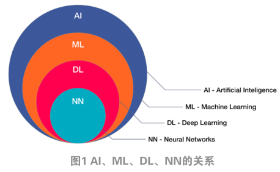
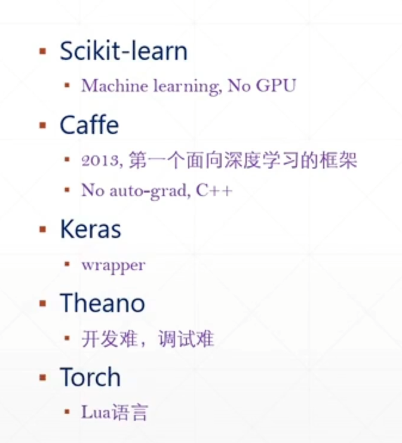
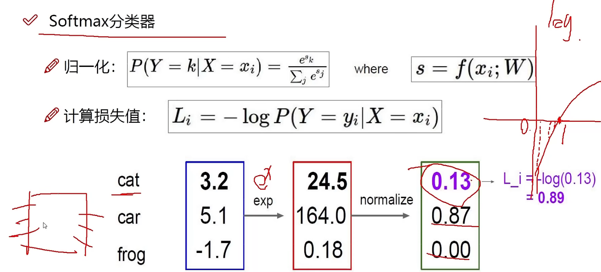
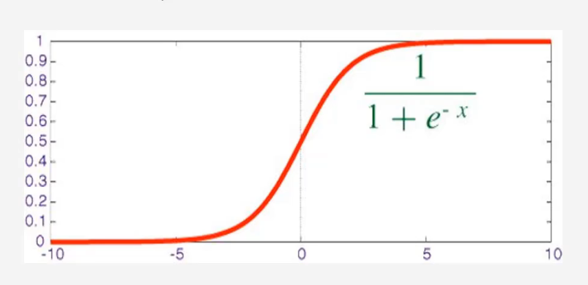
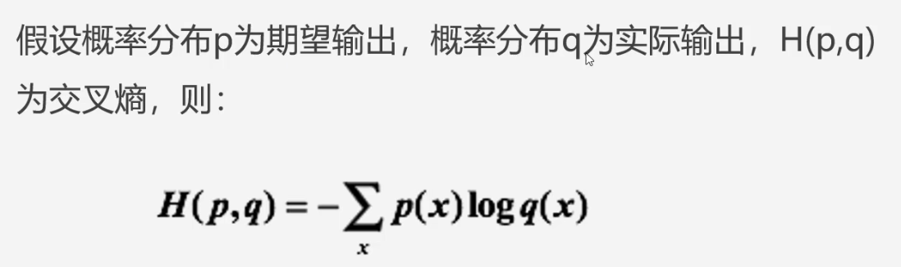

# Artificial Intelligence

## 基础知识

|      |                              |              |
| ---- | ---------------------------- | ------------ |
| NCP  | Neural circuit policies      | 神经回路策略 |
| CNN  | Convolutional Neural Network | 卷及神经网络 |
|      |                              |              |


计算机视觉、机器学习、自然语言处理、




现在流行的主要是Pytorch和TensorFlow2.0。Caffe和Torch并入Pytorch，TensorFlow1.0太难用，Theano停止开发，MXNet影响力小。Keras可以理解成一个高层API命名规范，被谷歌收购。

Keras 不做底层实现，只做顶层设计，可以交个底层计算库实现。比如TensorFlow有Keras实现，Keras官方也有实现。



## 前向传播


### Softmax分类器

归一化

计算损失函数




对数几率回归解决的事二分类问题，对于多个选项的问题，我们可以使用softmax函数，它是对数几率回归在N个可能不同的值上的推广。

神经网络的原始输出不是一个概率值，实质上只是输入的数值做了复杂的加权与非线性处理之后的一个数值而已，Softmax层就是将这个输出变成概率分布。

softmax要求每个样本必须属于某个类别，且所有可能的样本均被覆盖。样本分量之和为1，当只有两个类别时，与对数几率回归完全相同。


## 反向传播

链式法则：从后向前逐层看每层权重对结果的影响

梯度是一步步传播的。


加法门单元、乘法门单元、MAX门单元


## 计算机视觉

可分为四个方向：分类、检测、分割、实例分割

### 面临挑战

部分遮蔽，背景混入


### 常规套路

1. 收集数据并给定标签
2. 训练一个分类器
3. 测试，评估


## 深度学习模型

### yolov5

labelImg软件用来制作数据集，yolo格式的数据集格式为`txt`，做了归一化处理

```tex
1. 类别id	2-3. 中心点坐标	4-5. 宽高
0 0.459375 0.333724 0.228125 0.358314
```


## 模型量化

ncnn


## 数据集

CIFAR-10：CIFAR-10数据集：https://blog.csdn.net/qq_41185868/article/details/82793025


## 激活函数

### Sigmoid

会出现梯度消失现象。主要用于逻辑回归问题



### ReLU

收敛快，求梯度简单，但较脆弱。是当前主流激活函数

### Tanh


### LeakyReLU


## 损失函数

### 均方差

均方差所惩罚的是与损失为同一数量级的情形

看预测值和目标值之间的差异，所以越小越好


### 交叉熵

对于分类问题，我们最好使用交叉熵损失函数更有效。输出一个更大的“损失值”

交叉熵刻画的是实际输出（概率）与期望输出（概率）的距离，也就是交叉熵的值越小，两个概率分布就越接近。




## 逻辑回归

线性回归预测的是一个连续值

逻辑回归，回答“是与否”问题


