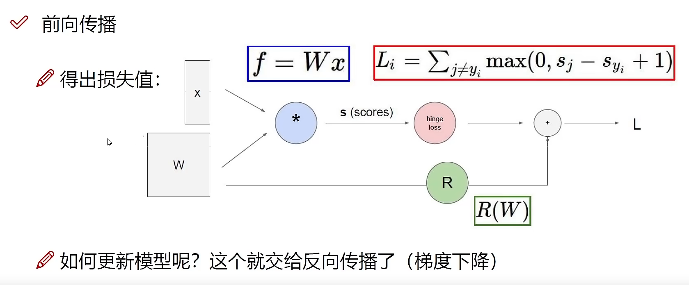

# Artificial Intelligence


# 框架搭建


# Conda

## 安装Anaconda或者Miniconda

下载Mniconda3，使用默认选项，不需要将Mniconda3加入环境变量，安装完成后打开Anaconda Prompt。

## 更换镜像源

```cpp
conda config --add channels https://mirrors.bfsu.edu.cn/anaconda/pkgs/free/
conda config --add channels https://mirrors.bfsu.edu.cn/anaconda/pkgs/main/
conda config --add channels https://mirrors.bfsu.edu.cn/anaconda/cloud/conda-forge/
conda config --add channels https://mirrors.bfsu.edu.cn/anaconda/cloud/pytorch/
conda config --add channels https://mirrors.bfsu.edu.cn/anaconda/cloud/pytorch-lts/
conda config --set show_channel_urls yes
```


## pip 镜像源

```bash
pip config set global.index-url https://pypi.tuna.tsinghua.edu.cn/simple
```


## 常用命令

```bash
conda env list		# 列出环境
conda active xxx		# 使用xxx环境
conda install nump		# 安装软件
conda update numpy
conda remove numpy
conda clean --all		# 清除不完整安装缓存
```

```bash
# 指定python版本为2.7，注意至少需要指定python版本或者要安装的包
# 后一种情况下，自动安装最新python版本
conda create -n env_name python=2.7
conda remove -n env_name --all				# 移除环境
```

```bash
conda list			# 查看环境内可用软件包的指令
pip list			# 查看已下载的软件包
```


```basb
conda install --offline ./cudnn-7.tar.bz2
```


### cpuonly

注意查看环境中·有没有安装cpuonly这个安装包，pytorch只能使用cpu而不能使用GPU可能因为这个。


## 官方下载库

https://download.pytorch.org/whl/torch_stable.html


## CUDA,CUDNN,NVCC等

https://zhuanlan.zhihu.com/p/91334380


## TensorFlow

```bash
# Requires the latest pip
pip install --upgrade pip

# Current stable release for CPU and GPU
pip install tensorflow

# Or try the preview build (unstable)
pip install tf-nightly
```


## Pytorch

```bash
# 后面不要加-c pytorch
conda install pytorch torchvision torchaudio cudatoolkit=11
conda install cudnn

conda uninstall cpuonly		# 注意查看有没有安装cpuonly
```


## 基础知识

|      |                              |              |
| ---- | ---------------------------- | ------------ |
| NCP  | Neural circuit policies      | 神经回路策略 |
| CNN  | Convolutional Neural Network | 卷及神经网络 |
|      |                              |              |


计算机视觉、机器学习、自然语言处理、


现在流行的主要是Pytorch和TensorFlow2.0。Caffe和Torch并入Pytorch，TensorFlow1.0太难用，Theano停止开发，MXNet影响力小。Keras可以理解成一个高层API命名规范，被谷歌收购。

Keras 不做底层实现，只做顶层设计，可以交个底层计算库实现。比如TensorFlow有Keras实现，Keras官方也有实现。


## 前向传播




### Softmax分类器

归一化

计算损失函数


对数几率回归解决的事二分类问题，对于多个选项的问题，我们可以使用softmax函数，它是对数几率回归在N个可能不同的值上的推广。

神经网络的原始输出不是一个概率值，实质上只是输入的数值做了复杂的加权与非线性处理之后的一个数值而已，Softmax层就是将这个输出变成概率分布。

softmax要求每个样本必须属于某个类别，且所有可能的样本均被覆盖。样本分量之和为1，当只有两个类别时，与对数几率回归完全相同。


## 反向传播

链式法则：从后向前逐层看每层权重对结果的影响

梯度是一步步传播的。


加法门单元、乘法门单元、MAX门单元


## 计算机视觉

可分为四个方向：分类、检测、分割、实例分割

### 面临挑战

部分遮蔽，背景混入


### 常规套路

1. 收集数据并给定标签
2. 训练一个分类器
3. 测试，评估


## 深度学习模型

### yolov5

labelImg软件用来制作数据集，yolo格式的数据集格式为`txt`，做了归一化处理

```tex
1. 类别id	2-3. 中心点坐标	4-5. 宽高
0 0.459375 0.333724 0.228125 0.358314
```


## 模型量化

ncnn


## 数据集

CIFAR-10：CIFAR-10数据集：https://blog.csdn.net/qq_41185868/article/details/82793025


## 激活函数

### Sigmoid

会出现梯度消失现象。主要用于逻辑回归问题


### ReLU

收敛快，求梯度简单，但较脆弱。是当前主流激活函数

### Tanh


### LeakyReLU


## 损失函数

### 均方差

均方差所惩罚的是与损失为同一数量级的情形

看预测值和目标值之间的差异，所以越小越好


### 交叉熵

对于分类问题，我们最好使用交叉熵损失函数更有效。输出一个更大的“损失值”

交叉熵刻画的是实际输出（概率）与期望输出（概率）的距离，也就是交叉熵的值越小，两个概率分布就越接近。


## 逻辑回归

线性回归预测的是一个连续值

逻辑回归，回答“是与否”问题，也就是用Sigmoid函数


  


