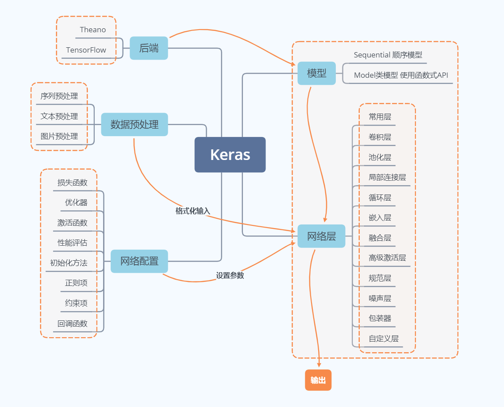
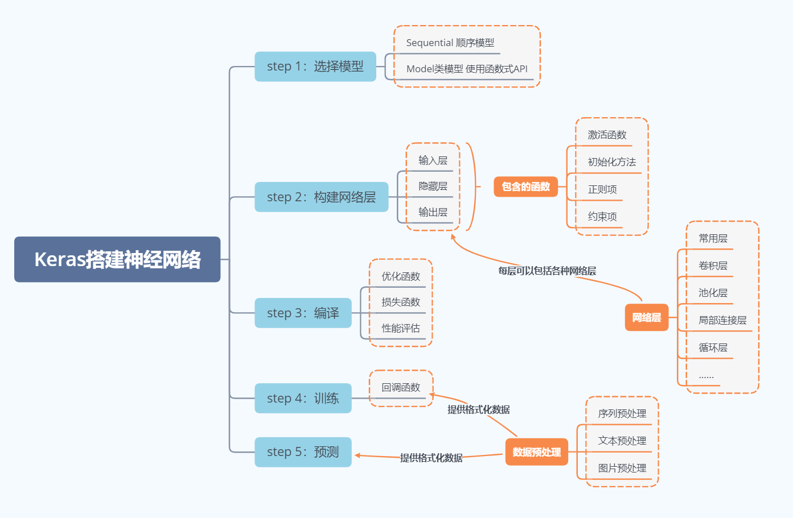
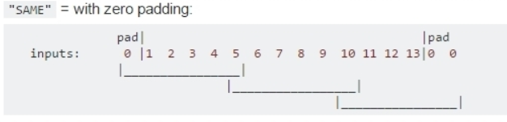
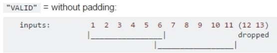
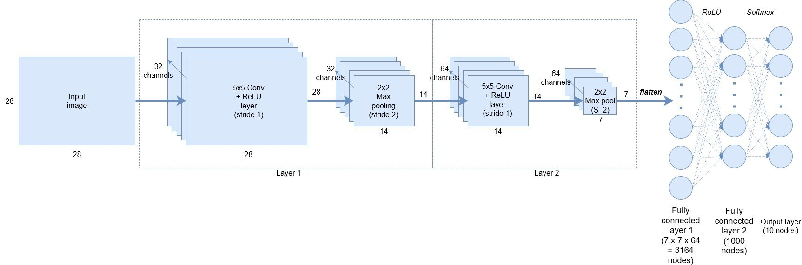
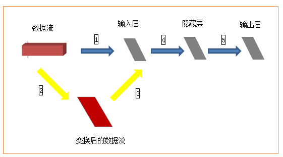
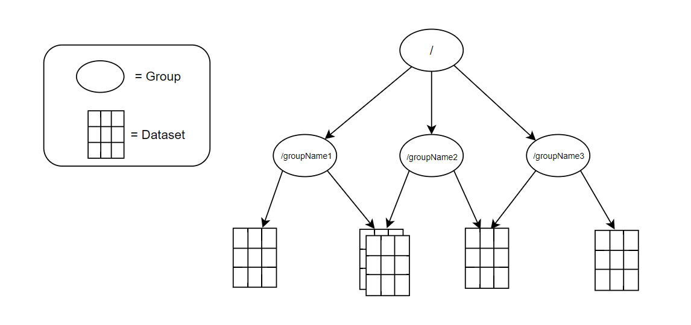
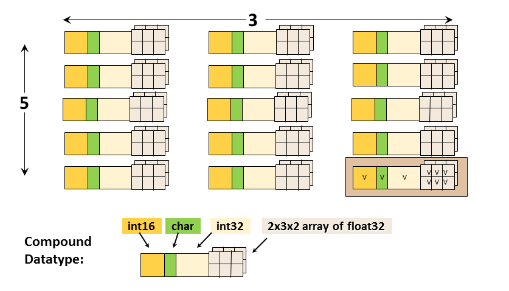
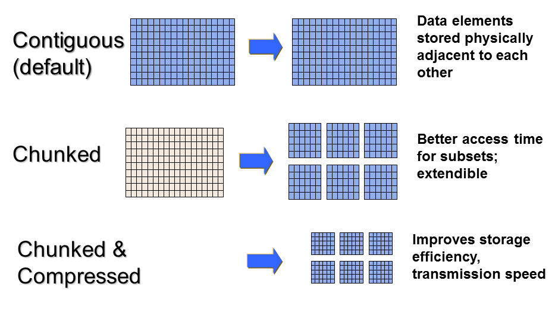

# Keras

## 基础知识

### 关于Keras

Keras是由纯python编写的基于theano/tensorflow的深度学习框架。

Keras是一个高层神经网络API，支持快速实验，能够把你的idea迅速转换为结果，如果有如下需求，可以优先选择Keras：

- 简易和快速的原型设计（keras具有高度模块化，极简，和可扩充特性）
- 支持CNN和RNN，或二者的结合
- 无缝CPU和GPU切换

### 设计原则

用户友好：Keras是为人类而不是天顶星人设计的API。用户的使用体验始终是我们考虑的首要和中心内容。Keras遵循减少认知困难的最佳实践：Keras提供一致而简洁的API， 能够极大减少一般应用下用户的工作量，同时，Keras提供清晰和具有实践意义的bug反馈。

模块性：模型可理解为一个层的序列或数据的运算图，完全可配置的模块可以用最少的代价自由组合在一起。具体而言，网络层、损失函数、优化器、初始化策略、激活函数、正则化方法都是独立的模块，你可以使用它们来构建自己的模型。

易扩展性：添加新模块超级容易，只需要仿照现有的模块编写新的类或函数即可。创建新模块的便利性使得Keras更适合于先进的研究工作。

与Python协作：Keras没有单独的模型配置文件类型（作为对比，caffe有），模型由python代码描述，使其更紧凑和更易debug，并提供了扩展的便利性。


### 模块结构




### 搭建一个神经网络




## 主要概念

### 符号计算

符号计算也叫数据流图。Keras的底层库使用Theano或TensorFlow，这两个库也称为Keras的后端。无论是Theano还是TensorFlow，都是一个“符号式”的库。符号计算首先定义各种变量，然后建立一个“计算图”，计算图规定了各个变量之间的计算关系。

### 张量

张量(tensor)，可以看作是向量、矩阵的自然推广，用来表示广泛的数据类型。张量的阶数也叫维度。

- 0阶张量,即标量,是一个数。
- 1阶张量,即向量,一组有序排列的数
- 2阶张量,即矩阵,一组向量有序的排列起来
- 3阶张量，即立方体，一组矩阵上下排列起来
- .....

> 重点：关于维度的理解
>
> 假如有一个10长度的列表，那么我们横向看有10个数字，也可以叫做10维度，纵向看只能看到1个数字，那么就叫1维度。注意这个区别有助于理解Keras或者神经网络中计算时出现的维度问题。


### 数据格式

目前主要有两种方式来表示张量：

- `th`模式或channels_first模式，Theano和caffe使用此模式。
- `tf`模式或channels_last模式，TensorFlow使用此模式。

下面举例说明两种模式的区别：

> 对于100张RGB3通道的16×32（高为16宽为32）彩色图，
>
> - `th`表示方式：（100,3,16,32）
> - `tf`表示方式：（100,16,32,3）
>
> 唯一的区别就是表示通道个数3的位置不一样。


### 模型

Keras有两种类型的模型，序贯模型（Sequential）和函数式模型（Model），函数式模型应用更为广泛，序贯模型是函数式模型的一种特殊情况。

- 序贯模型（Sequential)：单输入单输出，一条路通到底，层与层之间只有相邻关系，没有跨层连接。这种模型编译速度快，操作也比较简单
- 函数式模型（Model）：多输入多输出，层与层之间任意连接。这种模型编译速度慢。可以实现复杂网络


### padding补零

padding有两种模式：same和valid

same：采取的是补全方式，尝试在左边和右边补0，规则是左奇右偶，例如输入input_width=13，Filter_width=6，stride=5。在上面滑动的次数是3次，如图所示，输入不够0来凑。


$$
n_{output} = \lceil \frac {n_{input}} {s} \rceil , \qquad s为步长
$$


valid：采用的是丢弃的方式，如果不够滑动一次则将剩下的数据丢弃。




$$
n_{output} = \lceil \frac {n_{input} - f + 1} {s} \rceil , \qquad s为步长, f为kernel\ size
$$

## 基于人工神经网络的手写数字识别



### 导入包

```python
import os
from keras.datasets import mnist
from keras import models
from keras import layers
from keras.utils import np_utils
# 指明使用GPU
os.environ['CUDA_VISIBLE_DEVICES'] = '/gpu:0'
```


### 准备数据

因为使用TensorFlow作为后端，所以数据格式为`chanels_last`模式。

```python
(x_train, y_train), (x_test, y_test) = mnist.load_data()
print(x_train.shape)
print(x_test.shape)
# 在开始训练前首先对数据进行预处理，将数据转化为一个float32数组，形状为（60000， 28, 28, 1），取值范围0~1.
x_train = x_train.reshape(x_train.shape[0], 28, 28, 1).astype('float32') / 255
x_test = x_test.reshape(x_test.shape[0], 28, 28, 1).astype('float32') / 255

y_train = np_utils.to_categorical(y_train)  # 标签使用one-hot编码格式
y_test = np_utils.to_categorical(y_test)    # 标签使用one-hot编码格式
```


### 搭建模型

```python
# 设置神经网络模型为序贯模型（Sequential）或者函数式模型（Model）
model = models.Sequential()
# 卷积层：输出通道数为32，卷积核大小5x5，步长1x1，激活函数为ReLu，输入数据集形状28x28x1
model.add(layers.Conv2D(32, kernel_size=(5, 5), strides=(1, 1), activation='relu', input_shape=(28, 28, 1)))
# 池化层：池化核大小为2x2，步长2x2。池化后通道数不变为32，数据集形状变为14x14x1
model.add(layers.MaxPooling2D(pool_size=(2, 2), strides=(2, 2)))
# 卷积层：输出通道数为64，卷积核大小5x5，默认步长1x1，激活函数为ReLu, padding指定为same模式
model.add(layers.Conv2D(64, kernel_size=(5, 5), activation='relu', padding='same'))
# 池化层：池化核大小为2x2，步长1x1。池化后通道数不变为32，数据集形状变为14x14x1，padding指定为same模式
model.add(layers.MaxPooling2D(pool_size=(2, 2), strides=(1, 1), padding='same'))
# 讲数据展平，作为全连接层的输入，数据格式为nx1的形式
model.add(layers.Flatten())
# 全连接层：输入维度为n，输出维度为1000，激活函数为ReLu
model.add(layers.Dense(1000, activation='relu'))
# 全连接层：输入维度为1000，输出维度为10，激活函数为ReLu
model.add(layers.Dense(10, activation='softmax'))
model.compile(loss='categorical_crossentropy', optimizer='adam', metrics=['accuracy'])
# 打印网络模型，做个总结概要
model.summary()
```


### 训练模型

```python
# verbose：日志显示，0为不在标准输出流输出日志信息，1为输出进度条记录，2为每个epoch输出一行记录
# shuffle：布尔值或字符串，一般为布尔值，表示是否在训练过程中随机打乱输入样本的顺序。若为字符串“batch”，则是用来处理HDF5数据的特殊情况，它将在batch内部将数据打乱。
# validation_split：0~1之间的浮点数，用来指定训练集的一定比例数据作为验证集。验证集将不参与训练后，并在每个epoch结束测试的模型的指标，如损失函数、精确度等。
# 注意，validation_split的划分在shuffle之前，因此如果你的数据本身是有序的，需要先手工打乱再指定validation_split，否则可能会出现验证集样本不均匀。
# initial_epoch: 从该参数指定的epoch开始训练，在继续之前的训练时有用。
# fit函数返回一个History的对象，其History.history属性记录了损失函数和其他指标的数值随epoch变化的情况，如果有验证集的话，也包含了验证集的这些指标变化情况
model.fit(x_train, y_train, epochs=3, batch_size=128, validation_split=0.3, shuffle=True, verbose=2)
```


### Dense()

```python
Dense(500,input_shape=(784,))
```

Dense层属于网络层-->常用层中的一个层

500表示输出的维度，完整的输出表示：(*,500)：即输出任意个500维的数据流。但是在参数中只写维度就可以了，比较具体输出多少个是由输入确定的。换个说法，Dense的输出其实是个N×500的矩阵。

input_shape(784,) 表示输入维度是784(28×28，后面具体介绍为什么)，完整的输入表示：(*,784)：即输入N个784维度的数据。


### Activation()

```python
Activation('tanh')
```

Activation：激活层

'tanh' ：激活函数


### Dropout()

```python
Dropout(0.5)
```

在训练过程中每次更新参数时随机断开一定百分比（rate）的输入神经元，防止过拟合。


### 数据集

数据集包括60000张28×28的训练集和10000张28×28的测试集及其对应的目标数字。如果完全按照上述数据格式表述，以tensorflow作为后端应该是（60000,28,28,3），因为示例中采用了`mnist.load_data()`获取数据集，所以已经判断使用了tensorflow作为后端，因此数据集就变成了(60000,28,28)，那么input_shape(784,)应该是input_shape(28,28，)才对，但是在这个示例中这么写是不对的，需要转换成(60000,784),才可以。为什么需要转换呢？



如上图，训练集(60000,28,28)作为输入，就相当于一个立方体，而输入层从当前角度看就是一个平面，立方体的数据流怎么进入平面的输入层进行计算呢？所以需要进行黄色箭头所示的变换，然后才进入输入层进行后续计算。至于从28*28变换成784之后输入层如何处理，就不需要我们关心了。(喜欢钻研的同学可以去研究下源代码)。

并且，Keras中输入多为(nb_samples, input_dim)的形式：即(样本数量，输入维度)。


### to_categorical

简单来说，to_categorical就是将类别向量转换为[二进制](https://so.csdn.net/so/search?q=二进制&spm=1001.2101.3001.7020)（只有0和1）的矩阵类型表示。其表现为将原有的类别向量转换为one-hot编码的形式。

```python
from keras.utils.np_utils import *
#类别向量定义
b = [0,1,2,3,4,5,6,7,8]
#调用to_categorical将b按照9个类别来进行转换
b = to_categorical(b, 9)
print(b)
```

```python
执行结果如下：
[[1. 0. 0. 0. 0. 0. 0. 0. 0.]
 [0. 1. 0. 0. 0. 0. 0. 0. 0.]
 [0. 0. 1. 0. 0. 0. 0. 0. 0.]
 [0. 0. 0. 1. 0. 0. 0. 0. 0.]
 [0. 0. 0. 0. 1. 0. 0. 0. 0.]
 [0. 0. 0. 0. 0. 1. 0. 0. 0.]
 [0. 0. 0. 0. 0. 0. 1. 0. 0.]
 [0. 0. 0. 0. 0. 0. 0. 1. 0.]
 [0. 0. 0. 0. 0. 0. 0. 0. 1.]]
```


### np.argmax()

np.argmax()是numpy中获取array的某一个维度中数值最大的那个元素的索引。

https://blog.csdn.net/sinat_29047129/article/details/103661475


### 完整代码

```python
import os
from keras.datasets import mnist
from keras import models
from keras import layers
from keras.utils import np_utils

os.environ['CUDA_VISIBLE_DEVICES'] = '/gpu:0'

# ================== 准备数据 ============================
(x_train, y_train), (x_test, y_test) = mnist.load_data()
print(x_train.shape)
print(x_test.shape)
# 在开始训练前首先对数据进行预处理，将数据转化为一个float32数组，形状为（60000， 28, 28, 1），取值范围0~1.
x_train = x_train.reshape(x_train.shape[0], 28, 28, 1).astype('float32') / 255
x_test = x_test.reshape(x_test.shape[0], 28, 28, 1).astype('float32') / 255

y_train = np_utils.to_categorical(y_train)  # 标签使用one-hot编码格式
y_test = np_utils.to_categorical(y_test)    # 标签使用one-hot编码格式

# ================== 搭建模型 ============================
model = models.Sequential()
model.add(layers.Conv2D(32, kernel_size=(5, 5), strides=(1, 1), activation='relu', input_shape=(28, 28, 1)))
model.add(layers.MaxPooling2D(pool_size=(2, 2), strides=(2, 2)))
model.add(layers.Conv2D(64, kernel_size=(5, 5), activation='relu'))
model.add(layers.MaxPooling2D(pool_size=(2, 2)))
model.add(layers.Flatten())
model.add(layers.Dense(1000, activation='relu'))
model.add(layers.Dense(10, activation='softmax'))
model.compile(loss='categorical_crossentropy', optimizer='adam', metrics=['accuracy'])

# ================== 训练模型 ============================
model.fit(x_train, y_train, epochs=5, batch_size=128)

# ================== 评估模型 ============================
test_loss, test_acc = model.evaluate(x_test, y_test)
print('test_loss', test_loss)
print('test_acc', test_acc)
```


## .h5文件

H5文件是层次数据格式第5代的版本（Hierarchical Data Format，HDF5），它是用于存储科学数据的一种文件格式和库文件。由美国超级计算中心与应用中心研发的文件格式，用以存储和组织大规模数据。后来由一个非盈利组织HDF Group支持。HDF支持多种商业及非商业的软件平台，包括MATLAB、Java、Python、R和Julia等等。

**HDF5** 文件一般以 **.h5** 或者 **.hdf5** 作为后缀名。

| HDF5设计架构                              |
| ----------------------------------------- |
| 客户端                                    |
| 中间件（h5py、PyTables、MATLAB......）    |
| C API                                     |
| 公共抽象（组、数据集）                    |
| 内部数据结构（组：B树；数据集：分块存储） |
| 1维逻辑地址空间                           |
| 底层驱动                                  |
| 磁盘数据                                  |

### 文件结构

H5将文件结构简化成两个主要的对象类型:

- 数据集dataset：就是同一类型数据的多维数组，类似于NumPy 中的数组 array 
- 组group：是一种容器结构,可以包含数据集和其他组,若一个文件中存放了不同种类的数据集,这些数据集的管理就用到了group

直观的理解,可以参考我们的文件系统，不同的文件存放在不同的目录下:

- 目录就是HDF5文件中的group，描述了数据集dataset的分类信息，通过group有效的将多种dataset进行管理和划分
- 文件就是hdf5文件中的dataset，表示具体的数据

```python
+-- /
|   +-- group_1
|   |   +-- dataset_1_1
|   |   |   +-- attribute_1_1_1
|   |   |   +-- attribute_1_1_2
|   |   |   +-- ...
|   |   |
|   |   +-- dataset_1_2
|   |   |   +-- attribute_1_2_1
|   |   |   +-- attribute_1_2_2
|   |   |   +-- ...
|   |   |
|   |   +-- ...
|   |
|   +-- group_2
|   |   +-- dataset_2_1
|   |   |   +-- attribute_2_1_1
|   |   |   +-- attribute_2_1_2
|   |   |   +-- ...
|   |   |
|   |   +-- dataset_2_2
|   |   |   +-- attribute_2_2_1
|   |   |   +-- attribute_2_2_2
|   |   |   +-- ...
|   |   |
|   |   +-- ...
|   |
|   +-- ...
|
```


### 组结构

熟悉Linux系统的，可以将这个组结构类似于Linux文件系统的目录层次结构，根目录再包含其他目录，节点目录里面存放相应的数据集，或者可以将组结构当做Python里面的嵌套字典结构，通过这样一个层次化的结构可以合理地将数据组织起来.可以从下面的Python代码运行中看出来，f作为得到的HDF5的文件对象，其实就是根目录，通过新建组就可以看出来.

```python
import h5py

with h5py.File("test.hdf5", "w") as f:
    subgroup = f.create_group("subgroup")
    print(subgroup)
# <HDF5 group "/subgroup" (0 members)>
```


下图就是数据集和组的关系:




### 数据集

h5文件是一种真正的层次结构，文件系统式的数据类型。另外在数据集中还有元数据，即metadata

对于每一个dataset而言，除了数据本身之外，这个数据集还有很多的属性信息。在hdf5中，同时支持存储数据集对应的属性信息，所有的属性信息的集合叫做Metadata，下图来自HDF Group的官网，可以看出其中用于描述的元数据包括，Dataspaces、Datatypes、Properties和Attributes（可选）.


- **Dataspace** 给出原始数据的**秩** (Rank) 和**维度** (dimension)
- **Datatype** 给出数据类型
- **Properties** 说明该 dataset 的**分块储存**以及**压缩**情况
- - **Chunked**: Better access time for subsets; extendible
  - **Chunked & Compressed**: Improves storage efficiency, transmission speed
- **Attributes** 为该 dataset 的其他自定义属性

#### Dataspace

数据空间主要用于描述数据的分布情况，可以分类为无数据（NULL）、标量数据（scala）和数组，其中描述的维数（dimensions）可以是固定的，也可以是非固定的.数据空间描述的主要用途是，用于描述整个数据集的分布情况（这个应该是固定的描述），同时也用于当HDF5切片时，描述其切片的子集分布（通常来说，HDF5的切片操作类似于Numpy，但是它是在磁盘上进行操作）

#### Datatypes

数据类型用于描述HDF5数据集中单个数据元素的类型，在HDF5中数据类型可以被归类为：

- 预定义数据类型：通过HDF5创建的数据，其中又可以分为两类：
- 标准数据类型：在所有支持的平台通用，其命名格式为架构名+编程类型名，如H5T_IEEE_F32BE就是ARCH的架构，同时是标准的大端32位浮点类型.

- 原生数据类型：通常用于简化读写的内存操作，在不同平台上不一定一样，如H5T_NATIVE_INT 就表示int(C)

- 衍生数据类型：衍生数据类型的意思就是由预定义数据类型衍生而来，最直接的就是字符型就是预定义类型的一种，而字符串就属于衍生数据类型，即合成数据类型就是衍生数据类型，衍生数据类型还包括表格以及一些嵌套的类型。




#### Properties

特性元数据用于描述HDF5对象的特点，默认的特性描述可以通过使用 HDF5 Property List API进行修改。



#### Attributes

属性是可选的元数据，由用户人工指定，包含**名称-值**两个部分，注意不支持partial I/O operations，同时不能被压缩或扩展。

### 开发

Python里面有两个包都支持HDF5的开发，**h5py**和**PyTables**（基于HDF5并增加了数据集索引和额外的类型系统）

HDF Group提供的用于HDF5文件打开和编辑可视化工具，基于Java开发的支持各大平台。


## h5py包

h5py是一个python包，它包含两类对象：数据集(dataset)和组(group)。

dataset类似数组类的数据集合，和numpy的数组差不多。group是像文件夹一样的容器，它好比python中的字典，有键(key)和值(value)。group中可以存放dataset或者其他的group。”键”就是组成员的名称，”值”就是组成员对象本身(组或者数据集)，下面来看下如何创建组和数据集。

### 创建一个h5文件

```python
class File(name, mode=None, driver=None, libver=None, userblock_size=None, **kwds)
```

打开或创建一个 HDF5 文件，`name `为文件名字符串；`mode `为打开文件的模式；`driver `可以指定一种驱动方式，如需进行并行 HDF5 操作，可设置为 `‘mpio’`；`libver `可以指定使用的兼容版本，默认为 `‘earliest’`，也可以指定为 `‘latest’`，`userblock_size `以字节为单位指定一个在文件开头称作 user block 的数据块，一般不需要设置。返回所打开文件的句柄。

有效的 mode 参数有：

- r 只读，文件必须存在
- r+ 读写，文件必须存在
- w 创建新文件写，已经存在的文件会被覆盖掉
- w- / x 创建新文件写，文件如果已经存在则出错
- a 打开已经存在的文件进行读写，如果不存在则创建一个新文件读写，此为默认的 mode

```python
import h5py
#要是读取文件的话，就把w换成r
f=h5py.File("myh5py.hdf5","w")
```


## 教程

https://blog.csdn.net/qq_40076022/article/details/108984897


## Reference

https://www.cnblogs.com/lc1217/p/7132364.html

https://www.cnblogs.com/lc1217/p/7324935.html
