# YOLOV5

## 目标检测（Object Detection）

类别标签  置信度得分

单个物体：分类 定位

多个物体：目标检测 实例分割

## 常用数据集

### PASCAL VOC

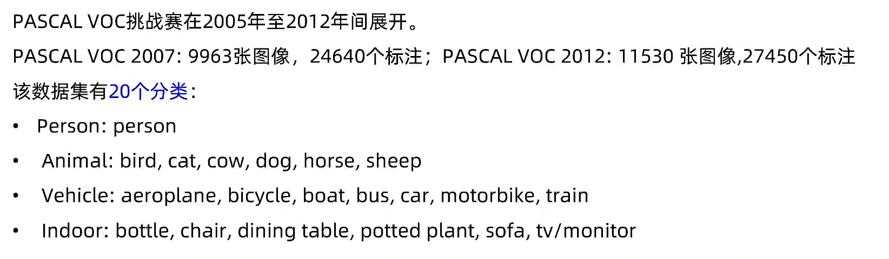

### MS COCO

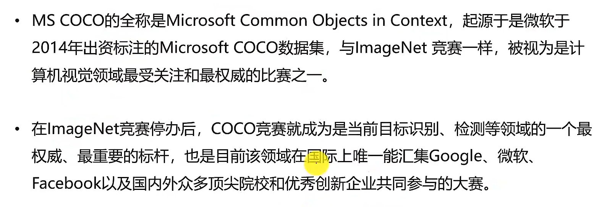

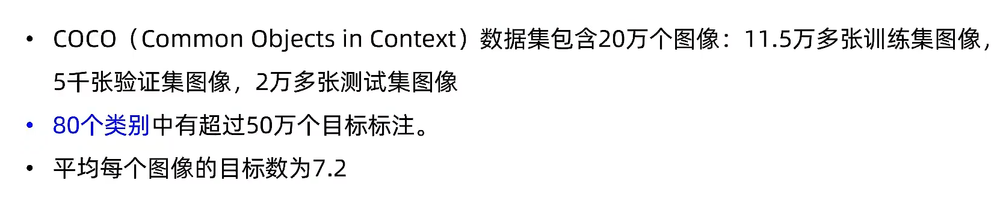

## 目标检测性能指标

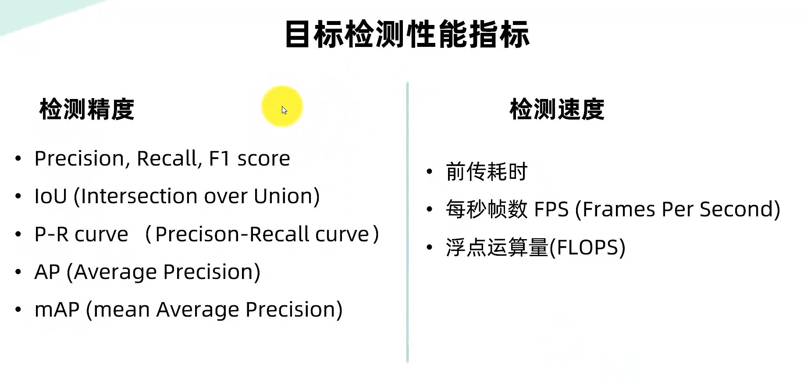

### 混淆矩阵

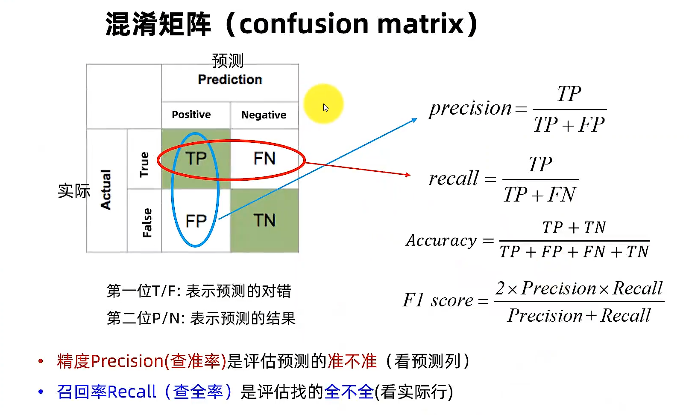

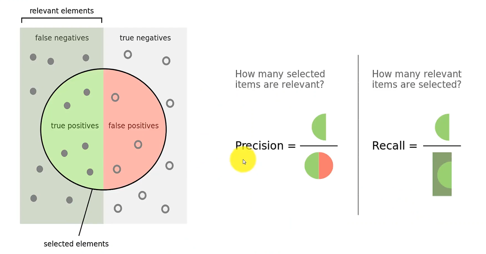

### IoU 交并比

产生的候选框（candidate bound）与原标记框（ground truth bound）的交叠率，即它们的交集与并集的比值。

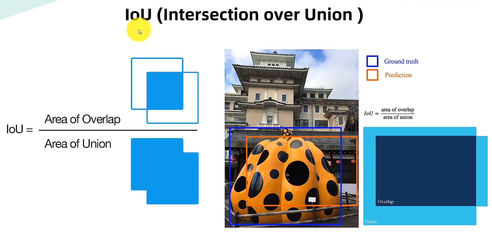

### AP 和mAP

PASCAL VOC 和 COCO 数据集对于AP 和 mAP定义不一样

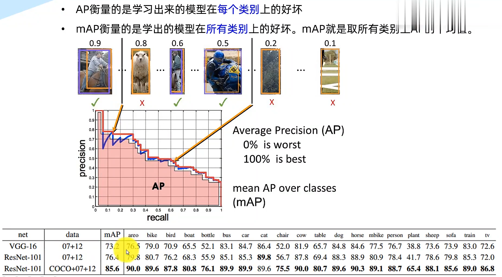

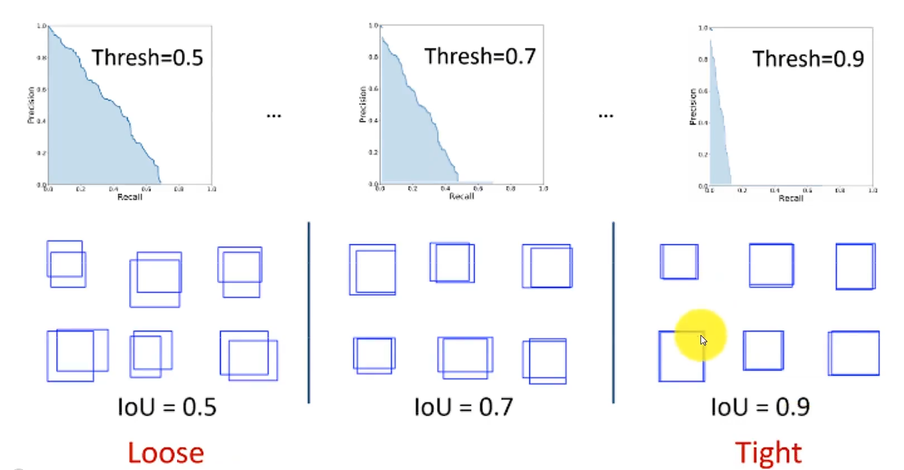

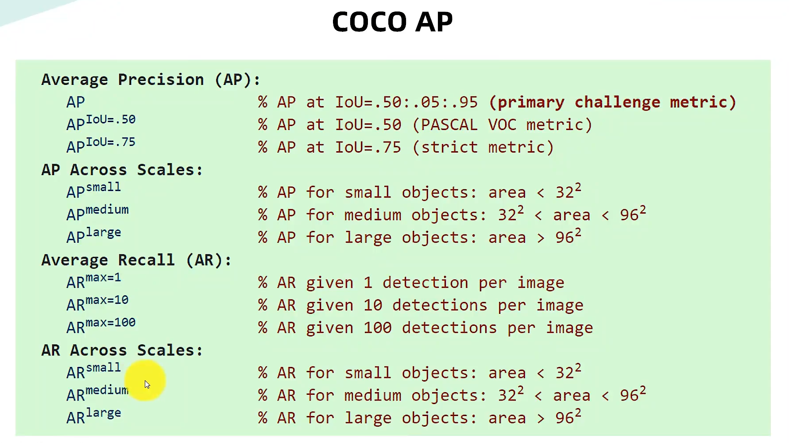

### 检测速度

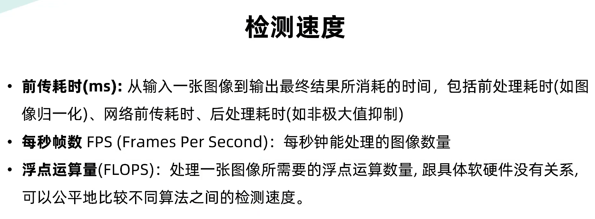

## 安装YOLOV5

