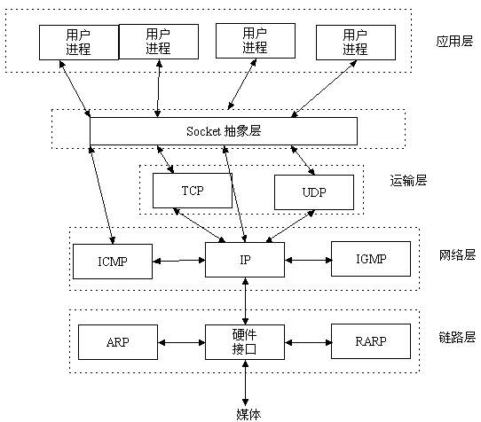

# Socket

## 套接字基础

### Socket定义

socket起源于Unix，而Unix/Linux基本哲学之一就是“一切皆文件”，都可以用“打开open –> 读写write/read –> 关闭close”模式来操作。我的理解就是Socket就是该模式的一个实现，socket即是一种特殊的文件，一些socket函数就是对其进行的操作（读/写IO、打开、关闭）。

在TCP/IP协议中，"IP地址+TCP或UDP端口号"唯一标识网络通讯中的一个进程。"IP地址+端口号"就对应一个socket。



### 套接字类型

流套接字（SOCK_STREAM）

数据报套接字（SOCK_DGRAM）

原始套机子（SOCK_RAW）


### 协议簇和地址簇

协议簇就是不同协议的集合，在linux中，用宏来表示不同的协议簇，这个宏的形式是PF开头，比如IPv4协议为`PF_INET`，PF的意思就是PROTOCOL FAMILY

地址簇就是一个协议所使用的地址集合，也是用宏来表示不同的地址簇，这个宏的形式是AF开头，比如IP地址簇为AF_INET，AF的意思是ADDRESS FAMILY


### IP地址转换

https://www.cnblogs.com/fortunely/p/14916296.html

推荐使用inet_pton()或inet_aton()。而非inet_addr()或inet_network(),因为返回值-1代表IP地址255.255.255.255。

inet_aton, inet_addr, inet_ntoa在点分十进制数串与长度为32bits的网络字节序二进制值间转换IPv4地址。 不适用于IPv6地址。

inet_pton(), inet_ntop()使用与IPv4和IPv6

```c
/*本地IP 即 字符串(点分十进制:xxx.xxx.xx.xxx)*/
/**
 * 本地IP转网络字节序 字符串 --> int(大端方式存储)
 * @param af 地址族协议对应的有AF_INET, AF_INET6等
 * @param src 要转换的指定的IP
 * @param dest  转换出来的值,  其实是整型值
 *
 * @return -1 失败, 0成功, 并对应有errno
 */
int inet_pton(int af, const char *src, void *dst);


/**
 *  网络字节序转本地IP int -> 字符串
 *  @param af    - 地址族协议对应的有AF_INET, AF_INET6等
 *  @param src  - 网路字节序格式的int类型的iP
 *  @param dst  - 存储字符串ip的数组的地址
 *  @param size - dst缓冲区大小
 *
 *  @return 返回的即是 dst
 */
const char *inet_ntop(int af, const void *src, char *dst, socklen_t size);
```


## 字节序

> ### 网络字节序与主机字节序
>
> **主机字节序**就是我们平常说的大端和小端模式：不同的CPU有不同的字节序类型，这些字节序是指整数在内存中保存的顺序，这个叫做主机序。引用标准的Big-Endian和Little-Endian的定义如下：
>
> * Little-Endian就是低位字节排放在内存的低地址端，高位字节排放在内存的高地址端。
>
> * Big-Endian就是高位字节排放在内存的低地址端，低位字节排放在内存的高地址端。
>
> **网络字节序**：4个字节的32 bit值以下面的次序传输：首先是0～7bit，其次8～15bit，然后16～23bit，最后是24~31bit。这种传输次序称作大端字节序。**由于TCP/IP首部中所有的二进制整数在网络中传输时都要求以这种次序，因此它又称作网络字节序。**字节序，顾名思义字节的顺序，就是大于一个字节类型的数据在内存中的存放顺序，一个字节的数据没有顺序的问题了。
>
> **在将一个地址绑定到socket的时候，请先将主机字节序转换成为网络字节序，而不要假定主机字节序跟网络字节序一样使用的是Big-Endian。**由于这个问题曾引发过血案！公司项目代码中由于存在这个问题，导致了很多莫名其妙的问题，所以请谨记对主机字节序不要做任何假定，务必将其转化为网络字节序再赋给socket。

```c
#include <arpa/inet.h>
/*主机字节顺序 --> 网络字节顺序*/
uint32_t htonl(uint32_t hostlong);  /* 端口*/
uint16_t htons(uint16_t hostshort); /* IP*/
/*网络字节顺序 --> 主机字节顺序*/
uint32_t ntohl(uint32_t netlong);  /* 端口*/
uint16_t ntohs(uint16_t netshort); /* IP*/
```


### sockaddr数据结构

根据使用场景不同，创建`sockaddr_in`, `sockaddr_un`, `sockaddr_in6`结构体来保存IP地址信息，但在使用的时候，统一将结构体的地址保存在`sockaddr`的地址域内，这样屏蔽了底层实现细节。向上层交付的就是一个结构体。


```cpp
// ipv4对应的是：
struct sockaddr_in {
    sa_family_t    sin_family; /* address family: AF_INET */
    in_port_t      sin_port;   /* port in network byte order */
    struct in_addr sin_addr;   /* internet address */
};
struct in_addr {
    uint32_t       s_addr;     /* address in network byte order */
};

// ipv6对应的是：
struct sockaddr_in6 { 
    sa_family_t     sin6_family;   /* AF_INET6 */ 
    in_port_t       sin6_port;     /* port number */ 
    uint32_t        sin6_flowinfo; /* IPv6 flow information */ 
    struct in6_addr sin6_addr;     /* IPv6 address */ 
    uint32_t        sin6_scope_id; /* Scope ID (new in 2.4) */ 
};
struct in6_addr { 
    unsigned char   s6_addr[16];   /* IPv6 address */ 
};

// Unix域
#define UNIX_PATH_MAX    108
struct sockaddr_un { 
    sa_family_t sun_family;               /* AF_UNIX */ 
    char        sun_path[UNIX_PATH_MAX];  /* pathname */ 
};
```


### 网络套接字API

```C
/**
 * @brief  创建套接字
 *
 * @param domain
 * @param type tcp - 流式协议  udp - 报式协议
 * @param protocol 协议类型, 值为0就会根据type默认为TCP或UDP
 * @return int 文件描述符(套接字)
 */
int socket(int domain, int type, int protocol);

/**
 * @brief 将本地的IP和端口与创建出的套接字绑定
 *
 * @param sockfd 创建出的文件描述符
 * @param addr 端口和IP
 * @param addrlen addr结构体的长度
 * @return int
 */
int bind(int sockfd, const struct sockaddr *addr, socklen_t addrlen);

//
/**
 * @brief 设置同时连接到服务器的客户端的个数
 *
 * @param sockfd 函数创建出来的文件描述符
 * @param backlog 系统进程最多允许多少个未完成的请求进入等待队列，最大值 128
 * @return int
 */
int listen(int sockfd, int backlog);

/**
 * @brief 阻塞等待客户端连接请求, 并接受连接
 *
 * @param sockfd 文件描述符, 使用socket创建出的文件描述符
 * @param addr 存储客户端的端口和IP, 传出参数
 * @param addrlen 传入传出参数
 * @return int 返回的是一个套接字, 对应客户端:
 * 服务器端与客户端进程通信使用accept的返回值对应的套接字
 */
int accept(int sockfd, struct sockaddr *addr, socklen_t *addrlen);

//客户端与服务器端建立连接的函数
/**
 * @brief
 *
 * @param sockfd 套接字
 * @param addr 服务器端的IP和端口
 * @param addrlen 第二个参数的长度
 * @return int
 */
int connect(int sockfd, const struct sockaddr *addr, socklen_t addrlen);

/**
 * @brief 发送数据
 *
 * @param sockfd accept返回的socket文件描述符。
 * @param buf 要发送数据
 * @param nbytes 发送数据大小
 * @param flags 对于传送数据的一些配置项
 * @return ssize_t
 */
ssize_t send(int sockfd, const void *buf, size_t nbytes, int flags);

/**
 * @brief 接收数据
 *
 * @param sockfd accept返回的socket文件描述符。
 * @param buf 要接收的数据
 * @param nbytes 要接收的数据大小
 * @param flags 对于传送数据的一些配置项
 * @return ssize_t
 */
ssize_t recv(int sockfd, void *buf, size_t nbytes, int flags);
```


### Socket配置函数

```c
/**
 * @brief socket更具体的配置函数
 *
 * @param sockfd 我们要进行配置的socket
 * @param level 根据我们选用的协议，配置相应的协议编号
 * @param option 参见下表
 * @param val
 * @param len
 * @return int
 */
int setsockopt(int sockfd, int level, int option, const void *val,
               socklen_t len);
```


一个程序成功bind后，当程序退出马上再次运行后，可能会因为端口占用问题报错（错误码98）。这是由于TCP套接字的状态`TIME_WAIT`引起的，该状态在套接字关闭后保留2-4分钟。在`TIME_WAIT`状态退出后，套接字被删除才能继续使用端口。

利用socket的配置选项，可以实现端口复用。**注意：该函数需要在bind函数之前使用**

```c
//  举例
int on = 1;
setsockopt(lfd, SOL_SOCKET, SO_REUSEADDR, (void *)&on, sizeof(on));
```


## socket()函数

```c
int socket(int domain, int type, int protocol);
```

socket函数对应于普通文件的打开操作。普通文件的打开操作返回一个文件描述字，而**socket()**用于创建一个socket描述符（socket descriptor），**它唯一标识一个socket**。这个socket描述字跟文件描述字一样，后续的操作都有用到它，把它作为参数，通过它来进行一些读写操作。

正如可以给fopen的传入不同参数值，以打开不同的文件。创建socket的时候，也可以指定不同的参数创建不同的socket描述符，socket函数的三个参数分别为：

- domain：即协议域，又称为协议族（family）。常用的协议族有，`AF_INET`、`AF_INET6`、`AF_LOCAL`（或称AF_UNIX，Unix域socket）、`AF_ROUTE`等等。协议族决定了socket的地址类型，在通信中必须采用对应的地址，如AF_INET决定了要用ipv4地址（32位的）与端口号（16位的）的组合、AF_UNIX决定了要用一个绝对路径名作为地址。
- type：指定socket类型。常用的socket类型有，SOCK_STREAM、SOCK_DGRAM、SOCK_RAW、SOCK_PACKET、SOCK_SEQPACKET等等（socket的类型有哪些？）。
- protocol：故名思意，就是指定协议。常用的协议有，IPPROTO_TCP、IPPTOTO_UDP、IPPROTO_SCTP、IPPROTO_TIPC等，它们分别对应TCP传输协议、UDP传输协议、STCP传输协议、TIPC传输协议（这个协议我将会单独开篇讨论！）。

注意：并不是上面的type和protocol可以随意组合的，如SOCK_STREAM不可以跟IPPROTO_UDP组合。**protocol一般取0时，自动选择type类型对应的默认协议。**

当我们调用**socket**创建一个socket时，返回的socket描述字它存在于协议族（address family，AF_XXX）空间中，但没有一个具体的地址。如果想要给它赋值一个地址，就必须调用bind()函数，否则就当调用connect()、listen()时系统会自动随机分配一个端口。


## 3.2、bind()函数

**bind()函数把一个地址族中的特定地址赋给socket。**例如对应AF_INET、AF_INET6就是把一个ipv4或ipv6地址和端口号组合赋给socket。

```c
int bind(int sockfd, const struct sockaddr *addr, socklen_t addrlen);
```

函数的三个参数分别为：

- sockfd：即socket描述字，它是通过socket()函数创建了，唯一标识一个socket。bind()函数就是将给这个描述字绑定一个名字。

- addr：一个

  const struct sockaddr *指针，指向要绑定给sockfd的协议地址。这个地址结构根据地址创建socket时的地址协议族的不同而不同

  
  
- addrlen：对应的是地址的长度。

通常服务器在启动的时候都会绑定一个众所周知的地址（如ip地址+端口号），用于提供服务，客户就可以通过它来接连服务器；而客户端就不用指定，有系统自动分配一个端口号和自身的ip地址组合。这就是为什么通常服务器端在listen之前会调用bind()，而客户端就不会调用，而是在connect()时由系统随机生成一个。


## 3.3、listen()、connect()函数

如果作为一个服务器，在调用socket()、bind()之后就会调用listen()来监听这个socket，如果客户端这时调用connect()发出连接请求，服务器端就会接收到这个请求。

```c
int listen(int sockfd, int backlog);
int connect(int sockfd, const struct sockaddr *addr, socklen_t addrlen);
```

listen函数的第一个参数即为要监听的socket描述字，第二个参数为相应socket可以排队的最大连接个数。socket()函数创建的socket默认是一个主动类型的，listen函数将socket变为被动类型的，等待客户的连接请求。

connect函数的第一个参数即为客户端的socket描述字，第二参数为服务器的socket地址，第三个参数为socket地址的长度。客户端通过调用connect函数来建立与TCP服务器的连接。

## 3.4、accept()函数

TCP服务器端依次调用socket()、bind()、listen()之后，就会监听指定的socket地址了。TCP客户端依次调用socket()、connect()之后就想TCP服务器发送了一个连接请求。TCP服务器监听到这个请求之后，就会调用accept()函数取接收请求，这样连接就建立好了。之后就可以开始网络I/O操作了，即类同于普通文件的读写I/O操作。

```c
int accept(int sockfd, struct sockaddr *addr, socklen_t *addrlen);
```

accept函数的第一个参数为服务器的socket描述字，第二个参数为指向struct sockaddr *的指针，用于返回客户端的协议地址，第三个参数为协议地址的长度。如果accpet成功，那么其返回值是由内核自动生成的一个全新的描述字，代表与返回客户的TCP连接。

注意：accept的第一个参数为服务器的socket描述字，是服务器开始调用socket()函数生成的，称为监听socket描述字；**而accept函数返回的是已连接的socket描述字。**一个服务器通常通常仅仅只创建一个监听socket描述字，它在该服务器的生命周期内一直存在。内核为每个由服务器进程接受的客户连接创建了一个已连接socket描述字，当服务器完成了对某个客户的服务，相应的已连接socket描述字就被关闭。

## 3.5、read()、write()等函数

万事具备只欠东风，至此服务器与客户已经建立好连接了。可以调用网络I/O进行读写操作了，即实现了网咯中不同进程之间的通信！网络I/O操作有下面几组：

- read()/write()
- recv()/send()
- readv()/writev()
- recvmsg()/sendmsg()
- recvfrom()/sendto()

我推荐使用recvmsg()/sendmsg()函数，这两个函数是最通用的I/O函数，实际上可以把上面的其它函数都替换成这两个函数。它们的声明如下：

```c
       #include <unistd.h>

       ssize_t read(int fd, void *buf, size_t count);
       ssize_t write(int fd, const void *buf, size_t count);

       #include <sys/types.h>
       #include <sys/socket.h>

       ssize_t send(int sockfd, const void *buf, size_t len, int flags);
       ssize_t recv(int sockfd, void *buf, size_t len, int flags);

       ssize_t sendto(int sockfd, const void *buf, size_t len, int flags,
                      const struct sockaddr *dest_addr, socklen_t addrlen);
       ssize_t recvfrom(int sockfd, void *buf, size_t len, int flags,
                        struct sockaddr *src_addr, socklen_t *addrlen);

       ssize_t sendmsg(int sockfd, const struct msghdr *msg, int flags);
       ssize_t recvmsg(int sockfd, struct msghdr *msg, int flags);
```

read函数是负责从fd中读取内容。当读成功时，read返回实际所读的字节数，如果返回的值是0表示已经读到文件的结束了，小于0表示出现了错误。如果错误为EINTR说明读是由中断引起的，如果是ECONNREST表示网络连接出了问题。

write函数将buf中的nbytes字节内容写入文件描述符fd.成功时返回写的字节数。失败时返回-1，并设置errno变量。 在网络程序中，当我们向套接字文件描述符写时有俩种可能。

1)write的返回值大于0，表示写了部分或者是全部的数据。

2)返回的值小于0，此时出现了错误。我们要根据错误类型来处理。如果错误为EINTR表示在写的时候出现了中断错误。如果为EPIPE表示网络连接出现了问题(对方已经关闭了连接)。

发送数据和接收数据也可以用send和recv函数去替代, 其中的flags直接传0即可, 并且window下也是这个接口。但是如果使用udp通信的话需用send_to和recv_from那组函数;

## 3.6、close()函数

在服务器与客户端建立连接之后，会进行一些读写操作，完成了读写操作就要关闭相应的socket描述字，好比操作完打开的文件要调用fclose关闭打开的文件。

```c 
#include <unistd.h>
int close(int fd);
```

close一个TCP socket的缺省行为时把该socket标记为以关闭，然后立即返回到调用进程。该描述字不能再由调用进程使用，也就是说不能再作为read或write的第一个参数。

注意：close操作只是使相应socket描述字的引用计数-1，只有当引用计数为0的时候，才会触发TCP客户端向服务器发送终止连接请求。

# 4、socket中TCP的三次握手建立连接详解

我们知道tcp建立连接要进行“三次握手”，即交换三个分组。大致流程如下：

- 客户端向服务器发送一个SYN J
- 服务器向客户端响应一个SYN K，并对SYN J进行确认ACK J+1
- 客户端再想服务器发一个确认ACK K+1

只有就完了三次握手，但是这个三次握手发生在socket的那几个函数中呢？请看下图：


从图中可以看出，当客户端调用connect时，触发了连接请求，向服务器发送了SYN J包，这时connect进入阻塞状态；服务器监听到连接请求，即收到SYN J包，调用accept函数接收请求向客户端发送SYN K ，ACK J+1，这时accept进入阻塞状态；客户端收到服务器的SYN K ，ACK J+1之后，这时connect返回，并对SYN K进行确认；服务器收到ACK K+1时，accept返回，至此三次握手完毕，连接建立。

> 总结：客户端的connect在三次握手的第二个次返回，而服务器端的accept在三次握手的第三次返回。

# 5、socket中TCP的四次握手释放连接详解

上面介绍了socket中TCP的三次握手建立过程，及其涉及的socket函数。现在我们介绍socket中的四次握手释放连接的过程，请看下图：


图示过程如下：

- 某个应用进程首先调用close主动关闭连接，这时TCP发送一个FIN M；
- 另一端接收到FIN M之后，执行被动关闭，对这个FIN进行确认。它的接收也作为文件结束符传递给应用进程，因为FIN的接收意味着应用进程在相应的连接上再也接收不到额外数据；
- 一段时间之后，接收到文件结束符的应用进程调用close关闭它的socket。这导致它的TCP也发送一个FIN N；
- 接收到这个FIN的源发送端TCP对它进行确认。

这样每个方向上都有一个FIN和ACK。


## Socket 实例

### Server

为了尽可能简单，减少代码量。去除了错误检查。实现的功能为：

1. 客户端可以给服务器发送消息，服务器统一回复OK
2. 客户端各服务发送`exit`给服务器，结束本次连接

```c
// server
#include <arpa/inet.h>
#include <stdio.h>
#include <stdlib.h>
#include <string.h>
#include <sys/socket.h>
#include <sys/stat.h>
#include <sys/types.h>
#include <unistd.h>

int main(int argc, const char* argv[]) {
  const char* IP = "0.0.0.0";  // 服务器IP地址一般设置成本地所有IP，不需要改动
  const int PORT = 9821;  // 服务器开放的端口号

  // 发送和接收缓冲区
  char send_buf[1024];
  char recv_buf[1024];
  int val = 1;  // 套接字配置函数所使用的值

  /* 1. 设置服务器地址为任意IP，和开放的端口号 */
  struct sockaddr_in server_addr;
  struct sockaddr_in client_addr;
  socklen_t clien_len = sizeof(client_addr);

  server_addr.sin_family = AF_INET;
  server_addr.sin_port = htons(PORT);  //设置服务器端口，必须是没有被占用的端口
  inet_pton(AF_INET, IP,
            &server_addr.sin_addr.s_addr);  //服务器IP设置为本地所有的IP

  /* 2. 创建监听的套接字 */
  int sfd = socket(AF_INET, SOCK_STREAM, 0);
  /* 2.1 配置套接字，实现端口复用 */
  setsockopt(sfd, SOL_SOCKET, SO_REUSEADDR, (void*)&val, sizeof(val));

  /*3. 将套接字和服务器地址绑定*/
  bind(sfd, (struct sockaddr*)&server_addr, sizeof(server_addr));

  /* 4. 监听套接字，并允许最大连接数为64 */
  listen(sfd, 64);

  /* 5. 阻塞等待连接请求，　并接受连接请求 */
  int cfd = accept(sfd, (struct sockaddr*)&client_addr, &clien_len);

  // 如果有客户端连接，则打印客户端信息：IP地址和端口号
  printf("client iP: %s, port: %d\n",
         inet_ntop(AF_INET, &client_addr.sin_addr.s_addr, recv_buf,
                   sizeof(recv_buf)),
         ntohs(client_addr.sin_port));

  while (1) {
    memset(send_buf, 0, sizeof(send_buf));
    memset(recv_buf, 0, sizeof(recv_buf));

    // 阻塞接收客户端发来的消息
    recv(cfd, recv_buf, sizeof(recv_buf), 0);

    // 打印接受到的数据
    printf("Server recv: %s\n", recv_buf);

    // 给客户端回复ok!!!
    strcpy(send_buf, "OK!!!");
    send(cfd, send_buf, strlen(send_buf), 0);

    // 如果客户端发送exit，则退出
    if (strcmp(recv_buf, "exit") == 0) {
      break;
    }
  }

  close(cfd);
  close(sfd);

  return 0;
}

```


### Client

```c
// client 端相对简单, 另外可以使用nc命令连接->nc ip prot
#include <arpa/inet.h>
#include <bits/socket.h>
#include <stdio.h>
#include <stdlib.h>
#include <string.h>
#include <sys/socket.h>
#include <sys/types.h>
#include <unistd.h>

int main(int argc, const char *argv[]) {
  // 配置要连接的服务器IP和端口
  const char *IP = "192.168.100.131";
  const int PORT = 9821;

  // 发送和接收缓冲区
  char send_buf[1024];
  char recv_buf[1024];

  /* 1. 设置要连接的服务器地址 */
  struct sockaddr_in server_addr;

  server_addr.sin_family = AF_INET;
  server_addr.sin_port = htons(PORT);
  inet_pton(AF_INET, IP, &server_addr.sin_addr.s_addr);

  /* 2. 创建套接字 */
  int cfd = socket(AF_INET, SOCK_STREAM, 0);

  /* 3. 连接服务器 */
  connect(cfd, (struct sockaddr *)&server_addr, sizeof(server_addr));

  while (1) {
    memset(send_buf, 0, sizeof(send_buf));
    memset(recv_buf, 0, sizeof(recv_buf));

    scanf("%s", send_buf);

    /* 4. 发送数据给服务器端 */
    send(cfd, send_buf, strlen(send_buf), 0);

    /*  5. 从服务器接收数据 */
    recv(cfd, recv_buf, sizeof(recv_buf), 0);

    // 打印接收到的数据
    printf("Client recv: %s\n", recv_buf);

    // 发送exit退出连接
    if (strcmp(send_buf, "exit") == 0) {
      break;
    }
  }

  close(cfd);
  return 0;
}

```


