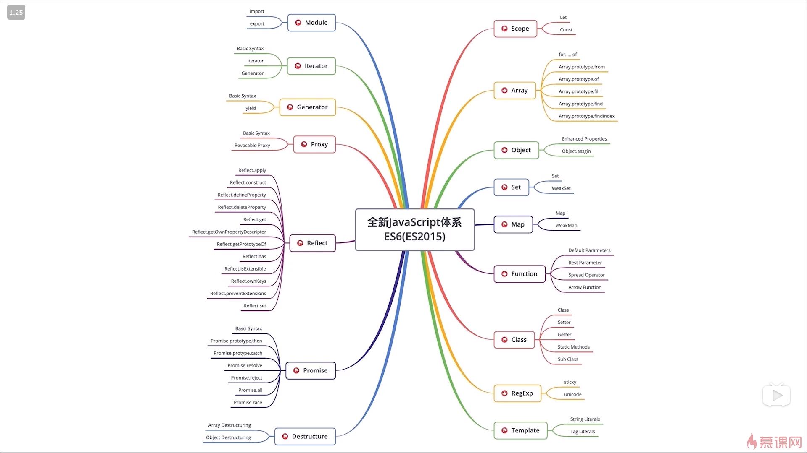

# ES6 学习笔记

> 因此，ES6 既是一个历史名词，也是一个泛指，含义是 5.1 版以后的 JavaScript 的下一代标准，涵盖了 ES2015、ES2016、ES2017 等等，而 ES2015 则是正式名称，特指该年发布的正式版本的语言标准。本书中提到 ES6 的地方，一般是指 ES2015 标准，但有时也是泛指“下一代 JavaScript 语言”。


### 1. 字符串相关扩展

``` 
includes(参数一， 参数二)    //判断字符串是否包含指定的字串，有的话返回true, 否则返回false。
                           //参数一：匹配的字符串，参数二：从第几个开始匹配

startsWith()               //判断字符串是否以特定的字串开始匹配
endsWith()                 //判断字符串是否以特定的字串结束
```

``` 
console.log('hello world'.includes('word', 7));

let url = 'admin/index.php';
console.log(url.startsWith('admin'))
cosole.log(url.endsWith('php'));
```

``` 
//模板字符串
//反引号表示模板，模板中可以有格式，通过${}方式填充数据
let tpl = `
    <div>
         <span>${obj.username}</span>
         <span>${obj.age}</span>
         <span>${obj.gender}</span> 
    </div>

`;

console.log(tpl);

```

### 2. 函数相关扩展

> 1. 参数默认值
> 2. 参数结构赋值
> 3. rest 参数
> 4. ... 扩展运算符

``` 
//参数默认值

function foo (param = 'nihao') {
    console.log(param);
}

foo();
foo('hello, kitty');

//参数结构赋值
function foo ({username = 'lisi', age = 12}= null) {
    console.log(username, age);
}

foo({username:'zhang', age: '19'});

//rest 参数
function foo (a, b, ...param) {
    console.log(a);
    console.log(b);
    console.log(param);
}

foo(1, 2, 3, 4, 5);

//... 扩展运算符

function foo (a, b, c, d, e, f, g) {
    console.log(a + b + c + d + e + f +g);
}

let arr = [1, 2, 3, 4, 5, 6, 7];

foo(...arr);


//应用, 数组合并
let arr1 = [1, 2, 3];
let arr2 = [4, 5, 6];
let arr3 = [...arr1, ...arr2];

console.log(arr3);

```

### 3. 箭头函数

``` 
function foo () {
    console.log('hello');
}
foo();
//等价于
let foo = () => console.log('hello');
foo();

//多个参数必须用小括号包住
let foo = (a,b) => {
    let c = 1;
    console.log(a + b + c);
}
foo(1, 2);

//作为匿名函数传递参数
let arr = [1, 2, 3];

arr.forEach(function(element, index) {
console.log(element, index);
});
//相当于
arr.forEach((element, index) => {
console.log(element, index);
}); 

```

> 箭头函数注意事项;
>
> 1. 箭头函数中的this取决于函数的定义，而不是调用
>
> 2.  箭头函数不可以new
>
> 3.  箭头函数不可以使用arguments获取参数列表， 可以使用rest 参数代替
>
>    ``` 
>    let foo (...param) => {
>    console.log(param);
>    };
>    foo(1, 3, 4);
>    ```
>
>    




### 变量

**var**

1. 可以重复声明
2. 无法限制修改
3. 没有块级作用域


let：不能重复声明、变量-可以修改、块级作用域

const：不能重复声明、常量-不能修改、块级作用域


### 箭头函数

说白了只是一个简写，可以用，看自己喜欢。

```js
let show = () => {
    alert("hello");
}

let show = a => {		//只有一个参数，圆括号省略
    return a*2;
}

let show = a => a*2;		//只有一个return，花括号{}可以省


/*
() => {

}
*/
```


> 1. 如果只有一个参数，圆括号（）可以省
> 2. 如果只有一个return，花括号{}可以省
>
> 


### 函数的参数

**参数扩展**

```js
function show(a, b, ...args) {
    alert(a);
    alert(b);
    alert(args);			//参数扩展，表示剩余的参数，必须是最后一个形参
}
```

**数组展开**

```js
let arr = [1, 2, 3];

alert(...arr);			//1, 2, 3
```


### 解构赋值

> 1. 左右两边类型必须一样
> 2. 右边必须是个确定的类型
> 3. 声明和赋值不能分开（必须在一句话里完成）；

```js
let [a, b, c] = [1, 2, 3];				//数组
let {a, b, c} = {a:12, b:5, c:8};		//JSON
let [{a, b},[n1, n2], num, str] = [{a:1, b:2}, [3, 4], 5, "hell0"];
let [json,arr, num, str] = [{a:1, b:2}, [3, 4], 5, "hell0"];
```


### 数组

> map：映射
>
> reduce：汇总
>
> filter：过滤器
>
> forEach：循环（迭代）


#### map

```js
        let arr = [12, 5, 8];
        // let result = arr.map(function(item) {
        //     return item * 2;
        // });
        let result = arr.map(item => item * 2); //利用箭头函数简写

        alert(result);
```


### reduce

```js
        let arr = [12, 5, 8];

        let result = arr.reduce(function(tmp, item, index) {		//求和
            alert(tmp);
            return tmp + item;
        });
		let average = arr.reduce(function(tmp, item, index) {		//求平均值
            if (index !== arr.length - 1) {
                return tmp + item;
            } else {
                return (tmp + item) / arr.length;
            }
        });
		alert(average);
        alert(result);
```


#### filter

```js
        let arr = [12, 5, 8, 2, 72, 81, 9];

        let result = arr.filter(function(item) {
            return item % 3 === 0;
        })

        // let result = arr.filter(item => item % 3 === 0);
        alert(result);
```


#### forEach

```js
        let arr = [12, 5, 8, 2, 72, 81, 9];

        // arr.forEach(function(item, index) {
        //     alert(index + ":" + item);
        // })
        arr.forEach((item, index) => {
            alert(index + ":" + item);
        });
```


### JSON

将JSON变成字符串

```js
let json = {
            a: 12,
            b: 13
        };
let str = JSON.stringify(json);

```


#### encodeURI 和 encodeURIComponent

```js
//encodeURI 可以整个资源路径进行编码，并且只对非法字符进行编码，基本字符不编码
//http://qiuyeyijian.com/?a=%E9%80%89%E6%8B%A9
let str = encodeURI("http://qiuyeyijian.com/?a=选择");

//encodeURIComponet 对除字母数字以外的所有字符均进行编码
//http%3A%2F%2Fqiuyeyijian.com%2F%3Fa%3D%E9%80%89%E6%8B%A9
let str = encodeURIComponet("http://qiuyeyijian.com/?a=选择");

```


#### JSON 字符串的标准写法

> 1. 只能用双引号，字符串本身可以用单引号包起来
> 2. 所有键都必须用双引号包起来，值如果是数字可以不用，如果是字符串也需用双引号

```js
let str = '{"a": 12, "b": "hello"}';
let json = JSON.parse(str);
```


#### JSON简写

> 1. 名字和值一样，留一个就行
> 2. 方法后面可以不用写冒号和function  (建议不要这样做)


```js
let a = 15;
let b = 30;

//let json = {a: a, b: b, c: 33};
let json = {a, b, c: 33};

console.log(json);
```


### Promise

用同步一样的方式，来书写异步代码

> 异步： 操作之间没有关系，同时进行多个操作
>
> 同步：同时只能做一件事


```js
let p = new Promise(function(resolve, reject) {
            $.ajax({
                url: "assets/a.txt",
                dataType: "json",
                success: function(arr) {
                    resolve(arr);
                },
                error: function(err) {
                    reject(err);
                }
            });
        });

        p.then(function(arr) {
            alert("success!" + arr);
        }, function() {
            alert("failure");
        });
```


```js
Promise.all([$.ajax(), $.ajax()]).then(results=>{
    //对了
}, err => {
    //错了
});
```


### Generator 生成器

**传参**

```js
function *show() {
    alert("a");
    
    let a = yield;
    
    alert("b");
    alert(a);
}

let gen = show();
gen.next();
gen.next(5);

```


**返回值**

```js
function *show() {
    alert("a");
    
    yield 12;
    
    alert("b");
    
    return 55;
}

let gen = show();
let res1 = gen.next();		//{value: 12, done: false}
let res2 = gen.next();		//{value: 55, done: true}
```


### export 和 export default

> export default 和 export 的主要区别 在于对应的import的区别：
>
> export 对应的 import 需要知道 export抛出的变量名或函数名 import{a,b}
>
> export default对应的 import 不需要知道 export抛出的变量名或函数名 import anyname
