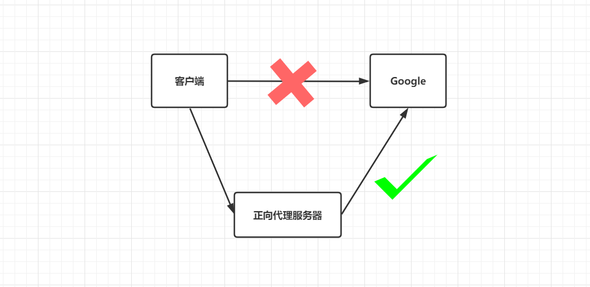
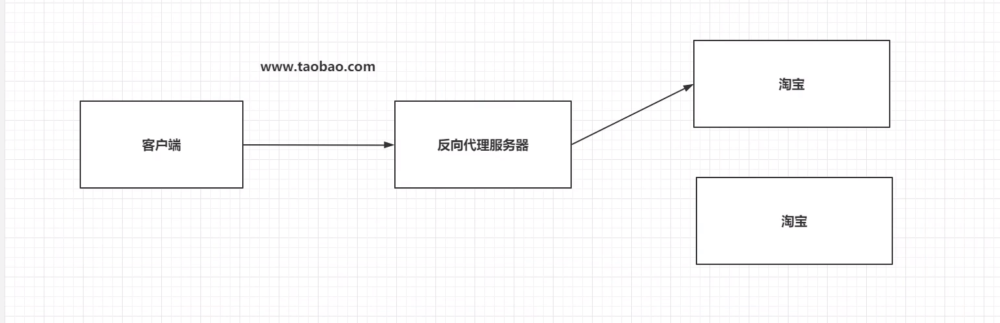
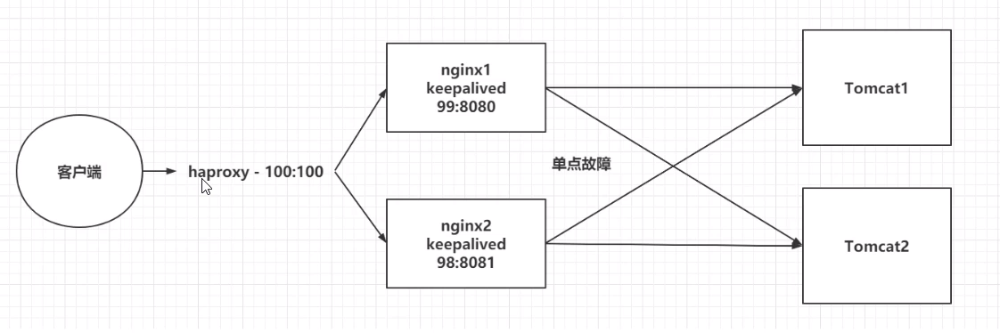

# Nginx

## Nginx基础操作

### Nginx安装

编写docker-compose.yml文件，使用docker-compose安装

```yaml
version: "3.1"
services:
  nginx:
    restart: always
    image: daocloud.io/library/nginx:latest
    container_name: nginx
    ports:
      - 80:80
    volumes:
      - /opt/docker/nginx/conf.d/:/etc/nginx/conf.d
```


### Nginx配置文件


```json
# 全局块
# work_process 的数值越大，Nginx的并发能力越强
# error_log 代表Nginx的错误日志存放位置
user  nginx;
worker_processes  1;

error_log  /var/log/nginx/error.log warn;
pid        /var/run/nginx.pid;

# events块
# worker_connections的数值越大，Nginx并发能力越强
events {
    worker_connections  1024;
}

# http块
http {
    
    #引入媒体类型，mime.types存放着大量的媒体类型
    include       /etc/nginx/mime.types;
    default_type  application/octet-stream;
    
    # server块
    # listen: 代表Nginx监听的端口号
    # localhost: 代表Nginx接收请求的ip
    server {
        listen       80;
        server_name  localhost;
		
    
        #location 块
        # root: 将接收到的请求根据/usr/share/nginx/html去查找静态资源
        # index: 默认去上述路径中找到index.html或者index.htm
        location / {
            root   /usr/share/nginx/html;
            index  index.html index.htm;
        }
	}

	# 引入conf.d目录下的以.conf结尾的配置文件，一般都是一个server设置一个配置文件
	# 主要修改的就是server块，所以后期重点修改conf.d目录下的配置文件即可
    include /etc/nginx/conf.d/*.conf;
}

```


## Nginx 反向代理


### 正向代理和反向代理

> 正向代理：
>
> 1. 正向代理服务是由客户端设立的
> 2. 客户端了解代理服务器和目标服务器都是谁
> 3. 实现突破访问权限，提高访问速度，对目标服务器隐藏客户端IP地址

  


> 反向代理：
>
> 1. 反向代理服务器是配置在服务端的
> 2. 客户端是不知道访问的到底是哪一台服务器
> 3. 达到负载均衡，并且可以隐藏服务器真正的IP地址




### 基于Nginx实现反向代理

> 准备一台目标服务器

修改`conf.d`目录下的`default.conf`文件或者新建一个配置文件

```json
server {
    listen       80;
    server_name  localhost;

    # 基于Nginx反向代理
     location / {
     proxy_pass http://192.168.150.129:8080;
}
```


### 关于Nginx的location路径映射

> 优先级关系：
>
> (location=) > (location/xx/yy/zz) > (location ^~) > (location ~, ~*) >(location/起始路径) > (location /)

#### 1. 精准匹配

```json
location = / {
...
}
```

#### 2. 通用匹配

```json
location /xxx {
    //匹配所有以/xxx开头的路径
    //如果只是 /,则匹配所有
}
```

#### 3. 正则匹配

```json
location ~ /xxx {
	//匹配所有以/xxx开头的路径
}
```

#### 4. 匹配开头路径

```json
location ^~ /images/ {
    //匹配所有以/images开头的路径
}
```

#### 5. 匹配结尾

```json
location ~* \.(gif|jpg.png)$ {
    //匹配以gif|jpg|png结尾的路径
}
```


### 负载均衡

> Nginx为我们默认提供了三种负载均衡策略：
>
> 1. 轮询：
>
>    将客户端发起的请求，平均地分配给每一台服务器
>
> 2. 权重：
>
>    会将客户端的请求，根据服务器的权重值不同，分配不同的数量
>
> 3. ip_hash:
>
>    基于发起请求的客户端的ip地址不同，他始终会将请求发送到指定的服务器上。


#### 轮询

```sh
upstream my-server {		# 注意名字命名不要有下划线
    server 192.168.150.129:8080;
    server 192.168.150.129:8081;

}
server {
    listen       80;
    server_name  localhost;

    # 基于Nginx反向代理
    location / {
     proxy_pass http://my-server/;
    }
}
```


#### 权重

```json
upstream my-server {		# 注意名字命名不要有下划线
    server 192.168.150.129:8080 weight=5;
    server 192.168.150.129:8081 weight=1;

}
server {
    listen       80;
    server_name  localhost;

    # 基于Nginx反向代理
    location / {
     proxy_pass http://my-server/;
    }
}
```


#### ip_hash

```json
upstream my-server {		# 注意名字命名不要有下划线
    ip_hash;	# 只需要加这个就行
    server 192.168.150.129:8080;
    server 192.168.150.129:8081;

}
server {
    listen       80;
    server_name  localhost;

    # 基于Nginx反向代理
    location / {
     proxy_pass http://my-server/;
    }
}
```


### Nginx动静分离

> Nginx的并发能力公式：
>
> 动态资源并发能力 = `worker_process * worker_connections /4`
>
> 静态资源并发能力 = `worker_process * worker_connections /2`
>
> Nginx通过动静分离，来提升Nginx的并发能力


#### 动态资源代理

```json
location / {
    proxy_pass 路径;
}
```


#### 静态资源代理

```json
location / {
    root 静态资源路径;
    index 默认访问路径下的什么资源;
    autoindex on;  # 代表展示静态资源全部的内容，以列表的形式展开。
}
```


YiJian

### Nginx 集群

  

> 单点故障，避免Nginx的宕机，导致整个程序的崩溃
>
> * 准备多台Nginx
> * 准备keepalive，监听Nginx健康情况
> * 准备haprox,提供一个虚拟路径，统一地去接受用户的请求


