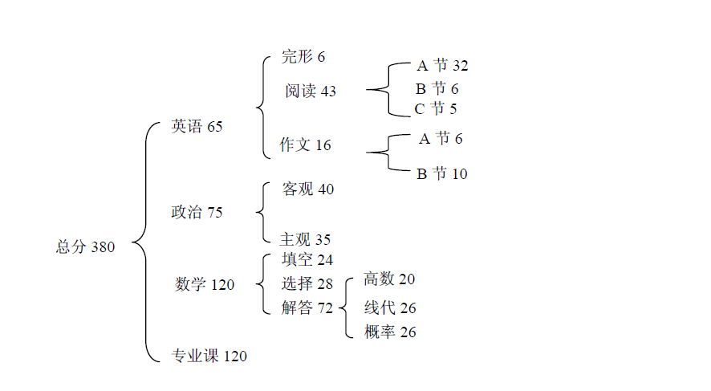
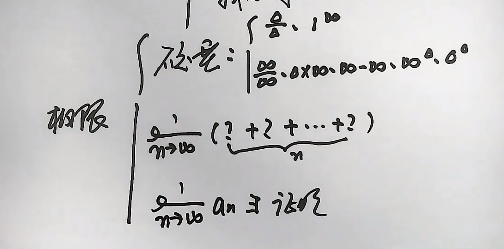

# CS考研

## 英语

考研真相，考研圣经

#### 推荐资料

1. 张剑黄皮书，王江涛作文

2. 张剑黄皮书（真题）、王江涛考研英语高分写作

英语二也可以找英语一的相同的题来做

### 阅读

得阅读者得天下

唐迟阅读理解，何凯文

### 作文

英语二的大作文小作文都可以看一下BEC的作文教程。

其实作文相对于阅读，其提分的性价比是很高的，然而很多人却忽视作文，邻近初试才硬背了几篇范文或者模版就上考场了。我认为作文可以稍早一些准备，尤其是英语二，作文的套路是非常好把握的。小作文要熟悉各种体裁的书写格式、大作文平时要多积累，并且英语二的大作文只可能是分析图表的那种（英语一一般是分析漫画），所以图表呈现的数据是递增式，递减式，上下波动式或者是复合图表，这都是有相应的套路去写作文的，需要自己去总结。而且并非说一定要背模版，我认为在对各类作文的行文结构熟悉的前提下，背一些在很多场景中都能用到的漂亮句子可能更有用，而这些句子在范文里都能提炼出来。

## 数学

### 分值分布

1. 选择题：10x5=50
2. 填空题：6x5=30
3. 大题：6x10=70

高等数学120分，线代30分

### 阶段复习计划

| 阶段     | 时间       | 内容                                                         |
| -------- | ---------- | ------------------------------------------------------------ |
| 基础阶段 | 截止6.30   | 复习全书，，基础练习，按章节复习，不追求综合练习，注重基础概念 |
| 强化阶段 | 7.1-9.30   | 4个能力：计算，综合分析，逻辑推理，实际应用。一个中心：疯狂练习 |
| 冲刺阶段 | 10.1-12.23 | 真题，                                                       |

一、基础阶段
内容：课本、习题
要求：概念，定理，公式
参考书：660，基础篇
时间：～5月（越早完成越好）
二、强化
内容：考研常见的题型，方法，技巧
要求：学会，（掌握）
参考书：讲义，全书，330
时间：5-9月
建议听课，该阶段课程最多
三、巩固 提高
内容：真题
要求：正确、熟练，举一反三
参考书：6套模拟卷，330，临阵磨枪
时间：10-12月

### 基础阶段

#### 知识体系

* 概念
* 原理和性质
* 公式

#### 原理和性质

* 条件
* 结论
* 证明
* 应用

#### 方法体系

* 核心问题
* 应对之道

## 政治

## 专业课

上机敲代码也别忘了偶尔手写自己认为比较重要的算法代码。

