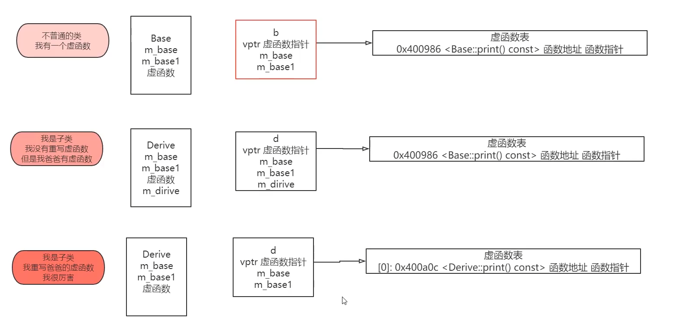
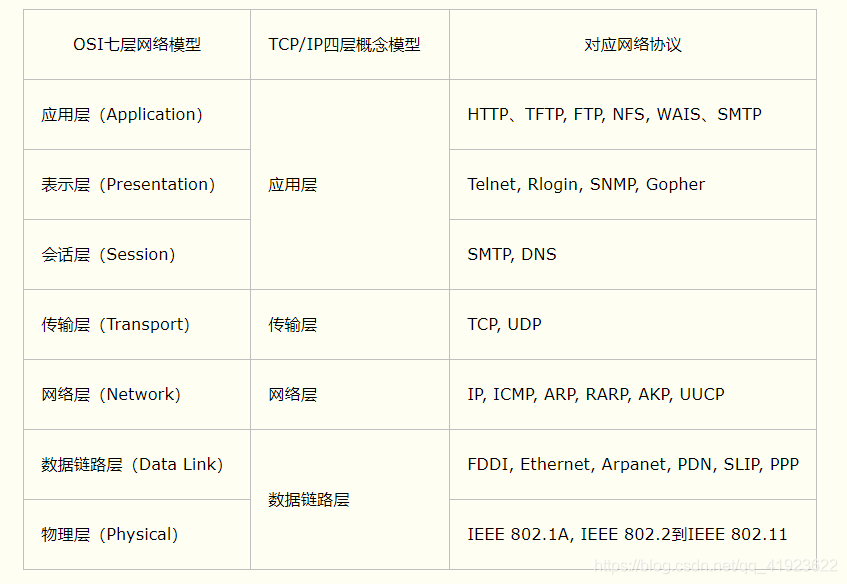

https://www.cnblogs.com/inception6-lxc/p/8686156.html


## 数据结构

### B树与B+树的区别

结构上：B树中关键字集合分布在整棵树中，叶节点中不包含任何关键字信息，而B+树关键字集合分布在叶子结点中，非叶节点只是叶子结点中关键字的索引；相对来说，B+树磁盘页能容纳更多节点元素，更“矮胖”；

性能上（也即为什么说B+树比B树更适合实际应用中操作系统的文件索引和数据库索引？）

**B+树的磁盘读写代价更低**，因为B+树的所有非叶子节点只会存放索引信息，而真正的数据信息都只存放在叶子节点中，这样一来，每个非叶子节点存放的索引信息就更多，一次磁盘IO就可以读取更多的索引信息到内存中，可以减少磁盘IO的次数。

**B+树的查询效率更加稳定**，由于非叶子节点只存索引信息，而没有真正的数据信息，所以任何关键字的查找必须走一条从根结点到叶子结点的路。所有关键字查询的路径长度相同，导致每一个数据的查询效率相当。

**B+树更加适合在区间查询的情况**，由于B+树的数据都存储在叶子结点中，非叶子结点均为索引，只需要扫一遍叶子结点即可得到所有数据信息，但是B树因为其非叶子结点同样存储着数据，我们要找到具体的数据，需要进行一次中序遍历按序来扫，所以B+树更加适合在区间查询的情况，所以通常B+树用于数据库索引。


### 排序算法

快速排序的逻辑


## C++

### 为什么STL要分为容器、算法、迭代器三部分

对于更多容器和算法，这种分离极大地减少了代码组合爆炸的发生。STL中有5个序列容器，8个关联容器和3个容器适配器，`<algorithm>`单独就有将近80种算法（甚至在`<numeric>`）中计数，使您的`16 + 80`而不是`16 * 80`减少了13倍的代码！（当然，不是每个算法在每个容器上都有意义，但要点很明确）。

https://www.mianshigee.com/question/101621mdg/


### 智能指针

在 C++ 中没有垃圾回收机制，必须自己释放分配的内存，否则就会造成内存泄露。解决这个问题最有效的方法是使用智能指针（smart pointer）。智能指针是存储指向动态分配（堆）对象指针的类，用于生存期的控制，能够确保在离开指针所在作用域时，自动地销毁动态分配的对象，防止内存泄露。

**智能指针的核心实现技术是引用计数，每使用它一次，内部引用计数加1，每析构一次内部的引用计数减1，减为0时，删除所指向的堆内存。**

C++11 中提供了三种智能指针，使用这些智能指针时需要引用头文件 `<memory>`：

`std::shared_ptr`：共享的智能指针

`std::unique_ptr`：独占的智能指针

`std::weak_ptr`：弱引用的智能指针，它不共享指针，不能操作资源，是用来监视` shared_ptr` 的。


### 右值引用


### vector内存管理

关于vector简单的讲就是一个动态增长的数组，里面有一个指针指向一片连续的内存空间，当空间装不下的时候会自动申请一片更大的空间（空间配置器）将原来的数据拷贝到新的空间，然后就会释放旧的空间。当删除的时候空间并不会被释放只是清空了里面的数据。

reserve：（预留一定的空间）

reserve是直接扩充到已经确定的大小，可以减少多次开辟、释放空间的问题，就可以提高效率，其次还可以减少多次要拷贝数据的问题。

resize：（重新分配大小）

若要开辟的空间的size大于其原来的size，那么resize之后要存放的数据就放在原size后的位置上。

若要开辟的空间小于原size则就保留前n个数据（之后的会自动的删除）


### 说说多态，以及多态怎么实现，虚函数表 

多态是对于不同对象接收相同消息时产生不同的动作。C++的多态性分为编译时多态和运行时多态：

- 编译时多态性：函数重载，函数模板
- 运行时多态性：通过虚函数实现。

作用：

- 隐藏实现细节，使得代码能够模块化；扩展代码模块。实现代码重用。
- 接口重用：为了类在继承和派生的时候，保证使用家族中任一类的实例的某一属性时的正确调用。说白了，就是(纯)虚函数。

1.定义：“一个接口，多种方法”，程序在运行时才决定要调用的函数。

2.实现：C++多态性主要是通过虚函数实现的，虚函数允许子类重写override(注意和overload的区别，overload是重载，是允许同名函数的表现，这些函数参数列表/类型不同）。

**注：多态与非多态的实质区别就是函数地址是静态绑定还是动态绑定。如果函数的调用在编译器编译期间就可以确定函数的调用地址，并产生代码，说明地址是静态绑定的；如果函数调用的地址是 需要在运行期间才确定，属于动态绑定。**

3.目的：**接口重用。**封装可以使得代码模块化，继承可以扩展已存在的代码，他们的目的都是为了代码重用。而多态的目的则是为了接口重用。

4.用法：声明基类的指针，利用该指针指向任意一个子类对象，调用相应的虚函数，可以根据指向的子类的不同而实现不同的方法。

用一句话概括：在基类的函数前加上virtual关键字，在派生类中重写该函数，运行时将会根据对象的实际类型来调用相应的函数。如果对象类型是派生类，就调用派生类的函数；如果对象类型是基类，就调用基类的函数。


### 关于重载、重写、隐藏的区别

```cpp
Overload(重载)：在C++程序中，可以将语义、功能相似的几个函数用同一个名字表示，但参数或返回值不同（包括类型、顺序不同），即函数重载。
（1）相同的范围（在同一个类中）；
（2）函数名字相同；
（3）参数不同；
（4）virtual 关键字可有可无。

Override(覆盖或重写)：是指派生类函数覆盖基类函数，特征是：
（1）不同的范围（分别位于派生类与基类）；
（2）函数名字相同；
（3）参数相同；
（4）基类函数必须有virtual 关键字。
注：重写基类虚函数的时候，会自动转换这个函数为virtual函数，不管有没有加virtual，因此重写的时候不加virtual也是可以的，不过为了易读性，还是加上比较好。

Overwrite(重写)：隐藏，是指派生类的函数屏蔽了与其同名的基类函数，规则如下：
（1）如果派生类的函数与基类的函数同名，但是参数不同。此时，不论有无virtual关键字，基类的函数将被隐藏（注意别与重载混淆）。
（2）如果派生类的函数与基类的函数同名，并且参数也相同，但是基类函数没有virtual关键字。此时，基类的函数被隐藏（注意别与覆盖混淆）。
```


### delete/new与free/malloc的区别


### 复制构造函数与赋值函数

https://blog.csdn.net/N1314N/article/details/91125969


### 多继承与多重继承

多重继承这个名词一般用来形容继承链条可以很长，多个层次。多继承则指一个类可以有多个基类，相反则是单继承。任何面向对象编程语言都支持多重继承，但像java这种只能通过接口实现有限程度的多继承。


### 虚函数与虚函数表

**C++的虚函数(Virtual Function)是通过一张虚函数表(Virtual Table)来实现的。简称为V-Table。**在这个表中，主要是一个类的虚函数的地址表，这张表解决了继承、覆盖(override)的问题，保证其能真实的反应实际的函数。这样，在有虚函数的类的实例中这张表被分配在了这个实例的内存中，所以当我们用父类的指针操作一个子类的时候，这张虚函数表就显得尤为重要了，他就像一个地图一样，指明了实际所应该调用的函数。





#### 虚函数表

只要有虚函数，C++类都会存在这样的一张**虚函数表**。指向这个虚函数表的指针叫做**虚函数表指针**，它存储在对象开始的位置。

虚函数表说白了就是函数指针数组，每一个表项指向了重写了父类的虚函数的地址，如果没有重写那么默认指向父类的虚函数地址。


### 虚继承作用

虚继承的提出就是为了解决多重继承时，可能会保存两份副本的问题，也就是说用了虚继承就只保留了一份副本。


### 析构函数声明为虚函数的原因 

**唯有这样，当delete一个指向子类对象的父类指针是，才能保证系统能够依次调用子类的析构函数和父类的析构函数，从而保证对象内存被正确地释放。**

只有虚函数才能够做到用父类指针调用子类的虚函数。也正是由于这种特性，所以只要把析构函数声明为虚函数，系统内部就能够正确处理调用关系。

父类中析构函数的虚属性也会被继承给子类，C++中为了获得运行时的多态行为，所调用的成员函数必须是virtual的。


### 构造函数可以声明为虚函数吗

**执行虚函数需要借助虚指针vptr，虚指针指向虚函数表，而虚指针在构造函数中初始化，虚指针还没有初始化，就不能执行虚函数，虚构造函数和虚指针是矛盾的。**


### map和unordered_map的区别

map是一种有序的容器，底层是用**红黑树**实现的，红黑树是一种自平衡的二叉树，可以保障最坏情况的运行时间，**它可以做到O(logn)时间完成查找、插入、删除元素的操作。**

unordered_map是一种无序的容器，底层是用**哈希表**实现的，哈希表最大的优点是把数据的查找和存储时间都大大降低。

|      | map                                                          | unordered_map                              |
| ---- | ------------------------------------------------------------ | ------------------------------------------ |
| 优点 | 1. 有序性，可应用于有顺序要求的应用中 2. 可保证最坏情况下的运行时间 | 哈希表保证了元素的查找和存储速度都非常的快 |
| 缺点 | 空间占用率高，红黑树的每个节点都需要保存 父节点、子节点和红黑性质，增加了使用空间 | 哈希表的建立比较耗时                       |

- 在有顺序要求的场合，肯定是要用map的；
- 如果我们只操作一次，为了保证最坏情况下的运行时间，最好也适用map；
- 如果是需要经常操作，map肯定是没有unordered_map快的。
- 因此，除了有顺序要求和有单次操作时间要求的场景下用map，其他场景都使用unordered_map。


### placement new

一般情况下，使用 new 申请空间时，是从系统的堆（heap）中分配空间，申请所得的空间的位置是根据当时的内存的实际使用情况决定的。但是，在某些特殊情况下，可能需要在已分配的特定内存创建对象，这种操作就叫做 `placement new `即**定位放置 new。**

最后，给大家总结一下关于 placement new 的一些细节：

- 使用定位放置 new 操作，既可以在栈 (stack) 上生成对象，也可以在堆（heap）上生成对象，这取决于定位时指定的内存地址是在堆还是在栈上。
- 从表面上看，定位放置 new 操作是申请空间，**其本质是利用已经申请好的空间，真正的申请空间的工作是在此之前完成的。**
- 使用定位放置 new 创建对象时会自动调用对应类的构造函数，但是由于对象的空间不会自动释放，如果需要释放堆内存必须显示调用类的析构函数（里面需要使用delete或者free语句）。
- **使用定位放置 new 操作，我们可以反复动态申请到同一块堆内存，这样可以避免内存的重复创建销毁，从而提高程序的执行效率（比如网络通信中数据的接收和发送）。**


### static和const关键字尽可能多的作用

#### static

函数体内static变量的作用范围为改函数体，不同于auto变量，该变量的内存只被分配一次。

在模块内的static全局变量可以被模块内的所有函数访问，但不能被模块外的其他函数访问

在模块内的static函数只可以被这一模块内的其他函数调用，这个函数的使用范围被限制在声明它的模块内

在类中的static成员变量属于整个类所拥有，对于类的所有对象只有一份拷贝

在类中的static成员函数属于整个类所拥有，这个函数不接收this指针，因而只能访问类的static成员变量


#### const

定义一个常量，不可以被修改，需要在定义的时候初始化

对于指针来说，可以指定指针本身为const，也可以指定指针所指的数据为const，或者二者同时指定为const

在一个函数声明中，const可以修饰形参，表名它是一个输入参数，在函数内部不能改变

对于类的成员函数，若指定其为const类型，则表明是一个常函数，不能修改类的成员变量

对于类的成员函数，有时候必须指定其返回值为const类型，使得其返回值不为“左值”


**不可以同时用const和static修饰成员函数。**

C++编译器在实现const的成员函数的时候为了确保该函数不能修改类的实例的状态，会在函数中添加一个隐式的参数const this*。但当一个成员为static的时候，该函数是没有this指针的。也就是说此时const的用法和static是冲突的。

我们也可以这样理解：两者的语意是矛盾的。**static的作用是表示该函数只作用在类型的静态变量上，与类的实例没有关系；而const的作用是确保函数不能修改类的实例的状态**，与类型的静态变量没有关系。因此不能同时用它们。


### 指针函数与函数指针

指针函数：返回类型是指针的函数

函数指针：指向函数的指针


### 模板函数和函数模板

函数模板是一组函数的抽象描述，它不是一个实实在在的函数，函数模板不会编译成任何目标代码。函数模板必须先实例化成模板函数，这些模板函数再程序运行时会进行编译和链接，然后产生相应的目标代码。

函数模板实例化之后就是模板函数，模板函数可以进行编译和链接，然后产生相应的目标代码。


### map的key可以自定义吗

可以，需要：

- 定义哈希函数的函数对象；
- 定义等比函数的函数对象或者在自定义类里重载operator==()。

https://blog.csdn.net/y109y/article/details/82669620


### vector增长因子

https://blog.csdn.net/beibaoke910/article/details/115062728

https://blog.csdn.net/honglicu123/article/details/77541943


## Linux

### 进程与线程

进程：具有独立功能的程序关于某个数据集合上的一次运行活动。

线程：进程的一个实体。

比喻：一列火车是一个进程，火车的每一节车厢是线程。

### 进程与线程的联系

①一个线程只能属于一个进程，一个进程可以有多个线程；

②系统资源分配给进程，同一进程的所有线程共享该进程的所有资源；

③真正在处理机上运行的是线程；

④不同进程的线程间利用消息通信的方式实现同步。

### 进程与线程的区别

调度：线程是系统调度和分配的基本单位，进程是作为拥有系统资源的基本单位；

拥有资源：进程是拥有资源的独立单位，线程不拥有资源，但可以访问隶属于进程的资源；

系统开销：创建和撤销进程的开销更大；进程拥有独立的地址空间，一个进程的崩溃不会影响其他进程；线程拥有自己的堆栈和局部变量，没有独立的地址空间，因此进程里的一个线程崩溃会导致其他线程均崩溃。


### 进程间通信方式

- 管道：半双工的通信方式，数据只能单向流动，且只能在有亲缘关系（父子进程或兄弟进程）的进程间使用；
- 命名管道：FIFO，半双工的通信方式，但允许在无亲缘关系的进程间通信；
- 消息队列：消息的链表，存放在内核中，并由消息队列标识符标识。消息队列克服了信号传递信息少、管道只能承载无格式字节流以及缓冲区大小受限等缺点；
- 信号量：是一个计数器，用于控制多个进程间对共享资源的访问；
- 共享内存：映射一段能被其他进程访问的内存，这段内存由一个进程创建，但多个进程都可以访问；
- 套接字

管道主要应用于本地进程间通信，而套接字多应用于网络进程间数据的传递。


### 线程间通信方式

多个线程在处理同一个资源，并且任务不同时，需要线程通信来帮助解决线程之间对同一个变量的使用或操作。就是多个线程在操作同一份数据时， 避免对同一共享变量的争夺。

①锁机制：包括互斥锁、条件变量、读写锁

- 互斥锁提供了以排他方式防止数据结构被并发修改的方法。
- 读写锁允许多个线程同时读共享数据，而对写操作是互斥的。
- 条件变量可以以原子的方式阻塞进程，直到某个特定条件为真为止。对条件的测试是在互斥锁的保护下进行的。条件变量始终与互斥锁一起使用。

②信号量机制(Semaphore)：包括无名线程信号量和命名线程信号量

③信号机制(Signal)：类似进程间的信号处理

**线程间的通信目的主要是用于线程同步，所以线程没有像进程通信中的用于数据交换的通信机制。**


### 进程间通信可以用互斥锁吗


### I/O多路复用

**IO多路复用是一种同步IO模型**，**实现一个进程可以监视多个文件句柄（socket、文件或者管道等等）**，一旦某个文件句柄**就绪**，就能够通知程序进行相应的**读写操作**。

IO多路复用相比于多线程的优势在于系统的开销小，系统不必创建和维护进程或线程，**免去了线程或进程的切换带来的开销**。而操作系统支持IO多路复用的系统调用有select，poll和epoll。

#### select

 select的底层是一个fd_set的数据结构，本质上是一个long类型的数组，数组中每一个元素都对应于一个文件描述符，通过轮询所有的文件描述符来检查是否有事件发生。

【优点】：

可移植性好；

连接数少并且连接都十分活跃的情况下，效率也不错。

【缺点】：

可以监听的最大文件描述符数量为1024（因为内核写定了）。

检查是否有事件发生是采用轮询遍历的方式，当文件描述符很多时开销很大。 


#### poll

poll与select差不多，但**poll的文件描述符没有最大数量的限制**，但是**依然采用轮询遍历**的方式检查是否有事件发生。


#### epoll

epoll是一种更加高效的IO多路复用的方式，它可以监视的文件描述符数量突破了1024的限制（十万），同时不需要通过轮询遍历的方式去检查文件描述符上是否有事件发生，**因为epoll_wait返回的就是有事件发生的文件描述符。本质上是事件驱动。**

**具体是通过红黑树和就绪链表实现的，红黑树存储所有的文件描述符，就绪链表存储有事件发生的文件描述符；**

epoll_ctl可以对文件描述符结点进行增、删、改、查，并且告知内核注册回调函数（事件）。

一旦文件描述符上有事件发生时，那么内核将该文件描述符节点插入到就绪链表里面

这时候epoll_wait将会接收到消息，并且将数据拷贝到用户空间。

**表面上看epoll的性能最好，但是在连接数少并且连接都十分活跃的情况下，select和poll的性能可能比epoll好，毕竟epoll的通知机制需要很多函数回调。**


#### epoll读到一半又有新事件来了怎么办？

避免在主进程epoll再次监听到同一个可读事件，可以把对应的描述符设置为**EPOLL_ONESHOT**，效果是监听到一次事件后就将对应的描述符从监听集合中移除，也就不会再被追踪到。读完之后可以再把对应的描述符重新手动加上。

类似于不希望中断嵌套，就在处理中断之前关中断


#### select 和 epoll的区别

epoll的优点对应select的缺点

1. **没有最大并发连接的限制，能打开的FD的上限远大于1024（1G的内存上能监听约10万个端口）**；
2. 效率提升，不是轮询的方式，不会随着FD数目的增加效率下降。只有活跃可用的FD才会调用callback函数；
   **即Epoll最大的优点就在于它只管你“活跃”的连接，而跟连接总数无关，因此在实际的网络环境中，Epoll的效率就会远远高于select和poll。**

3、 内存拷贝，利用mmap()文件映射内存加速与内核空间的消息传递；即epoll使用mmap减少复制开销。


### epoll是异步的还是同步的

关键看从哪个层面来来看了：IO层面、消息处理层面

1. 从IO层面来看,epoll绝对是同步的
2. 从消息处理层面来看，epoll是异步的


### 僵尸进程

在一个启动的进程中创建子进程，这时候就有了父子两个进程，父进程正常运行，子进程先结束，**子进程无法释放自己的 PCB 资源，需要父进程来做这个件事儿，但是如果父进程也不管，这时候子进程就变成了僵尸进程。**

比如进程采用exit()退出的时候，操作系统会进行一系列的处理工作，包括关闭打开的文件描述符、占用的内存等等，但是，操作系统也会为该进程保留少量的信息，比如进程ID号等信息，因而占用了系统的资源。在一种极端的情况下，档僵尸进程过多的时候，占用了大量的进程ID，系统将无法产生新的进程，相当于系统的资源被耗尽。


#### 避免产生僵尸进程

父进程使用wait()或者waitpid()之类的函数等待子进程退出

父进程先产生一个子进程，然后子进程再产生一个孙子进程，子进程在孙子进程之前退出。

使用信号函数sigaction为SIGCHLD设置wait处理函数


### 多线程编程


## 网络

https://www.cnblogs.com/inception6-lxc/p/9152691.html

OSI七层模型 


### tcp保证传输的可靠性

确认机制、重传机制、滑动窗口。


### tcp连接如何多次传送的报文 


### Tcp的状态转换过程 


### TCP和UDP的差别

TCP，传输控制协议。是一种面向连接的，可靠的，面向字节流的传输层协议。提供拥塞控制，超时和重发机制。全双工通信。

UDP，用户数据报协议。是一种面向无连接，不可靠的，面向数据报的传输层协议。提供广播和多播，常用于直播等。


### time_wait()

time_wait()会出现在主动断开连接的那一方，所以如果出现大量time_wait()

服务器：

* 从业务逻辑上面判断，是什么原因导致服务器主动调用close()
* 端口复用，使用setsockopt()


### close_wait()

客户端断开网络连接，服务端RECV返回0，但是没有调用或者很长一段时间后才调用close()函数，导致close_wait()时间很久。如果在高并发的情况下，就会出现大量close_wait()


另外，把SOCKET的SO_LINGER设置为0秒拖延（也就是立即关闭）在很多时候是有害处的。 

还有，把端口设置为可复用是一种不安全的网络编程方法


### HTTP和HTTPS

HTTP协议传输的数据都是未加密的，也就是明文的，因此使用HTTP协议传输隐私信息非常不安全，为了保证这些隐私数据能加密传输，于是网景公司设计了SSL（Secure Sockets Layer）协议用于对HTTP协议传输的数据进行加密，从而就诞生了HTTPS。

简单来说，HTTPS协议是由SSL+HTTP协议构建的可进行加密传输、身份认证的网络协议，要比http协议安全。


HTTP与HTTPS对比

HTTP特点

- 无状态：协议对客户端没有状态存储，对事物处理没有“记忆”能力，比如访问一个网站需要反复进行登录操作。
- 无连接：HTTP/1.1之前，由于无状态特点，每次请求需要通过TCP三次握手四次挥手，和服务器重新建立连接。比如某个客户机在短时间多次请求同一个资源，服务器并不能区别是否已经响应过用户的请求，所以每次需要重新响应请求，需要耗费不必要的时间和流量。
- 基于请求和响应：基本的特性，由客户端发起请求，服务端响应。
- 简单快速、灵活
- 通信使用明文、请求和响应不会对通信方进行确认、无法保护数据的完整性。

HTTPS特点

- 内容加密：采用混合加密技术，中间者无法直接查看明文内容。
- 验证身份：通过证书认证客户端访问的是自己的服务器。
- 保护数据完整性：防止传输的内容被中间人冒充或者篡改


http的中文叫做超文本传输协议,它负责完成客户端到服务端的一系列操作,是专门用来传输注入HTML的超媒体文档等web内容的协议,它是基于传输层的TCP协议的应用层协议

https：https是基于安全套接字的http协议,也可以理解为是http+ssl/tls(数字证书)的组合

http 和 https的区别:

HTTP 的 URL 以 http:// 开头，而 HTTPS 的 URL 以 https:// 开头

HTTP 是不安全的，而 HTTPS 是安全的

HTTP 标准端口是 80 ，而 HTTPS 的标准端口是 443

在 OSI 网络模型中，HTTPS的加密是在传输层完成的,因为SSL是位于传输层的,TLS的前身是SSL,所以同理

HTTP无需认证证书,而https需要认证证书 


https://blog.csdn.net/zhttly/article/details/112958695


### 说说osi七层模型，以及每一层对应的协议




### TCP三次握手的原因：

3次握手完成两个重要的功能，既要双方做好发送数据的准备工作(双方都知道彼此已准备好)，也要允许双方就初始序列号进行协商，这个序列号在握手过程中被发送和确认。

防止失效的连接请求到达服务器后，服务器重复打开链接。

例如，因为网络原因导致第一次链接请求在网络中滞留，然后客户端又发送了一次连接请求，此时，如果没有三次握手机制，服务器就会打开两条链接。

### 为什么连接的时候是三次握手，关闭的时候却是四次握手？

在连接时，当服务端接收到连接的报文时，服务端可以将应答报文和同步报文同时发送给客户端，但是当服务端接收到关闭的报文时，服务端有可能还有数据没有发送完成，因此服务端只能将应答报文先返回，等数据发送完成后再发送FIN报文。

### 四次挥手的原因

确保服务端能把所有数据发送完成


###   TCP拥塞控制 

慢开始

拥塞避免

快重传

快恢复


### TCP可靠传输

TCP基于以字节为单位的滑动窗口来实现可靠传输


### TCP协议如何保证数据不被丢失？

网络层协议还有个ICMP协议，ICMP协议常常认为是IP协议的一部分，由于IP协议对上层运输层和下层物理链路层是透明的，当发送数据报被丢弃时，ICMP会把错误信息反馈给TCP,而UDP不会得到任何返回信息，TCP解析后会进行数据重传。由于IP发送数据报可能会分片发送，TCP协议还有对数据进行重排在给应用增层。

### 为什么ICMP会把数据报异常返回给TCP而不是UDP？

TCP的首部长度为20个字节，而UDP的首部长度为8字节，多的12个字节中有4个字节保存的是32位的ICMP信息，而ICMP数据包由8bit的错误类型和8bit的代码和16bit的校验和组成。


### TCP和UDP每次传输的数据大小？

UDP是无连接的，发送一次数据报链接就断开了，因为32位IP是由4位（版本）+4位（头长度）+8位（服务类型）+16位（总长度：报头区+数据区）组成的所以最大传输数据为2的16次幂64K,UDP首部8位IP首部20位，所以UDP理论最大传输数据为64K-1bit-20bit-8bit（事实上受物理网络的限制，要比这个数值小很多） 。

TCP提供全双工服务，由于物理网络层一般要限制每次发送数据帧的最大长度，IP发送数据会分片发送，MTU（网络传输最大报文包）最大值为1500bit，所以TCP数据报最大为1500-20-20=1460bit（IP首部个TCP首部都是20bit），理想状态下**MSS(网络传输数据最大值 )**等于MTU，当然如果对于非本地的IP，这个MSS可能就只有536字节，而且，如果中间的传输网络的MSS更佳的小的话，这个值还会变得更小。


## Mysql

### mysql优化

查询优化

当MySQL单表记录数过大时，数据库的性能会明显下降，一些常见的优化措施如下：

可以从**分库分表、读写分离以及缓存**三个维度分别阐述。

- 限定数据的范围。比如：用户在查询历史信息的时候，可以控制在一个月的时间范围内；
- 读写分离： 经典的数据库拆分方案，主库负责写，从库负责读；
- 通过分库分表的方式进行优化，主要有垂直拆分和水平拆分。


### MVCC

MVCC(`Multiversion concurrency control`) 就是同一份数据保留多版本的一种方式，进而实现并发控制。在查询的时候，通过`read view`和版本链找到对应版本的数据。

作用：提升并发性能。对于高并发场景，MVCC比行级锁开销更小。


### 数据库三范式

**第一范式（1NF）**：字段（或属性）是不可分割的最小单元，即不会有重复的列，体现原子性

**第二范式（2NF）**：满足 1NF 前提下，存在一个候选码，非主属性全部依赖该候选码，即存在主键，体现唯一性，专业术语则是**消除部分函数依赖**

**第三范式（3NF）**：满足 2NF 前提下，非主属性必须互不依赖，**消除传递依赖**


### Mysql索引

主键和索引区别


mysql索引是什么，有什么作用？

#### 索引是什么，有什么作用？

索引是存储引擎用于提高数据库表的访问速度的一种**数据结构**。

**减少读取磁盘次数，加快查询速度。**数据是存储在磁盘上的，查询数据时，如果没有索引，会加载所有的数据到内存，依次进行检索，读取磁盘次数较多。有了索引，就不需要加载所有数据，因为B+树的高度一般在2-4层，最多只需要读取2-4次磁盘，查询速度大大提升。

#### 索引的优缺点？

优点：

- **加快数据查找的速度**
- 为用来[排序](https://www.nowcoder.com/jump/super-jump/word?word=排序)或者是分组的字段添加索引，可以加快分组和[排序](https://www.nowcoder.com/jump/super-jump/word?word=排序)的速度
- 加快表与表之间的连接

缺点：

- 建立索引需要**占用物理空间**
- 会降低表的增删改的效率，因为每次对表记录进行增删改，需要进行**动态维护索引**，导致增删改时间变长


## 设计模式

设计模式有哪些？


## HR面

### 优缺点


### 挫折


### 自豪


### 性格优缺点


### 你有什么想要问我的

Q1：“请问公司对待新人有没有相关职位的技能培训？我想多提升自己的专业技能！”

Q2：“请问公司对于新人的成长有没有什么规划？”

Q3：“请问公司的上班氛围是怎样的？有没有团建之类的互动活动”


### 宏函数和内联函数区别是什么

1. 宏函数在预编译时展开，内联函数在编译时展开。

2. 宏函数不是真正的函数，只是简单的文本替换，不会有类型检查。内联函数是真正的函数，会有类型检查，可以在运行时调试。
3. inline函数的引入正是为了替代宏函数


### 说说大小字节序，用一个简单函数判别大小序 

定义一个整型1，强制转换成字符型，再转换成整型，如果还是1那么就是小端，否则是大端。

```cpp
int i = 1;
((int)(char)i == 1) ? printf("little") : printf("big");
```


(15)滑动窗口怎么实现的 

(16)说说怎么取一个折中方案，提高TCP的传输效率 

 (18)拥塞控制[算法]()有哪些，怎么样实现 

(19)TIME_WAIT在哪个阶段，会发生什么作用 

(20)一个5升瓶子一个3升瓶子，弄出4升水 

(21)Top K 说说你的思路 

 (22)说说各种[排序]()的复杂度，和快排递归和非递归思路 

 (23)还有一个赛马[算法]()，记不清了 

(24)反问 


(4)多态 

(5)select poll epoll多路io复用都说一说 

(6)vector底层实现，空间不够怎么办，怎么分配128k的空间 

(7)3次握手4次挥手都说一说 

(8)虚继承，菱形继承 

(9)模板库中sort的时间复杂度 

(10)map和set知不知道，说一说 

 (11)尽可能多说一说[红黑树]()，怎么旋转的 

 (12)将数组中出现次数超过数组长度一半的元素输出，并优化你的[算法]() 

(13)进程通信，线程通信，进程线程区别 

(14)反问


### 中手游


1. MySQL事务的特性
2. 有没有了解过C++11
3. 什么是右值引用
4. 右值引用的优点
5. 讲讲智能指针
6. TCP/IP协议使用了IOS7层中的哪些层，为什么
7. TCP的特性优点
8. TCP的可靠性表现在哪里
9. 为什么三次握手
10. 如何实现三次握手
11. 第三次握手网络波动没有接收到会怎么样
12. TCP发送端接受端状态
13. TCP拥塞控制滑动窗口的了解
14. 使用过哪些STL，讲一下
15. vector和数组的区别
16. vector的扩容机制
17. vector各类操作的复杂度
18. list的了解
19. list的各类操作复杂度
20. 如何优化vector的删除复杂度接近O(1)
21. map和unordered_map的区别
22. map的实现，特性
23. 前中后序遍历讲一下
24. 讲讲你对组成原理的认识


## 阿丘科技

C++11新特性

函数指针与指针函数

类模板与模板类，函数模板与模板函数

类型是在什么时候确定

map的key可以是自定义的吗

weak_ptr可以取数据吗

回调函数


## 上期技术

c语言字符串转整型

I/O多路复用

TCP，UDP的应用场景

为什么滑动窗口要减半，而不是1/3

数据结构无向图的遍历，递归边界是什么

Mysql了解多少

线程通信

根据信号量来解释锁，为什么有了信号量还要锁


动态链接库，静态链接库


