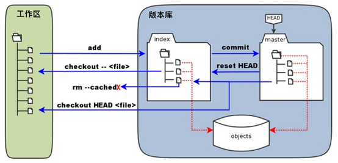

# Git


> 学习Git时记录的一些笔记。随着学习的不断深入，会不断对文章进行修改。文章内对其他文


## 基本概念

### 本地仓库

工作区：工作区就是我们能看到的目录，它持有实际文件。

版本库：工作区有一个隐藏目录.git，这个不是工作区，是Git的版本库。版本库里会有暂存区，以及Git自动创建的第一个分支master，以及指向master的一个指针叫HEAD。

暂存区，stage（或者叫index），存放在 ".git目录下" 下的index文件（.git/index）中。它像个缓存区域，临时保存你的改动；

HEAD，它指向你最后一次提交的结果。



可以说，版本控制的本质就是对文件版本的控制。对文件进行各种操作的前提是，明确文件所在的状态。在git中通过`git status`指令来查看当前所有文件的状态。若你的版本库与工作区的文件快照完全相同，即所有文件均处于`Unmodify`状态，则执行`git status`会提示：`working tree clean`。

### 文件状态

**Untracked：**未跟踪：此文件存在于项目文件夹中，但并未添加到版本库，所以不会参与版本控制，使用`git add filename`指令来将文件状态转换为Staged。

**Unmodify：**文件已入版本库，未修改，也就是说该文件与版本库中文件快照完全一致。这种状态下的文件有两种去处：使用`git rm filename`指令来将文件移出版本库，状态变为Untracked；或者修改该文件，状态变为Modified。

**Modified：**文件已经被修改（仅是修改，并无其它操作），意味着该文件与版本库的文件快照不相同，这种状态下的文件也有两种去处：使用指令`git add filename` 将该文件存入暂存区，状态变为Staged；或者使用指令`git checkout`丢弃修改，状态变为Unmodify。

**Staged：**暂存状态，文件被储存在暂存区。使用指令`git commit`将文件提交到版本库，状态变为Unmodify；或者使用指令`git reset HEAD filename`来取消暂存状态，状态变为Modified。


## 基本命令

### 全局配置

```bash
git config --global user.name "用户名"
git config --global user.email "邮箱"
```

```shell
# 生成SSH密钥
ssh-keygen -t rsa -b 4096 -C "xxx@gmail.com"
```


### 检查仓库状态 Git status

`git status` 命令显示工作目录和缓存区的状态。你可以看到哪些更改被缓存了，哪些还没有，以及哪些还未被 Git 追踪。status 的输出**不会**告诉你任何已提交到项目历史的信息。如果你想看的话，应该使用 `git log` 命令。

```bash
git status		# 列出已缓存、未缓存、未追踪的文件
```

### 查看历史提价 Git log

有一些有用的选项。`--graph` 标记会绘制一幅字符组成的图形，左边是提交，右边是提交信息。`--decorate` 标记会加上提交所在的分支名称和标签。`--oneline` 标记将提交信息显示在同一行，一目了然。

```shell
git log					# 查看日志信息
git log --decorate --oneline --graph --all   # 以图形的形式显示分支信息
git log --oneline		# 将每个提交压缩到一行。当你需要查看项目历史的上层情况时这会很有用。
```

用git log可以查看提交历史。如果觉得太繁琐，可以用git log --pretty=oneline，只显示版本号和提交的备注信息。

用git reflog可以查看所有分支的所有操作记录（包括已经被删除的 commit 记录和 reset 的操作）。


### diff 比较命令

```c
git diff
//比较工作目录和暂存区域的
```

```bash
   HP@QiuYeYiJian MINGW64 /f/GitPractice/myproject (master)
   $ git diff
   diff --git a/README.md b/README.md   //比较暂存区域的README和工作目录的README
   index 0cb0ebd..1be4651 100644        //文件id 权限
   --- a/README.md                      //旧文件，存放在暂存区域的文件
   +++ b/README.md                      //新文件，存放在工作目录的文件
   @@ -1 +1,2 @@                        //-1：旧文件开始的行数，+1：新文件开始的行数，2：连续的行号
   -this is a big project                
   \ No newline at end of file          //文件不是以换行符结束   
   +this is a big project
   +qiuyeyijian
   \ No newline at end of file
   diff --git a/game.py b/game.py
   index e69de29..8671739 100644
   --- a/game.py
   +++ b/game.py
   @@ -0,0 +1 @@
   +print（"hello,world");
   \ No newline at end of file
```


## 基本操作

### 创建代码仓库的两种方法

在本地创建仓库一般有两种方法：

* 手动从0到1创建，并关联远程仓库。此方法较为麻烦，但在一些场合十分有用。
* 直接克隆已有的远程仓库到本地。此方法常用，简单易行。

这两种方法都要求在Github提前创建远程仓库，为了演示方便，博主在Github上创建了一个测试仓库。

测试仓库地址：`git@github.com:qiuyeyijian/test.git`

#### 手动创建

1. 新建一个文件夹，然后进入到此文件夹下并打开终端
2. 初始化Git

```shell
git init
```

3. 关联一个远程仓库，命名为`origin`，默认仓库以此命名。

```shell
git remote add origin git@github.com:qiuyeyijian/test.git

git remote -v		# 查看是否添加成功
git remote rm origin		# 删除关联
```

4. 同步远程所有分支

```shell
git fetch --all				# 此时只是同步分支信息而已

git pull origin master		# 拉取远程主分支，此时会拉取远程分支master中的所有文件
```

5. 将远程的主分支和我们本地的主分支关联起来

```shell
git branch --set-upstream-to=origin/master
```

> 说明：
>
> `git branch --set-upstream-to=<remote>/<branch> master` 
>
> * remote 改成之前我们设置的远程仓库的名字，然后 branch 换成远程仓库的分支
> * master 是本地的 master 分支

至此创建完成，接下来就可以在此文件夹下编写代码并提交Github，如何提交接下来也会说明。


#### 直接克隆远程分支到本地

```shell
git clone git@github.com:qiuyeyijian/test.git
```

Git为了能进行版本控制，方便进行版本回退，会将用户所有修改记录保存到`.git`  文件夹下，时间久了就会导致记录文件很大。我们在克隆下载别人仓库的时候，可以只克隆最近一次提交记录即可，可以加快下载速度。只需要在后面加上`--depth 1`参数即可。

```shell
git clone git@github.com:qiuyeyijian/test.git --depth=1
```

### 提交远程仓库

我们在本地仓库编辑好代码后，就可以提交到远程仓库了，具体流程如下：

1. 添加所有修改到暂存区，注意add后面的点

```shell
git add .
```

2. 为你的修改做一些说明

```shell
git commit -m "first commit"    //将first commit 替换成你的一些说明
```

3. 推送到远程仓库的`master`分支

```shell
git push origin master

# 可以简写成，因为origin是默认远程仓库，master是默认主分支
git push
```


### 同时关联Github和Gitee远程仓库

利用`创建本地仓库`方法，我们的本地仓库已经关联了Github远程仓库，接下来将演示如何再添加一个Gitee远程仓库。博主已经提前在Gitee上创建好了测试仓库：`git@gitee.com:qiuyeyijian/test.git`

1. 添加Gitee远程仓库

```bash
git remote add gitee git@gitee.com:qiuyeyijian/test.git
```

> 说明：
>
> `git remote add <远程仓库名> url`
>
> * **远程仓库名**可以随便起，容易记就行。
> * url 可以是 `https://`形式的，如果你添加了ssh，就可以使用上面那种形式

2. 使用`git remote -v`查看所有远程分支，配置成功会出现：

```bash
gitee   git@gitee.com:qiuyeyijian/test.git (fetch)
gitee   git@gitee.com:qiuyeyijian/test.git (push)
origin  git@github.com:qiuyeyijian/test.git (fetch)
origin  git@github.com:qiuyeyijian/test.git (push)
```

3. 同步远程所有分支，即同步Gitee和Github所有分支

```bash
git fetch --all
```

```bash
git pull gitee master --allow-unrelated-histories	# 拉取Gitee的master仓库分支内容
```

> 说明：
>
> * 拉取gitee上的远程分支，后面加的命令的意思是忽略版本不同，不然会报错`fatal: refusing to merge unrelated histories` 
> * 如果有冲突的话就直接解决冲突，不在赘述

4. 至此，Gitee远程仓库已经添加完毕。之后我们需要提交到远程仓库时：

* 提交到Github

```shell
git push origin master		 #可以简写 git push
```

* 提交到Gitee

```shell
git push gitee master		# 可以简写 git push gitee
```


### 克隆X的项目，一段时间后再次同步X的提交信息

1. 进入到自己项目，打开终端
2. 添加原作者的远程仓库地址，习惯命名`upstream`，当然也可以自定义其他

```shell
# git remote add [远程仓库名] [远程仓库地址]
git remote add upstream git@github.com:qiuyeyijian/Notes.git
```

3. 将原作者仓库的所有分支同步到本地

```shell
git fetch upstream
```

4. 将其中一个分支，比如`upstream/master`合并到自己本地的`master`分支

```shell
git checkout master
git merge upstream/master
```

5. 提交到自己的Github远程托管分支

```shell
git push
```


## 分支管理

### 创建分支

```shell
git branch <分支名>                            # 创建分支
git checkout <分支名>                          # 切换分支
git checkout -b <分支名>                       # 创建并切换分支
git branch -a								  # 查看所有分支
```


### 合并分支

master指针指向版本，HEAD指向master，每次提交master都会向前移一步，而HEAD跟随master移动。现在创建一个新的分支dev，Git就会新建一个指针dev，并指向master指向的内容，并且把HEAD指向dev，表示dev是当前使用的分支。那么此时，我们在工作区的修改和提交就会在dev分支上进行，每一次提交，dev分支就会向前移动一步，而master分支不变。如果dev分支上的内容开发完毕，就需要合并两个分支，最简单的方法就是直接将master的指针指向dev分支指向的内容。 master指针指向版本，HEAD指向master，每次提交master都会向前移一步，而HEAD跟随master移动。现在创建一个新的分支dev，Git就会新建一个指针dev，并指向master指向的内容，并且把HEAD指向dev，表示dev是当前使用的分支。那么此时，我们在工作区的修改和提交就会在dev分支上进行，每一次提交，dev分支就会向前移动一步，而master分支不变。如果dev分支上的内容开发完毕，就需要合并两个分支，最简单的方法就是直接将master的指针指向dev分支指向的内容。


场景：假如我们在本地仓库创建一个`dev`分支，并在此分支下开发软件，完成后提交的远程仓库。现在我们希望将`dev`分支合并到`master`主分支。

```shell
git checkout -b dev			# 创建dev分支，在此分支下开发程序

git add . 					# 将程序提交到暂存区
git commit -m "dev"			# 编写提交信息
git push		            # 推送到远程仓库的dev分支

git checkout master			# 切换到主分支
git merge dev				# 将dev合并到主分支，如果遇到冲突就解决
git push					# 合并完成推送到远程仓库
```

另外可以使用下面命令创建一个匿名分支。可以用来做实验，切换到主分支后，匿名分支不会保存。

```shell
git checkout HEAD~
```


### 删除分支

```bash
git branch -a				# 查看所有分支
git checkout master			# 切换到主分支
git branch -d dev			# 删除本地分支
git push origin --delete dev	# 删除远程分支
git branch -a				# 查看所有分支
```

如果报错：

```bash
error: unable to delete 'dev': remote ref does not exist
```

说明remote端已经删掉（比如在合并master时删除了），为什么用git branch -av还是能看到呢？ 其实我们看到的，只是前面用git fetch 保存到本地的缓存信息而已。可以执行命令：

```bash
git fetch --prune origin
# 或者 git fetch --p origin
```

这时候，再执行git branch -a ，已经看不到remote的dev这个分支了

### 重命名分支

**本地分支重命名**

```shell
git branch -m old-name new-name
```

**远程分支重命名**

> - 1、将远程分支删除掉
> - 2、将本地分支重命名
> - 3、将本地分支推到远程

比如：将远程的dev重命名为develop

```cpp
git push --delete origin dev
git branch -m dev develop
git push origin develop
```


## 进阶操作


### 修改最后一次提交

```c
git commit --amend
```

### 删除文件

```bash
git rm <file name>
git reset --soft HEAD~                      //回退当前指针
git rm -f <file name>                       //暴力删除工作目录和暂存区的文件
git rm --cached <file name>                 //只删除暂存区域的文件
```

​                          


### 解决合并冲突
```bash
git status         //查看状态
cat <file name>    //查看冲突文件
vi  <file name>    //修复冲突文件
git add <file>     //单独添加冲突文件
git commit -m "confict fixed"   //提交
git log --graph --pretty=oneline --abbrev-commit          //查看分支合并情况
```


### 忽略某些文件
首先在git仓库下新建一个`.gitignore`文件，然后在里面添加你想忽略的目录，一行代表一个规则。然后提交到远程仓库。

```bash
git rm -r --cached .				//注意后面的点，意思是删除全部缓存， 
git commit -a -m "添加忽略文件“
git push
```


## Tag标签

```shell
git tag					# 查看标签
git tag <标签名称>		 # 创建一个标签
git tag -a <标签名称>	 # 创建一个带注解的标签，会打开编辑器输入
git tag -a <标签名称> -m "注解信息"	# 创建一个带注解的标签，直接指定注解信息
git tag -d 标签名	 	  # 删除本地标签
git push origin 标签名   # 推送远程标签
```


## 其他

### bug分支

修复bug时，我们会通过创建新的bug分支进行修复，然后合并，最后删除。当手头工作没有完成时，先用git stash储藏现在的工作，然后去修复bug，修复后，再使用git stash pop，回到工作现场。

在master分支上修复的bug，想要合并到当前dev分支，可以用git cherry-pick <commitid>命令，把bug提交的修改“复制”到当前分支，避免重复劳动。


### 多人协作

查看远程库信息，使用git remote -v命令，本地新建的分支如果不推送到远程，对其他人就是不可见的。

从本地推送分支，使用git push origin (branchname)命令，如果推送失败，先用git pull命令抓取远程的新提交。

在本地创建和远程分支对应的分支，使用git checkout -b (branchname) origin/(branchname)，本地和远程分支的名称最好一致。

建立本地分支和远程分支的关联，使用git branch --set-upstream (branchname) origin/(branchname)。

从远程抓取分支，使用git pull，如果有冲突，要先处理冲突。


### 版本回退

用git checkout -- file命令可以撤销文件在工作区的修改，撤到最近一次commit 或add时的状态。

用git reset --hard HEAD^ 可以退到上一个版本，

用git reset --hard (commitid) 可以恢复到相应的版本。

git revert命令用来撤销某次操作，此次操作之前和之后的commit和history都会保留，并且把这次撤销作为一次最新的提交。


### reset 命令回滚选项

移动HEAD的指向，将其指向上一个快照，将HEAD移动后指向的快照回滚到暂存区域

```bash
git reset --mixed HEAD~
```

移动HEAD的指向，将其指向上一个快照，相当于撤销最近一次的commit提交

```bash
git reset --soft HEAD~
```

移动HEAD的指向，将其指向上一个快照，将HEAD移动后指向的快照回滚到暂存区域，将暂存区域的文件还原到工作目录

```bash
git reset --hard HEAD~

git reset --hard commit_id
```


### git 版本回退

查看日志

```bash
$ git log --pretty
```

本地回退

```bash
$ git reset --hard commit_id(commit字符)
```

将远程同步

```bash
$ git push origin HEAD --force
```


