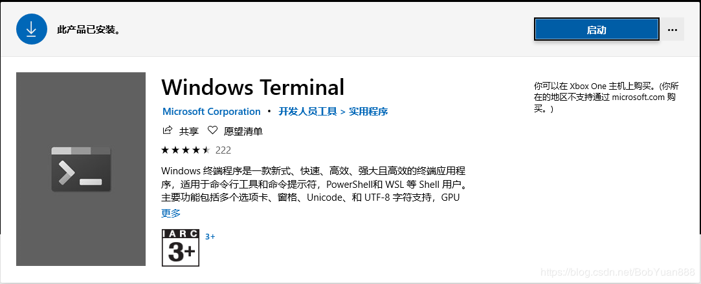
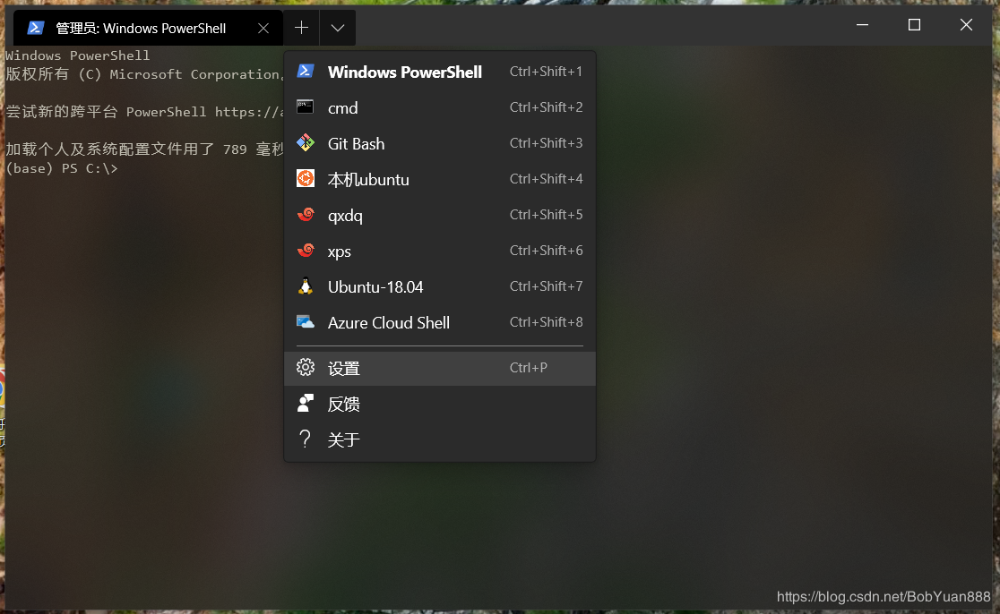
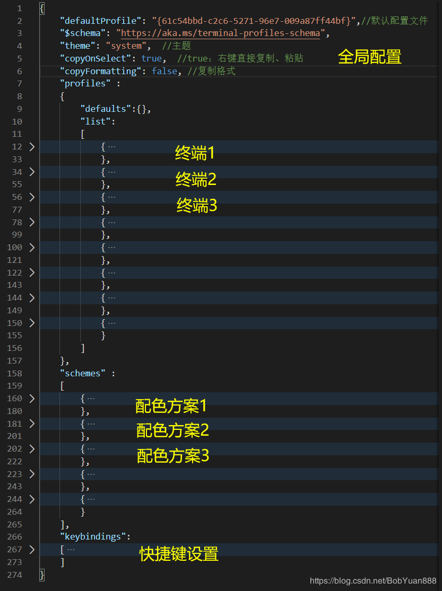
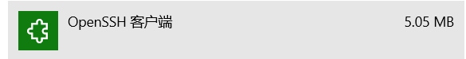

# **一、下载**

在微软商店Microsoft Store中搜索Terminal，点击获取，确保你的系统版本是1903以上



# **二、配置**

在开始菜单中找到新安装的Terminal并打开，点击向下箭头，点击settings进行配置



 

**微软最近出了比较详细的文档（https://docs.microsoft.com/zh-cn/windows/terminal/）来介绍这个配置文件，这边简单介绍一下这个配置文件。**

这个配置文件虽然看起来有 200+ 行，但实际上结构非常简单。我把它折叠起来加上一点点注释你应该很容易看出其配置文件的结构。



## **1、全局配置**

下面第一第二个属性可以自己设置一下，其他几个属性用系统默认就行。如果想折腾折腾，想了解详细含义可以查阅上面的文档链接。

```bash
一、打开时的默认终端
"defaultProfile"："{uuid}"
 
二、主题
"theme": "system"或"dark"或"light"，用"system" 将使用与 Windows 相同的主题，我上面的截图用的是dark暗黑主题。
 
三、禁用动态配置文件
"disabledProfileSources": ["Windows.Terminal.Wsl", "Windows.Terminal.Azure", "Windows.Terminal.PowershellCore"]
 
四、选项卡设置
1、始终显示选项卡
"alwaysShowTabs": true、false
2、选项卡宽度模式
"tabWidthMode": "equal"(等宽)、"titleLength"(标题长度)
3、隐藏关闭所有选项卡弹出窗口
"confirmCloseAllTabs": true、false
 
五、启动设置
1、以最大化方式启动
"launchMode": "default"、"maximized"
2、启动位置（窗口左上角的像素位置）
"initialPosition":采用以下格式的字符串形式的坐标：","、"X,Y"、"X,"、",Y"
3、首次启动时的列
"initialCols": 整数值
4、首次启动时的行
"initialRows": 整数值
 
六、标题栏设置
1、显示/隐藏标题栏
"showTabsInTitlebar": true、false
2、设置标题栏中的文本
"showTerminalTitleInTitlebar": true、false
 
七、所选内容设置
1、选择内容后复制
"copyOnSelect": true、false
2、复制格式
"copyFormatting": true、false
3、字分隔符
"wordDelimiters": 字符串形式的字符
 
八、滚动速度
"rowsToScroll": 整数
 
九、窗口大小调整行为
"snapToGridOnResize": true、false
```

 

 

## **2、终端配置**

我们只需要在 profiles 的 list 中添加项就可以添加新的终端了，把原来的一个 profile 复制一份，然后稍微修改一下。

如果希望将某个设置应用于所有配置文件，可以将其添加到 profiles 中的 defaults 部分。

```bash
{
    // 唯一标识符
    "guid" : "{}",                            // 百度搜uuid生成器，每个终端都要不重复
 
    // 可执行文件设置
    "commandline" : "D://Git//bin//bash.exe", // 终端的可执行文件路径
    "startingDirectory" : "%USERPROFILE%",    // 加载终端时所处的起始目录
 
    // 下拉列表设置
    "name" : "Git Bash",                      // 下拉列表中终端的名称
    "icon" : "D://pictures//gitbash.png",     // 下拉列表中终端的图标，填图标路径
 
    // 文本设置
    "fontFace" : "Consolas",                  // 字体名称。默认Consolas。
    "fontSize" : 11,                          // 字体大小
    "padding" : "0, 0, 0, 0",                 // 填充上下左右的边距
    "antialiasingMode": "grayscale",          // 消除文本锯齿，有 "grayscale"、"cleartype"、"aliased"可选项，具体多大差别我也没看出来
 
    // Acrylic设置
    "useAcrylic" : true,                      // 使用亚克力效果
    "acrylicOpacity" : 0.75,                  // 亚克力效果不透明度,值越大越不透明
 
    // 背景颜色
    "background" : "#012456",                 // 背景颜色
 
    // 滚动设置
    "scrollbarState" : "visible",            // 设置滚动条的可见性("visible"、"hidden")
    "snapOnInput" : true,                    // true:输入时滚动到输入行， false：不滚动
    "historySize" : 9001,                    // 在窗口显示的内容上方可以回滚的行数
 
    // 光标设置
    "cursorShape" : "bar",                    // 光标形状，可选"bar" ( ┃ )、"vintage" ( ▃ )、"underscore" ( ▁ )、"filledBox" ( █ )、"emptyBox" ( ▯ )
    "cursorColor" : "#FFFFFF",                // 光标的颜色
 
    // 颜色设置
    "colorScheme" : "Campbell",               // 配色方案名称，默认有"Campbell"、"Campbell Powershell"、"Vintage"、"One Half Dark"、"One Half Light"、"Solarized Dark"、"Solarized Light"、"Tango Dark"、"Tango Light"可选，你也自己可以在下面scheme配置中自己调配配色方案
            
 
    // 背景图像设置
    "backgroundImage" : "D://pictures/111.jpg",       // 背景图片文件路径，可以是.jpg、.png 或 .gif 文件。
    "backgroundImageStretchMode" : "uniformToFill",   // 背景图片拉伸模式，可选 "uniformToFill"(默认)、"none"、"fill"、"uniform"
    "backgroundImageAlignment" : "center"             // 背景图像与窗口边界对齐的方式,可选 "center"(默认)、"left"、"top"、"right"、"bottom"、"topLeft"、"topRight"、"bottomLeft"、"bottomRight"
    "backgroundImageOpacity" : 0.75,                  // 背景图像不透明度
 
    
    // 退出时配置文件的关闭方式
    "closeOnExit" : true,                    // 设置配置文件如何响应终止或启动失败。 当键入 exit 或进程正常退出时，"graceful" 将关闭配置文件。 "always" 将始终关闭配置文件，而 "never" 将永远不会关闭配置文件。 true 和 false 分别被接受为 "graceful" 和 "never" 的同义词。
 
    // 怀旧式终端效果**
    "experimental.retroTerminalEffect": false // 设置为 true，则终端将模拟具有扫描线和模糊文本边缘的经典 CRT 显示。 这是一个试验性功能，我们不保证它会持续存在。                              
},
```

修改后保存配置，立即生效。

 

## **3、配色方案scheme配置**

```bash
{
    "name": "deep",                 // 配色方案名
    "foreground" : "#cdcdcd",       // 字体颜色
    "background": "#090909",        // 背景色
 
    "black": "#000000",             // 每种颜色都有很多不同的色号，自己选配自己喜欢的
    "red": "#d70005",
    "green": "#1cd915",
    "yellow": "#d9bd26",
    "blue": "#5665ff",
    "purple": "#b052da",
    "cyan": "#50d2da",
    "white": "#e0e0e0",
    "brightBlack": "#535353",
    "brightRed": "#fb0007",
    "brightGreen": "#22ff18",
    "brightYellow": "#fedc2b",
    "brightBlue": "#9fa9ff",
    "brightPurple": "#e09aff",
    "brightCyan": "#8df9ff",
    "brightWhite": "#ffffff",
},
```

除 name 以外，每个设置都接受十六进制格式（"#rgb" 或 "#rrggbb"）的字符串形式的颜色。 github上有一个项目分享了很多配色方案：https://github.com/mbadolato/iTerm2-Color-Schemes/tree/master/windowsterminal

 

## **4、快捷键设置**

### **1）格式**

**a、不带参数的命令**

```bash
{ "command": "commandName", "keys": "modifiers+key" }
```

**b、带参数的命令**

```bash
{ "command": { "action": "commandName", "argument": "value" }, "keys": "modifiers+key" }
```

 

### **2）属性**

**a、属性名称：keys**

快捷键，可以由多个键组成

**b、属性名称：command**

在按下相关快捷键时执行的命令

**c、属性名称：action**

向某些命令添加其他功能

 

### **3）常用快捷键**

```bash
注意，使用快捷键，一般要把输入法调成微软输入法英文模式，否则可能按不出来
 
以下keys都是我比较习惯的，你可以自己设置，不过命令名称是固定的
 
一、应用程序级命令（就是terminal这个应用，应用级别的快捷键，好吧，我也不知道怎么解释）
1、关闭应用 
命令名称：closeWindow 
{ "command": "closeWindow", "keys": "alt+f4" }
 
2、查找
命令名称：find 
{ "command": "find", "keys": "ctrl+f" } 
 
3、打开下拉菜单
命令名称：openNewTabDropdown
{ "command": "openNewTabDropdown", "keys": "ctrl+shift+space" }
 
4、打开设置文件
命令名称： openSettings
{ "command": "openSettings", "keys": "ctrl+p" }
 
5、切换全屏
命令名称： toggleFullscreen
{ "command": "toggleFullscreen", "keys": "alt+enter" },
{ "command": "toggleFullscreen", "keys": "f11" }
 
 
二、选项卡相关命令
1、关闭选项卡
命令名称： closeTab
{ "command": "closeTab", "keys": "ctrl+w" }
 
2、复制选项卡
命令名称： duplicateTab
{ "command": "duplicateTab", "keys": "ctrl+d" }
 
3、新建选项卡
命令名称： newTab
{ "command": "newTab", "keys": "ctrl+t" },
{ "command": { "action": "newTab", "index": 0 }, "keys": "ctrl+shift+1" },
{ "command": { "action": "newTab", "index": 1 }, "keys": "ctrl+shift+2" },
{ "command": { "action": "newTab", "index": 2 }, "keys": "ctrl+shift+3" },
{ "command": { "action": "newTab", "index": 3 }, "keys": "ctrl+shift+4" },
{ "command": { "action": "newTab", "index": 4 }, "keys": "ctrl+shift+5" },
{ "command": { "action": "newTab", "index": 5 }, "keys": "ctrl+shift+6" },
{ "command": { "action": "newTab", "index": 6 }, "keys": "ctrl+shift+7" },
{ "command": { "action": "newTab", "index": 7 }, "keys": "ctrl+shift+8" },
{ "command": { "action": "newTab", "index": 8 }, "keys": "ctrl+shift+9" },
 
4、切换选项卡
下一个 命令名称：nextTab
{ "command": "nextTab", "keys": "ctrl+tab" }
上一个 命令名称： prevTab
{ "command": "prevTab", "keys": "ctrl+shift+tab" }
切换指定的选项卡 命令名称： switchToTab
{ "command": { "action": "switchToTab", "index": 0 }, "keys": "ctrl+1" },
{ "command": { "action": "switchToTab", "index": 1 }, "keys": "ctrl+2" },
{ "command": { "action": "switchToTab", "index": 2 }, "keys": "ctrl+3" },
{ "command": { "action": "switchToTab", "index": 3 }, "keys": "ctrl+4" },
{ "command": { "action": "switchToTab", "index": 4 }, "keys": "ctrl+5" },
{ "command": { "action": "switchToTab", "index": 5 }, "keys": "ctrl+6" },
{ "command": { "action": "switchToTab", "index": 6 }, "keys": "ctrl+7" },
{ "command": { "action": "switchToTab", "index": 7 }, "keys": "ctrl+8" },
{ "command": { "action": "switchToTab", "index": 8 }, "keys": "ctrl+9" },
 
 
三、窗格相关命令（窗格就是在一个选项卡中再拆分）
1、拆分窗格
命令名称：splitPane
a、自动拆分
{ "command": { "action": "splitPane", "split": "auto", "splitMode": "duplicate" }, "keys": "alt+shift+d" },
b、水平拆分
{ "command": { "action": "splitPane", "split": "horizontal"}, "keys": "alt+shift+-" }
c、垂直拆分
{ "command": { "action": "splitPane", "split": "vertical"}, "keys": "alt+shift+plus" }
 
2、关闭窗格
命令名称：closePane
{ "command": "closePane", "keys": "ctrl+shift+w" }
 
3、移动窗格焦点
命令名称：moveFocus
{ "command": { "action": "moveFocus", "direction": "down" }, "keys": "alt+down" },
{ "command": { "action": "moveFocus", "direction": "left" }, "keys": "alt+left" },
{ "command": { "action": "moveFocus", "direction": "right" }, "keys": "alt+right" },
{ "command": { "action": "moveFocus", "direction": "up" }, "keys": "alt+up" },
 
4、调整窗格大小
命令名称： resizePane
{ "command": { "action": "resizePane", "direction": "down" }, "keys": "alt+shift+down" },
{ "command": { "action": "resizePane", "direction": "left" }, "keys": "alt+shift+left" },
{ "command": { "action": "resizePane", "direction": "right" }, "keys": "alt+shift+right" },
{ "command": { "action": "resizePane", "direction": "up" }, "keys": "alt+shift+up" },
 
 
四、剪贴板相关命令
1、复制
命令名称： copy
{ "command": { "action": "copy", "singleLine": false }, "keys": "ctrl+c" },
 
2、粘贴
命令名称： paste
{ "command": "paste", "keys": "ctrl+v" },
 
 
五、滚动命令
1、向上滚动
命令名称： scrollUp
{ "command": "scrollUp", "keys": "ctrl+up" },
 
2、向下滚动
命令名称： scrollDown
{ "command": "scrollDown", "keys": "ctrl+down" },
 
3、向上滚动一整页
命令名称： scrollUpPage
{ "command": "scrollUpPage", "keys": "pgup" },
 
4、向下滚动一整页
命令名称： scrollDownPage
{ "command": "scrollDownPage", "keys": "pgdn" },
 
 
六、字号调整命令
1、字号大小调整
命令名称： adjustFontSize
{ "command": { "action": "adjustFontSize", "delta": 1 }, "keys": "ctrl+=" },
{ "command": { "action": "adjustFontSize", "delta": -1 }, "keys": "ctrl+-" }
2、重置字号
命令名称： resetFontSize
{ "command": "resetFontSize", "keys": "ctrl+0" }
```

 

 

# **三、使用**

它默认已经帮你配好了powershell和cmd，其他使用：

1）其他终端如git bash

上面例子中已经配置好了就不多讲。

 

2）ssh连接

首先确保安装了**openssh**，在windows的设置-应用-应用和功能-管理可选功能-添加功能，找到OpenSSH客户端，点击安装



ssh连接在安装完openssh后，在powershell和cmd中就可以使用，不过添加进terminal后，就可以保存进配置，不用每次都输入命令了。

新建一个profile，将`commandline填写为`： "ssh -p port username@ip"，port填写端口号，username填写用户名，ip填写ip地址。

这里有一个不方便的地方是每次都要输入密码登录，因此可以使用SSH密钥对。在本地创建一个密钥对，不会创建的可以参考下面这篇博文：https://blog.csdn.net/qq_36829091/article/details/81135581 。

创建完成后在C:\Users\你的用户名\.ssh\ 这个路径下，复制其中 id_rsa.pub 公钥的内容。在远程服务器的用户家目录（~）中，创建 .ssh 文件夹，在 .ssh 文件夹下创建 authorized_keys 文件，将 id_rsa.pub 公钥中复制的内容写入到 authorized_keys 文件中。这样就可以实现ssh免密登录了。

 

3）wsl（适用于Linux 的 Windows 子系统）

https://www.windows10.pro/bash-on-ubuntu-on-windows/

安装完ubuntu后，新建一个profile，将`commandline填写为`： "wsl.exe"，这样就能在terminal中启动ubuntu了。不用虚拟机，直接在windows中使用linux子系统，很爽！目前版本更新后好像如果你系统装了wsl，它会自动帮你添加到terminal中，不用再自己去配置了。

###  

参考：

https://docs.microsoft.com/zh-cn/windows/terminal/