# 基于MCU的图像识别分类识别系统的设计与实现

## 摘要


关键字：嵌入式人工智能；ARM；深度学习；机器视觉；图像识别

## ABSTRACT


## 第一章 绪论

### 1.1 课题的研究背景及意义

随着人工智能的蓬勃发展，研究人员训练的神经网络呈现出更宽、更深和更密集的特点。但是，随之而来的就是算力要求不断提高。2014年后，神经网络的发展越来越关注网络结构的优化所带来的效率和性能的提升，嵌入式人工智能应运而生。

嵌入式人工智能（Embedded Artificial Intelligence，EAI）与一般意义上人工智能（General Artificial Intelligence，GAI）既有联系又有本质的区别。EAI是以微控制器MCU或应用处理器MPU为核心，在有限的算力下，执行基本的学习或推理算法。嵌入式设备无需联网，实时感知、决策，延迟低。GAI一般以通用计算机为载体，可通过网络与云端数据中心通信，进而获得远超本身的算力。

EAI是人工智能落地的重要实现形式，它涉及到很多方面，如传感器、MCU、AI、数据库系统等。目前来看，EAI在工业控制、智慧医疗、智慧城市、交通运输以及农业等行业的垂直领域都有非常大的市场潜力，各种终端应用数量不断增加。值得一提的是，EAI在自然语言处理（NLP）应用市场方面有着十分出色的表现，具有代表性的产品有天猫精灵音箱、亚马逊智能音箱、小米的小爱同学等。

归纳起来，嵌入式AI的出现主要源自下面三个方面的影响。

一是来自硬件支持。这一点非常关键。在过去的几年里，微控制器和应用处理器的技术演进实在是太惊人了。微控制器现在能支持兆字节的闪存和RAM，系统时钟频率能达到甚至超过1 GHz，有些控制器还能支持DSP指令，这意味着它们可以有效地执行AI中的推理任务。随着处理器计算能力的大幅提升，在边缘支持机器学习不再需要太多额外的成本。

二是大幅简化的软件开发过程。机器学习已经成为物联网和云计算不可或缺的工具，它可以极大地简化软件开发。尤其是在语音识别、图像分类和预测维护等领域，机器学习可以大大简化开发过程，加快开发速度。以物联网为例，每天都会产生海量数据，数据分析是一项庞大的任务，通过机器学习训练出一个模型，然后在嵌入式系统上部署推理，这些数据的分析将不再困难。

三是市场的推动。嵌入式AI正在变成市场的一个营销热点。一个产品能否热销，除了功能和性能出众，寻找卖点也很重要。机器学习现在就是市场的热门话题，将其用于你的产品设计中，它很可能就会成为撬动市场的一个支点。

本课题的提出主要基于以下三个方面：

（1）图像处理技术的迅速发展。数字图像处理利用模数转换，将图像信号转换成数字信号，然后利用计算机对其进行处理。 它最初起源于20世纪20年代，并于80-90年代形成独立的科学体系。现在此技术已成为一门引人注目、前景广阔的新型学科。广泛用于科学研究、农业生产、工业制造、生物医学、航空航天、军事、机器人等多领域，并在其中扮演着越来越重要的角色。

（2）嵌入式系统的迅速发展。随着嵌入式技术将AI逐渐落地到物联网，让人工智能从云端扩展到设备端和边缘端，围绕着嵌入式AI的研究越来越繁荣，智能家居、移动机器人、智能制造等领域也迎来了大量的嵌入式AI落地应用。而这一切与算法、软硬件等技术的不断成熟与发展，有紧密联系。嵌入式AI浪潮袭来，智慧生活往万物皆可联的AIoT新时代又迈进了一大步。毫无疑问，嵌入式AI的蓬勃发展将带来新一轮的机遇与挑战。

（3）PC上的图像识别准确率已经超越人类， 但很难转化为具体产品。一切技术研究最终都需要转化为具体产品才能产生效益。PC的图像处理技术在实际应用过程中暴露出了“三高一低”问题——能耗高、延迟高、成本高和隐私安全低。嵌入式系统虽然算力受限，但是执行基本的推理计算并没有问题，加上功耗低、架构简单等特点，受到研究人员和商业公司的广泛关注。

综上所述，基于MCU的图像识别、分类识别是未来人工智能产业落地的一个主要趋势。也就是说，传感器除了能够测量，还必须能够识别自己测量的是什么东西。它需要依靠自己的能力去消化原始数据，而不是将一大堆原始数据丢给云计算。神经网络分类器是一个效果很好的动作识别工具，缺点是计算量太大。就算在学术界都很少有人把它直接放到MCU上跑，工程上可能更少。通常认为MCU资源太少，性能太弱跑不了神经网络。2014年之后的神经网络的发展方向更多的是往模型的结构优化上做文章，同时还更注重效能上的优化而不是识别精度。于是性能稍差的MCU有了发挥的空间。因此，设计一个基于MCU的图像识别分类识别系统的研究具有重要意义。

### 1.2  国内外研究现状

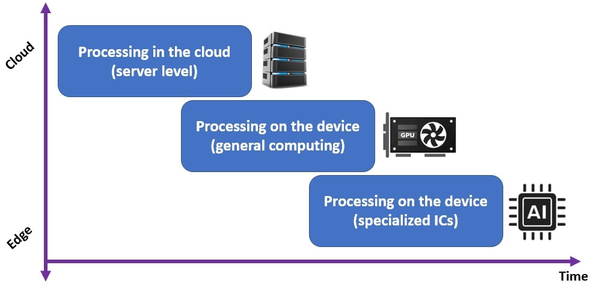

**图1:**嵌入式人工智能从云端到边缘的研究进展（图源：网络）

| 主要供应商                                                   | 应用市场                                                     |
| ------------------------------------------------------------ | ------------------------------------------------------------ |
| 微软、高通、英特尔、谷歌、NVIDIA、NXP、意法半导体、瑞萨、莱迪思、赛灵思、Maxim、Arm、新思科技、百度、Orbit、联发科、Mythic、地平线、商汤科技、智存科技、OPEN AI LAB | 手机、可穿戴设备、车载电子、智能家居、安全监控、无人机、机器人、其他 |

#### 1.2.1 国外研究现状

国外最具代表性的企业有NXP（恩智浦）、STMicroelectronics（意法半导体）、Maxim、ARM、Xilinx（赛灵思）等。他们纷纷推出硬件、软件、开发工具等一系列解决方案，并建立了各自的生态系统。

近几年，国外的嵌入式AI发展十分迅速，各大厂商都推出了端侧神经网络超级计算芯片，并且将功耗控制在了可接受的范围内。譬如，Movidius（Intel）、Jetson-Nano（NVIDIA）、3399Pro（瑞芯微）等。下面对他们产业研究的最新进展进行简单介绍。

（1） NXP i.MX 8M Plus：将高性能机器学习推向边缘端

NXP i.MX 8M Plus是一款配备了专用高性能机器学习加速器的i.MX应用处理器。因使用了14nm FinFET工艺技术，故i.MX 8M Plus拥有很高的性能且保持低功耗。该处理器还采用了同时支持两个低成本高清图像传感器或一个4K分辨率图像传感器的双摄像头ISP，足以应对人脸、物体对象和手势识别等机器学习任务。

此外，它还集成了独立的800MHz Cortex-M7，用来处理实时任务、H.265和H.264的视频编解码、800MHz HiFi4 DSP以及用于语音识别的8通道PDM麦克风输入。借助i.MX 8M Plus，语音识别、对象检测、人脸识别、对象分割、增强现实、手势识别等应用均可在边缘运行机器学习。

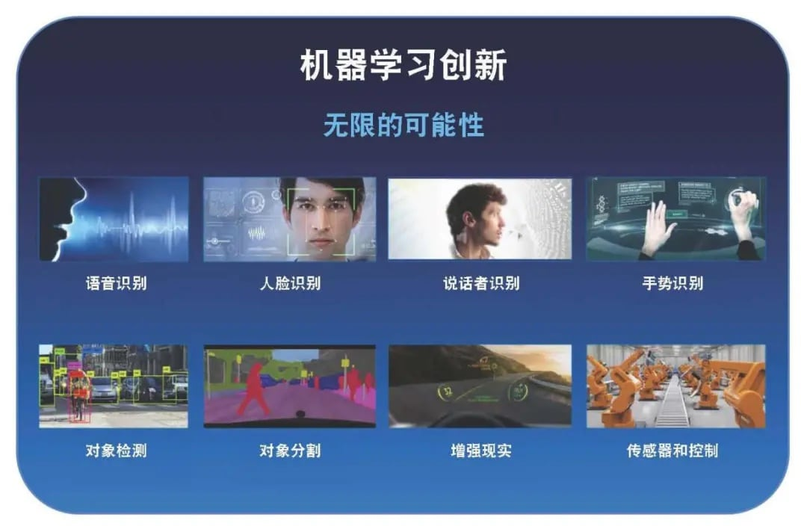

恩智浦i.MX 8M Plus支持在边缘运行机器学习的部分应用（图源：NXP）


（2） Xilinx Versal ACAP：将智能引入到边缘设备

Xilinx Versal ACAP是一款自适应计算加速平台，它融合了用于嵌入式计算的新一代标量引擎、用于FPGA芯片编程的自适应引擎，以及用于AI推断与高级信号处理的智能引擎，拥有卓越的计算性能和单位功耗。

为了让更多的开发者受益于赛灵思所提供的从边缘到云的人工智能和深度学习推断加速度，赛灵思紧接着又推出了另一款软件平台产品——Vitis AI。Vitis AI开发环境是赛灵思在其硬件平台上进行AI推理的开发平台，可加速基于赛灵思平台部署深度学习推断的进程，其中的模型涵盖不同的应用，包括ADAS/AD、视频监控、机器人和数据中心等。

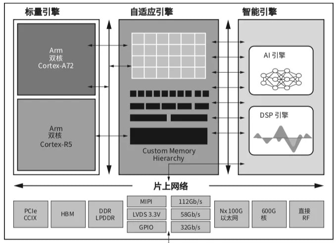

Xilinx的Versal ACAP功能框图（图源：Xilinx）


（3）Maxim神经网络加速器芯片：在边缘实现复杂的嵌入式决策

Maxim神经网络加速器MAX78000是一款低功耗微控制器，它支持电池供电的嵌入式IoT设备在边缘通过快速、低功耗AI推理来制定复杂决策。MAX78000将高能效AI处理与超低功耗微控制器结合在一起，内建的基于硬件的卷积神经网络 (CNN) 加速器可在电池供电应用执行AI推理，而仅消耗微焦耳级别的能量。

与软件方案相比，这种快速、低功耗的决策实施使得复杂的AI推理能耗降低到前期方案的百分之一以内，采用AI技术的电池供电系统的运行时间可得到大幅延长。更重要的是，MAX78000的成本只有FPGA或GPU方案的零头，而执行推理的速度比低功耗微控制器上实施的软件方案快100倍。

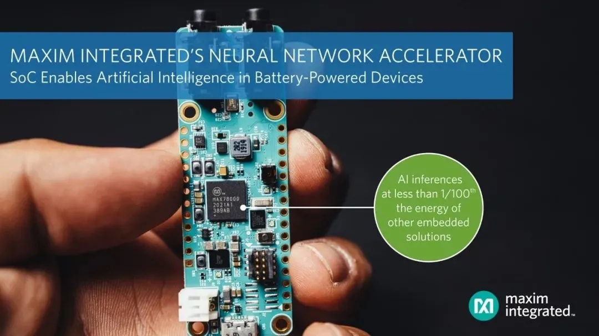

Maxim具有神经网络加速器的低功耗微控制器MAX78000（图源：Maxim Integrated）


#### 1.2.2 国内研究现状

早在2018年9月中国（上海）国际嵌入式大会期间，何积丰院士指出，人工智能有向嵌入式系统迁移的趋势，嵌入式人工智能是一个崭新的重要机遇，同时指出，边缘计算、机器学习、AI芯片是嵌入式人工智能的三项前沿技术【1】。苏州大学王宜怀老师认为，嵌入式人工智能是以一般意义上的人工智能算法为基础，以嵌入式应用实践为目标，将人工智能训练和推理算法构件驻留于嵌入式计算机内部，实现嵌入式终端智能化，它是伴随着机器学习理论与算法的发展、嵌入式芯片性能的提高、嵌入式智能终端的市场需求而提出的，是人工智能产业化落地的主要形式【2】。

我国首款嵌入式人工智能视觉芯片是在2017年12月20日由地平线机器人技术团队发布的面向智能驾驶的“征程1.0”处理器和面向智能摄像头的“旭日1.0”处理器，该芯片完全由中国企业自主研发，具有高性能、低功耗、低延时等特点，可直接嵌入至终端设备。

梯智眼成功推出了基于嵌入式AI的电梯专用智能分析相机，利用嵌入式视觉AI提高电梯的智慧感知能力和决策能力，让物联网方案落地电梯场景进程得以提速。

海康威视开发的智能网络摄像机采用32位ARM核心技术，支持深度学习算法。可以对人脸进行跟踪、抓拍，视频帧率达到60FPS，并且可以自动报警。此外，它对区域入侵、越界、移动等侦测方面也有出色的表现。

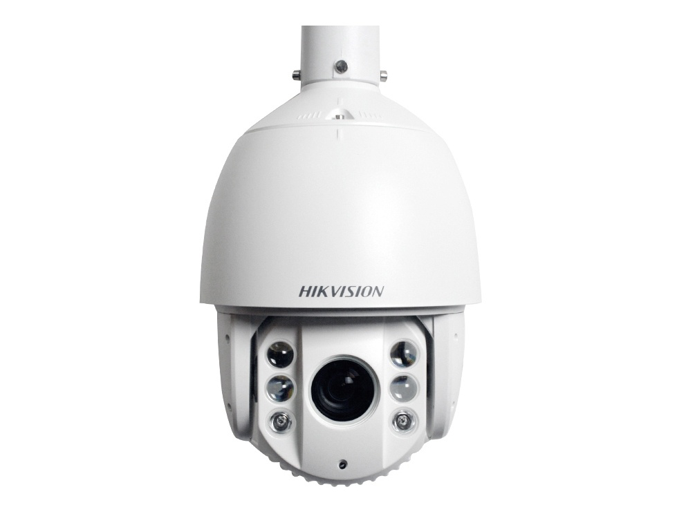

图：海康威视智能交通网络摄像机


### 1.3 课题的主要研究内容

为了提高嵌入式系统开发效率，避免不必要的重复劳动，有必要对嵌入式AI从模型搭建到终端部署进行系统研究。苏州大学王宜怀教授认为，目前我国嵌入式AI产品开发过程中，技术人员往往从“零”做起，具有门槛高、成本大、周期长等特征。教师在教学过程中，缺乏可以演示的教学产品；学生在嵌入式AI入门学习过程中，往往在硬件环境问题上浪费太多时间，而无法对嵌入式AI形成系统的认识。

针对上述提出的问题，本文开发了一套基于ARM Cortex-M4 内核的图像识别分类识别系统，具体的开发环境为STM32L431RCT。此系统原理清晰、编码规范、简单实用，可作为教师教学过程中的演示系统，也可以帮助学生快速上手嵌入式AI系统的开发。系统的主要功能包括如下几个方面：

（1）用户只需要利用PC机完成神经网络模型的搭建和训练。其它诸如量化、部署和结果的可视化展示等都可以调用系统提供的API。

（2）系统可以根据用户提供的已经训练好的神经网络模型生成对应的纯C语言代码，由于C语言的可移植性，理论上可以在任意终端部署。

（3）由于PC上训练的模型一般较大，系统可以对模型进行量化，压缩到原来的四分之一左右而准确率几乎不变。

（4）借鉴了ARM官方CMSIS-NN网络库中的部分方法，程序在基于ARM Cortex-M4/7/33/35P内核的设备上运行时，效率可以提升4-5倍左右。

（5）提供友好的上位机图形界面，方便用户操作。

本文的结构和章节内容安排如下：


### 1.4 本章小结

本章节一开始介绍了此次研究的背景和意义，之后简明扼要地分析了国内外嵌入式AI的发展现状。章节的最后，归纳了本文研究的主要内容，对文章结构做了总体介绍。


## 第二章 系统的整体架构

在特定场景下物体认知的对象类别是固定的，对网络模型训练的所需要的资源远远大于推理，模型参数不需要频繁的更新。所以将本文将二者进行切割，把消耗资源较少的推理过程部署在嵌入式终端，而消耗较多资源的模型训练部分则部署在 PC，降低终端的资源消耗 。

PC使用基于神经网络结构的算法模型进行样本训练，嵌入式终端提取图像特征利用算法推导函数与算法模型参数进行物体认知。

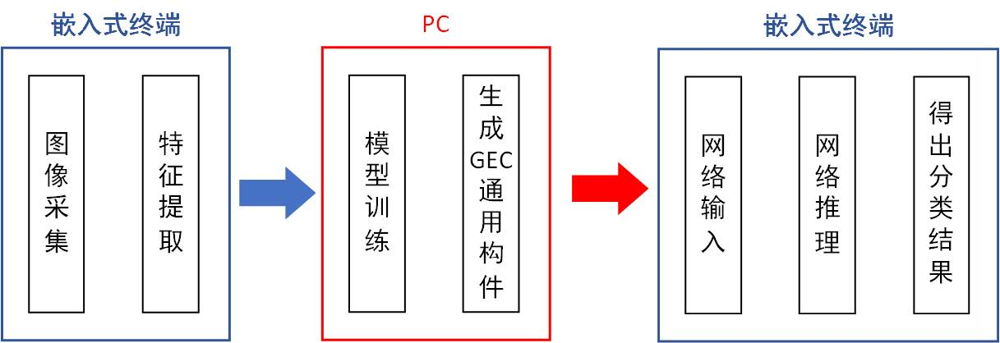


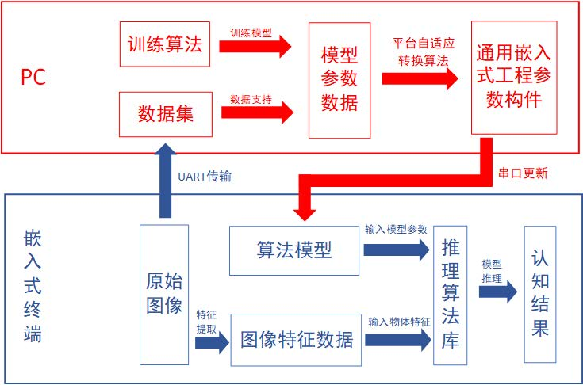


## 第三章 图像预处理技术应用

### RGB色彩模式

RGB色彩模式是工业界的一种颜色标准，是通过对红、绿、蓝三个颜色通道的变化以及它们相互之间的叠加来得到各式各样的颜色的，RGB即是代表红、绿、蓝三个通道的颜色，这个标准几乎包括了人类视力所能感知的所有颜色，是目前运用最广的颜色系统之一。

RGB16数据格式主要有二种：RGB565和RGB555。

#### RGB565

每个像素用16比特位表示，占2个字节，RGB分量分别使用5位、6位、5位。

```python
# 获取高字节的5个bit
R = color & 0xF800;
# 获取中间6个bit
G = color & 0x07E0;
# 获取低字节5个bit
B = color & 0x001F;
```

#### RGB555

每个像素用16比特位表示，占2个字节，RGB分量都使用5位(最高位不用)。

```python
# 获取高字节的5个bit
R = color & 0x7C00;
# 获取中间5个bit
G = color & 0x03E0;
# 获取低字节5个bit
B = color & 0x001F;
```


## 第四章 基于CNN的图像识别与分类

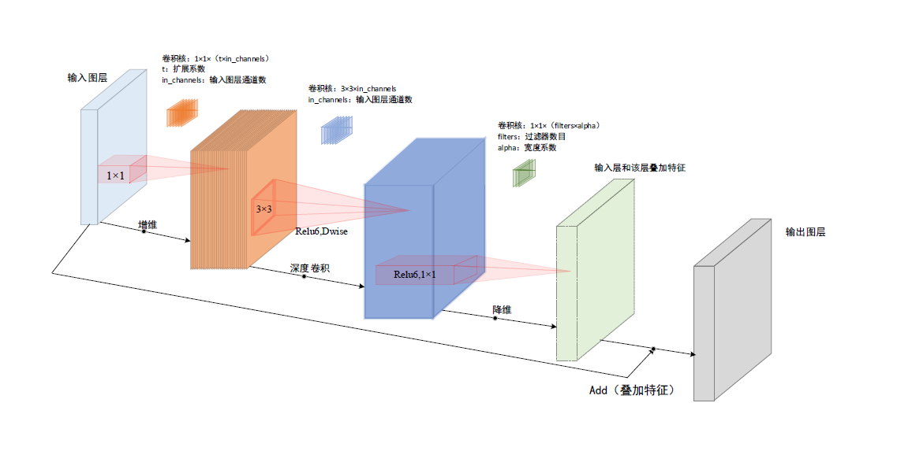

### 人类视觉原理

 深度学习的许多研究成果，离不开对大脑认知原理的研究，尤其是视觉原理的研究。

1981 年的诺贝尔医学奖，颁发给了 David Hubel（出生于加拿大的美国神经生物学家）和TorstenWiesel，以及 Roger Sperry。前两位的主要贡献，是“发现了视觉系统的信息处理”，可视皮层是分级的。

人类的视觉原理如下：从原始信号摄入开始（瞳孔摄入像素 Pixels），接着做初步处理（大脑皮层某些细胞发现边缘和方向），然后抽象（大脑判定，眼前的物体的形状，是圆形的），然后进一步抽象（大脑进一步判定该物体是只气球）。下面是人脑进行人脸识别的一个示例：

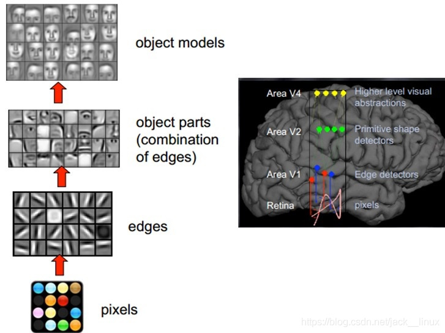

我们可以看到，在最底层特征基本上是类似的，就是各种边缘，越往上，越能提取出此类物体的一些特征（轮子、眼睛、躯干等），到最上层，不同的高级特征最终组合成相应的图像，从而能够让人类准确的区分不同的物体。那么我们可以很自然的想到：可以不可以模仿人类大脑的这个特点，构造多层的神经网络，让计算机来逐层提取图像中的特征，最终在顶层做出分类呢？答案是肯定的，这也是卷积神经网络的灵感来源。

### CNN整体描述

卷积神经网络（Convolutional Neural Networks, CNN）是一类包含卷积运算且具有深度结构的前馈神经网络（Feedforward Neural Networks）。相比早期的BP神经网络，卷积神经网络最重要的特性在于“局部感知”与“参数共享”，自2012年的AlexNet开始，卷积神经网络就多次成为ImageNet大规模视觉识别竞赛（ImageNet Large Scale Visual Recognition Challenge, ILSVRC）的优胜算法，至此，卷积神经网络开始大放异彩，成为了众多科学领域的研究重点之一。

如图1所示，一个完整的卷积神经网络可包含卷积层、池化层、全连接层等。其中卷积层用来进行特征提取，池化层用于降低维数，全连接层可用于结果预测（也可使用全卷积网络进行预测）。卷积运算也属于一种线性运算，故需要进行非线性处理，即添加激活函数（示例中为修正线性单元的函数，即 Relu 激活函数）

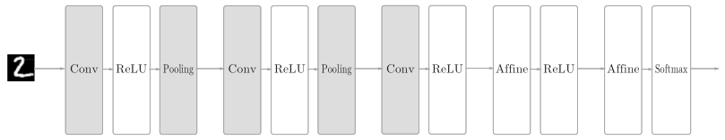

对于卷积层，其详细描述如图1.2所示

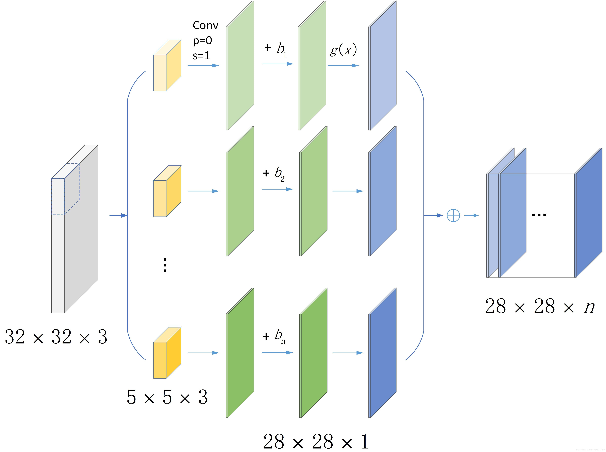

其运算过程主要由以下4步组成：

- 原图像（尺寸为32x32x3）分别与n个5x5x3的卷积核（又名滤波器，fliter）进行卷积运算，得到n个28x28x1的特征图（feature map）
- 每个特征图分别添加不同的偏置（bias），具体为特征图中的每个元素+$b_n$
- 对每个特征图添加激活函数$g^{(x)}$，进行非线性运算
- 将这n个特征图依次叠加，得到最终的特征图（尺寸为28x28xn）

注：对于某一个卷积层，其不同特征图所使用的激活函数相同，但不同卷积层所使用的激活函数可以不同，该步骤在整体描述中为突出与神经网络的相似性而单独提出，但实际上其仍属于卷积层的一部分。


对于池化层，其详细描述如图1.3所示：

 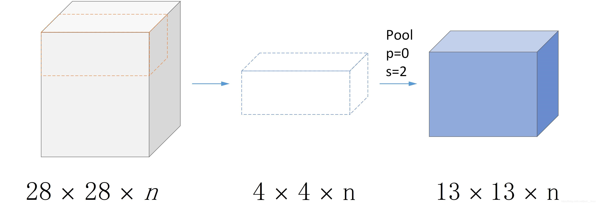

对于28x28xn的特征图，其池化过程仅需通过池化核对该特征图进行池化运算即可得到输出。

然后将得到的特征图经过全连接层进行处理并由softmax算法进行回归即可得到最终的输出结果。


### CNN基本理论

#### 卷积（Convolution）

卷积神经网络中的核心即为卷积运算，其相当于图像处理中的“滤波器运算”。 对于一个$m \times n$大小的卷积核
$$
W=\left[ 
\begin{matrix} 
w_{11} & w_{12} & \cdots & w_{1n} \\
w_{21} & w_{22} & \cdots & w_{2n} \\
\vdots & \vdots & \ddots & \vdots \\
w_{m1} & w_{m2} & \cdots & w_{mn} \\
\end{matrix} 
\right]
$$
其对某一原图像 $X$ 进行卷积运算的过程为：卷积核$W$中的每一个权值 $w$ 分别和覆盖的原图像 $X$ 中所对应的像素 $x$ 相乘，然后再求和。计算公式为：
$$
z = w_1x_1 + w_2x_2 + \cdots + w_{mn}x_{mn} = \sum^{mn}_{k=1} w_kx_k = W^TX
$$
 如图2.1所示，对一幅图像的一个完整的卷积运算过程为：卷积核以一定的间隔滑动，并对所覆盖的区域进行卷积运算得到值 $z$，直至遍历完整幅图像。

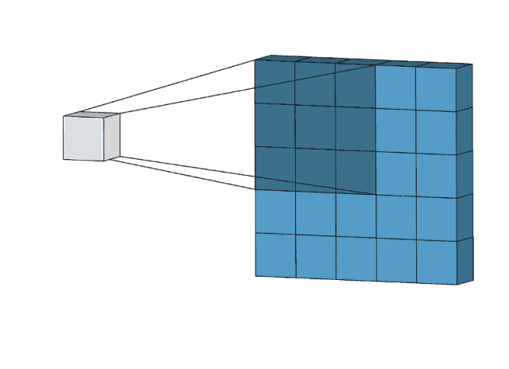

  一个标准的卷积运算以图2.2为例，其卷积核每次覆盖原图像的9个像素，共滑动4次，得到了一个 $2\times2$ 的二维数据。对于一个大小为 $n$ 的原图像，经过大小为 $f$ 的卷积运算后，其输出图像的尺寸为 $n-f+1$

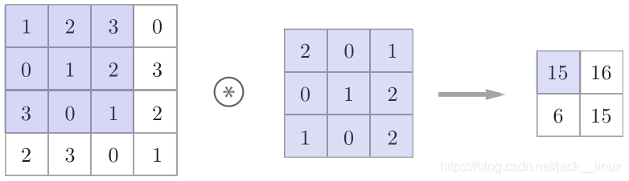

#### 步长（Strides）

滑动一定的间距，但这个间距该如何定义呢? 这个概念就是卷积的 “步长”（stride），设置卷积的步长可使卷积过程跳过原图像中的某些像素。结合步长 $s$ 操作后，其输出图像的尺寸为 $\lfloor \frac {n-f} {s} \rfloor + 1$ 。stride = 1 表示卷积核滑过每一个相距是 1 的像素，是最基本的单步滑动，作为标准卷积模式。Stride 是 2 表示卷积核的移动步长是 2，跳过相邻像素，输出图像缩小为原来的 1/2。Stride 是 3 表示卷积核的移动步长是 3，跳过 2 个相邻像素，图像缩小为原来的 1/3，以此类推。

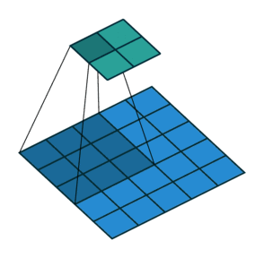

#### 填充（Padding）

在标准的卷积过程中，存在两个问题：

- 每次卷积运算后，图像就会缩小，在经历多次运算后，图像终会失去其形状，变为$1 \times 1$的 “柱状”。
- 对于图像边缘的像素，其只被一个输出所触碰或者使用，但对于图像中间的像素，则会有多个卷积核与之重叠。所以那些在角落或者边缘区域的像素点在输出中采用较少，意味着卷积过程丢掉了图像边缘位置的许多信息。

对于这个问题，可以采用额外的 “假” 像素（通常值为 0， 因此经常使用的术语 ”零填充“ ）填充边缘。这样，在滑动时的卷积核可以允许原始边缘像素位于其中心，同时延伸到边缘之外的假像素。假设填充的像素大小为$p$，则$n$就变成了$n+2p$，故其输出的图像尺寸为 $\lfloor \frac {n+2p -f} {s} \rfloor + 1$ 。

 至于选择填充多少像素，通常有两个选择，分别叫做 Valid 卷积和 Same 卷积。

same：采取的是补全方式，尝试在左边和右边补0，规则是左奇右偶，例如输入input_width=13，Filter_width=6，stride=5。在上面滑动的次数是3次，如图所示，输入不够0来凑。

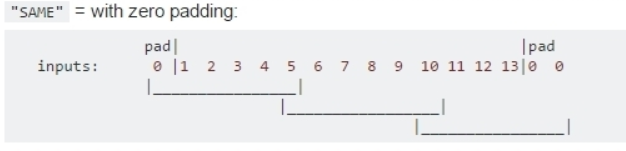
$$
n_{output} = \lceil \frac {n_{input}} {s} \rceil , \qquad s为步长
$$


valid：采用的是丢弃的方式，如果不够滑动一次则将剩下的数据丢弃。

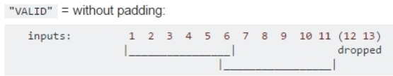


$$
n_{output} = \lceil \frac {n_{input} - f + 1} {s} \rceil , \qquad s为步长, f为kernel\ size
$$


注：一般卷积核的大小$f$会选择一个奇数，如 3 \ 5 \ 7 等。主要因为：

- 如果 $f$ 是一个偶数，那么只能使用一些不对称填充。只有当 $f$ 是奇数时，Same 卷积才会有自然的填充，即可以选择同样的数量填充四周。
- 当卷积核 $f$ 是奇数时，其只有一个中心点，在具体的程序实现过程中会便于指出卷积核的位置。


#### 1x1卷积（1x1 Convolution）

$1\times1$卷积也称作 “Network in Network”，其本质上相当于全连接层，以一个$4\times4\times28$的输入图像为例，1x1卷积（通道数与输入图像一致，即尺寸为$1\times\times1\times28$）所实现的功能就是依次遍历这28个单元格作乘积再求和，增加偏置后应用激活函数（输出图像的高和宽不变，通道数为卷积核的数量）。这时，输入图像的28个不同通道的数据可看作是神经网络的输入向量 $X$，而卷积核则可看作是权重 $W$，而多个卷积核即构成了神经网络中的隐藏层。

其主要有2个功能：

- 降维/升维，即改变图像的通道数，本质上就是通道间信息的线性组合变化。
- 增加非线性，1x1卷积核，可以在保持图像尺度不变的（即不损失分辨率）的前提下增加非线性特性（利用后接的非线性激活函数）。


#### 偏置（Bias）

参考图1.2，每个卷积核都有一个偏置参数 $b$，它是一个实数。偏差包含了这些变量，它是该维度上的一个向量，其在代码中表示为一个 ![1 \times 1\times 1\times n_c^{[l]}](assets/README/times%20n_c%5E%7B%5Bl%5D%7D.gif) 的四维向量或四维张量。如图2.6所示，三维卷积中，偏置中的每一个单元分别作用于特征图中的每一个图层。


  其具体计算过程如图2.7所示（以二维卷积为例，也可理解为图2.6中的某一个偏置单元与特征图中对应图层的计算过程）。

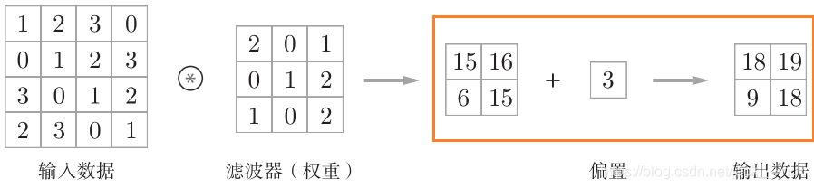


从图2.6可以看出，在仅含有权重参数$w$的情况下，假设函数必须经过原点，但这将使其无论如何也无法回归出一条完美拟合的直线，而当添加偏置 $b$ 后，假设函数变为 $h(x)=wx+b$  ，直线将可以通过任意点，进而对数据进行拟合，这个原理可引申到深度学习的前向传播算法中 $（Z=W^TA+b ）$，即给网络增加了平移的能力（激活函数则可以改变网络拟合的形状），无论在回归还是分类问题中，都可以使网络更好的拟合数据。


#### 池化（Pooling）

在通过卷积获得了特征 (features) 之后，下一步我们希望利用这些特征去做分类。理论上讲，人们可以用所有提取得到的特征去训练分类器，但这样做会面临巨大计算量的挑战。并且容易出现过拟合 (over-fitting)。

为了解决这个问题，首先回忆一下，我们之所以决定使用卷积后的特征是因为图像具有一种“静态性”的属性，这也就意味着在一个图像区域有用的特征极有可能在另一个区域同样适用。因此，为了描述大的图像，一个很自然的想法就是对不同位置的特征进行聚合统计，例如，人们可以计算图像一个区域上的特征的最大值 (或平均值)。这些统计到的特征不仅具有低得多的维度 (相比使用所有提取得到的特征)，同时还会改善结果(不容易过拟合)。这种聚合的操作就叫做池化 (pooling)。

除了最大值池化（Max Pooling）之外，还有平均值池化（Average pooling）等。相对于Max池化是从目标区域中取出最大值，Average池化则是计算目标区域的平均值。如图2.6.1所示的即为Max池化的运算过程，Average池化依此类推。

  

池化有4个重要特性：

- 不同于卷积，池化没有需要学习的参数。
- 池化运算后图像的高度和宽度被压缩，但通过数不会改变。
- 降低了数据特征，扩大了卷积核的感受野。
- 微小的位置变化具有鲁棒性，在输入数据发生微小偏差时，池化仍会返回相同的结果。如图2.6.2为例，输入数据在宽度方向上只偏离1个元素时，输出仍为相同的结果（根据数据的不同，有时结果也不相同）。

**注：**在图像识别领域，主要使用Max池化。所以通常所说的“池化层”，指的就是Max池化。


#### 全局池化

既然全连接网络可以使feature map的维度减少，进而输入到softmax（NIN论文），但是又会造成过拟合，是不是可以用pooling来代替全连接。

答案是肯定的，Network in Network工作使用GAP来取代了最后的全连接层，直接实现了降维，更重要的是极大地减少了网络的参数(CNN网络中占比最大的参数其实后面的全连接层)。GAP的结构如下图所示：

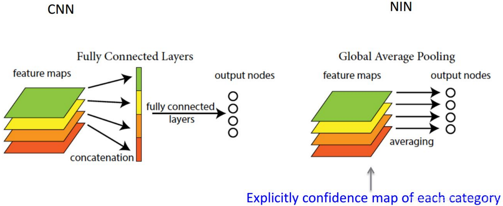


虽然说GAP就是把池化的窗口大小设置成输入图像的大小，但这并不是GAP内涵的全部。GAP的意义是对整个网络从结构上做正则化防止过拟合。既降低参数避免了全连接带来的过拟合风险，又达到了全连接一样的转换功能。

【注】：“global pooling”在滑窗内的具体池化方法可以是任意的，所以就会被细分为“global average pooling”、“global max pooling”等。


#### 激活函数（Activation Function）

 常用的激活函数主要有：

（1）sigmoid函数    

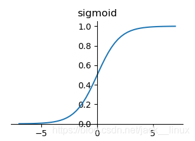
$$
g(z) = \frac {1} {1+e^{-z}}
$$


（2）tanh 函数

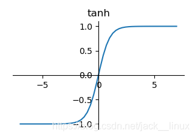
$$
tanh(z) = \frac {e^z - e^{-z}} {e^z + e^{-z}}
$$
（3）修正线性单元的函数（ReLu） 

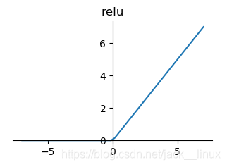


$$
ReLu(z) = max(0, z)
$$
（4）Leaky Relu函数

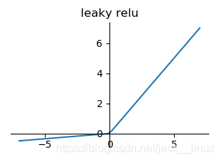
$$
LeakyRelu(z) = max(az, z)
$$
**注：**Relu 进入负半区的时候，梯度为 0，神经元此时不会训练，产生所谓的稀疏性，而 Leaky ReLu 不会有这问题。

注：tanh函数的效果总是优于 sigmoid 函数。因为函数值域在-1 和+1的激活函数，其均值是更接近零均值的。在训练一个算法模型时，如果使用 tanh 函数代替sigmoid 函数中心化数据，会使得数据的平均值更接近 0 而不是 0.5。

注：sigmoid 函数和 tanh 函数两者共同的缺点是，在  特别大或者特别小的情况下，导数的梯度或者函数的斜率会变得特别小，最后就会接近于 0，导致降低梯度下降的速度。


### CNN特性

#### 局部感知

 一般认为，人对外界的认知是从局部到全局的，而对于图像来说，空间联系也是局部的像素联系较为紧密，而距离较远的像素相关性则较弱。因而，每个神经元其实没有必要对全局图像进行感知，只需要对局部进行感知，然后在更高层将局部的信息综合起来就得到了全局的信息。网络部分连通的思想，也是受启发于生物学里面的视觉系统结构。视觉皮层的神经元就是局部接受信息的（即这些神经元只响应某些特定区域的刺激）。

在全连接神经网络中（如图3.1所示），相邻层的神经元全部连接在一起，由于其输入数据是一维结构，故图像需先转换为一维向量，而这个过程，也导致图像完全丢失了“形状”，即像素间的空间信息，从理论上来讲，神经网络几乎能解决所有深度学习问题，但是在处理复杂问题时，往往难以达到理想的效果。

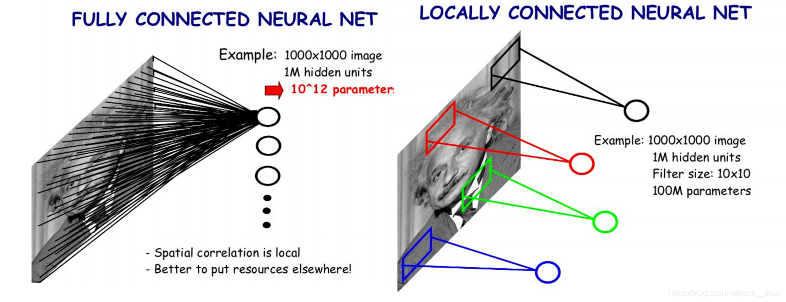


该类网络不仅参数量巨大，且学习速度较慢，即使是一个简单的问题，一般也需要几百次甚至上千次的学习才能收敛，而且易产生过拟合问题，泛化能力较弱。

而卷积层则可以保持形状不变。当输入图像时，卷积层会以3维数据的形式接收输入数据，并同样以3维数据的形式输出至下一层。因此，在CNN中，可以正确理解图像等具有形状的数据，而且由于局部连接，大大降低了参数量，节省了内存。

#### 参数共享

也可理解为“平移不变性”。卷积神经网络在图像的某一区域学到某个模式之后，它就可以在图像的任何地方识别这个模式。

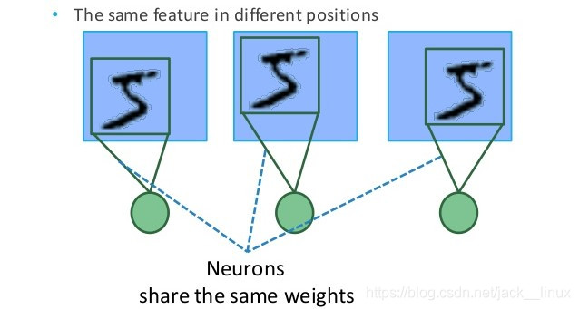

如图3.2所示，假设使用某一特征过滤器（检测器）提取 “手写5” 的特征，那么图片的右下角区域，以及旁边的各个区域都可以使用这个过滤器。每个特征检测器以及输出都可以在输入图片的不同区域中使用同样的参数，以便提取特征 “5”。而对于全连接网络来说，如果模式出现在新的位置，它只能重新学习这个模式。这使得卷积神经网络在处理图像时可以高效利用数据（因为视觉世界从根本上具有平移不变性），只需要更少的训练样本就可以学到具有泛化能力的数据表示。


#### 分层提取

卷积神经网络可以学到**模式的空间层次结构**（spatial hierarchies of patterns）。


 如图3.3。第一个卷积层将学习较小的局部模式（比如边缘），第二个卷积层将学习由第一层特征组成的更大的模式，以此类推，层数越高，学到的特征就越全局化。这使得卷积神经网络可以有效地学习越来越复杂、越来越抽象的视觉概念（视觉世界从根本上具有空间层次结构）。


#### 感受野（Receptive field）

感受野用来表示网络内部的不同神经元对原图像的感受范围的大小，换句话说，即为每一层输出的特征图(feature map)上的像素点在原始图像上映射的区域大小。其中神经元感受野的值越大表示其能接触到的原始图像范围就越大，也意味着它可能蕴含更为全局，语义层次更高的特征；相反，值越小则表示其所包含的特征越趋向局部和细节，因此感受野的值可以用来大致判断每一层的抽象层次。

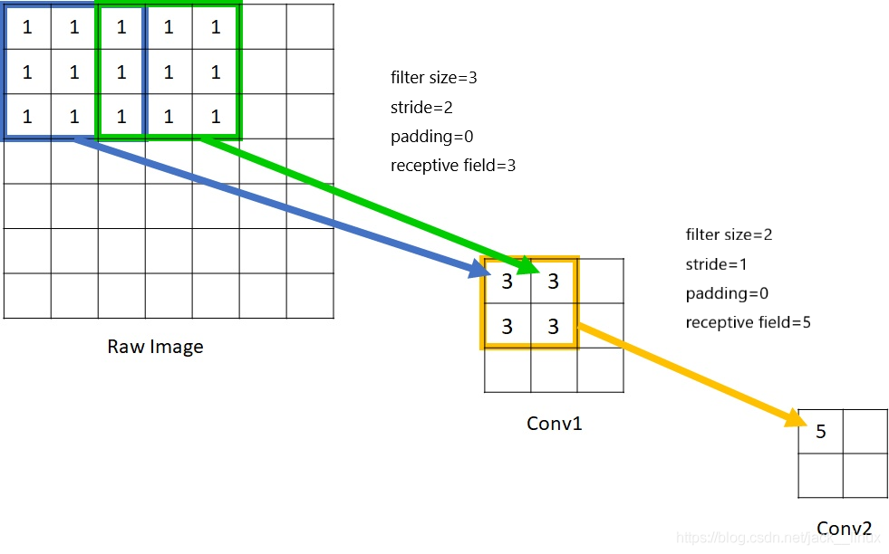

对于卷积核 Conv1 来说，其每个元素在原图像上所能看到的范围是 $3 \times 3$（感受野值为 3），又因为卷积核Conv1的大小为3，步长为2，且卷积核 Conv2的大小为2，步长为1，结合可知，Conv2中的每一个元素可包含 Conv1 中大小为2的元素，而2个 Conv1 所能覆盖原始图像的范围为 $5 \times 5 $，故Conv2的感受野值为 5。


#### 多核卷积

 一个卷积核只能提取某一种特征，而计算机对于一幅图像的 “理解” 过程中，往往需要对其多个特征进行学习，其每个卷积核都是一种特征提取方式，就像一个筛子，将图像中符合条件（激活值越大越符合条件）的部分筛选出来。

如图3.3，我们人类对于猫的理解会包括猫的耳朵、鼻子和眼睛，故其可采取图示的三种卷积核来进行提取，而更底层的特征，如不同形状的曲线、图案等则由其他不同种类的卷积核来进行提取。


#### 局部卷积

以LeNet网络举例，其结构如下图所示：


原始图像进来以后，先进入一个卷积层C1，由6个 5x5 的卷积核组成，卷积出28x28的图像，然后下采样到14x14（S2）。接下来，再进一个卷积层C3，由16个5x5的卷积核组成，之后再下采样到5x5（S4）。注意，这里S2与C3的连接方式并不是全连接，而是部分连接，如下图所示：


其中行代表S2层的某个节点，列代表C3层的某个节点。我们可以看出，C3的 0 和S2的 0、1、2 连接，C3的 1 和S2的 1、2、3 连接，不过从C3的6~13变为了每次连接4个节点，C3的14变为了5个节点，C3的15与S2的节点全部连接。

 即用不同底层特征的组合，可以得到进一步的高级特征，例如：/ + \ = ，再比如，以图3.3为例，第一层的9个卷积核与输入图像 “猫” 是全部连接，从 “猫” 中得到了9种不同的底层特征图（各类底层曲线及图案），而第二层的卷积核1（将用于提取 “猫眼睛”）则只与第一层的特征图1\~5相连接（即仅与特征图1\~5进行卷积运算），同理，第二层的卷积核3（“猫耳朵”）则只与第一层的特征图7~9相连接。


此处所说的 “全部连接” 与BP神经网络中的 “全连接” 有着本质的不同，BP神经网络中的全连接表示网络中的每一个神经元都与上一层的所有神经元相连接，而卷积网络中的 “全部连接” 只是表示该层的卷积核与上一层特征图的所有通道进行卷积，但卷积运算的过程仍是 “局部连接”。

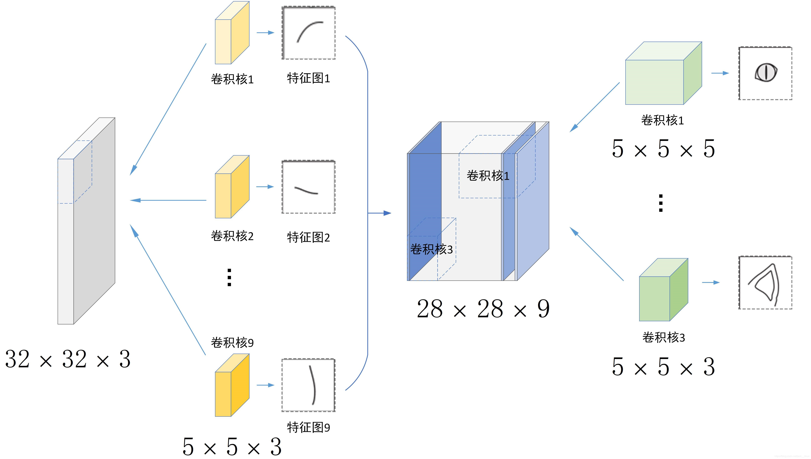

结合图3.3，以图4.3为例，第一层中卷积核1~9的通道数都与原图像的相同（值都为3），故此处属于卷积的 “全部连接”，也是卷积运算默认的连接方式，而第二层中卷积核1的通道数为5，卷积核3的通道数为3，而上层特征图的通道数为9，故此处属于卷积的 “局部连接”。

注：在此处，卷积核1与卷积核3分别仅与第1\~5层特征图、7~9层特征图进行卷积运算，即分别仅在其所处的立体空间中的一个面内移动，分别输出的是一个二维的图像（通道数为1），其与处理视频序列的三维卷积概念不同。


### 卷积层和池化层的实现

如果以传统思维使用for循环来实现的话，则在巨大数据量的情况下，for循环进行计算和切换内存的时间消耗会非常大。而采用向量化的并行计算方式则可以大幅缩短计算时间。

#### 卷积实现

如图5.1所示，首先对于输入数据，将应用滤波器的区域（3维方块）横向展开为1列以匹配卷积核（权重），然后将卷积核依次展开为1列，计算两者的矩阵乘积，最后将得到的2维数据reshape至4维。

注：为了便于观察，将步幅设置得很大，以使滤波器的应用区域不重叠。而在实际的卷积运算中，滤波器的应用区域几乎都是重叠的。在滤波器的应用区域重叠的情况下，展开后的元素个数会多于原方块的元素个数。因此该方法比普通的实现会消耗更多的内存。

注：在程序中，因为包含批处理数量（N幅图像同时处理），故输入数据是4维，卷积核也是所有共同展开，故也是4维。其中：N——批处理的图像数量（样本数）；FN——滤波器数量；C——通道数；H——高度；W——宽度

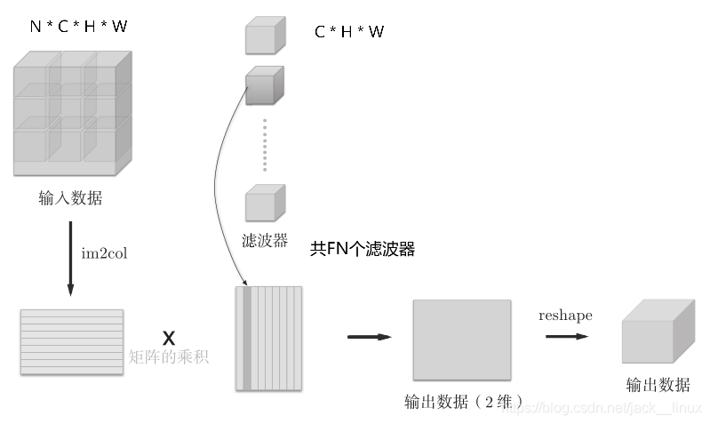

im2col 是一个展开函数，名称是“image to column”的缩写，即 “从图像到矩阵” 的意思。Caffe、Chainer等深度学习框架中有名为im2col 的函数，并且在卷积层的实现中，都使用了 im2col。


#### 池化层实现

池化层的实现和卷积层相同，都对输入数据进行展开。不过，池化的情况下，在通道方向上是独立的。如图5.2所示，池化的应用区域按通道单独展开。如图5.2所示，对于输入数据的每一层的池化区域分别展开为2维向量，然后对每一行求最大值得到一个1维向量，最后将该向量reshape为合适的维数。

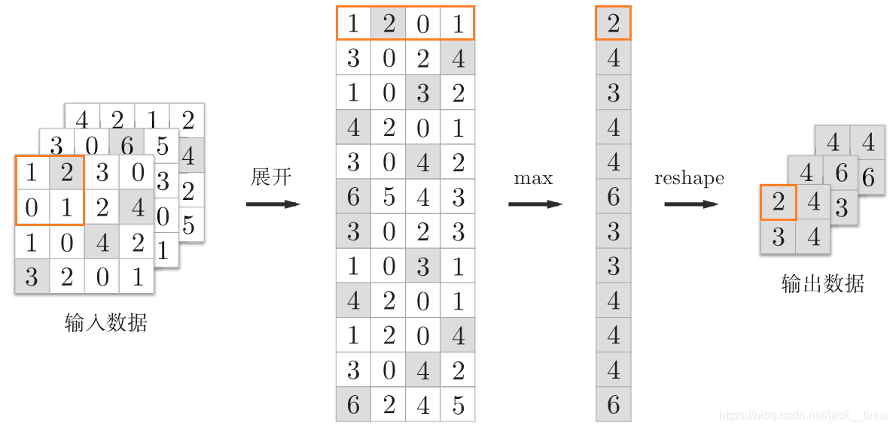


### 可视化

学习前的卷积核是随机进行初始化的，所以在黑白的浓淡上没有规律可循，但学习后的滤波器变成了有规律的图像。可以发现，通过学习，滤波器被更新成了有规律的滤波器，比如从白到黑渐变的滤波器、含有块状区域（称为blob）的滤波器等。

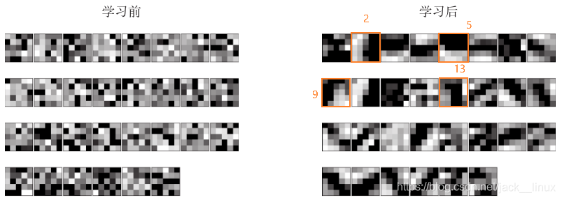

以图6.1为例，不同卷积核经过学习改变了自身对不同特征的响应程度，如边缘（颜色变化的分界线）和斑块（局部的块状区域）等，其中第2个卷积核对垂直边缘响应，第5个卷积核对水平边缘响应，第9个对倾斜边缘响应，第13个对中心斑块响应。

上面的结果是针对第1层的卷积层得出的。第1层的卷积层中提取了边缘或斑块等“低级”信息，而在堆叠了多层的CNN中，随着层次加深，提取的信息（准确说，是响应强烈的神经元））也越来越抽象。如图6.2所示，第1层的神经元对边缘或斑块有响应，第3层对纹理有响应，第5层对物体部件有响应，最后的全连接层对物体的类别（狗或车）有响应。

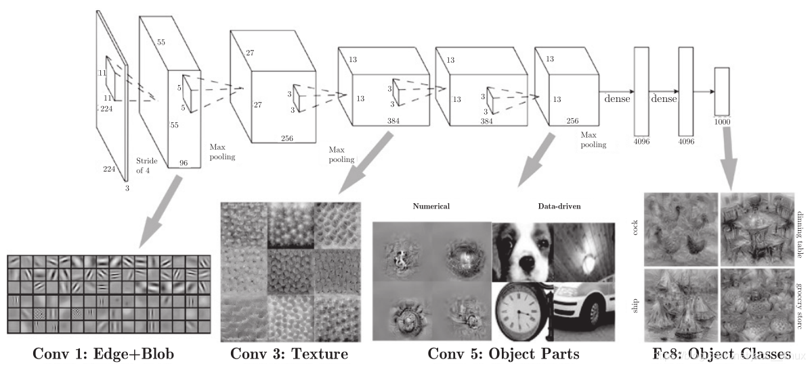

也就是说，随着层次加深，神经元从简单的形状向“高级”信息变化。换句话说，就像我们理解东西的“含义”一样，响应的对象在逐渐变化。

### 神经网络的本质

神经网络由大量的节点（或称“神经元”，卷积神经网络中为“特征图”）相互连接构成，每个节点代表一种特定的函数，称为激活函数（Activation Function）。节点之间的连接具有特定的权重，信号经过会进行加权，代表神经网络的记忆。网络的输出则依网络的连接方式、权重值和激活函数的不同而不同。网络本身则代表对自然界某种算法或者函数的逼近，也可以是一种逻辑策略的表达。


### CNN的训练过程

#### 卷积层的训练


#### 池化层的训练


## 第五章 系统的设计与实现

### HDF5文件介绍

HDF5文件是层次数据格式第5代的版本（Hierarchical Data Format，HDF5），它是用于存储科学数据的一种文件格式和库文件。一般以 **.h5** 或者 **.hdf5** 作为后缀名。最初由美国超级计算中心与应用中心研发的文件格式，用以存储和组织大规模数据，后来由一个非盈利组织HDF Group支持。HDF支持多种商业及非商业的软件平台，包括MATLAB、Java、Python、R和Julia等等。

| HDF5设计架构                              |
| ----------------------------------------- |
| 客户端                                    |
| 中间件（h5py、PyTables、MATLAB......）    |
| C API                                     |
| 公共抽象（组、数据集）                    |
| 内部数据结构（组：B树；数据集：分块存储） |
| 1维逻辑地址空间                           |
| 底层驱动                                  |
| 磁盘数据                                  |

#### 文件结构

H5将文件结构简化成两个主要的对象类型:

- 数据集dataset：就是同一类型数据的多维数组，类似于NumPy 中的数组 array 
- 组group：是一种容器结构,可以包含数据集和其他组,若一个文件中存放了不同种类的数据集,这些数据集的管理就用到了group

直观的理解,可以参考我们的文件系统，不同的文件存放在不同的目录下:

- 目录就是HDF5文件中的group，描述了数据集dataset的分类信息，通过group有效的将多种dataset进行管理和划分
- 文件就是hdf5文件中的dataset，表示具体的数据

#### 组结构

熟悉Linux系统的，可以将这个组结构类似于Linux文件系统的目录层次结构，根目录再包含其他目录，节点目录里面存放相应的数据集，或者可以将组结构当做Python里面的嵌套字典结构，通过这样一个层次化的结构可以合理地将数据组织起来.可以从下面的Python代码运行中看出来，f作为得到的HDF5的文件对象，其实就是根目录，通过新建组就可以看出来.

```python
import h5py

with h5py.File("test.hdf5", "w") as f:
    subgroup = f.create_group("subgroup")
    print(subgroup)
# <HDF5 group "/subgroup" (0 members)>
```

下图就是数据集和组的关系:

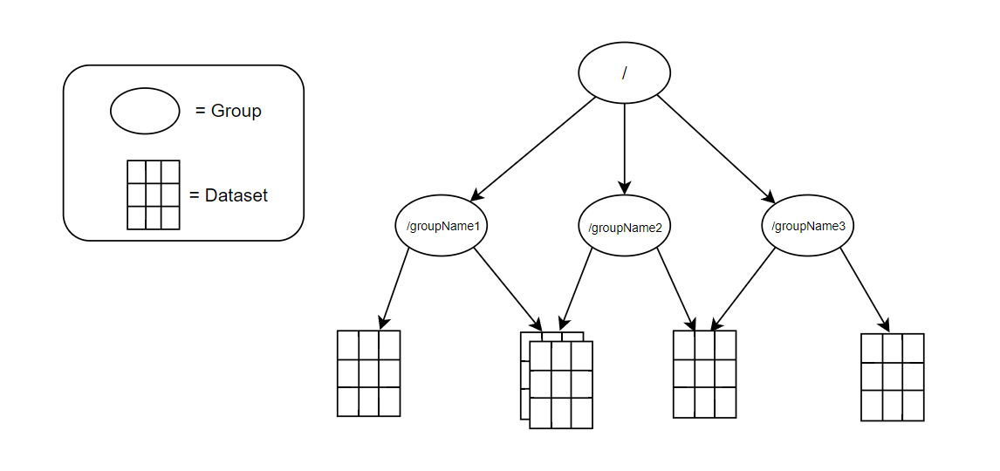

#### 数据集

h5文件是一种真正的层次结构，文件系统式的数据类型。另外在数据集中还有元数据，即metadata

对于每一个dataset而言，除了数据本身之外，这个数据集还有很多的属性信息。在hdf5中，同时支持存储数据集对应的属性信息，所有的属性信息的集合叫做Metadata，下图来自HDF Group的官网，可以看出其中用于描述的元数据包括，Dataspaces、Datatypes、Properties和Attributes（可选）.

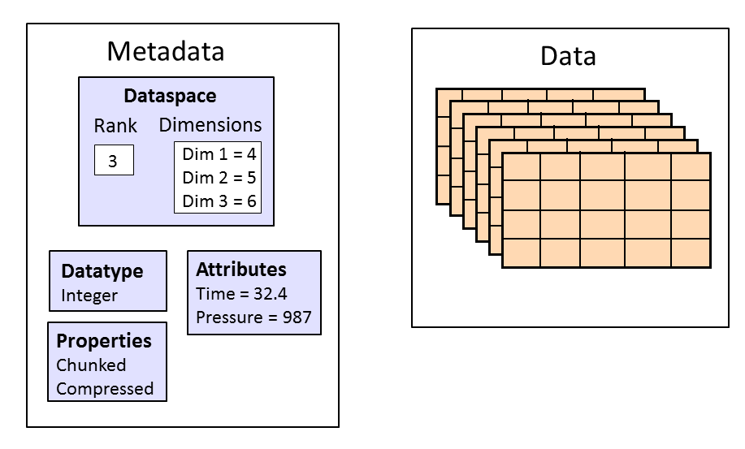

- **Dataspace** 给出原始数据的**秩** (Rank) 和**维度** (dimension)
- **Datatype** 给出数据类型
- **Properties** 说明该 dataset 的**分块储存**以及**压缩**情况
- **Attributes** 为该 dataset 的其他自定义属性


### 在PC上训练模型

#### 数据集的读取


#### 训练集和测试集的选取


#### 模型结构的选择


#### 模型参数的训练


#### 参数文件的生成


### 在MCU端进行推理

#### Input层


#### Convolution层


#### Activation层


#### Pooling层


#### Dense层


#### Output层


#### 降采样


#### 归一化


#### 卷积


#### 池化


#### 全连接


#### Softmax


#### 输出分类结果


## 第六章 神经网络模型的量化与部署


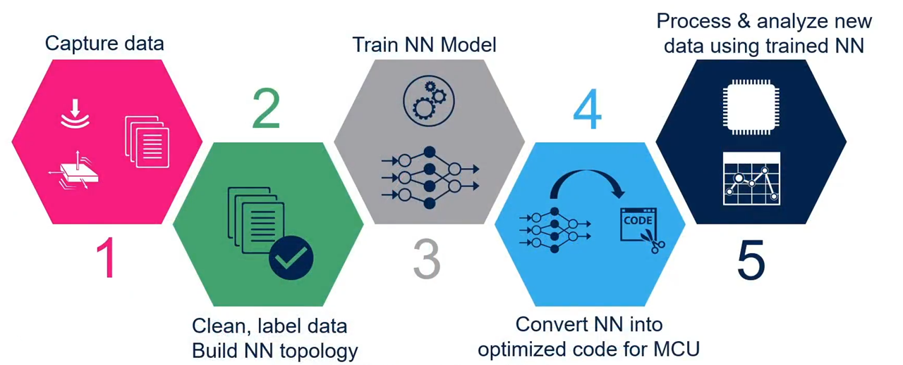


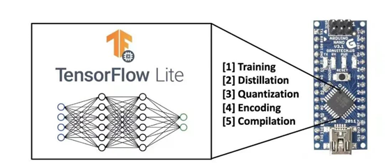

其中，一些关键的技术包括：

蒸馏：是指在训练后通过剪枝（pruning）和知识蒸馏的技术手段，对模型进行更改，以创建更紧凑的表示形式。

量化：在模型蒸馏后，通过量化实现以更少位数的数据类型近似表示32位浮点型数据，在可接受的精度损失范围之内减少模型尺寸大小、内存消耗并加快模型推理速度。

编码：就是通过更有效的编码方式（如霍夫曼编码）来存储数据，进一步减小模型规模。

编译：通过以上方式压缩好的模型，将被编译为可被大多MCU使用的C或C++代码，通过设备上的轻量级网络解释器（如TF Lite和TF Lite Micro）运行。


## 第七章 嵌入式AI框架的设计与实现


## 第八章 设计小结


## 参考文献

[1]李瑞霞,马伊栋,潘世生.嵌入式人工智能的应用与展望[J].电子世界,2021,(04):8-9.

https://wdeyes.com/news/industry/31.html

https://www.mouser.cn/blog/cn-the-embedded-ai-is-here

https://www.likecs.com/show-976107.html

https://m.elecfans.com/article/614787.html


## 致谢


## 附录


