# 基于MCU的图像识别分类识别系统的设计与实现

## 摘要


关键字：嵌入式人工智能；ARM；深度学习；机器视觉；图像识别

## ABSTRACT


## 第一章 绪论

### 1.1 课题的研究背景及意义

随着人工智能的蓬勃发展，研究人员训练的神经网络呈现出更宽、更深和更密集的特点。但是，随之而来的就是算力要求不断提高。2014年后，神经网络的发展越来越关注网络结构的优化所带来的效率和性能的提升，嵌入式人工智能（Embedded Artificial Intelligence，EAI）应运而生。

EAI与一般意义上人工智能（General Artificial Intelligence，GAI）既有联系又有本质的区别。EAI是以微控制器MCU或应用处理器MPU为核心，在有限的算力下，执行基本的学习或推理算法。嵌入式设备无需联网，实时感知、决策，延迟低。GAI一般以通用计算机为载体，可通过网络与云端数据中心通信，进而获得远超本身的算力。

EAI是人工智能落地的重要实现形式，它涉及到很多方面，如传感器、MCU、AI、数据库系统等。目前来看，EAI在工业控制、智慧医疗、智慧城市、交通运输以及农业等行业的垂直领域都有非常大的市场潜力，各种终端应用数量不断增加。值得一提的是，EAI在自然语言处理（NLP）应用市场方面有着十分出色的表现，具有代表性的产品有天猫精灵音箱、亚马逊智能音箱、小米的小爱同学等。

本课题的提出主要基于以下三个方面：

（1）图像处理技术的迅速发展。数字图像处理利用模数转换，将图像信号转换成数字信号，然后利用计算机对其进行处理。 它最初起源于20世纪20年代，并于80-90年代形成独立的科学体系。现在此技术吸引了大量研究人员，具有非常广应用场景。在农业、工业、生物、航空等领域扮演着越来越重要的角色。

（2）嵌入式系统的蓬勃发展。从我们身边随处可见的智能手环这一点可以看出，MCU在近几年以令人惊讶的速度在不断演进，它们已经具备执行AI模型推理的能力。此外，相对于PC来说，它们还有着功耗低，成本低和快速实现产品原型等优势。

（3）PC上的图像识别准确率已经超越人类， 但很难转化为具体产品。一切技术研究最终都需要转化为具体产品才能产生效益。PC的图像处理技术在实际应用过程中暴露出了“三高一低”问题，即能耗高、延迟高、成本高和隐私安全低。嵌入式系统虽然算力受限，但是执行基本的推理计算并没有问题，加上功耗低、架构简单等特点，受到研究人员和商业公司的广泛关注。

综上所述，基于MCU的图像识别、分类识别是未来人工智能产业落地的一个主要趋势。也就是说，嵌入式终端除了能够测量，还必须能够识别自己测量的是什么东西。它必须具备处理原始数据的能力，而不是通过网络将数据传输给云端，利用云计算进行处理。卷积神经网络（Convolutional Neural Network，CNN）能够满足人类绝大多数图片识别、 分类识别的需求，但缺点也很明显，那就是所需算力太大，就算领导CNN发展的一线研究人员也很少将CNN直接放在MCU上跑，实际工程应用那就更少了。通常认为MCU计算资源不多，性能太弱跑不了神经网络。不过在2014年之后，图片识别精度已经非常接近人类，所以CNN的发展开始关注模型结构的优化，更加注重效能的提升。于是算力资源受限的MCU也在模型推理方面有了用武之地。

### 1.2  国内外研究现状

从最初的在服务器上执行计算，然后是通用计算机，最后是MCU本地执行，EAI发展的三个阶段如下图所示。


EAI研究进展


EAI的主要供应商和应用市场如下表所示。

| 主要供应商                                                   | 应用市场                                                     |
| ------------------------------------------------------------ | ------------------------------------------------------------ |
| 微软、高通、英特尔、谷歌、NVIDIA、NXP、意法半导体、瑞萨、莱迪思、赛灵思、Maxim、Arm、新思科技、百度、Orbit、联发科、Mythic、地平线、商汤科技、智存科技、OPEN AI LAB | 手机、可穿戴设备、车载电子、智能家居、安全监控、无人机、机器人、其他 |

#### 1.2.1 国外研究现状

国外最具代表性的企业有NXP（恩智浦）、STMicroelectronics（意法半导体）、Maxim、ARM、Xilinx（赛灵思）等。他们纷纷推出硬件、软件、开发工具等一系列解决方案，并且将功耗控制在了可接受的范围内，建立了各自的生态系统。

2021年，米尔电子跟恩智浦合作推出MYC-JX8MPQ核心板及开发板上市，MYC-JX8MPQ核心板采用NXP第一款集成专用神经处理单元NPU的高性能处理器i.MX 8M Plus，板载资源十分丰富。可运行当下流行的图像分类识别网络，如MobileNet、ResNet等。i.MX 8M Plus的主要特点如下表所示。

| 名称     | 参数                                      |
| -------- | ----------------------------------------- |
| 算力     | 2.3 TOPS（每秒兆级操作）                  |
| 主频     | 1.8GHz（工业级1.6Ghz）                    |
| 子系统   | ARM Cortex-M7的独立实时子系统，主频800MHz |
| 音频     | 高性能数字音频处理器（DSP），主频800MHz   |
| 信号     | 双摄像头图像信号处理器（ISP）             |
| 图像     | 具有图形渲染的3D GPU                      |
| 工艺技术 | 14nm LPC FinFET                           |


Versal ACAP是Xilinx推出的一种具有革命性的异构计算架构。它结合标量计算，可编程逻辑和矢量计算的各自优势，极大地增强了使用此架构的MCU运行机器学习算法的效率和性能。AI Engine和GPU的结构有点类似，它由多个DSP、BRAM以及DMA等构成，这使得它可以处理超长指令字、单指令字，多数据指令。AI Engine之间并不是各自孤立的存在，而是相互关联。由于存储带宽可以达到100Tb/s，所以完全不必担心各个模块的通信延迟问题。NoC技术的数据传输参考了网络的通信方式，因此又被叫做片上网络，它实现了各个模块之间的互联共通。


Xilinx的Versal ACAP功能框图


美信（Maxim Intergrated）发布了一款低功耗的神经网络加速器芯片，适用于边缘人工智能。它由两个超低功耗内核——Arm Cortex-M4和RISC-V、基于FPU的MCU和CNN加速器组成，具有能耗低、延迟低和高度集成的特点。这款芯片充分地考虑了AI处理和低功耗之间的平衡，将二者有效地结合在一起，再加上硬件本身的CNN加速器使得执行网络模型的推理的能量消耗仅为焦耳级别。


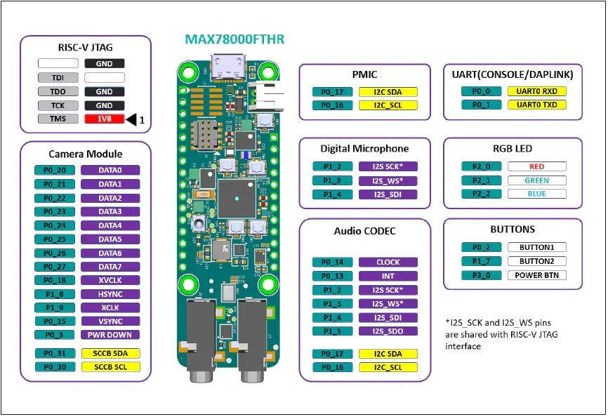

Maxim的低功耗MCU产品MAX78000


#### 1.2.2 国内研究现状

何积丰院士认为，AI芯片、机器学习、边缘计算是EAI比较前沿的技术，从整体来看，人工智能要进行产品落地必然会和嵌入式结合，所以EAI是一个重要的机遇。苏州大学的王宜怀教授认为，EAI实现了嵌入式的智能化，随着嵌入式芯片的不断地演进，市场需求不断扩大，EAI正在成为人工智能产品落地的重要形式。

地平线针对 AIoT 场景，推出的新一代低功耗、高性能的 AI 处理器旭日3 。该处理器集成了地平线最先进的伯努利2.0 架构 AI 引擎( BPU )， 可同时处理不同分辨率 4 ~ 8 个 Camera Sensor 的输入，并支持多种图像后处理，如畸变矫正、拼接等。同时支持 H.264 / H.265 编解码，可处理60FPS的4K视频。

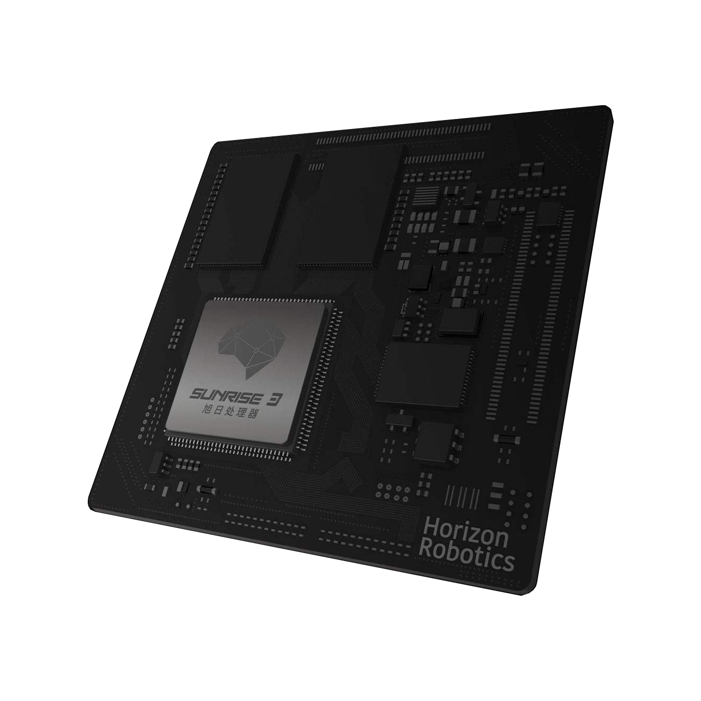


海康推出了一款自主研发的AI摄像头。可以对人脸进行跟踪、抓拍，视频帧率达到60FPS，并且可以自动报警。此外，它对区域入侵、越界、移动等侦测方面也有出色的表现。


图：海康威视智能交通网络摄像机


### 1.3 论文结构

本文的结构和章节内容安排如下：


### 1.4 本章小结

本章节一开始介绍了此次研究的背景和意义，之后简明扼要地分析了国内外嵌入式AI的发展现状。章节的最后，归纳了本文研究的主要内容，对文章结构做了总体介绍。


## 第二章 CNN图像识别基本概念

CNN可以处理图像以及一切可以转化成类似图像结构的数据。相比传统算法和其它神经网络，卷积神经网络能够高效处理图片的二维局部信息，提取图片特征，进行图像分类。CNN最初是模拟人类的视觉原理而提出的，人类识别一张图片的过程如下图所示。

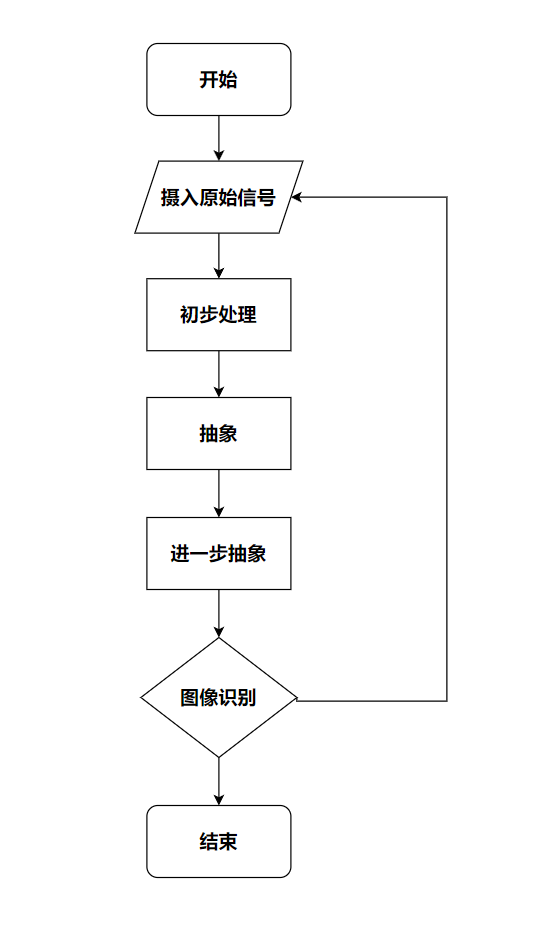

当然，人类识别一个物体的过程远远比图中所展示的流程复杂。譬如，当一个人在大街上看到一辆车的时候，从一开始的光学信号进入眼睛，伴随着逐层的抽象，人的大脑也逐渐提取轮子、车灯、雨刷等车的特征，最后 这些特征合成相应的物体图像，人类从而识别出看到的是一辆车。

### CNN模型结构

如下图所示，一个完整的CNN包括卷积层（Conv2D）、池化层（Pooling）、全连接层（Dense）等。其中Conv2D和Pooling层构成了CNN的基础。

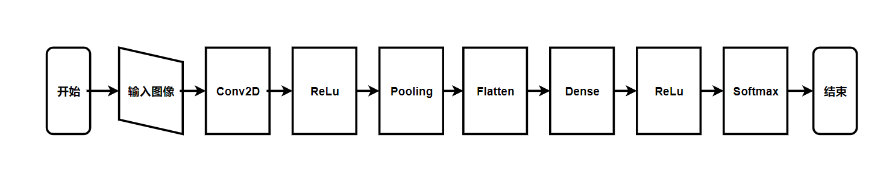

上图里面提到的名词主要含义如下表所示。

| 名词    | 含义                                                         |
| ------- | ------------------------------------------------------------ |
| Conv2D  | 卷积层。一般卷积操作面对的都是二维图像，所以行业默认将卷积函数定义为Conv2D。下面的命名也是基于行业不成文的规定。 |
| ReLu    | 激活函数。一般是非线性的。                                   |
| Pooling | 池化层。减少模型参数，降低计算复杂度                         |
| Flatten | 将多维张量展平成一维，作为全连接层的输入                     |
| Dense   | 全连接层。和传统神经网络的全连接一样                         |
| Softmax | 将输出结果映射成概率值，表示属于该类别的可能性               |


对于卷积层，其详细描述如图1.2所示


其运算过程主要由以下4步组成：

- 原图像（尺寸为32x32x3）分别与n个5x5x3的卷积核（又名滤波器，fliter）进行卷积运算，得到n个28x28x1的特征图（feature map）
- 每个特征图分别添加不同的偏置（bias），具体为特征图中的每个元素+$b_n$
- 对每个特征图添加激活函数$g^{(x)}$，进行非线性运算
- 将这n个特征图依次叠加，得到最终的特征图（尺寸为28x28xn）

注：对于某一个卷积层，其不同特征图所使用的激活函数相同，但不同卷积层所使用的激活函数可以不同，该步骤在整体描述中为突出与神经网络的相似性而单独提出，但实际上其仍属于卷积层的一部分。


对于池化层，其详细描述如图1.3所示：

 

对于28x28xn的特征图，其池化过程仅需通过池化核对该特征图进行池化运算即可得到输出。

然后将得到的特征图经过全连接层进行处理并由softmax算法进行回归即可得到最终的输出结果。


### CNN基本理论

#### 步长（Strides）

滑动一定的间距，但这个间距该如何定义呢? 这个概念就是卷积的 “步长”（stride），设置卷积的步长可使卷积过程跳过原图像中的某些像素。结合步长 $s$ 操作后，其输出图像的尺寸为 $\lfloor \frac {n-f} {s} \rfloor + 1$ 。stride = 1 表示卷积核滑过每一个相距是 1 的像素，是最基本的单步滑动，作为标准卷积模式。Stride 是 2 表示卷积核的移动步长是 2，跳过相邻像素，输出图像缩小为原来的 1/2。Stride 是 3 表示卷积核的移动步长是 3，跳过 2 个相邻像素，图像缩小为原来的 1/3，以此类推。


#### 填充（Padding）

在标准的卷积过程中，存在两个问题：

- 每次卷积运算后，图像就会缩小，在经历多次运算后，图像终会失去其形状，变为$1 \times 1$的 “柱状”。
- 对于图像边缘的像素，其只被一个输出所触碰或者使用，但对于图像中间的像素，则会有多个卷积核与之重叠。所以那些在角落或者边缘区域的像素点在输出中采用较少，意味着卷积过程丢掉了图像边缘位置的许多信息。

对于这个问题，可以采用额外的 “假” 像素（通常值为 0， 因此经常使用的术语 ”零填充“ ）填充边缘。这样，在滑动时的卷积核可以允许原始边缘像素位于其中心，同时延伸到边缘之外的假像素。假设填充的像素大小为$p$，则$n$就变成了$n+2p$，故其输出的图像尺寸为 $\lfloor \frac {n+2p -f} {s} \rfloor + 1$ 。

 至于选择填充多少像素，通常有两个选择，分别叫做 Valid 卷积和 Same 卷积。

same：采取的是补全方式，尝试在左边和右边补0，规则是左奇右偶，例如输入input_width=13，Filter_width=6，stride=5。在上面滑动的次数是3次，如图所示，输入不够0来凑。


$$
n_{output} = \lceil \frac {n_{input}} {s} \rceil , \qquad s为步长
$$


valid：采用的是丢弃的方式，如果不够滑动一次则将剩下的数据丢弃。


$$
n_{output} = \lceil \frac {n_{input} - f + 1} {s} \rceil , \qquad s为步长, f为kernel\ size
$$


注：一般卷积核的大小$f$会选择一个奇数，如 3 \ 5 \ 7 等。主要因为：

- 如果 $f$ 是一个偶数，那么只能使用一些不对称填充。只有当 $f$ 是奇数时，Same 卷积才会有自然的填充，即可以选择同样的数量填充四周。
- 当卷积核 $f$ 是奇数时，其只有一个中心点，在具体的程序实现过程中会便于指出卷积核的位置。


#### 偏置（Bias）

参考图1.2，每个卷积核都有一个偏置参数 $b$，它是一个实数。偏差包含了这些变量，它是该维度上的一个向量，其在代码中表示为一个 ![1 \times 1\times 1\times n_c^{[l]}](assets/README/times%20n_c%5E%7B%5Bl%5D%7D.gif) 的四维向量或四维张量。如图2.6所示，三维卷积中，偏置中的每一个单元分别作用于特征图中的每一个图层。


  其具体计算过程如图2.7所示（以二维卷积为例，也可理解为图2.6中的某一个偏置单元与特征图中对应图层的计算过程）。


从图2.6可以看出，在仅含有权重参数$w$的情况下，假设函数必须经过原点，但这将使其无论如何也无法回归出一条完美拟合的直线，而当添加偏置 $b$ 后，假设函数变为 $h(x)=wx+b$  ，直线将可以通过任意点，进而对数据进行拟合，这个原理可引申到深度学习的前向传播算法中 $（Z=W^TA+b ）$，即给网络增加了平移的能力（激活函数则可以改变网络拟合的形状），无论在回归还是分类问题中，都可以使网络更好的拟合数据。


#### 卷积（Convolution）

卷积神经网络中的核心即为卷积运算，其相当于图像处理中的“滤波器运算”。 对于一个$m \times n$大小的卷积核
$$
W=\left[ 
\begin{matrix} 
w_{11} & w_{12} & \cdots & w_{1n} \\
w_{21} & w_{22} & \cdots & w_{2n} \\
\vdots & \vdots & \ddots & \vdots \\
w_{m1} & w_{m2} & \cdots & w_{mn} \\
\end{matrix} 
\right]
$$
其对某一原图像 $X$ 进行卷积运算的过程为：卷积核$W$中的每一个权值 $w$ 分别和覆盖的原图像 $X$ 中所对应的像素 $x$ 相乘，然后再求和。计算公式为：
$$
z = w_1x_1 + w_2x_2 + \cdots + w_{mn}x_{mn} = \sum^{mn}_{k=1} w_kx_k = W^TX
$$


#### 池化（Pooling）

我们之所以决定使用卷积后的特征是因为图像具有一种“静态性”的属性，这也就意味着在一个图像区域有用的特征极有可能在另一个区域同样适用。因此，为了描述大的图像，一个很自然的想法就是对不同位置的特征进行聚合统计，例如，人们可以计算图像一个区域上的特征的最大值 (或平均值)。这种聚合的操作就叫做池化 (pooling)。

除了最大值池化（Max Pooling）之外，还有平均值池化（Average pooling）等。相对于Max池化是从目标区域中取出最大值，Average池化则是计算目标区域的平均值。如图2.6.1所示的即为Max池化的运算过程，Average池化依此类推。

  

池化有4个重要特性：

- 不同于卷积，池化没有需要学习的参数。

- 池化运算后图像的高度和宽度被压缩，但通过数不会改变。

- 降低了数据特征，扩大了卷积核的感受野。

  

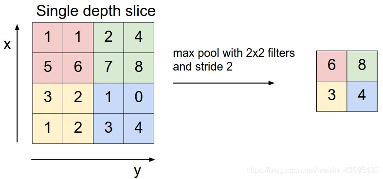

上图所展示的是取区域最大，即上图左边部分中 左上角2x2的矩阵中6最大，右上角2x2的矩阵中8最大，左下角2x2的矩阵中3最大，右下角2x2的矩阵中4最大，所以得到上图右边部分的结果：6 8 3 4。

近期，池化层并不是很受青睐。部分原因是现在的数据集又大又复杂，我们更关心欠拟合问题。Dropout 是一个更好的正则化方法。


#### 激活函数（Activation Function）

常见的激活函数及其优缺点总结如下表所示。

| 激活函数   | 公式                                            | 优点                                     | 缺点                                |
| ---------- | ----------------------------------------------- | ---------------------------------------- | ----------------------------------- |
| Sigmoid    | $Sigmoid(z) = \frac {1} {1+e^{-z}}$             | 平滑、易于求导                           | 计算量大、梯度消失问题、不以0为中心 |
| Tanh       | $tanh(z) = \frac {e^z - e^{-z}} {e^z + e^{-z}}$ | 以0为中心                                | 计算量大、仍存在梯度消失问题        |
| ReLu       | $ReLu(z) = max(0, z)$                           | 计算简单、收敛速度快、不存在梯度消失问题 | 不以0为中心，存在dead ReLU 问题。   |
| Leaky Relu | $LeakyRelu(z) = max(az, z)$                     | 缓解了 dead ReLU 问题                    | 使用该函数的结果并不连贯。          |


### CNN模型的存储

HDF5文件是层次数据格式第5代的版本（Hierarchical Data Format，HDF5），它是用于存储科学数据的一种文件格式和库文件。一般以 **.h5** 或者 **.hdf5** 作为后缀名。最初由美国超级计算中心与应用中心研发的文件格式，用以存储和组织大规模数据，后来由一个非盈利组织HDF Group支持。

|               HDF5设计架构                |
| :---------------------------------------: |
|                  客户端                   |
|  中间件（h5py、PyTables、MATLAB......）   |
|                   C API                   |
|          公共抽象（组、数据集）           |
| 内部数据结构（组：B树；数据集：分块存储） |
|              1维逻辑地址空间              |
|                 底层驱动                  |
|                 磁盘数据                  |

H5将文件结构简化成两个主要的对象类型：数据集Dataset和组Group。熟悉Linux系统的，可以将这个组结构类似于Linux文件系统的目录层次结构，根目录再包含其他目录，节点目录里面存放相应的数据集，或者可以将组结构当做Python里面的嵌套字典结构，通过这样一个层次化的结构可以合理地将数据组织起来.可以从下面的Python代码运行中看出来，f作为得到的HDF5的文件对象，其实就是根目录，通过新建组就可以看出来.

```python
import h5py

with h5py.File("test.hdf5", "w") as f:
    subgroup = f.create_group("subgroup")
    print(subgroup)
# <HDF5 group "/subgroup" (0 members)>
```

下图就是数据集和组的关系:


h5文件是一种真正的层次结构，文件系统式的数据类型。对于每一个dataset而言，除了数据本身之外，这个数据集还有很多的属性信息。在HDF5中，同时支持存储数据集对应的属性信息，所有的属性信息的集合叫做Metadata。他们之间的关系如下图所示。


各种属性的含义如下表所示。

|    属性    |                        含义                        |
| :--------: | :------------------------------------------------: |
| Dataspace  | 给出原始数据的**秩** (Rank) 和**维度** (dimension) |
|  Datatype  |                    给出数据类型                    |
| Properties |   说明该 dataset 的**分块储存**以及**压缩**情况    |
| Attributes |           为该 dataset 的其他自定义属性            |


### RGB色彩模式

RGB16数据格式主要有二种：RGB565和RGB555。一般常见的格式是RGB888，也就是说每个像素三个通道，分别为R、G、B，都用8bit表示。之所以要说RGB565和RGB555，是因为有很多嵌入式摄像头所拍摄的图像是基于此格式的。

RGB565每个像素三个通道，分别为R（5位）、G（5位）、B（5位）。

```python
# 获取高字节的5个bit
R = color & 0xF800;
# 获取中间6个bit
G = color & 0x07E0;
# 获取低字节5个bit
B = color & 0x001F;
```

RGB555每个像素三个通道，分别为R（5位）、G（5位）、B（5位），特别地，最高位不用。

```python
# 获取高字节的5个bit
R = color & 0x7C00;
# 获取中间5个bit
G = color & 0x03E0;
# 获取低字节5个bit
B = color & 0x001F;
```


## 第三章 神经网络模型的量化与部署

正如前文所言，为了能够将只存在于学术上的关于CNN的理论研究转化成服务于人类的产品，很多研究人员开始将从前只存在于服务端的网络模型转移到嵌入式MCU终端等资源受限的设备上。当下关于CNN具有研究前景的问题之一就是如何在有限的资源上部署一般较为复杂的模型，比较通用且流行的技术是对部署前的网络模型进行量化。一个模型如果经过量化，不仅尺寸大大减小，而且部署到终端后的推理时间也相对快了许多。


其中用到的关键技术和各自含义如下表所示。

| 关键技术 | 含义                                                         |
| -------- | ------------------------------------------------------------ |
| 蒸馏     | 是指在训练后通过剪枝（pruning）和知识蒸馏的技术手段，对模型进行更改，以创建更紧凑的表示形式。 |
| 量化     | 在模型蒸馏后，通过量化实现以更少位数的数据类型近似表示32位浮点型数据，在可接受的精度损失范围之内减少模型尺寸大小、内存消耗并加快模型推理速度。 |
| 编码     | 通过更有效的编码方式（如霍夫曼编码）来存储数据，进一步减小模型规模。 |
| 编译     | 通过以上方式压缩好的模型，将被编译为可被大多MCU使用的C或C++代码，通过设备上的轻量级网络解释器（如TF Lite和TF Lite Micro）运行。 |


### 量化基础

#### 什么是量化

量化是指将信号的连续取值近似为有限多个离散值的过程。可理解成一种信息压缩的方法。在计算机系统上考虑这个概念，一般用“低比特”来表示。也有人称量化为“定点化”，但是严格来讲所表示的范围是缩小的。定点化特指 scale 为 2 的幂次的线性量化，是一种更加实用的量化方法。为了保证较高的精度，计算机中大部分的科学运算都是采用浮点型进行计算，常见的是 float32 和 float64。神经网络的模型量化即将网络模型的权值，激活值等从高精度转化成低精度的操作过程，例如将 float32 转化成 int8，同时我们期望转换后的模型准确率与转化前相近。由于模型量化是一种近似算法方法，精度损失是一个严峻的问题，大部分的研究都在关注这一问题。

#### 量化的原理

模型量化为定点与浮点等数据之间建立一种数据映射关系，使得以较小的精度损失代价获得了较好的收益。详细如下：

R 表示真实的浮点值，Q 表示量化后的定点值，Z 表示 0 浮点值对应的量化定点值，S 则为定点量化后可表示的最小刻度。 由浮点到定点的量化公式如下：
$$
Q=\frac {R} {S} + Z
$$
由定点到浮点反量化公式如下：
$$
R = (Q-Z)*S
$$
其中，S 和 Z 的求值公式如下：
$$
S = \frac {R_{max} - R_{min}} {Q_{max} - Q_{min}} \\
\\
Z = Q_{max} - \frac {R_{max}} {S}
$$
$R_{max} , R_{min}, Q_{max}, Q_{min}$ 分别表示最大和最小的浮点数，最大和最小的定点数。量化后的 Q 还是反推求得的浮点值 R，若它们超出各自可表示的最大范围，则需进行截断处理。

#### 量化的优势

模型量化可以带来如下几个方面的优势：

- 更少的存储开销和带宽需求。即使用更少的比特数存储数据，有效减少应用对存储资源的依赖。
- 更低的功耗。移动 8bit 数据与移动 32bit 浮点型数据相比，前者比后者高 4 倍的效率，而在一定程度上内存的使用量与功耗是成正比的。
- 更快的计算速度。相对于浮点数，大多数处理器都支持 8bit 数据的更快处理，如果是二值量化，则更有优势。


### 量化算法

根据映射函数是否是线性可以分为两类，即线性量化和非线性量化，本文主要讨论线性量化技术。

根据参数 Z 是否为零可以将线性量化分为两类：对称量化和非对称量化。

#### 线性量化之对称量化

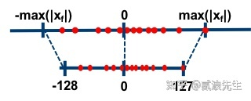

如上图所示，所谓的对称量化，即使用一个映射公式将输入数据映射到 [-128,127] 的范围内，图中 $-max(|x_f|)$ 表示的是输入数据的最小值，$max(|x_f|)$ 表示输入数据的最大值。对称量化的一个核心即零点的处理，映射公式需要保证原始的输入数据中的零点通过映射公式后仍然对应 [-128,127] 区间的零点。总而言之，对称量化通过映射关系将输入数据映射在 [-128,127] 的范围内，对于映射关系而言，我们需要求解的参数即 Z 和 S。

#### 线性量化之费对称量化

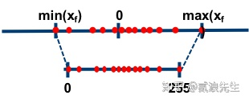

如上图所示，所谓的非对称量化，即使用一个映射公式将输入数据映射到 [0,255] 的范围内，图中 $min(x_f)$ 表示的是输入数据的最小值，$max(x_f)$ 表示输入数据的最大值。总而言之，对称量化通过映射关系将输入数据映射在 [0,255] 的范围内，对于映射关系而言，我们需要求解的参数即 Z 和 S。


### 量化实现

#### 一般步骤

对于模型量化任务而言，具体的执行步骤如下所示：

- 步骤1-在输入数据（通常是权重或者激活值）中统计出相应的 min_value 和 max_value；
- 步骤2-选择合适的量化类型，对称量化（int8）还是非对称量化（uint8）；
- 步骤3-根据量化类型、min_value 和 max_value 来计算获得量化的参数 Z/Zero point 和 S/Scale；
- 步骤4-根据标定数据对模型执行量化操作，即将其由 FP32 转换为 INT8；
- 步骤5-验证量化后的模型性能，如果效果不好，尝试着使用不同的方式计算 S 和 Z，重新执行上面的操作。


#### 支持量化的框架介绍

不管是 Post-Training Quantization 还是 Quantization-Aware Training，算法端都还是用伪量化操作实现的，部署时就必须用 INT8 引擎。支持INT8 引擎框架有：

- DSP/加速芯片平台；
- CPU 平台：Google 的 TensorFlow Lite，Facebook 的 QNNPACK，Tencent 的 NCNN，Alibaba 的 MNN。
- GPU 平台：NVIDIA 的 TensorRT ，Alibaba 的 MNN 和 TVM。

而伪量化框架则在深度学习框架 (caffe，pytorch，tensorflow) 中开源的较多，如基于 pytorch 的 distiller，NNCF。

对于 ARM 平台，INT8 引擎会通过 NEON 指令集加速；对于 x86 平台，INT8 引擎会通过 SSE 加速；对于 NVIDIA GPU 平台，则通过 dp4a 矩阵运算库加速。dp4a 实现了基础的 INT8 矩阵相乘操作，目前 cuDNN，cuBLAS，TensorRT 均采用该指令集。


### 量化落地的一些问题

阻碍模型量化算法落地核心问题当然是精度问题。虽然学术界大家很早就开始做量化，但现在算法还无法大规模落地。主要存在以下几个问题：

- 可落地的线性量化方案无法很好的刻画一些分布，比如高斯分布；
- 比特数越低，精度损失就越大，实用性就越差；
- 任务越难，精度损失越大，比如识别任务，就比分类任务要难非常多；
- 小模型会比大模型更难量化；
- 某些特定结构，如 depthwise，对量化精度十分不友好；
- 常见的对部署友好的方法比如合并 BN，全量化，都会给精度带来更大的挑战。

除了模型精度损失外，软硬件支持不好也是一个阻碍：不同的硬件支持的低比特指令是不一样的，同样训练得到的低比特模型，无法直接部署在所有硬件上。除了硬件之外，不同软件库实现的量化方案和细节也不一样，量化细节里包括量化位置、是否支持每个通道、是否混合精度等等。即使硬件支持了量化，但你会发现不是所有硬件可以在低比特上提供更好的速度提升， 造成这个状况的主要原因有多个，一方面是指令集峰值提升可能本身就并不多，而要引入较多的额外计算，另一方面也取决于软件工程师优化指令的水平，同时由于网络结构灵活多样，不一定能在不同网络结构上达到同样好的加速比，需要优化足够多的的 corner case 才可以解决。


### MCU终端部署

本文选用的开发版是STM32L431RCT，是ST（意法半导体）公司推出的一款开发板。首先介绍一下ST以及他们提供的MCU终端部署AI的解决方案。作为全球最大的半导体公司之一，ST一直积极参与AI相关研究。得益于ST的新AI解决方案，现在可以将预先训练好的CNN，运行在ST公司推出的MCU上。基于此方案，我们可以借助深度学习的力量，增强数据信号的处理性能。


在MCU上运行CNN有五个关键步骤：

1. 采集数据
2. 清理、标记收集的数据并构建CNN拓扑结构
3. 使用数据训练CNN，得到训练后的模型
4. 将模型转换成可在MCU上运行的代码
5. 在设备上运行CNN


### C程序的的执行流程

1. 初始化。开发板上电之后，执行程序主函数，初始化一些参数，使能相机模块。
2. 捕获一帧图像。图像大小是56*56，捕获格式为RGB565，拷贝到内存缓冲区中，以数组格式存放。
3. 缩放图像大小。将图像大小转换成28*28，从而匹配模型要求的输入张量。
4. 执行像素格式的转换。图像格式从RGB565转换成RGB888，且由R,G,B三通道转换成只有一通道的灰度图像。
5. 归一化。
6. 将数据喂给神经网络。执行模型推理。
7. 后处理。找出预测概率最大的类别标号，并将结果显示在LCD屏幕上。


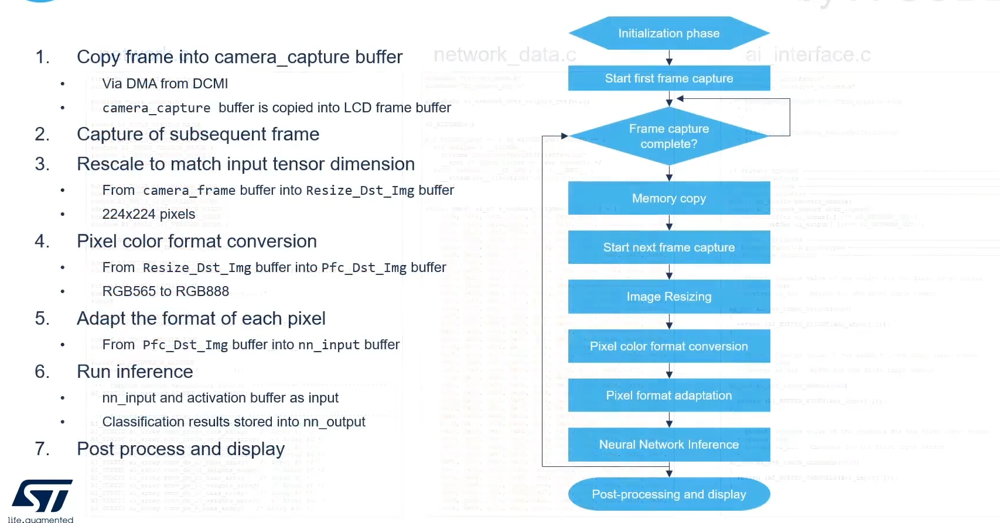


### STM32Cube.AI

本文在研究过程中，也发现了ST公司提出的MCU终端部署AI的解决方案，这里进行一些简单介绍。

他们提出，从数据到部署MCU，总体来说有3个阶段：由科学家或工程师完成CNN的训练，由嵌入式工程师完成在MCU上的实现，而Cube.AI是介于二者之间的便捷高效的转换工具。

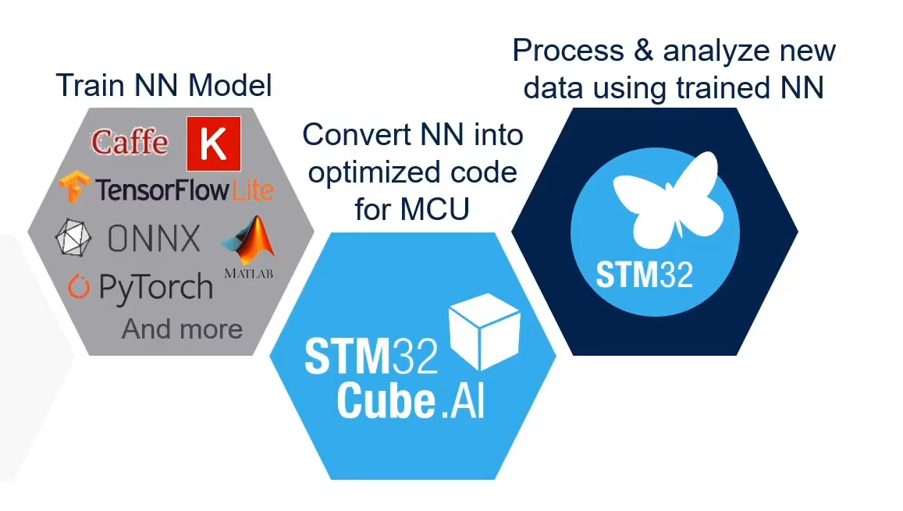


## MCU图像识别系统的设计

### 需求分析

为了提高嵌入式系统开发效率，避免不必要的重复劳动，有必要对嵌入式AI从模型搭建到终端部署进行系统研究。苏州大学王宜怀教授认为，目前我国嵌入式AI产品开发过程中，技术人员往往从“零”做起，具有门槛高、成本大、周期长等特征。学生在嵌入式AI入门学习过程中，往往在硬件环境问题上浪费太多时间，而无法对嵌入式AI形成系统的认识。

针对上述提出的问题，本文开发了一套基于ARM Cortex-M4 内核的图像识别分类识别系统，具体的开发环境为STM32L431RCT。此系统原理清晰、编码规范、简单实用，可作为教师教学过程中的演示系统，也可以帮助学生快速上手嵌入式AI系统的开发。系统的主要功能包括如下几个方面：

1、用户只需要利用PC机完成神经网络模型的搭建和训练。其它诸如量化、部署和结果的可视化展示等都可以调用系统提供的API。

2、系统可以根据用户提供的已经训练好的神经网络模型生成对应的纯C语言代码，由于C语言的可移植性，理论上可以在任意终端部署。

3、由于PC上训练的模型一般较大，系统可以对模型进行量化，压缩到原来的四分之一左右而准确率几乎不变。

4、借鉴了ARM官方CMSIS-NN网络库中的部分方法，程序在基于ARM Cortex-M4/7/33/35P内核的设备上运行时，效率可以提升4-5倍左右。

### 可行性分析

从要实现的功能这一角度来看，系统已经默认内置了一个网络模型，该模型可以胜任简单的图像识别和分类任务，譬如数字、字母，常见水果等，用户无需对EAI有任何相关知识也可以很轻松地将此系统运行起来。学生以传统方式进行EAI入门学习时，容易在嵌入式硬件问题上浪费大量精力，而不能专注EAI本身的学习。本系统屏蔽了底层细节，用户只需几分钟即可成功运行此系统。另外，系统也提供了图形界面，以简化操作，这就使得学生在学习EAI的时候能像打游戏一样获得及时的正反馈，进而提高对嵌入式AI的热情。当用户有了一定的嵌入式AI基础的时候，可以使用Keras搭建并训练自己的网络模型，系统提供对网络模型的评估、可视化、量化和部署等操作。总之，用户只需要关注EAI业务层面，专注EAI本身的学习，快速实现自己设计的网络模型的量化与部署。

从技术实现这一角度来看，国内外许多厂商均纷纷推出了自己的EAI部署解决方案，本系统基于业界成熟的方案结合易学、易用和易上手等需求提出了自己的一套解决方案。简而言之，首先在PC机上使用Keras搭建一个神经网络模型并使用数据集进行训练。接着模型保存为HDF5格式，这种格式可以完整地保存网络模型的结构和权重等参数。直接训练后得到的模型一般较大，所以可以使用TensorFlow Lite进行量化。之后编写一个Python脚本将模型里的权重等参数转换成纯C语言文件，就可以部署到嵌入式终端了。此外，苏州大学的王宜怀教授已经提出物体认知系统（EROS）并且有相应的论文和产品发表，本系统已经完全具备实现的理论和技术支撑。

### 相关技术

#### 技术基础 

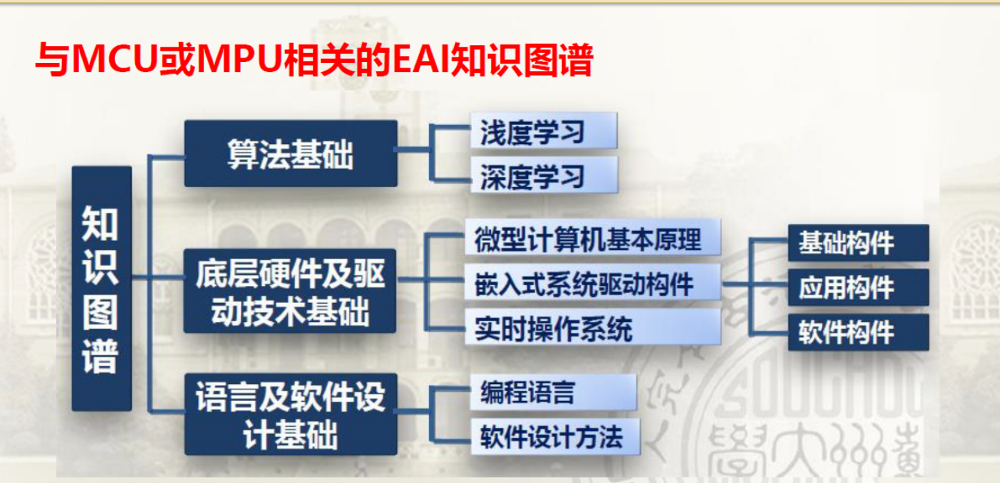


#### 开发语言

Python语言以其简洁、用户友好著称，是进行EAI入门必须要熟练掌握的一门语言，尤其是常用的数据分析和可视化库。

C语言比较接近机器语言，相应地对用户来说就不像Python那么友好，但是在其他条件下，C语言编写的程序执行速度快，内存占用率低，可移植等优点是其他语言无法比拟的，也是大家公认的嵌入式开发首选语言。

#### 开发工具和框架

MiniConda是一款优秀的虚拟环境管理工具，本文使用此工具创建虚拟工作环境并安装了Python 3.8、TensorFlow 2.8和Keras 2.8，避免了麻烦的环境配置问题。

Keras框架可以帮你快速构建自己想要的神经网络，基于Python语言编写，后端需要使用TensorFlow进行模型的训练，所以本文虽然使用Keras搭建神经网络，但是也必须安装TensorFlow。目前二者版本迭代已经进行了同步。Keras 的核心数据结构是 model，一种组织网络层的方式。最简单的模型是Sequential 顺序模型，它由多个网络层线性堆叠。对于更复杂的结构，你应该使用Keras 函数式 API，它允许构建任意的神经网络图。

AHL-GEC-IDE是苏州大学推出的一款针对嵌入式终端开发的编辑器，具有交叉编译、串口更新、断电调试等特点，界面简洁，开发团队也一直在不断迭代更新，所以使用此编辑器进行针对STM32L431MCU开发版的软件开发。

### 概要设计

#### 系统整体架构

考虑到功能需求和成本问题，嵌入式终端不能也不必选择最先进的MCU，STM32L431的性价比完全符合要求。但是这样一来，由于算力资源受限，需要大量计算的模型训练部分就必须放在PC上。在MCU端只需捕获图像，进行简单推理，现时预测值即可。所以系统整体分为两部分，一部分是PC端，另一部分是嵌入式终端。它们之间的关系如下图所示。

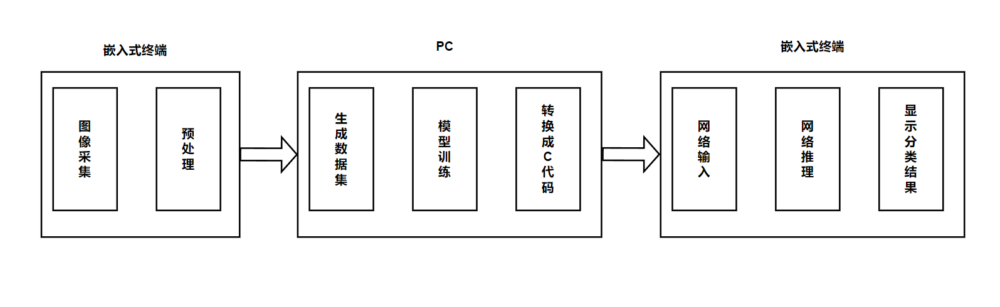

嵌入式终端有相机模块，可以进行图像的采集任务。采集的图像经过预处理和归一化变成标准格式，通过串口发送给PC，然后生成数据集，作为模型的输入。数据集分为两个部分，比例为6:1 。大的那部分作为训练数据集，喂给神经网络模型进行训练，小的部分作为测试数据集，测试训练后的模型是否过拟合。训练后的模型可以使用HDF5格式的文件进行保存，量化之后生成C语言代码。最后，通过AHL-GEC-IDE编辑器对项目工程进行交叉编译，通过串口烧录到开发板上，就可以进行网络的推理和预测了。

#### 模块与功能划分

系统整体上划分成两大部分：PC和嵌入式终端。具体各个模块的划分如下图所示。

PC部分下面按照功能划分成6个子模块，分别为模型搭建模块，负责建立模型；模型训练模块，负责训练模型，得到权重参数；模型量化模块，负责在保证准确率的情况下压缩模型；模型评估模块，负责评估训练的模型是否符合预期，是否出现过拟合的情况，量化后的模型准确率变化情况等；模型转换模块，负责将模型转换成C语言工程文件，方便利用IDE部署到嵌入式终端。

嵌入式终端部分按照功能划分成5个子模块，一个模块对应一个构件，分别为相机模块，负责图像的拍摄并存入内存缓冲区；图像预处理模块，负责对图像进行简单的处理，譬如缩放、滤波、转换格式等。

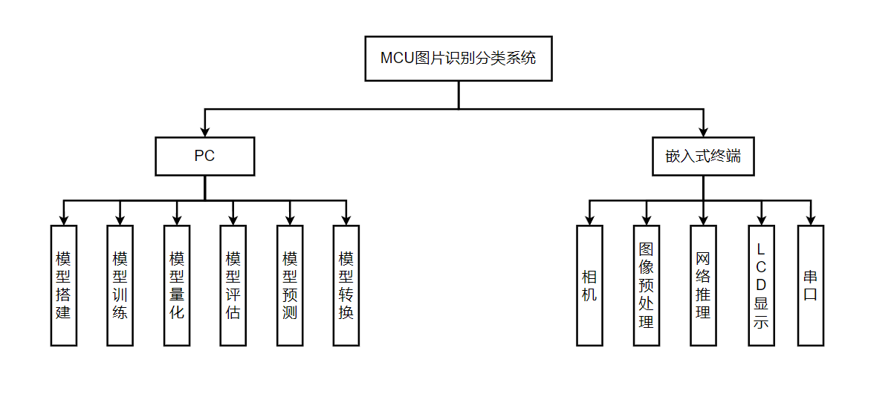


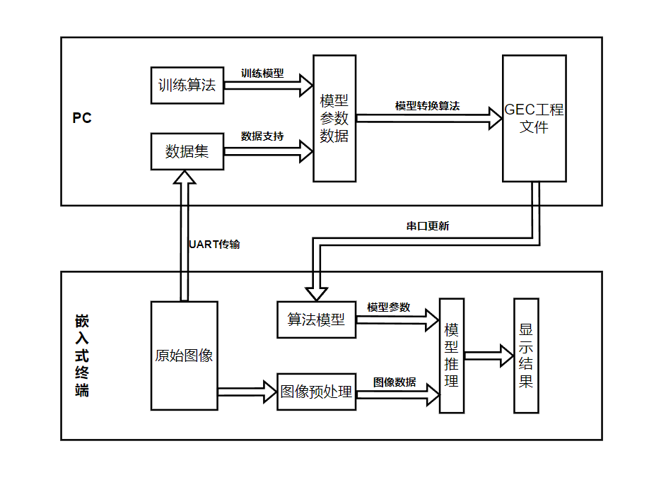


## MCU图像识别系统的实现


### 在PC上训练模型

基于所选芯片的内存空间和芯片算力的考量，系统将模型的训练放在PC机，以此保证模型训练的精确性。所谓的机器学习模型，本质上是一个函数，其作用是实现从一个样本x到样本的标记值Y的映射，即𝑓(𝑥)→𝑌。事实上机器学习模型需要在给定样本集合{𝑥𝑥𝑖𝑖|𝑖𝑖 =1,…,n}及其对应标签<Y1,Y2,…,Yn>的情况下，用假设已知的函数形式𝑓𝑓′(𝑥𝑥𝑖𝑖)→𝑌𝑌𝑖𝑖，尽可能拟合客观存在的映射函数𝑓𝑓(𝑥𝑥𝑖𝑖)→𝑌𝑌𝑖𝑖，并保证𝑓𝑓′在未知同分布样本上具有尽可能相似的拟合能力。

本系统中模型指卷积神经网络中所涉及的所有参数的有规律的集合。具体包括卷积层滤波器矩阵中的元素数值、激活层中的偏置项以及全连接层中的所有神经元之间的权重。

#### 准备数据集

训练过程中使用的数据称为“训练数据”，其中每个样本称为一个“训练样本”，训练样本组成的集合称为“训练集”。学得模型后，使用其进行预测的过程称为测试，被预测的样本称为“测试样本”，测试样本组成的集合称为“测试集”。示例结果的信息，称为标签，例如物体的类别。

系统调用sklearn库中的train_test_split()函数来随机划分样本数据为训练集和测试集，这样做能够保证模型训练取得较高的准确率，减小模型训练的随机性。


```python
# ================== 准备数据 ============================
(x_train, y_train), (x_test, y_test) = mnist.load_data()
print(x_train.shape)
print(x_test.shape)
# 在开始训练前首先对数据进行预处理，将数据转化为一个float32数组，形状为（60000， 28, 28, 1），取值范围0~1.
x_train = x_train.reshape(x_train.shape[0], 28, 28, 1).astype('float32') / 255
x_test = x_test.reshape(x_test.shape[0], 28, 28, 1).astype('float32') / 255

y_train = np_utils.to_categorical(y_train)  # 标签使用one-hot编码格式
y_test = np_utils.to_categorical(y_test)  # 标签使用one-hot编码格式
```


#### 模型结构的选择

本模型架构是基于传统LeNet5的七层传播网络进行适应性优化，针对嵌入式低资源图像识别的场景进行参数以及相关数据处理方式进行调整，在硬件终端上实现模型推理。

终端模型在每层的传播过程中共需要使用到前一层输出的特征图像、本层的权重以及偏置数组和输出的特征图像数组。由于本系统选取的STM32L431RC芯片存储资源为64KB大小RAM空间，所以这三个数组的占用空间之和不能超过64KB，根据此原则本文设计出终端推理模型架构，如表5-1所示。

```python
# ================== 搭建模型 ============================
def build_model():
    # 设置神经网络模型为序贯模型（Sequential）或者函数式模型（Model）
    model = models.Sequential()
    # 卷积层：输出通道数为32，卷积核大小5x5，步长1x1，激活函数为ReLu，输入数据集形状28x28x1
    model.add(layers.Conv2D(32, kernel_size=(5, 5), strides=(1, 1), activation='relu', input_shape=(28, 28, 1)))
    # 池化层：池化核大小为2x2，步长2x2。池化后通道数不变为32，数据集形状变为14x14x1
    model.add(layers.MaxPooling2D(pool_size=(2, 2), strides=(2, 2)))
    # 卷积层：输出通道数为64，卷积核大小5x5，默认步长1x1，激活函数为ReLu, padding指定为same模式
    model.add(layers.Conv2D(64, kernel_size=(5, 5), activation='relu', padding='same'))
    # 池化层：池化核大小为2x2，步长1x1。池化后通道数不变为32，数据集形状变为14x14x1，padding指定为same模式
    model.add(layers.MaxPooling2D(pool_size=(2, 2), strides=(1, 1), padding='same'))
    # 讲数据展平，作为全连接层的输入，数据格式为nx1的形式
    model.add(layers.Flatten())
    # 全连接层：输入维度为n，输出维度为1000，激活函数为ReLu
    model.add(layers.Dense(1000, activation='relu'))
    # 全连接层：输入维度为1000，输出维度为10，激活函数为ReLu
    model.add(layers.Dense(10, activation='softmax'))

    # 打印网络模型，做个总结概要
    model.summary()
    return model
```


#### 训练模型

对于模型的训练我们直接使用了Keras库中的model.fit方法，通过设置模型的训练轮数以及相关的参数实现模型的训练。

```python
# ================== 编译模型 ============================
def train(model, x_train, y_train, epochs=10, batch_size=128):
    # loss为损失函数，里使用交叉熵损失函数；optimizer代表优化器；metric为监控指标，这里只关心精度（accuracy）。
    model.compile(loss='categorical_crossentropy', optimizer='adam', metrics=['accuracy'])

    # ================== 训练模型 ============================
    # verbose：日志显示，0为不在标准输出流输出日志信息，1为输出进度条记录，2为每个epoch输出一行记录
    # shuffle：布尔值或字符串，一般为布尔值，表示是否在训练过程中随机打乱输入样本的顺序。若为字符串“batch”，则是用来处理HDF5数据的特殊情况，它将在batch内部将数据打乱。
    # validation_split：0~1之间的浮点数，用来指定训练集的一定比例数据作为验证集。验证集将不参与训练后，并在每个epoch结束测试的模型的指标，如损失函数、精确度等。
    #   注意，validation_split的划分在shuffle之前，因此如果你的数据本身是有序的，需要先手工打乱再指定validation_split，否则可能会出现验证集样本不均匀。
    # initial_epoch: 从该参数指定的epoch开始训练，在继续之前的训练时有用。

    # fit函数返回一个History的对象，其History.history属性记录了损失函数和其他指标的数值随epoch变化的情况，如果有验证集的话，也包含了验证集的这些指标变化情况
    history = model.fit(x_train, y_train, epochs=epochs, batch_size=batch_size, validation_split=0.3)

    # 保存模型
    models.save_model(model, './model.h5')
    return history
```


#### 评估模型

```python
# ================== 评估模型 ============================
def evaluate_model(model, x_test, y_test, to_file='evaluation.txt'):
    scores = model.evaluate(x_test, y_test, verbose=2)
    print('Test loss: ', scores[0])  # scores[0] 表示损失值
    print('Test accuracy: ', scores[1])  # scores[1] 表示最好的精度

    pred = model.predict(x_test)
    # 混淆矩阵，可视化显示预测值和真实值
    matrix = metrics.confusion_matrix(y_test.argmax(axis=1), pred.argmax(axis=1))
    print(matrix)

    # 计算预测一副图片平均运行时间
    T = time.time()
    for i in range(10):
        model.predict(x_test)
    T = time.time() - T
    run_time = round((T / 10 / x_test.shape[0] * 1000 * 1000), 2)
    print("Running time: ", run_time, "us")

    # 将结果保存在文件内
    with open(to_file, 'w') as f:
        f.write("Running time: " + str(run_time) + "us" + "\n")
        f.write("Test loss: " + str(scores[0]) + "\n")
        f.write("Test accuracy: " + str(scores[1]) + "\n")

        for row in matrix:
            row.tofile(f, sep=', ')
            f.write("\n")
    return scores
```


#### 生成C语言文件

由于训练程序生成的是h5格式的文件，是无法直接放在嵌入式工程环境下进行编译以及使用的，所以我们在训练完成后需要将h5文件转换为存放在C语言的数组类型中的数据格式。
首先读取h5文件中的数据。根据h5文件树状数据存放格式，每层的参数按照“网络层+本身结构（卷积核或偏置）+该数据的序数”格式读取，具体见“…\07-Other\Model_Train_v1.0\Source\ModelTrain.py”。
再将读取到的参数数据打印到指定.c文件中。首先在选择生成文件的路径，再通过write方法依次打印.c文件所需要的包含头文件、宏定义等表头。例


### 在MCU端进行推理

本系统针对嵌入式端编程的特点，优化网络模型结构与相关参数，实现在资源受限的嵌入式端的图像推理分类功能。目前系统是基于STM32L431RC芯片的基础上实现图像识别功能。由于芯片资源受限，所以在嵌入式终端上实现模型的前向传播也就是对图像数据的分类处理，而在PC端对模型进行训练。模型大小目前为40kb，满足在嵌入式终端上运行条件。

在嵌入式端的推理流程如图5-11所示，输入图像依次经过卷积、激活、池化、卷积与全连接这些处理，最后得到分类结果。
在模型输入之前，系统首先需要与摄像头模块通信，在完成摄像头配置后，将传输来的RGB图像进行存储。

#### 降采样和归一化

由于摄像头传来的图像的格式是320×240大小的RGB565格式图像，即每一个像素点占16位存储空间，红色、绿色与蓝色分别占第0-4位，5-10位和11-15位。

基于MCU芯片的外设资源空间考虑，继续将图片进行降采样，先后通过一次均值池化法与一次最大值池化法，最终将RGB值处理为灰度值，最终将输入图像矩阵压缩为28×28大小。


接下来，对输入图像进行归一化操作，将图像的像素点从灰度值映射到0到1范围内处理。
本系统使用的最大最小标准化（Min-Max Normalization），该归一化方法又称离差标准化，使结果映射到[0,1]之间，转换函数为：
$$
X^，= \frac {x - min(x)} {max(x) - min(x)}
$$

其中，max为样本数据的最大值，min为样本数据的最小值。该归一化方法适合用在数值比较集中的情况。如果max和min不稳定，很容易使归一化结果不稳定，造成后续使用效果也不稳定。


#### 卷积

在得到28×28大小的输入图像后，系统开始对图像进行第一次卷积操作。
首先通过在图像周围添加两层0值元素的方式将图像拓展至32×32大小，便于图像边缘部分的特征提取。同时激活函数我们选用了ReLU函数:
$$
ReLU(X) = max(x, 0)
$$
于是此时卷积后的特征函数输出为:
$$
f(x_{i, j}) = max(\sum{11*11 \atop i}w_iv_i + b, 0)
$$
卷积核在嵌入式终端的存放方式是以多维数组的形式存放在模型数组中。以第一个卷积核为例，如图5-12所示，卷积核以二维数组的形式存储。系统通过取对应数组位置获得第𝑚 个卷积核中的第𝑖𝑖行第𝑗𝑗列的具体元素值。

在第一次卷积操作后，输入图像在与6个5×5卷积核进行点乘操作后，得到的6张大小为28×28的特征图像。在特征图像经过激活函数的激活后，系统将得到的4704个特征图像数据。


#### 池化

如果系统直接将上一层输出的4704个参数直接进行后续计算，那么产生的大量运算数据，这是MCU的运算资源无法负载的。因此需要通过池化层的操作，将数据进一步的精简优化。

为此，系统选择了最大池化法的方式去精简数据：保留区域内卷积响应最大的特征，丢弃一些响应值较小的特征。

此时，池化层的输入特性图像的大小为28×28。系统首先四个元素一组，将特征图像分为196组，再在每组中选出激活值最大的一个元素作为输出。

设池化层的输入特征图第𝑖𝑖行第𝑗𝑗列的点𝑦𝑦𝑖𝑖,𝑗𝑗与池化后特征图像中第𝑖𝑖行第𝑗𝑗个坐标点𝑥𝑥之间的具体实现公式为：


经过一次池化操作后，特征图像的大小缩减为原来的四分之一，总数量为1176个。


#### Flatten层


#### 全连接

此时系统将这10个数据作为全连接神经网络的输入神经元，再根据分类结果的个数来选择对应个数的输出神经元，由于系统目前设定为识别3类物体，所以本层全连接的输出神经元个数为3个。

通过激活函数激活后，我们就得到了3个输出神经元的激活值。


#### Softmax


#### 输出分类结果

$$
y = max(x_1, x_3, x_4)
$$

而当三类物体的预测概率𝑦𝑦 <60%时，系统便认为什么都没有找到，通过串口和屏幕输出“detect noting”。

最后，系统将得到的三个神经元输出值通过Softmax函数计算后，得到图像可能为这三类物体的概率。例如系统的输入是芯片PCB板的图像时，图像在模型中向前传播后，我们变得到了3个数，分别为图像可能是排针、USB接口以及芯片PCB板的概率，并通过LCD显示出来。

我们可以观察出，系统认为它所观察到的图像最有可能的是第三类物体，也就是芯片PCB板，同时系统也认为它有一定的可能为USB接口，在经过一次排序后，系统认为采集到的这一张图像是芯片PCB板。


## 系统测试


## 第五章 设计小结


## 参考文献

[1]李瑞霞,马伊栋,潘世生.嵌入式人工智能的应用与展望[J].电子世界,2021,(04):8-9.

[1]None. Xilinx创下新里程碑:Versal ACAP开始出货了![J]. 单片机与嵌入式系统应用, 2019, 19(8):1.

https://wdeyes.com/news/industry/31.html

https://www.mouser.cn/blog/cn-the-embedded-ai-is-here

https://www.likecs.com/show-976107.html

https://m.elecfans.com/article/614787.html

https://www.elecfans.com/d/1615417.html

https://zhuanlan.zhihu.com/p/374374300

https://zhuanlan.zhihu.com/p/400275925


## 致谢


## 附录


