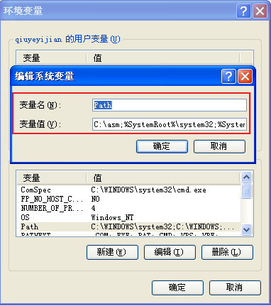
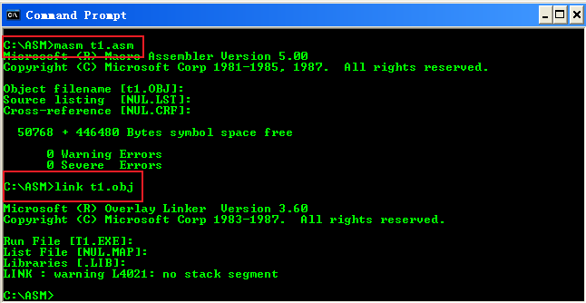
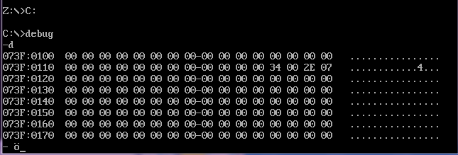

## winXPwin7win10搭建汇编环境

### 前言

这学期学汇编，看B站上有个老师讲王爽的《汇编语言》讲的不错，这里记录下搭建过程。

> 工具下载：[https://www.lanzous.com/i6y3nij](https://www.lanzous.com/i6y3nij)

### 一. winXP环境搭建

1. c盘根目录下新建名为 `asm` 的文件夹（虚拟机演示，只有C盘，推荐建在D盘，名字什么的也无所谓）

2. 在文件夹下新建测试用的文本文件，并将以下代码保存其中，名字改为  `t1.asm`  

   ``` 
   assume cs:code
   
   
   
   code segment
   
   
   
   		mov bx,0B800H
   		mov es,bx
   		
   		mov bx,160*10 + 40*2
   
   		mov word ptr es:[bx],5535H
   
   
   
   
   
   
   		mov ax,4C00H
   		int 21H
   
   
   
   code ends
   
   
   
   end
   ```

   3. 将具包里 `MASM.EXE`和`LINK.EXE`文件复制到我们刚才新建的` asm`文件夹里

   
   4. 将`asm`文件夹路径加到系统环境变量

      

5. 打开cmd 进入asm文件夹，依次执行以下命令

   ``` 
   masm t1.asm
   
   link t1.obj
   
   ```

   

6. 此时就生成了可执行文件`t1.exe`

### 二. win7环境搭建

1. 安装DOSBox, 软件在工具包里，不想改安装路径的，一路下一步就可以了

2. 在 D盘 新建`asm `文件夹, 将工具包里`degbug.exe`  `LINK.EXE` `MASM.EXE`文件复制到里面

3. 配置DOSBox, 在路径`C盘`->用户->当前用户目录->APPDate->Local->DOSBox，打开`dosbox-0.74.conf` ，在最后面加入如下命令：

   ``` 
   ## 例如我的位置是在：C:\Users\qiuyeyijian\AppData\Local\DOSBox
   
   mount C: D:\asm
   C:
   ```

   

4. 此时，已经配置好了，打开DOSBox， 输入 debug , 然后输入 d, 就可以看到效果



5. 程序测试和WinXP一样，这里不再详细赘述

### win10 环境搭建

1.和win7差不多，这里也不再详细赘述。，，（哈哈）