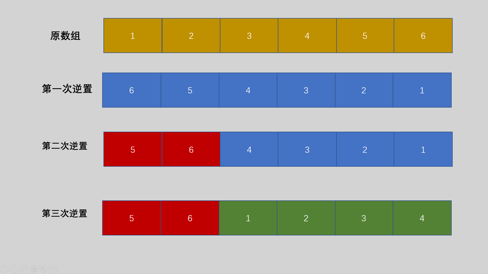
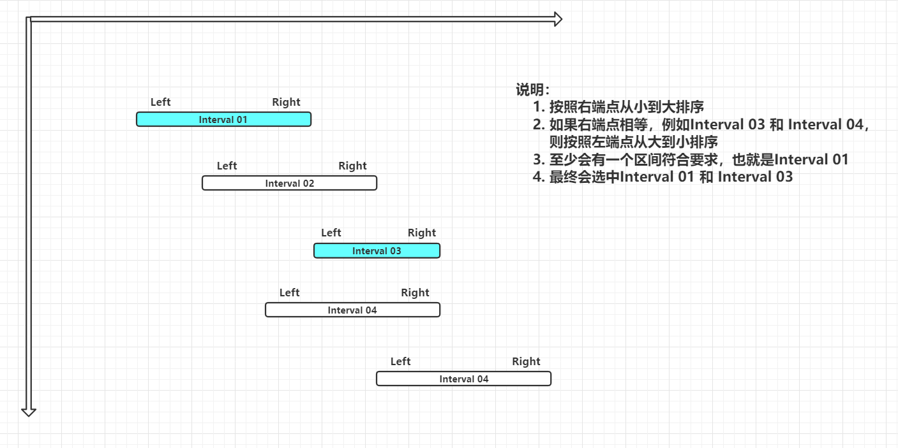

## 进制转换

```cpp
// p进制数x转换成十进制数y
int toDecimal(int x, int p) {
  // weight: x各位的权值
  // weight: 会在循环中不断乘权值p，得到1、p^2、p^3...
  int y = 0, weight = 1;
  while (x != 0) {
    y = y + (x % 10) * weight;  // 每次加上x的个位数乘以权值
    x /= 10;                    // 去掉x的各位数
    weight *= p;
  }

  return y;
}

// 十进制数x转换成p进制数
void toOther(int x, int p) {
    int z[100] = { 0 };  //用于存放p进制的每一位
    int index = 0;
    do {
        z[index++] = x % p;
        x /= p;
    } while (x != 0);

    for (int i = index - 1; i >= 0; --i) {
        printf("%d", z[i]);
    }
}
```


## 类型转换

### 整型和字符型

```cpp
char ch[100];
int n;

// 整形转字符型
sprintf(ch, "%d", n);
// 字符型转整型
sscanf(ch, "%d", &n);
```


## 几种常见的排序算法

### 冒泡排序

```cpp
void bubbleSort(int* arr, int len) {
    // 从后向前冒泡，从小到大排序
    /*for (int i = 0; i < len; ++i) {
        for (int j = len - 1; j > i; --j) {
            if (arr[j - 1] > arr[j]) {
                int temp = arr[j - 1];
                arr[j - 1] = arr[j];
                arr[j] = temp;
            }
        }
    }*/

    // 从前向后冒泡，从小到大排序
    for (int i = len - 1; i > 0; --i) {
        for (int j = 0; j < i; ++j) {
            if (arr[j + 1] < arr[j]) {
                int temp = arr[j];
                arr[j] = arr[j + 1];
                arr[j + 1] = temp;
            }
        }
    }
}
```


### 选择排序

时间复杂度：$O(n^2)$

```cpp
void selectSort(int arr[], int len) {
    for (int i = 0; i < len - 1; ++i) {
        for (int j = i + 1; j < len; ++j) {
            if (arr[i] > arr[j]) {
                int temp = arr[j];
                arr[j] = arr[i];
                arr[i] = temp;
            }
        }
    }
}
```


### 直接插入排序

```cpp
// 插入排序
void insertSort(int arr[], int len) {
  for (int i = 1; i < len; ++i) {
    int temp = arr[i], j = i;

    // 向后移动
    while (j > 0 && arr[j - 1] > temp) {
      arr[j] = arr[j - 1];
      --j;
    }
    // 插入数据
    arr[j] = temp;
  }
}

```


### 归并排序

https://segmentfault.com/a/1190000021734148

归并排序时间复杂度为$O(nlogn)$

```cpp
const int maxn = 100;

// 将数组a的[l1, r1]与[l2, r2]区间合并为有序区间（此处l2, 即为 r1 + 1）
// 利用双指针法将两个区间合并， 注意while的边界
void merge(int arr[], int l1, int r1, int l2, int r2) {
  int i = l1, j = l2;  // i 指向arr[l1], j指向a[l2]

  int temp[maxn], index = 0;
  while (i <= r1 && j <= r2) {
    if (arr[i] <= arr[j]) {
      temp[index++] = arr[i++];
    } else {
      temp[index++] = arr[j++];
    }
  }

  while (i <= r1) temp[index++] = arr[i++];
  while (j <= r2) temp[index++] = arr[j++];

  // 将合并后的序列赋值回数组A
  for (int i = 0; i < index; i++) {
    arr[l1 + i] = temp[i];
  }
}

// 将arr数组当前区间[left, right]进行归并排序
void mergeSort(int arr[], int left, int right) {
  if (left < right) {  // 只要left < right，说明还可以进行二分
    int mid = (left + right) / 2;  // 取[left, right]的中点
    mergeSort(arr, left, mid);  // 递归，将左区间[left, mid]归并排序
    mergeSort(arr, mid + 1, right);  // 递归，将右区间[mid + 1, right]归并排序
    merge(arr, left, mid, mid + 1, right);
  }
}
```


### 快速排序

平均时间复杂度为$O(nlogn)$

> 1. 调整序列中的元素，使当前序列最左端的元素在调整后满足左侧所有元素均不超过该元素、右侧元素均大于该元素。
> 2. 对该元素的左侧和右侧分别进行递归进行第一步的调整，直到当前调整区间的长度不超过1。

选择一个pivot中心轴，一般选择左边第一个数，交替移动left 和 right 指针，二者重合之后，将pivot放到相遇的下标位置。

```cpp
// 将[left, right]按照arr[left]分成两部分
// 左边都比arr[left]小，右边都比arr[left]大
// 返回中心下标
int partition(int arr[], int left, int right) {
  int pivot = arr[left];  // 将arr[left] 作为主元
  while (left < right) {  // 只要left和right不相遇
    // 反复左移right直到找到一个元素比pivot小
    while (left < right && arr[right] > pivot) right--;
    // 将找到的元素移到左边
    arr[left] = arr[right];
    // 再反复右移left直到找到一个元素比pivot大
    while (left < right && arr[left] <= pivot) left++;
    // 将该元素移动到右边
    arr[right] = arr[left];
  }

  // left 和 right相遇，则将pivot元素放到该位置下，一轮快排结束
  arr[left] = pivot;
  return left;  // left和right相遇的地方就是中心下标
}

// 快读排序， left和right初始值为序列的首尾下标
void quickSort(int arr[], int left, int right) {
  // 当前区间长度超过1
  if (left < right) {
    // 将[left, right]按照arr[left]分成两部分
    // 左边都比arr[left]小，右边都比arr[left]大
    int pos = partition(arr, left, right);
    // 对左边区间进行递归快速排序
    quickSort(arr, left, pos - 1);
    // 对右边区间进行递归快速排序
    quickSort(arr, pos + 1, right);
  }
}
```


## 排序

C++ 中sort函数和C中的qsort函数是用于排序的函数，推荐使用sort函数，简单与效率并存。

sort函数的使用必须加上头文件`#include<algorithm>`和`using namespace std;` 如果不加比较函数，默认从小到大排序。

```cpp
sort(首元素地址（必填），尾元素地址的下一个地址（必填），比较函数（非必填）);
```

```cpp
// 不使用比较函数
int arr[5] = {3, 1, 2, 4};
sort(arr, arr + 4);		
```

```cpp
// 使用比较函数
struct Student {
    string name;
    int score;
} stu[100];

/*
1. 如果两个学生分数不相同，那么分数高的排在前面
2. 如果分数相同， 将姓名字典序小的排在前面
*/
bool cmp(Student a, Student b) {
    if(a.score != b.score) {
        return a.score > b.score;
    } else {
        return a.name > b.name;
    }
}

sort(stu, stu + 100, cmp);
```


## 查找

### 二分查找

```cpp
// arr:  要查找的数组
int binarySearch(int arr[], int left, int right, int data) {

    while (left <= right) {
        // 获取中间下标
        // 这样做比 （left + right）/ 2 更安全，可以避免int溢出
        int mid = left + (right - left) / 2;
        if (arr[mid] == data) {
            // 查找成功，返回下标
            return mid;
        }
        else if (arr[mid] > data) {
            right = mid - 1;
        }
        else {
            left = mid + 1;
        }
    }

    // 查找失败
    return -1;
}
```


## 素数（质数）判断

素数又称质数，是指除了1和本身之外，不能被其他数整除的一类数，反之称为合数。1既不是素数，也不是合数。

```cpp
bool isPrime(int n) {		// 时间复杂度O(sqrt(n))
  if (n <= 1) return false;
  int sqr = (int)sqrt(n * 1.0);
  for (int i = 2; i <= sqr; i++) {
    if (n % i == 0) return false;
  }
  return true;
}
```


## 数组元素循环右移问题及解决方法

通过对数组的多次逆置来达到循环的效果，一共对数组进行了三次逆置，所以就需要构造一个函数，这个函数既可以逆置一个数组，也可以逆置数组的部分区间。

需要注意移动的位数M可能大于数组的长度N，需要首先令M = M % N;

1. 先将整个数组[0，N)逆置一遍；
2. 将数组的前部分区间[0，M)进行逆置；
3. 将数组的后部分区间[M，N)进行逆置；

假设N=6，M=2。具体数组为nums[6]={1,2,3,4,5,6}; 则逆置过程如下图所示：



参考文章：https://www.jb51.net/article/181740.htm


## 字符串转整数

```cpp
int strToInt(char s[], int len) {
  int id = 0;
  for (int i = 0; i < len; ++i) {
    id = id * 26 + (s[i] - 'A');
  }

  return id;
}
```


## N皇后问题

```cpp
#include <math.h>

#include <iostream>

using namespace std;
const int maxn = 11;

int n;        //　行列数
int ans = 0;  // 记录合法方案数
int p[maxn];  // 存放合法方案数，p[1] = 2 代表第1行第2列放一个皇后
bool hashTable[maxn] = {false};  // 第i列是否已经存放了皇后

// index 正在处理的行数
void nQueen(int index) {
  // 递归边界，已经处理了所有行；并且得到的是合法方案
  if (index == n + 1) {
    ++ans;
    return;
  }

  // 从第1列开始查询
  for (int x = 1; x <= n; ++x) {
    // 如果这一列还没有放皇后
    if (hashTable[x] == false) {
      // 设置一个标志，判断这一列是否可以放皇后
      bool flag = true;
      // 去和之前行的皇后比较
      for (int pre = 1; pre < index; ++pre) {
        // 不同行，不同列已经确定，只要判断是否在对角线就行
        if (abs(index - pre) == abs(p[pre] - x)) {
          // 如果在同一对角线，就直接去判断下一列
          flag = false;
          break;
        }
      }

      if (flag) {
        p[index] = x;         // 将皇后放在第index行第x列
        hashTable[x] = true;  // 第x列已经放了皇后了
        nQueen(index + 1);    // 处理下一行
        hashTable[x] = false;  // 返回的时候拿走皇后，以便进行下一种排列
      }
    }
  }
}

int main() {
  n = 8;
  nQueen(1);

  printf("%d", ans);

  return 0;
}
```


## 区间贪心

题目是落谷的P1803：https://www.luogu.com.cn/problem/P1803

解题思路：

* 首先定义区间结构体，将所有输入的区间存放到数组`intervals[]`中。
* 将数组中的区间**按照右端点从小到大排序**，如果右端点相等，则**按照左端点从大到小排序**。
* 定义一个索引`index`用来存放上一个被选中的区间的右端点，遍历数组，如果该区间的左端点大于`index`，则`ans++` ，更新`index`的值为当前区间的右端点。
* 打印答案`ans`



```cpp
#include <stdio.h>

#include <algorithm>

using namespace std;

const int maxn = 100010;

struct Interval {
  int left;
  int right;
} intervals[maxn];

// 先按照右端点从小到大排序
// 如果右端点相等，按照左端点从大到小排序
bool cmp(Interval a, Interval b) {
  return (a.right != b.right) ? a.right < b.right : a.left > b.left;
}

int main() {
  int n;        // 将要输入的区间个数
  int ans = 1;  // 第0个区间肯定会被选择到
  int index;    // 记录上一个被选择区间的右端点
    
  // 录入数据
  scanf("%d", &n);
  for (int i = 0; i < n; ++i) {
    scanf("%d %d", &intervals[i].left, &intervals[i].right);
  }
    
  // 排序
  sort(intervals, intervals + n, cmp);
    
  // 寻找符合要求的区间
  index = intervals[0].right;
  for (int i = 1; i < n; ++i) {
    // 如果该区间的左端点大于上一个选中的区间的右端点，则选中该区间，记录加1
    if (intervals[i].left >= index) {
      index = intervals[i].right;
      ++ans;
    }
  }

  printf("%d", ans);

  return 0;
}
```


## two pointers （双指针）

充分利用序列递增的性质，以很浅显的思想降低了复杂度。

问题引入：

给定一个递增的正整数序列和一个正整数M， 求序列中的两个不同位置的数a 和 b ，使得他们的和恰好为M，输出所有满足条件的方案。

例如给定序列`{1, 2, 3, 4, 5, 6}` 和正整数 M=8 ，就存在`2+6=8`与`3+5=8`两种方案。

暴力法，时间复杂度$O(n^2)$ 

```cpp
for(int i = 0; i < n; i++) {
    for(int j = i + 1; j < n; j++) {
        if(a[i] + a[j] == m) {
            printf("%d %d\n", arr[i], arr[j]);
        }
    }
}
```

双指针法，时间复杂度$O(n)$

如果满足`a[i] + a[j] == M`，说明找到了其中的一组方案。由于序列递增，不等式a[i + 1] + a[j] > M 与 a[i] + a[j - 1] < M 均成立。但是a[i+1] + a[j-1]与M的大小未知，因此剩余的方案只可能在[i + 1, j-1]区间产生，于是令`i++, j--`（即令i向右移动，j向左移动）

如果`a[i] + a[j] > M` 由于序列递增，不等式`a[i + 1] + a[j] > M`成立，但是`a[i] + a[j-1]` 与M的关系未知，因此剩余的方案只可能在区间`[i, j-1]`内产生，于是令`j--`

如果`a[i] + a[j] < M` 由于序列递增，不等式`a[i] + a[j-1] < M`成立，但是`a[i+1] + a[j]` 与M的关系未知，因此剩余的方案只可能在区间`[i+1, j]`内产生，于是令`i++`

反复执行上面三个判断，知道i >=j 成立

```cpp
// i: 数组第一个元素下标, 0
// j: 数组最后一个元素下标，n-1
// m: 给定的正整数
void twoPointers(int arr[], int i, int j, int m) {
  while (i < j) {
    if (arr[i] + arr[j] == m) {
      printf("%d %d\n", i, j);
      i++;
      j--;
    } else if (arr[i] + arr[j] < m) {
      i++;
    } else {
      j--;
    }
  }
}
```


合并两个数组，也可以利用双指针法

```cpp
// a, b 均为从小到大已排好序的数组，c是接收合并结果的数组
// n, m为a, b数组的长度
int merge(int a[], int b[], int c[], int n, int m) {
  int i = 0, j = 0, index = 0;

  while (i < n && j < m) {
    if (a[i] <= b[j]) {
      c[index++] = a[i++];
    } else {
      c[index++] = b[j++];
    }
  }

  // 如果a数组还有数据，将剩余元素加入c
  while (i < n) c[index++] = a[i++];
  // 如果b数组还有数据，将剩余元素加入c
  while (j < m) c[index++] = b[j++];

  return index;
}
```


