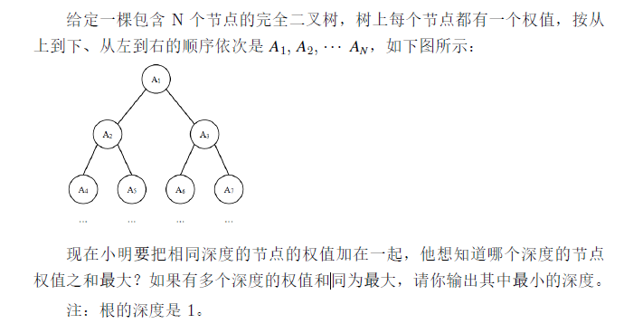

### 试题C: 数列求值

给定数列1, 1, 1, 3, 5, 9, 17, …，从第4 项开始，每项都是前3 项的和。求
第20190324 项的最后4 位数字。

```c++
#include<stdio.h>
int main(){
	int a=1, b=1, c=1, ans;
	for(int i = 4; i <= 20190324; i++) {
		ans = (a+b+c)%10000;
		a=b;
		b=c;
		c=ans;
	}
	printf("%d", ans);
	return 0;
}
```


### 试题D: 数的分解

把2019 分解成3 个各不相同的正整数之和，并且要求每个正整数都不包含数字2 和4，一共有多少种不同的分解方法？

注意交换3 个整数的顺序被视为同一种方法，例如1000+1001+18 和
1001+1000+18 被视为同一种。

```c++
#include<stdio.h>

int check(int n) {
	while(n) {
		if(n % 10 == 2 || n % 10 == 4) {
			return 0;
		}
		n /= 10;
	} 	
	return 1;
}

int main() {
	int ans = 0;
	// 始终保持后面的大于前面的，这样就不会有重复
	// 而且两重循环，减少计算量 
	for(int i = 1; i < 2019; i++) {
		if(check(i)) {
			for(int j = i+1; j < 2019; j++) {
				if(check(j)) {
					int k = 2019 - i - j;
					if(check(k) && k > j) {
						ans++;
					}
				}
			}
		}
		
	}	
	printf("%d", ans);
	
	return 0;
} 
```


### 试题F: 特别数的和

> **问题描述**
>
> 小明对数位中含有2、0、1、9 的数字很感兴趣（不包括前导0），在1 到
> 40 中这样的数包括1、2、9、10 至32、39 和40，共28 个，他们的和是574。
> 请问，在1 到n 中，所有这样的数的和是多少？
>
> **输入格式**
>
> 输入一行包含两个整数n。
>
> **输出格式**
>
> 输出一行，包含一个整数，表示满足条件的数的和。

| 样例输入 | 样例输出 |
| -------- | -------- |
| 40       | 574      |
|          |          |

```c
// 数据规模与约定
对于20% 的评测用例，1 <=n <=10。
对于50% 的评测用例，1 <= n<=100。
对于80% 的评测用例，1 <=n <=1000。
对于所有评测用例，1 <=n <=10000。
//提示

```

**参考源代码**

```c++
#include<stdio.h>

bool isOk(int n) {
	while(n) {
		int t = n%10;
		if(t == 0 || t==1 || t==2 || t==9) {
			return true;
		}
		n /= 10;
	}
	
	return false;
}

int main() {
	int n;
	int sum = 0;
	scanf("%d", &n);
	
	for(int i = 1; i <=n; i++) {
		if(isOk(i)) {
			sum += i;
		}
	}
	printf("%d", sum);
		
	return 0;
}
```


### 试题G: 完全二叉树的权值

> **问题描述**
>
> 
>
> **输入格式**
>
> 第一行包含一个整数N。
>
> 第二行包含N 个整数A1, A2,    AN 。
>
> **输出格式**
>
> 输出一个整数代表答案。

| 样例输入           | 样例输出 |
| ------------------ | -------- |
| 7<br>1 6 5 4 3 2 1 | 2        |
|                    |          |

```c
// 数据规模与约定
对于所有评测用例，1<=N <=100000，-100000 <= Ai <=100000。
//提示

```

**参考源代码**

```c++

```


### 试题H: 等差数列

> **问题描述**
>
> 数学老师给小明出了一道等差数列求和的题目。但是粗心的小明忘记了一部分的数列，只记得其中N 个整数。
>
> 现在给出这N 个整数，小明想知道包含这N 个整数的最短的等差数列有
> 几项？
>
> **输入格式**
>
> 输入的第一行包含一个整数N。
>
> 第二行包含N 个整数A1; A2;    ; AN。(注意A1  AN 并不一定是按等差数列中的顺序给出)
>
> **输出格式**
>
> 输出一个整数表示答案

| 样例输入          | 样例输出 |
| ----------------- | -------- |
| 5<br/>2 6 4 10 20 | 10       |
|                   |          |

```c
// 数据规模与约定
对于所有评测用例，2 <= N <= 100000，0 <= Ai <= 10^9。
//提示
包含2、6、4、10、20 的最短的等差数列是2、4、6、8、10、12、14、16、
18、20。
```

**参考源代码**

```c++

```

