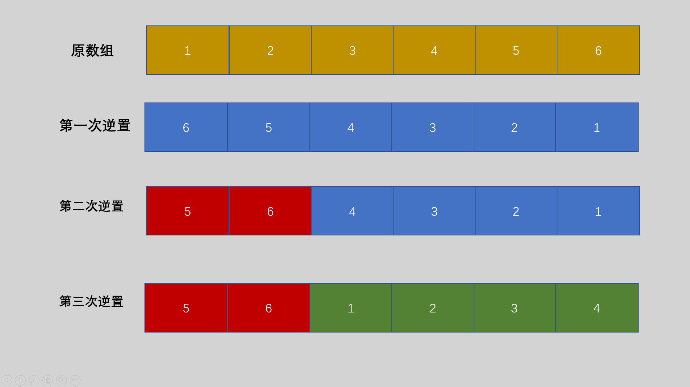
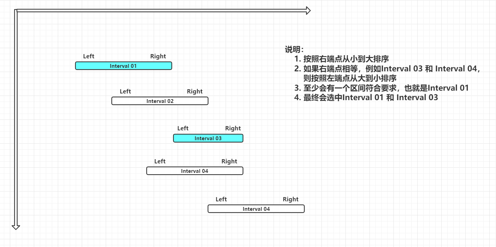

## 进制转换

```cpp
// p进制数x转换成十进制数y
int toDecimal(int x, int p) {
  // weight: x各位的权值
  // weight: 会在循环中不断乘权值p，得到1、p^2、p^3...
  int y = 0, weight = 1;
  while (x != 0) {
    y = y + (x % 10) * weight;  // 每次加上x的个位数乘以权值
    x /= 10;                    // 去掉x的各位数
    weight *= p;
  }

  return y;
}

// 十进制数x转换成p进制数
void toOther(int x, int p) {
    int z[100] = { 0 };  //用于存放p进制的每一位
    int index = 0;
    do {
        z[index++] = x % p;
        x /= p;
    } while (x != 0);

    for (int i = index - 1; i >= 0; --i) {
        printf("%d", z[i]);
    }
}
```


## 类型转换

### 整型和字符型

```cpp
char ch[100];
int n;

// 整形转字符型
sprintf(ch, "%d", n);
// 字符型转整型
sscanf(ch, "%d", &n);
```


## 几种常见的排序算法

### 冒泡排序

```cpp
void bubbleSort(int* arr, int len) {
    // 从后向前冒泡，从小到大排序
    /*for (int i = 0; i < len; ++i) {
        for (int j = len - 1; j > i; --j) {
            if (arr[j - 1] > arr[j]) {
                int temp = arr[j - 1];
                arr[j - 1] = arr[j];
                arr[j] = temp;
            }
        }
    }*/

    // 从前向后冒泡，从小到大排序
    for (int i = len - 1; i > 0; --i) {
        for (int j = 0; j < i; ++j) {
            if (arr[j + 1] < arr[j]) {
                int temp = arr[j];
                arr[j] = arr[j + 1];
                arr[j + 1] = temp;
            }
        }
    }
}
```


### 选择排序

时间复杂度：$O(n^2)$

```cpp
void selectSort(int arr[], int len) {
    for (int i = 0; i < len - 1; ++i) {
        for (int j = i + 1; j < len; ++j) {
            if (arr[i] > arr[j]) {
                int temp = arr[j];
                arr[j] = arr[i];
                arr[i] = temp;
            }
        }
    }
}
```


### 直接插入排序

```cpp
// 插入排序
void insertSort(int arr[], int len) {
  for (int i = 1; i < len; ++i) {
    int temp = arr[i], j = i;

    // 向后移动
    while (j > 0 && arr[j - 1] > temp) {
      arr[j] = arr[j - 1];
      --j;
    }
    // 插入数据
    arr[j] = temp;
  }
}

```


## 排序

C++ 中sort函数和C中的qsort函数是用于排序的函数，推荐使用sort函数，简单与效率并存。

sort函数的使用必须加上头文件`#include<algorithm>`和`using namespace std;` 如果不加比较函数，默认从小到大排序。

```cpp
sort(首元素地址（必填），尾元素地址的下一个地址（必填），比较函数（非必填）);
```

```cpp
// 不使用比较函数
int arr[5] = {3, 1, 2, 4};
sort(arr, arr + 4);		
```

```cpp
// 使用比较函数
struct Student {
    string name;
    int score;
} stu[100];

/*
1. 如果两个学生分数不相同，那么分数高的排在前面
2. 如果分数相同， 将姓名字典序小的排在前面
*/
bool cmp(Student a, Student b) {
    if(a.score != b.score) {
        return a.score > b.score;
    } else {
        return a.name > b.name;
    }
}

sort(stu, stu + 100, cmp);
```


## 素数（质数）判断

素数又称质数，是指除了1和本身之外，不能被其他数整除的一类数，反之称为合数。1既不是素数，也不是合数。

```cpp
bool isPrime(int n) {		// 时间复杂度O(sqrt(n))
  if (n <= 1) return false;
  int sqr = (int)sqrt(n * 1.0);
  for (int i = 2; i <= sqr; i++) {
    if (n % i == 0) return false;
  }
  return true;
}
```


## 数组元素循环右移问题及解决方法

通过对数组的多次逆置来达到循环的效果，一共对数组进行了三次逆置，所以就需要构造一个函数，这个函数既可以逆置一个数组，也可以逆置数组的部分区间。

需要注意移动的位数M可能大于数组的长度N，需要首先令M = M % N;

1. 先将整个数组[0，N)逆置一遍；
2. 将数组的前部分区间[0，M)进行逆置；
3. 将数组的后部分区间[M，N)进行逆置；

假设N=6，M=2。具体数组为nums[6]={1,2,3,4,5,6}; 则逆置过程如下图所示：



参考文章：https://www.jb51.net/article/181740.htm


## 字符串转整数

```cpp
int strToInt(char s[], int len) {
  int id = 0;
  for (int i = 0; i < len; ++i) {
    id = id * 26 + (s[i] - 'A');
  }

  return id;
}
```


## N皇后问题

```cpp
#include <math.h>

#include <iostream>

using namespace std;
const int maxn = 11;

int n;        //　行列数
int ans = 0;  // 记录合法方案数
int p[maxn];  // 存放合法方案数，p[1] = 2 代表第1行第2列放一个皇后
bool hashTable[maxn] = {false};  // 第i列是否已经存放了皇后

// index 正在处理的行数
void nQueen(int index) {
  // 递归边界，已经处理了所有行；并且得到的是合法方案
  if (index == n + 1) {
    ++ans;
    return;
  }

  // 从第1列开始查询
  for (int x = 1; x <= n; ++x) {
    // 如果这一列还没有放皇后
    if (hashTable[x] == false) {
      // 设置一个标志，判断这一列是否可以放皇后
      bool flag = true;
      // 去和之前行的皇后比较
      for (int pre = 1; pre < index; ++pre) {
        // 不同行，不同列已经确定，只要判断是否在对角线就行
        if (abs(index - pre) == abs(p[pre] - x)) {
          // 如果在同一对角线，就直接去判断下一列
          flag = false;
          break;
        }
      }

      if (flag) {
        p[index] = x;         // 将皇后放在第index行第x列
        hashTable[x] = true;  // 第x列已经放了皇后了
        nQueen(index + 1);    // 处理下一行
        hashTable[x] = false;  // 返回的时候拿走皇后，以便进行下一种排列
      }
    }
  }
}

int main() {
  n = 8;
  nQueen(1);

  printf("%d", ans);

  return 0;
}
```


## 区间贪心

题目是落谷的P1803：https://www.luogu.com.cn/problem/P1803

解题思路：

* 首先定义区间结构体，将所有输入的区间存放到数组`intervals[]`中。
* 将数组中的区间**按照右端点从小到大排序**，如果右端点相等，则**按照左端点从大到小排序**。
* 定义一个索引`index`用来存放上一个被选中的区间的右端点，遍历数组，如果该区间的左端点大于`index`，则`ans++` ，更新`index`的值为当前区间的右端点。
* 打印答案`ans`



```cpp
#include <stdio.h>

#include <algorithm>

using namespace std;

const int maxn = 100010;

struct Interval {
  int left;
  int right;
} intervals[maxn];

// 先按照右端点从小到大排序
// 如果右端点相等，按照左端点从大到小排序
bool cmp(Interval a, Interval b) {
  return (a.right != b.right) ? a.right < b.right : a.left > b.left;
}

int main() {
  int n;        // 将要输入的区间个数
  int ans = 1;  // 第0个区间肯定会被选择到
  int index;    // 记录上一个被选择区间的右端点
    
  // 录入数据
  scanf("%d", &n);
  for (int i = 0; i < n; ++i) {
    scanf("%d %d", &intervals[i].left, &intervals[i].right);
  }
    
  // 排序
  sort(intervals, intervals + n, cmp);
    
  // 寻找符合要求的区间
  index = intervals[0].right;
  for (int i = 1; i < n; ++i) {
    // 如果该区间的左端点大于上一个选中的区间的右端点，则选中该区间，记录加1
    if (intervals[i].left >= index) {
      index = intervals[i].right;
      ++ans;
    }
  }

  printf("%d", ans);

  return 0;
}
```


