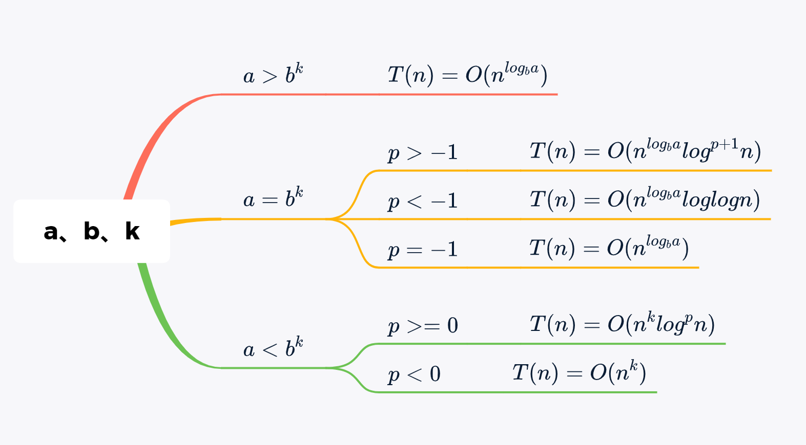

# 算法概论

## 算法的概念

### 什么是算法

算法的设计应满足以下几个目标：正确性、可使用性、可读性、健壮性、高效率与低存储量需求。

算法应具有以下5个重要特性：有限性、确定性、可行性、输入性、输出性。

### 算法和数据结构

算法和数据结构既有联系又有区别。

数据结构是算法设计的基础。算法的操作对象是数据结构，在设计算法时通常要构建适合这种算法的数据结构。数据结构的设计主要是选择数据结构的存储方式，例如确定求解问题中的数据采用数组存储还是采用链表存储等。算法设计就是在选定的存储结构上设计一个好的算法。

另外，数据结构关注的是数据的逻辑结构、存储结构以及基本操作，而算法更多的是关注如何在数据结构的基础上解决实际问题。算法是编程思想，数据结构则是这些思想的逻辑基础。

## 算法分析

通常有两种衡量算法效率的方法：事后统计法和事前分析估算法。前者存在这些缺点：一是必须执行程序，二是存在其他因素掩盖算法本质。所以我们一般采用事前分析估算法来分析算法效率。

### 数学基础

* **算术级数**

$$
\displaystyle \sum^{n}_{k=1}{k} = n (n+1)/2
$$

* **几何级数**

$$
\displaystyle \sum^{n}_{k=0}{x^k} = \frac{x^{n+1} - 1}{x-1}
$$

* **调和级数**

$$
\displaystyle \sum^{n}_{k = 1}{\frac 1 k} = logn
$$

* **其他级数**
$$
\displaystyle \sum^{n}_{i=1}{i^2} = n (n+1)(2n+1)/6
$$

$$
\displaystyle \sum^{n}_{k=1}{2^{k-1}} = 2^n -1
$$

$$
\displaystyle \sum^{n}_{k=1}{logk} = nlogn
$$

### 主要定理

#### 1、分治法主定理

所谓分治算法是把一个问题划分成多个子问题，每个子问题是原问题的一部分，然后执行一些额外的工作来计算最后的答案。

例如，归并排序算法计算两个子问题，每个子问题都是原问题规模的一半，然后利用`O(n)`时间的额外工作完成归并。时间公式为：
$$
T(n) = 2T(\frac{n}{2}) + O(n)
$$

下面的定理可以用来确定分治算法的运行时间。对于一个给定的程序（算法），首先尝试找到问题的递归关系。**如果问题的递归满足下面的公式，那么可以直接算出时间复杂度：**
$$
T(n) = aT(\frac{n}{b}) + O(n^klog^pn)
$$
其中：$a >= 1, b > 1, k >= 0 且 p 是实数$，则：

## 实战演练

