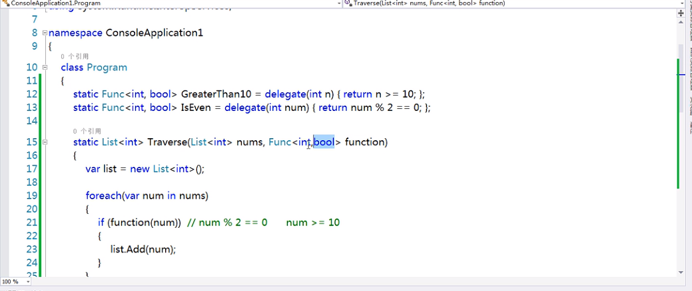

C# 是综合了c/c++ 许多优点，由此衍生出的面向对象的编程语言，所以很多地方都和c/c++一样，这里只记录个人认为有区别的地方，节省篇幅，方便快速上手。

### HelloWorld

```c#
using System;
namespace HelloWorldApplication
{
   class HelloWorld
   {
      static void Main(string[] args)
      {
         /* 我的第一个 C# 程序*/
         Console.WriteLine("Hello World");
         Console.ReadKey();
      }
   }
}
```

> - 程序的第一行 **using System;** - **using** 关键字用于在程序中包含 **System** 命名空间。 一个程序一般有多个 **using** 语句。
>
> - 下一行是 **namespace** 声明。一个 **namespace** 里包含了一系列的类。*HelloWorldApplication* 命名空间包含了类 *HelloWorld*。
>
> - 下一行是 **class** 声明。类 *HelloWorld* 包含了程序使用的数据和方法声明。类一般包含多个方法。方法定义了类的行为。在这里，*HelloWorld* 类只有一个 **Main** 方法。
>
> - 下一行定义了 **Main** 方法，是所有 C# 程序的 **入口点**。**Main** 方法说明当执行时 类将做什么动作。
>
> - 下一行 /*...*/ 将会被编译器忽略，且它会在程序中添加额外的 **注释**。
>
> - Main 方法通过语句
>
>   Console.WriteLine("Hello World"); 
>
>   指定了它的行为。
>
>   *WriteLine* 是一个定义在 *System* 命名空间中的 *Console* 类的一个方法。该语句会在屏幕上显示消息 "Hello World"。
>
> - 最后一行 **Console.ReadKey();** 是针对 VS.NET 用户的。这使得程序会等待一个按键的动作，防止程序从 Visual Studio .NET 启动时屏幕会快速运行并关闭。

> - C# 是大小写敏感的。
> - 所有的语句和表达式必须以分号（;）结尾。
> - 程序的执行从 Main 方法开始。
> - 与 Java 不同的是，文件名可以不同于类的名称。


### // 注释和 /// 注释的区别

**/// 会被编译， // 不会**

所以使用 /// 会减慢编译的速度（但不会影响执行速度）

/// 会在其它的人调用你的代码时提供智能感知

/// 也是一种注释，但是这种注释主要有两种作用：

> -  1.这些注释能够生成一个XML文件。这样呢,看起来会对程序的内容一目了然。
> -  2.以这种方式对你的类，属性，方法等等加上注释之后，当你在其他地方使用以这种方式加上的类，属性，方法等等地时候，黄色的提示框里面会把你写的注释显示出来，是你更加明白你要使用的功能的作用。

```c#
/// <summary>
///定义用户姓名属性，该属性为可读可写属性
/// </summary>
```


### Console.WriteLine

C#中的`Console.WriteLine()`打印的信息如果含有变量，和C语言类似，需要使用占位符，不过比C语言简单，不需要记忆许多占位符标志：

> `{0}`：第一个参数的占位符
>
> `{1}`：第二个参数的占位符
>
> ... 以此类推，不需要考虑参数类型，但是要注意参数顺序

```c#
Console.WriteLine("A:{0}，a:{1}",65,97);		// A:65, a:97
Console.WriteLine("A:{1}，a:{0}",65,97);		// A:97, a:65

```


### string

C# string 字符串的前面可以加 @（称作"逐字字符串"）将转义字符（\）当作普通字符对待，比如：

```c#
string str = @"C:\Windows";
```

等价于：

```c#
string str = "C:\\Windows";
```


###  一些比较重要的运算符

| 运算符   | 描述                                   | 实例                                                         |
| :------- | :------------------------------------- | :----------------------------------------------------------- |
| sizeof() | 返回数据类型的大小。                   | sizeof(int)，将返回 4.                                       |
| typeof() | 返回 class 的类型。                    | typeof(StreamReader);                                        |
| &        | 返回变量的地址。                       | &a; 将得到变量的实际地址。                                   |
| *        | 变量的指针。                           | *a; 将指向一个变量。                                         |
| ? :      | 条件表达式                             | 如果条件为真 ? 则为 X : 否则为 Y                             |
| is       | 判断对象是否为某一类型。               | If( Ford is Car) // 检查 Ford 是否是 Car 类的一个对象。      |
| as       | 强制转换，即使转换失败也不会抛出异常。 | Object obj = new StringReader("Hello"); StringReader r = obj as StringReader; |


### 修饰符

-  **Pubilc** ：任何公有成员可以被外部的类访问。
-   **Private** ：只有同一个类中的函数可以访问它的私有成员。
-   **Protected** ：该类内部和继承类中可以访问。
-   **internal** : 同一个程序集的对象可以访问。
-   **Protected internal** ：3 和 4 的并集，符合任意一条都可以访问。


### 引用传递参数

**ref型参数**

该种类型的参数传递变量地址给方法（引用传递），传递前变量必须初始化。

该类型与out型的区别在与：

> -  1）.ref 型传递变量前，变量必须初始化，否则编译器会报错, 而 out 型则不需要初始化
> -  2）.ref 型传递变量，数值可以传入方法中，而 out 型无法将数据传入方法中。换而言之，ref 型有进有出，out 型只出不进。

**out 型参数**

与 ref 型类似，仅用于传回结果。

out 比起 ref 来说，还有一个用法就是可以作为多返回值来用，都知道函数只能有一个返回值，C#里，如果你想让一个函数有多个返回值，那么OUT能很容易解决。

**注意：**

> 1. out型数据在方法中必须要赋值，否则编译器会报错。
>
>    将代码中的sum1方法的方法体
>
>    * 改为 a+=b; 则编译器会报错。原因：out 型只出不进，在没给 a 赋值前是不能使用的
>
>    * 不对a进行处理；编译器也会报错。原因：out 型数据在方法中必须要赋值。
>
> 2. 重载方法时若两个方法的区别仅限于一个参数类型为ref 另一个方法中为out，编译器会报错，如果将下面的sum1改成sum（重载sum）编译器将会报错。

```c#
class C{
    // ref型参数
    public void sum(ref int a, int b) {
        // ref可以以自己作原料，因为 ref类型的a的数值可以传递过来
        a += b;
    }
    // out型参数
    public void sum1(out int a, int b) {
        // out型只用于传回结果，所以不能使用 a += b;
        // 因为调用该函数时 out 类型的a的数值无法传递过来（只出不进）
        // 也就是说此时a的值还是不确定的，所以a+=b;会报错
        a = b+2;
    }
}
```


### 可空类型 (Nullable)

#### 单问号 ? 与 双问号 ??

> **?** : 单问号用于对` int,double,bool `等无法直接赋值为 null 的数据类型进行 null 的赋值，意思是这个数据类型是 Nullable 类型的。
>
> **??** : 双问号 可用于判断一个变量在为 null 时返回一个指定的值。

```c#
int? i = 3;		// 等同于 Nullable<int> i = new Nullable<int>(3);
int i; //默认值0
int? j; //默认值null
```

C#两个问号的作用是判断??左边的对象是否为 null，如果不为 null 则使用 ?? 左边的对象，如果为 null 则使用 ?? 右边的对象，有点类似三元运算符。

```c#
a = b ?? c		// 如果 b 为 null，则 a = c，如果 b 不为 null，则 a = b。
```


### 数组

```c#
datatype[] arrayName;		//声明一个数组
```

> - *datatype* 用于指定被存储在数组中的元素的类型。
> - *[ ]* 指定数组的秩（维度）。秩指定数组的大小。
> - *arrayName* 指定数组的名称。

声明一个数组不会在内存中初始化数组。当初始化数组变量时，您可以赋值给数组。

数组是一个引用类型，所以您需要使用 **new** 关键字来创建数组的实例。

```c#
double[] balance = new double[10];		// 创建一个数组实例

double[] balance = { 2340.0, 4523.69, 3421.0};		//声明数组同时赋值

int [] marks = new int[5]  { 99,  98, 92, 97, 95};	// 创建并初始化，数组大小5可以省略
```


```c#
 /* 使用foreach输出每个数组元素的值 */
foreach (int j in arr) {
    Console.WriteLine("{0}", j);
}
/* 使用for输出每个数组元素的值 */
for (int i=0; i < n; i++) {
    Console.WriteLine("{0}", arr[i]);
}
```


### 面向对象

#### 封装


#### 继承

同一概念：

- 基类/父类/超类
- 派生/继承
- 派生类/子类

c# 是单一继承，和Java一样。如果想要实现多重继承，就需要使用接口。

C++中支持多重继承。

```c#
class Dog:Animal {	// C#中继承使用 :
    
}
```


#### 多态

多态，简单来说就是一个类型，多种状态。

```c#
	
// 父类定义 虚方法
public virtual void Draw()
{
    Console.WriteLine("执行基类的画图任务");
}

// 子类使用 override重写
public override void Draw()
{
    Console.WriteLine("画一个圆形");
    base.Draw();
}
```


当有一个定义在类中的函数需要在继承类中实现时，可以使用**虚方法**。

虚方法是使用关键字 **virtual** 声明的。

虚方法可以在不同的继承类中有不同的实现。

对虚方法的调用是在运行时发生的。

动态多态性是通过 **抽象类** 和 **虚方法** 实现的。


**多态：**一个接口多个功能。

**静态多态性：**编译时发生函数响应（调用）；

**动态多态性：**运行时发生函数响应。

**静态绑定（早期绑定）：**编译时函数和对象的连接机制。 两种技术实现静态多态性：函数重载/运算符重载。

**函数重载：**在同一范围内对相同函数名有多个定义，可以是参数类型或参数个数的不同，但不许只有返回值类型不同。

**运算符重载：**

关键字 abstract 声明抽象类：用于接口部分类的实现（派生类继承抽象类时，实现完成）。抽象类包含抽象方法，抽象方法可被派生类实现。

抽象类规则：

-  1.不能创建抽象类的实例
- 2.不能在抽象类外定义抽象方法
- 3.不能把抽象类声明为sealed（类前带关键字sealed代表该类是密封类，不能被继承）

关键字virtual声明虚方法:用于方法在继承类中的实现（在不同的继承类中有不同的实现）。

抽象类和虚方法共同实现动态多态性。

注：继承类中的重写虚函数需要声明关键字 override，在方法参数传入中写（类名 形参名）例如 public void CallArea(Shape sh)，意思是传入一个 shape 类型的类。


### 接口

以下实例定义了两个接口 IMyInterface 和 IParentInterface。

如果一个接口继承其他接口，那么实现类或结构就需要实现所有接口的成员。

以下实例 IMyInterface 继承了 IParentInterface 接口，因此接口实现类必须实现 MethodToImplement() 和 ParentInterfaceMethod() 方法：

```c#
using System;

interface IParentInterface
{
    void ParentInterfaceMethod();
}

interface IMyInterface : IParentInterface
{
    void MethodToImplement();
}

class InterfaceImplementer : IMyInterface
{
    static void Main()
    {
        InterfaceImplementer iImp = new InterfaceImplementer();
        iImp.MethodToImplement();
        iImp.ParentInterfaceMethod();
    }

    public void MethodToImplement()
    {
        Console.WriteLine("MethodToImplement() called.");
    }

    public void ParentInterfaceMethod()
    {
        Console.WriteLine("ParentInterfaceMethod() called.");
    }
}
```


### 委托

委托，也叫匿名方法，可以联想C++ 的仿函数。委托可以实现代码的封闭性。

```c#
using System;
using System.Collections.Generic;

namespace HelloWorld {

    class Program {
        
        // 1. 声明委托类型
        delegate bool Function(int num);
        
        // 找到大于10的数
        static Function GreaterThan10 = delegate(int num) { return num > 10; };
        // 找到偶数
        static Function IsEven = delegate(int num) { return num > 10; };
        
        // 2. 修改形参列表
        static List<int> Traverse(List<int> nums, Function function) {
            var list = new List<int>();

            foreach (var num in nums) {
                // 很多情况下只需要改变这里就可以换个功能，
                // 例如 num % 2 == 0， num >= 10等
                // 所以将这个判断条件变成一个匿名函数，也就是委托
                // if (num >= 10) {   
                //     list.Add(num);
                // }
                if (function(num)) {   
                    list.Add(num);
                }
            }
            return list;
        }
         
        static void Main(string[] args) {
            var list1 = Traverse(new List<int>{1, 2, 3, 4, 5}, IsEven);
            var list2 = Traverse(new List<int>{1, 2, 3, 4, 5}, IsEven);
        }
    }
}
```

也可以这样创建委托

```c#
using System;

delegate int NumberChanger(int n);
namespace DelegateAppl
{
   class TestDelegate
   {
      static int num = 10;
      public static int AddNum(int p)
      {
         num += p;
         return num;
      }

      public static int MultNum(int q)
      {
         num *= q;
         return num;
      }
      public static int getNum()
      {
         return num;
      }

      static void Main(string[] args)
      {
         // 创建委托实例
         NumberChanger nc1 = new NumberChanger(AddNum);
         NumberChanger nc2 = new NumberChanger(MultNum);
         // 使用委托对象调用方法
         nc1(25);
         Console.WriteLine("Value of Num: {0}", getNum());
         nc2(5);
         Console.WriteLine("Value of Num: {0}", getNum());
         Console.ReadKey();
      }
   }
}
```


系统已经自带了一些泛型委托，可以直接使用

> Func<int, bool> 第一个是接收参数，第二个是返回参数
>
> Action<int, bool>

也可以利用系统自带的委托，使用Lambda表达式创建委托

```c#
//static Action<int, bool> GreaterThan10 = delegate(int n){return n>10;};
static Action<int, bool> GreaterThan10 = n => n>10;		//lambda表达式，有点像Es6的简写
static Func<int, bool> IsEven = num => num%2==0;	
```




### Lambda表达式


