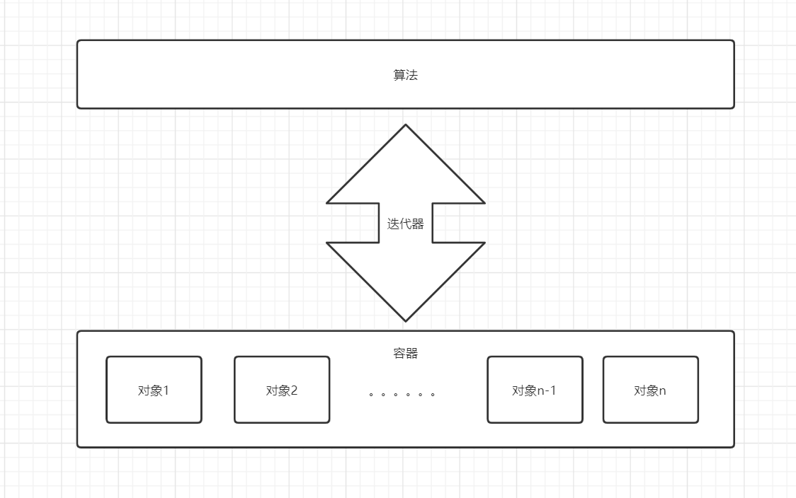

# STL

STL主要由`container(容器)、algorithm(算法)、iterator(迭代器)`三大部分组成。





### 什么是STL算法


> 使用STL算法`sort()`实现整型数组a的递增排序

```c++
#include<algorithm>
using namespace std;

int main() {
	int a[] = { 2, 3, 5, 4, 1 };
	sort(a, a + 5);
	for (int i = 0; i < 5; i++) {
		printf("%d ", a[i]);
	}
	printf("\n");

	return 0;
}
```


### 什么是STL迭代器

| 迭代器                 | 描述                                                         |
| ---------------------- | ------------------------------------------------------------ |
| input_iterator         | 提供读功能的向前移动迭代器，它们可被进行增加(++)，比较与解引用（*）。 |
| output_iterator        | 提供写功能的向前移动迭代器，它们可被进行增加(++)，比较与解引用（*）。 |
| forward_iterator       | 可向前移动的，同时具有读写功能的迭代器。同时具有input和output迭代器的功能，并可对迭代器的值进行储存。 |
| bidirectional_iterator | 双向迭代器，同时提供读写功能，同forward迭代器，但可用来进行增加(++)或减少(--)操作。 |
| random_iterator        | 随机迭代器，提供随机读写功能.是功能最强大的迭代器， 具有双向迭代器的全部功能，同时实现指针般的算术与比较运算。 |
| reverse_iterator       | 如同随机迭代器或双向迭代器，但其移动是反向的。（Either a random iterator or a bidirectional iterator  that moves in reverse direction.）（我不太理解它的行为） |


```cpp
#include<algorithm>
#include<vector>
using namespace std;

int main() {
	vector<int> myVec;

	myVec.push_back(1);
	myVec.push_back(2);
	myVec.push_back(3);
	myVec.push_back(4);

	//使用正向迭代器 it
	for (vector<int>::iterator it = myVec.begin(); it != myVec.end(); it++) {
		printf("%d ", *it);
	}
	printf("\n");

	//使用反向迭代器 rit
	for (vector<int>::reverse_iterator rit = myVec.rbegin(); rit != myVec.rend(); rit++) {
		printf("%d ", *rit);
	}

	printf("\n");

	return 0;
}
```


## 概述

C++中map和unordered_map提供的是一种键值对容器，在实际开发中会经常用到，它跟Python的字典很类似，所有的数据都是成对出现的,每一对中的第一个值称之为关键字(key)，每个关键字只能在map中出现一次；第二个称之为该关键字的对应值(value)。

## map和unordered_map

map是一种有序的容器，底层是用**红黑树**实现的，红黑树是一种自平衡的二叉树，可以保障最坏情况的运行时间，**它可以做到O(logn)时间完成查找、插入、删除元素的操作。**

unordered_map是一种无序的容器，底层是用**哈希表**实现的，哈希表最大的优点是把数据的查找和存储时间都大大降低。

|      | map                                                          | unordered_map                              |
| ---- | ------------------------------------------------------------ | ------------------------------------------ |
| 优点 | 1. 有序性，可应用于有顺序要求的应用中 2. 可保证最坏情况下的运行时间 | 哈希表保证了元素的查找和存储速度都非常的快 |
| 缺点 | 空间占用率高，红黑树的每个节点都需要保存 父节点、子节点和红黑性质，增加了使用空间 | 哈希表的建立比较耗时                       |

关于它们的适用场景，在有顺序要求的场合，肯定是要用map的；如果我们只操作一次，为了保证最坏情况下的运行时间，最好也适用map；而如果是需要经常操作，map肯定是没有unordered_map快的。

因此，除了有顺序要求和有单词操作时间要求的场景下用map，其他场景都使用unordered_map。


## set

c++中set的用法；我觉得很详细了，改到窒息：https://blog.csdn.net/Strawberry_595/article/details/81188509

