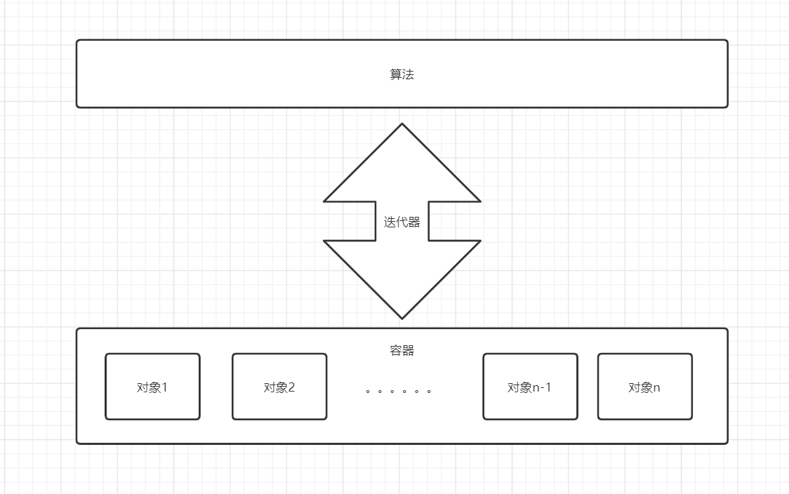

# STL

* 长久以来，软件界一直希望建立一种可重复利用的东西

* C++的**面向对象**和**泛型编程**思想，目的就是**复用性的提升**

* 大多情况下，数据结构和算法都未能有一套标准，导致被迫从事大量重复工作

* 为了建立数据结构和算法的一套标准,诞生了**STL**

## 基本概念

* STL(Standard Template Library,**标准模板库**)
* STL 从广义上分为: **容器(container)、算法(algorithm)、迭代器(iterator)**
* **容器**和**算法**之间通过**迭代器**进行无缝连接。
* STL 几乎所有的代码都采用了模板类或者模板函数



STL大体分为六大组件，分别是:**容器、算法、迭代器、仿函数、适配器（配接器）、空间配置器**

1. 容器：各种数据结构，如vector、list、deque、set、map等,用来存放数据。
2. 算法：各种常用的算法，如sort、find、copy、for_each等
3. 迭代器：扮演了容器与算法之间的胶合剂。
4. 仿函数：行为类似函数，可作为算法的某种策略。
5. 适配器：一种用来修饰容器或者仿函数或迭代器接口的东西。
6. 空间配置器：负责空间的配置与管理。


## STL迭代器

| 迭代器                 | 描述                                                         |
| ---------------------- | ------------------------------------------------------------ |
| input_iterator         | 提供读功能的向前移动迭代器，它们可被进行增加(++)，比较与解引用（*）。 |
| output_iterator        | 提供写功能的向前移动迭代器，它们可被进行增加(++)，比较与解引用（*）。 |
| forward_iterator       | 可向前移动的，同时具有读写功能的迭代器。同时具有input和output迭代器的功能，并可对迭代器的值进行储存。 |
| bidirectional_iterator | 双向迭代器，同时提供读写功能，同forward迭代器，但可用来进行增加(++)或减少(--)操作。 |
| random_iterator        | 随机迭代器，提供随机读写功能.是功能最强大的迭代器， 具有双向迭代器的全部功能，同时实现指针般的算术与比较运算。 |
| reverse_iterator       | 如同随机迭代器或双向迭代器，但其移动是反向的。（Either a random iterator or a bidirectional iterator  that moves in reverse direction.）（我不太理解它的行为） |

```cpp
#include<algorithm>
#include<vector>
using namespace std;

int main() {
	vector<int> myVec;

	myVec.push_back(1);
	myVec.push_back(2);
	myVec.push_back(3);
	myVec.push_back(4);

	//使用正向迭代器 it
	for (vector<int>::iterator it = myVec.begin(); it != myVec.end(); it++) {
		printf("%d ", *it);
	}
	printf("\n");

	//使用反向迭代器 rit
	for (vector<int>::reverse_iterator rit = myVec.rbegin(); rit != myVec.rend(); rit++) {
		printf("%d ", *rit);
	}

	printf("\n");

	return 0;
}
```


### 迭代器运算符

```cpp
*iter			// 返回迭代器iter所指元素的引用
iter->mem    	// 解引用iter并获取该元素名为mem的成员，等价于(*iter).mem 
++iter 			// 令iter指向容器的下一个元素
--iter			// 令iter指向器的上一个元素
iter1 == iter2  // 判断两个迭代器是否相等（是否指向同一个元素，或者同一个容器的尾后迭代器）
iter1 != iter2
*iter1 == *iter2	// 判断两个迭代器所指向的元素是否相同
*iter1 != *iter2 
```


### 迭代器运算

只有空间连续，迭代器才能进行下面的跳跃运算，否则只能进行自增运算。

```cpp
iter + n 		// 返回的迭代器是原迭代器向前移动若干个元素。如果超出容器的范围，则返回迭代器的第一个元素的位置，或者尾元素的下一个位置。     
iter - b 		// 返回的迭代器是原迭代器向后移动若干个元素。如果超出容器的范围，则返回迭代器的第一个元素的位置，或者尾元素的下一个位置。
iter += n		// 迭代器加法赋值语句，将iter + n 赋值给iter  （！！！不能超范围！！！）
iter -= n		// 迭代器减法赋值语句，将iter - n 赋值给iter	（！！！不能超范围！！！）
iter1 - iter2 	// 返回两个迭代器，之间的距离。返回的类型为difference_type,带符号的整数。建议使用auto
>、>= 、<、<=、 ==、 !=	// 判断两个迭代器的位置。必须是同一个容器的迭代器
```


# 顺序容器

顺序容器按照线性次序的位置存储数据，即第一个元素，第二个元素，以此类推。STL提供的顺序容器有`vector`、 `string` 、`deque`、`list`


## vector(向量容器)

它是一个向量类模板，向量容器相当于数组，它存储具有相同数据类型的一组元素。可以从末尾快速地插入与删除元素，快速地随机访问元素，但是在序列中间插入与删除元素较慢，因为需要移动要插入或删除位置后面的所有元素。

如果初始分配的空间不够，当超过空间大小时会重新分配更大的空间（通常按两倍大小扩展），此时需要重新进行大量元素的复制，从而增加了性能开销。


### 构造函数

定义vector容器的几种方式

```cpp
vector<int> v1;		//定义元素为int的向量v1
vector<int> v2(10);		//定义v2, 初始大小为1
vector<double> v3(10, 1.23);	//指定v3的10个初始元素的初值为1.23
vector<int> v4(a, a+5);		//用数组a[0..4] 共5个元素初始化v4
vector<vector<vector<int>>> vec(n1, vector<vector<int>>(n2, vector<int>(n3, 0)));
vector<vector<int>> vec(row, vector<int> (col,1));
```

遍历vector容器的几种方式

```cpp
#include <algorithm>
#include <iostream>
#include <vector>
using namespace std;

int main(int argc, char const *argv[]) {
  vector<int> vect(10, 100);

  printf("\nFirst way\n");
  for (int i = 0; i < vect.size(); ++i) {
    printf(" %d", vect[i]);
  }

  printf("\nSecond way\n");
  for (auto it = vect.begin(); it != vect.end(); it++) {
    printf(" %d", *it);
  }

  printf("\nThird way\n");
  for (vector<int>::iterator it = vect.begin(); it != vect.end(); it++) {
    printf(" %d", *it);
  }
    
  // lamda 表达式
  printf("\nFourth way\n");
  for_each(vect.begin(), vect.end(), [](int i) { printf(" %d", i); });

  printf("\nFifth way\n");
  for (int i : vect) {
    printf(" %d", i);
  }
    
  // 反向迭代器
  for (vector<int>::reverse_iterator rit = vect.rbegin(); rit != vect.rend(); rit++) {
    printf("%d ", *rit);
  }
    
  return 0;
}
```


### 赋值操作

* `vector& operator=(const vector &vec);`//重载等号操作符


* `assign(beg, end);`       //将[beg, end)区间中的数据拷贝赋值给本身。
* `assign(n, elem);`        //将n个elem拷贝赋值给本身。


### 容量和大小

* `empty(); `                            //判断容器是否为空

* `capacity();`                      //容器的容量

* `size();`                              //返回容器中元素的个数

* `resize(int num);`             //重新指定容器的长度为num，若容器变长，则以默认值填充新位置。

  ​					      //如果容器变短，则末尾超出容器长度的元素被删除。

* `resize(int num, elem);`  //重新指定容器的长度为num，若容器变长，则以elem值填充新位置。

  ​				              //如果容器变短，则末尾超出容器长度的元素被删除


### 插入和删除

* `push_back(ele);`                                         //尾部插入元素ele
* `pop_back();`                                                //删除最后一个元素
* `insert(const_iterator pos, ele);`        //迭代器指向位置pos插入元素ele
* `insert(const_iterator pos, int count,ele);`//迭代器指向位置pos插入count个元素ele
* `erase(const_iterator pos);`                     //删除迭代器指向的元素，返回下一个元素的迭代器
* `erase(const_iterator start, const_iterator end);`//删除迭代器从start到end之间的元素
* `clear();`                                                        //删除容器中所有元素

返回值，

```cpp
vector<int> arr = {1, 2, 3, 4};

// 删除arr[2]
arr.erase(arr.begin() + 2);
```


### 数据存取

* `at(int idx); `     //返回索引idx所指的数据
* `operator[]; `       //返回索引idx所指的数据
* `front(); `            //返回容器中第一个数据元素
* `back();`              //返回容器中最后一个数据元素


### 互换容器

* `swap(vec);`  // 将vec与本身的元素互换


### 预留空间

* `reserve(int len);`		//容器预留len个元素长度，预留位置不初始化，元素不可访问。

 


## string（字符串容器）

`string` 是一个保存字符序列的容器，他的所有元素为字符类型，类似于`vector<char>` , 因此除了有字符串的一些常用操作以外，还包含了所有序列容器的操作。字符串的常用操作包括增加、删除、修改、查找、比较、连接、输入、输出等。

string重载了许多运算符，包括`+, +=, <, =, [], <<, >>`等。正是有了这些运算符，使得string实现字符串的操作变得非常方便和简洁。

string 是C++中的字符串。 字符串对象是一种特殊类型的容器，专门设计来操作的字符序列。 不像传统的`c-strings`，只是在数组中的一个字符序列，我们称之为字符数组，而C++字符串对象属于一个类。

**string和char * 区别：**

* char * 是一个指针
* string是一个类，类内部封装了char\*，管理这个字符串，是一个char*型的容器。


### 构造函数

* `string();`          				//创建一个空的字符串 例如: string str;
* `string(const char* s);`	        //使用字符串s初始化
* `string(const string& str);`    //使用一个string对象初始化另一个string对象
* `string(int n, char c);`           //使用n个字符c初始化，这种方式系统内部会创建临时对象，不太推荐

```cpp
const char* buf = "123456";
char cstr[] = "123456789";
string s1(cstr);            // s1: 123456789
string s2(s1);              // s2: 123456789
string s3(cstr, 0, 4);      // cstr从0开始，长度为4的子串赋值给s3
string s4(cstr, 4);         // 默认从0开始
string s5(5, 'A');          // s5: AAAAA
```


### 赋值操作

* `string& operator=(const char* s);`             //char*类型字符串 赋值给当前的字符串
* `string& operator=(const string &s);`         //把字符串s赋给当前的字符串
* `string& operator=(char c);`                          //字符赋值给当前的字符串
* `string& assign(const char *s);`                  //把字符串s赋给当前的字符串
* `string& assign(const char *s, int n);`     //把字符串s的前n个字符赋给当前的字符串
* `string& assign(const string &s);`              //把字符串s赋给当前字符串
* `string& assign(int n, char c);`                  //用n个字符c赋给当前字符串

```cpp
int main(int argc, char const *argv[]) {
  string str;

  // 从0开始，一共2个字符
  // string str("1234", 0, 2);
  str.assign("1234", 0, 2);

  // 默认从0开始，一共两个字符
  // string str("1234", 2);
  str.assign("1234", 2);

  // 使用n个字符来赋值
  // string str(3, 'a');
  str.assign(3, 'a');

  cout << str << endl;

  return 0;
}
```


### 字符串拼接

* `string& operator+=(const char* str);`                   //重载+=操作符
* `string& operator+=(const char c);`                         //重载+=操作符
* `string& operator+=(const string& str);`                //重载+=操作符
* `string& append(const char *s); `                               //把字符串s连接到当前字符串结尾
* `string& append(const char *s, int n);`                 //把字符串s的前n个字符连接到当前字符串结尾
* `string& append(const string &s);`                           //同operator+=(const string& str)
* `string& append(const string &s, int pos, int n);`//字符串s中从pos开始的n个字符连接到字符串结尾


### 查找和替换

* `int find(const string& str, int pos = 0) const;`              //查找str第一次出现位置,从pos开始查找
* `int find(const char* s, int pos = 0) const; `                     //查找s第一次出现位置,从pos开始查找
* `int find(const char* s, int pos, int n) const; `               //从pos位置查找s的前n个字符第一次位置
* `int find(const char c, int pos = 0) const; `                       //查找字符c第一次出现位置
* `int rfind(const string& str, int pos = npos) const;`      //查找str最后一次位置,从pos开始查找
* `int rfind(const char* s, int pos = npos) const;`              //查找s最后一次出现位置,从pos开始查找
* `int rfind(const char* s, int pos, int n) const;`              //从pos查找s的前n个字符最后一次位置
* `int rfind(const char c, int pos = 0) const;  `                      //查找字符c最后一次出现位置
* `string& replace(int pos, int n, const string& str); `       //替换从pos开始n个字符为字符串str
* `string& replace(int pos, int n,const char* s); `                 //替换从pos开始的n个字符为字符串s

* find查找是从左往后，rfind从右往左
* find找到字符串后返回查找的第一个字符位置，找不到返回-1
* replace在替换时，要指定从哪个位置起，多少个字符，替换成什么样的字符串

```cpp
string str = "123456";
str[0] = '9';		// 可以修改单个字符
```


### 比较

* `int compare(const string &s) const; `  //与字符串s比较
* `int compare(const char *s) const;`      //与字符串s比较

字符串比较是按字符的ASCII码进行对比，字符串对比主要是用于比较两个字符串是否相等，判断谁大谁小的意义并不是很大。

- = 返回   0
- \> 返回   1 
- < 返回  -1


### 存取

string中单个字符存取方式有两种

* `char& operator[](int n); `     //通过[]方式取字符
* `char& at(int n);   `                    //通过at方法获取字符


### 插入和删除

* `string& insert(int pos, const char* s);  `                //插入字符串
* `string& insert(int pos, const string& str); `        //插入字符串
* `string& insert(int pos, int n, char c);`                //在指定位置插入n个字符c
* `string& erase(int pos, int n = npos);`                    //删除从Pos开始的n个字符 

```cpp
  std::string str = "to be question";

  str.insert(10, "qiuyeyijian");  //在str的第十位 插入该字符串
  str.insert(10, "that is cool", 8);  //在str的第十位 插入中间字符串的前八位

  str.insert(3, 4, ':');  //在str的第3个位置插入4个字符 :

  str.insert(str.begin(), '0');  // 在str的开始位置插入一个字符0
  // str.insert(0, '0');    error

  str.insert(str.end(), 3, '.');  //在str的结束 插入3个“.”
```


### 子串

* `string substr(int pos = 0, int n = npos) const;`   //返回由pos开始的n个字符组成的字符串

```cpp
string str = "123456";

string s1 = str.substr(3);     // 从下标3开始一直到结尾
string s2 = str.substr(3, 3);  // 从下标3开始，截取长度为3的子串
```


## deque（双端队列容器）

**list和vector结合体，基于原理推理。**

它是一个双端队列模板。双端队列容器由若干个块构成，每个块中元素地址是连续的，块之间的地址是不连续的，系统有一个特定的机制将这些块构成一个整体。用户可以从前面或后面快速地掺入与删除元素，并可以快速地随机访问元素，但在中间位置插入和删除元素较慢。

deque容器不像vector容器那样把所有的元素保存在一个连续的内存块，而是采用多个连续的存储快存放数据元素，所以空间的重新分配要比vector快，因为重新分配空间后原有的元素不需要重新复制。

deque内部工作原理:

deque内部有个**中控器**，维护每段缓冲区中的内容，缓冲区中存放真实数据

中控器维护的是每个缓冲区的地址，使得使用deque时像一片连续的内存空间

* deque容器的迭代器也是支持随机访问的

> **deque与vector区别：**
>
> * vector对于头部的插入删除效率低，数据量越大，效率越低
> * deque相对而言，对头部的插入删除速度回比vector快
> * vector访问元素时的速度会比deque快,这和两者内部实现有关


### 构造函数

* `deque<T>` deqT;                      //默认构造形式
* `deque(beg, end);`                  //构造函数将[beg, end)区间中的元素拷贝给本身。
* `deque(n, elem);`                    //构造函数将n个elem拷贝给本身。
* `deque(const deque &deq);`   //拷贝构造函数

deque容器和vector容器的构造方式几乎一致，灵活使用即可，定义deque双端队列容器的几种方式如下。

```cpp
deque<int> dq1;			// 定义元素为int的双端队列
deque<int> dq2(10);		// 指定dq2的初始大小为10个int元素
deque<double> dq3(10, 1.23);	// 指定dq3 的10个元素的初值为1.23
deque<int> dq4(dq2.begin(), dq2.end());	// 用dq2的所有元素初始化dq4
```


### 赋值操作

* `deque& operator=(const deque &deq); `         //重载等号操作符


* `assign(beg, end);`                                      //将[beg, end)区间中的数据拷贝赋值给本身。
* `assign(n, elem);`                                        //将n个elem拷贝赋值给本身。

```cpp
deque<int> dq1 = {1, 2, 3, 4, 5};

// 直接赋值
deque<int> dq2 = dq1;
// 将[begin, end)区间中的数据拷贝给本身
deque<int> dq3(dq1.begin(), dq1.end());

// 将10个1拷贝给本身
deque<int> dq4;
dq4.assign(10, 1);
```


### 容量和大小

* `deque.empty();`                       //判断容器是否为空

* `deque.size();`                         //返回容器中元素的个数

* `deque.resize(num);`                //重新指定容器的长度为num,若容器变长，则以默认值填充新位置。

  ​			                             //如果容器变短，则末尾超出容器长度的元素被删除。

* `deque.resize(num, elem);`     //重新指定容器的长度为num,若容器变长，则以elem值填充新位置。

  ​                                                     //如果容器变短，则末尾超出容器长度的元素被删除。

### 插入和删除

两端插入操作：

- `push_back(elem);`          //在容器尾部添加一个数据
- `push_front(elem);`        //在容器头部插入一个数据
- `pop_back();`                   //删除容器最后一个数据
- `pop_front();`                 //删除容器第一个数据

指定位置操作：

* `insert(pos,elem);`         //在pos位置插入一个elem元素的拷贝，返回新数据的位置。

* `insert(pos,n,elem);`     //在pos位置插入n个elem数据，无返回值。

* `insert(pos,beg,end);`    //在pos位置插入[beg,end)区间的数据，无返回值。

* `clear();`                           //清空容器的所有数据

* `erase(beg,end);`             //删除[beg,end)区间的数据，返回下一个数据的位置。

* `erase(pos);`                    //删除pos位置的数据，返回下一个数据的位置。


### 数据存取

- `at(int idx); `     //返回索引idx所指的数据
- `operator[]; `      //返回索引idx所指的数据
- `front(); `            //返回容器中第一个数据元素
- `back();`              //返回容器中最后一个数据元素


### 排序

* `sort(iterator beg, iterator end)`  //对beg和end区间内元素进行排序


## list（链表容器）

它是一个**双链表**类模板，可以从任何地方快速插入与删除。它的每个结点之间通过指针链接，不能随机访问元素，为了访问表容器中特定的元素，必须从第1个位置（表头）开始，随着指针从一个元素到下一个元素，直到找到要找的元素。list容器插入元素比vector快，对每个元素单独分配空间，所以不存在空间不够需要重新分配的情况。

* 采用动态存储分配，不会造成内存浪费和溢出
* 链表执行插入和删除操作十分方便，修改指针即可，不需要移动大量元素

* 链表灵活，但是空间(指针域) 和 时间（遍历）额外耗费较大

由于链表的存储方式并不是连续的内存空间，因此链表list中的迭代器只支持前移和后移，属于**双向迭代器**

**List有一个重要的性质，插入操作和删除操作都不会造成原有list迭代器的失效，这在vector是不成立的。**

```cpp
int main(int argc, char const *argv[]) {
  list<int> lst;
  std::unordered_map<int, list<int>::iterator> mp;

  // 存储指向第一个元素迭代器
  lst.push_back(2);
  mp[1] = lst.begin();

  // 头插元素
  lst.push_front(100);

  // 能正确打印，证明迭代器没有失效
  cout << *mp[1] << endl;

  return 0;
}
```


### 构造函数

* `list<T> lst;`                               //list采用采用模板类实现,对象的默认构造形式：
* `list(beg,end);`                           //构造函数将[beg, end)区间中的元素拷贝给本身。
* `list(n,elem);`                             //构造函数将n个elem拷贝给本身。
* `list(const list &lst);`            //拷贝构造函数。

```cpp
list<int> l1;		//定义元素为int的链表l1
list<int> l2(10);
list<double> l3(10, 1.23);
list<int> l4(a, a+5);
```


### 赋值和交换

* `assign(beg, end);`            //将[beg, end)区间中的数据拷贝赋值给本身。
* `assign(n, elem);`              //将n个elem拷贝赋值给本身。
* `list& operator=(const list &lst);`         //重载等号操作符
* `swap(lst);`                         //将lst与本身的元素互换。


### 大小操作

* `size(); `                             //返回容器中元素的个数

* `empty(); `                           //判断容器是否为空

* `resize(num);`                   //重新指定容器的长度为num，若容器变长，则以默认值填充新位置。

  ​					    //如果容器变短，则末尾超出容器长度的元素被删除。

* `resize(num, elem); `       //重新指定容器的长度为num，若容器变长，则以elem值填充新位置。

   //如果容器变短，则末尾超出容器长度的元素被删除。


### 插入和删除

```cpp
push_back(elem);		//在容器尾部加入一个元素
pop_back();				//删除容器中最后一个元素
push_front(elem);		//在容器开头插入一个元素
pop_front();			//在容器开头插入移除一个元素
insert(pos, elem);		//在pos位置插elem元素的拷贝，返回新数据的位置
insert(pos,n,elem);		//在pos位置插入n个elem元素，无返回值
insert(pos, beg, end);	//在pos位置插入[beg, end]区间的数据，无返回值
clear();				//移除容器的所有数据
erase(beg,end);			//删除pos位置的数据，返回下一个数据的位置
erase(pos);				//删除pos位置的数据，返回下一个数据的位置
remove(elem);			//删除容器中所有与elem值匹配的元素
```


### 数据存取

* `front();`        //返回第一个元素。
* `back();`         //返回最后一个元素。


### 反转和排序

* `reverse();`   //反转链表
* `sort();`        //链表排序

```cpp
bool cmp(int a, int b) { return a > b; }

int main(int argc, char const* argv[]) {
  list<int> lst;
  lst.push_back(10);
  lst.push_back(1);
  lst.push_back(8);
  lst.push_back(4);
  lst.push_back(5);

  // 默认从小到大排序
  lst.sort();

  // 可以自定义排序
  lst.sort(cmp);

  for (const auto& x : lst) {
    cout << x << " ";
  }

  return 0;
}
```

### splice

**list容器底层实现是一个带头结点的双向链表，**由于链表的每个节点是单独开辟的，所以链表在移动数据，或者两个链表之间移动数据的时候，直接把节点摘下来，接入到新的位置就可以了，效率比较高。

**splice方法就是将list的元素进行拼接，原理就是改变结点指针的指向，效率比较高。**

```cpp
 // 将list x中的元素全部移动到positionc处
  void splice(iterator position, list & x);

  // 将list x中的由迭代器it指向的元素移动到position处
  void splice(iterator position, list & x, iterator i);

  // 将list x中的由迭代器first到迭代器last这一段元素移动到position处
  void splice(iterator position, list & x, iterator first, iterator last);
```


# 关联容器

关联容器中的每个元素有一个key(关键字)，通过key来存储和读取元素，这些关键字可能与元素在容器的位置有关，所以关联容器不提供顺序容器中的 `front(), push_front(), back(), push_back(), pop_back()`操作。

C++ STL中标准关联容器set, multiset, map, multimap内部采用的就是一种非常高效的平衡检索二叉树：红黑树，也成为RB树(Red-Black Tree)。RB树的统计性能要好于一般平衡二叉树，所以被STL选择作为了关联容器的内部结构。

## set(集合容器) / multiset(多重集合容器)

`set` 和 `multiset `都是集合类模板，其元素值称为关键字。`set`中元素的关键字是唯一的、`multiset`中元素的关键字可以不唯一，而且**默认情况下会对元素按关键字自动进行升序排列**，所以查找速度比较快，同时支持，交，差和并等一些集合上的运算，如果需要集合中的元素允许重复，那么可以使用multiset。

由于`set`中没有相同关键字的元素，在向set中插入元素，如果已经存在则不插入。multiset中允许存在两个相同关键字的元素，在删除操作时删除multiset中值等于elem的所有元素，若删除成功返回删除个数，否则返回0。

* set不可以插入重复数据，而multiset可以
* set插入数据的同时会返回插入结果，表示插入是否成功
* multiset不会检测数据，因此可以插入重复数据

对于自定义数据结构，set必须指定排序规则，才可以插入数据。map 和 set 底层存储结构式都是红黑树

### 构造和赋值

* `set<T> st;`                        //默认构造函数：
* `set(const set &st);`       //拷贝构造函数

* `set& operator=(const set &st);`    //重载等号操作符

```cpp
#include <set>
// 数组
int a[] = {1,2,3,4,5};
set<int> s(a,a+5);
s.insert(a,a+5);

// 迭代器
vector<int> v={1,2,3,4,5};
set<int> s(v.begin(),v.end());
s.insert(v.begin(),v.end());  //如果是vector的话，第一个参数会是插入位置。
```

c++中set的用法；我觉得很详细了，改到窒息：https://blog.csdn.net/Strawberry_595/article/details/81188509

### 大小和交换

* `size();`          //返回容器中元素的数目
* `empty();`        //判断容器是否为空
* `swap(st);`      //交换两个集合容器


### 插入和删除

* `insert(elem);`           //在容器中插入元素。
* `clear();`                    //清除所有元素
* `erase(pos);`              //删除pos迭代器所指的元素，返回下一个元素的迭代器。
* `erase(beg, end);`    //删除区间[beg,end)的所有元素 ，返回下一个元素的迭代器。
* `erase(elem);`            //删除容器中值为elem的元素。


### 查找和统计

* `find(key);`                  //查找key是否存在,若存在，返回该键的元素的迭代器；若不存在，返回set.end();
* `count(key);`                //统计key的元素个数


## map(映射容器) / multimap(多重映射容器)

* map中所有元素都是pair
* pair中第一个元素为key（键值），起到索引作用，第二个元素为value（实值）
* 所有元素都会根据元素的键值自动排序

map 和 multimap 都是映射类模板。映射是实现关键字与值关系的存储结构，可以用一个关键字key来访问相应的数值value。map 和 set 底层存储结构式都是红黑树。

#### pair对组创建

* 成对出现的数据，利用对组可以返回两个数据

* `pair<type, type> p ( value1, value2 );`
* `pair<type, type> p = make_pair( value1, value2 );`

map和multimap中的key和value是一个pair类结构。pair类结构的生命形式如下：

```cpp
struct pair {
    T first;
    T second;
}
```

也就是说，pair中有两个分量（二元组），first为第一个分量（在map中对应key），second为第二个分量（在map中对应value）。例如，定义一个对象p1表示一个平面坐标点并输入坐标

```cpp
pair<double, double> p1;
cin >> p1.first >> p1.second;
```

同时 pair 对`==, !=, <, >, <=, >=`共6个运算符进行重载，提供了按照字典序对元素进行大小比较的比较运算符模板函数。

map/multimap 利用 pair 的 `<`运算符将所有元素（即key-value对）按key的升序排列，以红黑树的形式存储，可以根据key快速找到与之对应的value（查找时间为$O(log_2n)$）。

map中不允许关键字重复出现，支持`[]`运算符。而multimap中允许关键字重复出现，但不支持`[]`运算符。

```cpp
/* 插入 */
  map<int, int> m;
  //第一种插入方式
  m.insert(pair<int, int>(1, 10));
  //第二种插入方式
  m.insert(make_pair(2, 20));
  //第三种插入方式
  m.insert(map<int, int>::value_type(3, 30));
  //第四种插入方式
  m[4] = 40;

/* 删除 */
  m.erase(m.begin());
  m.erase(3);

/* 清空 */
  m.erase(m.begin(), m.end());
  m.clear();
```


### 构造函数

* `map<T1, T2> mp;`                     //map默认构造函数: 
* `map(const map &mp);`             //拷贝构造函数

* `map& operator=(const map &mp);`    //重载等号操作符


### 大小和交换

- `size();`          //返回容器中元素的数目
- `empty();`        //判断容器是否为空
- `swap(mp);`      //交换两个集合容器


### 插入和删除

- `insert(elem);`           //在容器中插入元素。
- `clear();`                    //清除所有元素
- `erase(pos);`              //删除pos迭代器所指的元素，返回下一个元素的迭代器。
- `erase(beg, end);`    //删除区间[beg,end)的所有元素 ，返回下一个元素的迭代器。
- `erase(key);`            //删除容器中值为key的元素。


### 查找和统计

- `find(key);`                  //查找key是否存在,若存在，返回该键的元素的迭代器；若不存在，返回map.end();
- `count(key);`                //统计key的元素个数


判断map容器内是否有某个元素，不能使用`mp[key]`来判断，因为这会插入mp本来不存在的元素。

```cpp
std::unordered_map<int, int> mp;
cout << mp.size() << endl;
if (mp[8] != 0){}
cout << mp.size() << endl;
```


## map和unordered_map

C++中map和unordered_map提供的是一种键值对容器，在实际开发中会经常用到，它跟Python的字典很类似，所有的数据都是成对出现的,每一对中的第一个值称之为关键字(key)，每个关键字只能在map中出现一次；第二个称之为该关键字的对应值(value)。

map是一种有序的容器，底层是用**红黑树**实现的，红黑树是一种自平衡的二叉树，可以保障最坏情况的运行时间，**它可以做到O(logn)时间完成查找、插入、删除元素的操作。**

unordered_map是一种无序的容器，底层是用**哈希表**实现的，哈希表最大的优点是把数据的查找和存储时间都大大降低。

|      | map                                                          | unordered_map                              |
| ---- | ------------------------------------------------------------ | ------------------------------------------ |
| 优点 | 1. 有序性，可应用于有顺序要求的应用中 <br>2. 可保证最坏情况下的运行时间 | 哈希表保证了元素的查找和存储速度都非常的快 |
| 缺点 | 空间占用率高，红黑树的每个节点都需要保存 父节点、子节点和红黑性质，增加了使用空间 | 哈希表的建立比较耗时                       |

- 在有顺序要求的场合，肯定是要用map的；
- 如果我们只操作一次，为了保证最坏情况下的运行时间，最好也适用map；
- 如果是需要经常操作，map肯定是没有unordered_map快的。
- 因此，除了有顺序要求和有单次操作时间要求的场景下用map，其他场景都使用unordered_map。


# 适配器容器

适配器容器是指基于其他容器实现的容器，也就是说适配器容器包含另一个容器作为其底层容器，在底层容器的基础上实现适配器容器的功能，实际上在算法设计中可以将适配器容器作为一般容器来使用。


## stack容器和queue容器

|      | stack                                                        | queue                                                        |
| ---- | ------------------------------------------------------------ | ------------------------------------------------------------ |
| 概念 | stack是一种**先进后出**(First In Last Out,FILO)的数据结构，它只有一个出口 | Queue是一种**先进先出**(First In First Out,FIFO)的数据结构，它有两个出口 |
| 特点 | stack容器是一个栈类模板，不允许顺序遍历，没有`begin(), end(), rbegin(), rend()`这样的用于迭代器的成员函数。 | queue是一个队列类模板，不允许顺序遍历，没有`begin(), end(), rbegin(), rend()`这样的用于迭代器的成员函数。 |

栈的默认的底层容器是deque。用户也可以指定其他的底层容器，例如以下语句指定`st `栈的底层容器是 `vector`

```cpp
stack<string, vector<string>> st;		//第2个参数指定底层容器为vector
```

```cpp
#include<stack>		//包含栈的头文件
#include<queue>		//包含队列的头文件

stack<int> s;		//定义栈
queue<int> q;		//定义队列

s.empty() 	//如果栈为空返回true，否则返回false
s.size()	//返回栈中元素的个数
s.pop() 	//删除栈顶元素但不返回其值
s.top() 	//返回栈顶的元素，但不删除该元素
s.push() 	//在栈顶压入新元素
    
q.empty() 	//如果队列为空返回true，否则返回false
q.size() 	//返回队列中元素的个数
q.pop() 	//删除队列首元素但不返回其值
q.front() 	//返回队首元素的值，但不删除该元素
q.push() 	//在队尾压入新元素
q.back() 	//返回队列尾元素的值，但不删除该元素
```


## priority_queue（优先队列容器）

它是一个优先队列模板。优先队列是一种具有受限访问操作的存储结构，元素可以以任意顺序进入优先队列。一旦元素在优先队列中出队操作将出队列中优先级最高的元素。

优先队列中优先级的高低由队列中数据元素的关系函数（比较运算符）确定，用户可以使用默认的关系函数（对于内置的数据类型，默认关系函数是值越大优先级越高），也可以重载自己编写的关系函数。

优先级队列有3个可输入的参数

```cpp
priority_queue< type, container, function >
```

```cpp
// 由于C++默认为大顶堆，因此在初始化大顶堆时，后两个参数可以省略，
priority_queue< int, vector<int>, less<int> > pq;

// 创建小顶堆
priority_queue< int, vector<int>, greater<int> > pq;

// 使用数组初始化大顶堆
priority_queue<int> pq(arr.begin(),arr.end());
```

priority_queue 有优先级，要求元素可比较。

queue 和 priority_queue 默认的底层存储结构也不同。queue 默认用的是 deque 双端队列，priority_queue 用的是 vector。

priority_queue 实现使用的默认比较是 operator< ,是最大堆数据结构，即队列头元素值最大


# 函数对象

### 基本概念

* 重载**函数调用操作符**的类，其对象常称为**函数对象**
* **函数对象**使用重载的()时，行为类似函数调用，也叫**仿函数**
* 函数对象(仿函数)本质是一个**类**，不是一个函数


### 函数对象使用

仿函数(functor)，就是使一个**类**的使用看上去象一个函数。其实现就是类中实现一个operator()，这个类就有了类似函数的行为，就是一个仿函数类了。

* 函数对象在使用时，可以像普通函数那样调用, 可以有参数，可以有返回值
* **函数对象超出普通函数的概念，函数对象可以有自己的状态**
* 函数对象可以作为参数传递


```cpp
#include <stdio.h>

#include <algorithm>
#include <iostream>
#include <string>
using namespace std;

class Log {
 public:
  void operator()(std::string str) { cout << str << "\n"; }
};

class Cmp {
 public:
  int count = 0;

 public:
  bool operator()(int a, int b) {
    cout << count++ << endl;
    return a > b;
  }
};

int main(int argc, char const *argv[]) {
  // 新建一个对象，该对象的使用和一般函数一样
  Log log;
  log("Hello, word");

  int arr[] = {3, 5, 2, 1, 4, 6, 7};
  // Cmp() 是匿名的函数对象
  sort(arr, arr + 7, Cmp());

  // 显示创建函数对象，作为参数传递
  Cmp cmp;
  sort(arr, arr + 7, cmp);

  return 0;
}

```


## 谓词

* 返回bool类型的**仿函数**称为**谓词**
* 如果operator()接受一个参数，那么叫做一元谓词
* 如果operator()接受两个参数，那么叫做二元谓词

```cpp
// 参数只有一个的谓词，称为一元谓词
class GreaterFive{
	bool operator()(int val) {
		return val > 5;
	}
};

//参数只有两个的谓词，称为二元谓词
class MyCompare {
public:
    bool operator()(int num1, int num2) {
        return num1 > num2;
    }
};
```


## 内建函数对象

STL内建了一些函数对象，使用内建函数对象，需要引入头文件 `#include<functional>`。这些函数对象分为算术仿函数、关系仿函数、逻辑仿函数。这些仿函数所产生的对象，用法和一般函数完全相同


### 算术仿函数

实现四则运算，其中negate是一元运算，其他都是二元运算。

| 函数原型                            | 含义       |
| ----------------------------------- | ---------- |
| `template<class T> T plus<T>`       | 加法仿函数 |
| `template<class T> T minus<T>`      | 减法仿函数 |
| `template<class T> T multiplies<T>` | 乘法仿函数 |
| `template<class T> T divides<T>`    | 除法仿函数 |
| `template<class T> T modulus<T>`    | 取模仿函数 |
| `template<class T> T negate<T>`     | 取反仿函数 |


### 关系仿函数

实现关系对比

| 函数原型                                  | 含义      |
| ----------------------------------------- | --------- |
| `template<class T> bool equal_to<T>`      | 等于      |
| `template<class T> bool not_equal_to<T>`  | 不等于    |
| `template<class T> bool greater<T>`       | 大于      |
| `template<class T> bool greater_equal<T>` | 大于等于  |
| `template<class T> bool less<T>`          | 小于      |
| `template<class T> bool less_equal<T>`    | /小于等于 |


### 逻辑仿函数

实现逻辑运算

| 函数原型                                | 含义   |
| --------------------------------------- | ------ |
| `template<class T> bool logical_and<T>` | 逻辑与 |
| `template<class T> bool logical_or<T>`  | 逻辑或 |
| `template<class T> bool logical_not<T>` | 逻辑   |


# 常用算法

* 算法主要是由头文件`<algorithm>` `<functional>` `<numeric>`组成。

* `<algorithm>`是所有STL头文件中最大的一个，范围涉及到比较、 交换、查找、遍历操作、复制、修改等等
* `<numeric>`体积很小，只包括几个在序列上面进行简单数学运算的模板函数
* `<functional>`定义了一些模板类,用以声明函数对象。

## 遍历

| 函数      | 功能                         |
| --------- | ---------------------------- |
| for_each  | 实现遍历容器                 |
| transform | 搬运容器的元素到另一个容器中 |


### for_each

实现遍历容器

```cpp
// beg 开始迭代器，end 结束迭代器，_func 函数或者函数对象
for_each(iterator beg, iterator end, _func); 
```

```cpp
vector<int> v = {1, 2, 3, 4, 5};
std::for_each(v.begin(), v.end(), [](int value) { cout << value << " "; });
```


### transform

搬运容器的元素到另一个容器中

```cpp
transform(iterator beg1, iterator end1, iterator beg2, _func);
```

```cpp
vector<int> v1 = {1, 2, 3, 4, 5};

//  搬运的目标容器必须要提前开辟空间，否则无法正常搬运
vector<int> v2(5, 0);

// 将v1中的元素乘以2,搬运到v2中
std::transform(v1.begin(), v1.end(), v2.begin(),
               [](int value) { return value * 2; });
```


## 查找

| 函数名        | 功能               |
| ------------- | ------------------ |
| find          | 查找元素           |
| find_if       | 按条件查找         |
| adjacent_find | 查找相邻重复元素   |
| binary_search | 二分查找           |
| count         | 统计元素个数       |
| count_if      | 按条件统计元素个数 |

对于自定义的数据类型的查找，需要重载`==`运算符

```cpp
class Person {
 public:
  string m_Name;
  int m_Age;

 public:
  Person(string name, int age) : m_Name(name), m_Age(age) {}
  bool operator==(const Person& p) {
    return this->m_Age == p.m_Age && this->m_Name == p.m_Name ? true : false;
  }
};
```


### find

按值查找元素，找到返回指定位置迭代器，找不到返回结束迭代器位置

```cpp
// beg 开始迭代器，end 结束迭代器，value 查找的元素
find(iterator beg, iterator end, value); 
```

```cpp
vector<int> v1 = {1, 2, 3, 4, 5};

int t = std::find(v1.begin(), v1.end(), 5) - v1.begin();
if (it != v.end()) {
    cout << "找到了\n";
}
```


### find_if

find_if按条件查找使查找更加灵活，提供的仿函数可以改变不同的策略。找到返回指定位置迭代器，找不到返回结束迭代器位置

```cpp
// beg 开始迭代器，end 结束迭代器，_Pred 函数或者谓词（返回bool类型的仿函数）
find_if(iterator beg, iterator end, _Pred);
```

```cpp
bool gt(const int& a) { return a > 4; }

int main(int argc, char const* argv[]) {
  vector<int> v = {1, 2, 3, 4, 5};

  // 找到大于4的元素下标
  int t = std::find_if(v.begin(), v.end(), gt) - v.begin();

  return 0;
}
```


### adjacent_find

查找相邻重复元素，返回相邻元素的第一个位置的迭代器

```cpp
// // beg 开始迭代器，end 结束迭代器
adjacent_find(iterator beg, iterator end); 
```

```cpp
vector<int> v1 = {1, 2, 3, 4, 5, 5};

int t = std::adjacent_find(v1.begin(), v1.end()) - v1.begin();
cout << t;
```


### binary_search

查找指定的元素，查到 返回true  否则false。注意: 在无序序列中不可用

```cpp
// beg 开始迭代器，end 结束迭代器，value 查找的元素
bool binary_search(iterator beg, iterator end, value);  
```

```cpp
vector<int>v = {2, 5, 8, 9, 10, 3, 6};
// 查找的容器中元素必须的有序序列
std::sort(v.begin(), v.end());
//二分查找
bool ret = std::binary_search(v.begin(), v.end(),2);
```


### count

统计元素出现次数，**统计自定义数据类型时候，需要配合重载 `operator==`**

```cpp
// beg 开始迭代器，end 结束迭代器，value 统计的元素
count(iterator beg, iterator end, value);
```

```cpp
vector<int>v = {2, 5, 8, 9, 10, 3, 4};
int num = count(v.begin(), v.end(), 4);
```

```cpp
#include <algorithm>
#include <string>
#include <vector>
using namespace std;

int main() {
  Person p1("Jack", 35);
  Person p2("Rose", 35);
  Person p3("Bob", 35);

  vector<Person> v1 = {p1, p2, p3};

  int num = std::count(v1.begin(), v1.end(), p1);
  cout << num << " ";
  return 0;
}
```


### count_if

按条件统计元素出现次数

```cpp
// beg 开始迭代器，end 结束迭代器，_Pred 函数或者谓词（返回bool类型的仿函数）
count_if(iterator beg, iterator end, _Pred); 
```

```cpp
int main() {
  Person p1("Jack", 18);
  Person p2("Rose", 19);
  Person p3("Bob", 20);

  vector<Person> v1 = {p1, p2, p3};

  int num = std::count_if(v1.begin(), v1.end(),
                          [](Person& p) { return p.m_Age > 19; });

  cout << num << " ";
  return 0;
}
```


### lower_bound()和upper_bound()

`lower_bound()`和`upper_bound()`需要用在一个有序数组或容器中。如果是数组则返回该位置的指针，如果是容器则返回该位置的迭代器。

`lower_bound( begin,end,num)`：从数组的begin位置到end-1位置二分查找**第一个大于或等于num的数字**，找到返回该数字的地址，不存在则返回end。通过返回的地址减去起始地址begin,得到找到数字在数组中的下标。

`upper_bound( begin,end,num)`：从数组的begin位置到end-1位置二分查找**第一个大于num的数字**，找到返回该数字的地址，不存在则返回end。通过返回的地址减去起始地址begin,得到找到数字在数组中的下标。

`lower_bound( begin,end,num,greater<type>() )`：从数组的begin位置到end-1位置二分查找**第一个小于或等于num的数字**，找到返回该数字的地址，不存在则返回end。通过返回的地址减去起始地址begin,得到找到数字在数组中的下标。

`upper_bound( begin,end,num,greater<type>() )`：从数组的begin位置到end-1位置二分查找**第一个小于num的数字**，找到返回该数字的地址，不存在则返回end。通过返回的地址减去起始地址begin,得到找到数字在数组中的下标。

```cpp
int main(int argc, char const* argv[]) {
  vector<int> v = {1, 3, 100, 6, 7, 55, 4, 4, 10, 10};
  int arr[10] = {1, 3, 100, 6, 7, 55, 4, 4, 10, 10};
  std::sort(v.begin(), v.end());

  // 找到数组中第一个大于或者等于10的元素位置
  int pos1 = lower_bound(v.begin(), v.end(), 10) - v.begin();
  // 找到数组中第一个大于10的元素位置
  int pos2 = upper_bound(arr, arr + 10, 10) - arr;
  // 找到数组中第一个小于或者等于10的元素位置
  int pos3 = lower_bound(v.begin(), v.end(), 10, greater<int>()) - v.begin();
  // 找到数组中第一个小于10的元素位置
  int pos4 = upper_bound(arr, arr + 10, 10, greater<int>()) - arr;

  return 0;
}
```


## 排序

### sort

对容器内元素进行排序，按值查找元素，找到返回指定位置迭代器，找不到返回结束迭代器位置

```cpp
// beg 开始迭代器，end 结束迭代器，_Pred 函数或者谓词（返回bool类型的仿函数）
sort(iterator beg, iterator end, _Pred);  
```

```cpp
std::sort(v.begin(), v.end(), greater<int>());
```


### random_shuffle

洗牌，指定范围内的元素随机调整次序

`random_shuffle(iterator beg, iterator end);  `

`random_shuffle`在C ++ 14中已弃用，在C ++ 17中已完全删除。

您需要使用`shuffle`，它将随机生成器作为参数。

```cpp
std::random_device rd;
std::mt19937 g(rd());

vector<int> v = {1, 2, 3, 4, 5};

std::shuffle(v.begin(), v.end(), g);
```


### merge

两个容器元素合并，并存储到另一容器中。注意: 两个容器必须是**有序的**

```cpp
merge(iterator beg1, iterator end1, iterator beg2, iterator end2, iterator dest);  
```

### reverse

将容器内元素进行反转

```cpp
// beg 开始迭代器，end 结束迭代器
reverse(iterator beg, iterator end);
```

## 算术生成

### accumulate

accumulate使用时头文件注意是 numeric，这个算法很实用

算术生成算法属于小型算法，使用时包含的头文件为 `#include <numeric>`

- `accumulate` 计算容器元素累计总和
- `fill` 向容器中添加元素

```cpp
// 计算容器元素累计总和
// beg 开始迭代器，end 结束迭代器，value 起始值
accumulate(iterator beg, iterator end, value); 
```


### fill

向容器中填充指定的元素

```cpp
// beg 开始迭代器，end 结束迭代器，value 填充的值
fill(iterator beg, iterator end, value);  
```


## 集合操作

### set_intersection

求两个容器的交集，两个集合必须是有序序列

```cpp
// beg1 容器1开始迭代器, end1 容器1结束迭代器, beg2 容器2开始迭代器. end2 容器2结束迭代器, dest 目标容器开始迭代器
set_intersection(iterator beg1, iterator end1, iterator beg2, iterator end2, iterator dest);  
```

* 求交集的两个集合必须的有序序列
* 目标容器开辟空间需要从**两个容器中取小值**
* set_intersection返回值既是交集中最后一个元素的位置

### set_union

求两个集合的并集，两个集合必须是有序序列

```cpp
// beg1 容器1开始迭代器, end1 容器1结束迭代器, beg2 容器2开始迭代器. end2 容器2结束迭代器, dest 目标容器开始迭代器
set_union(iterator beg1, iterator end1, iterator beg2, iterator end2, iterator dest);  
```

- 求并集的两个集合必须的有序序列
- 目标容器开辟空间需要**两个容器相加**
- set_union返回值既是并集中最后一个元素的位置

### set_difference

求两个集合的差集，两个集合必须是有序序列

```cpp
// beg1 容器1开始迭代器, end1 容器1结束迭代器, beg2 容器2开始迭代器. end2 容器2结束迭代器, dest 目标容器开始迭代器
set_difference(iterator beg1, iterator end1, iterator beg2, iterator end2, iterator dest); 
```

- 求差集的两个集合必须的有序序列
- 目标容器开辟空间需要从**两个容器取较大值**
- set_difference返回值既是差集中最后一个元素的位置

## 拷贝和替换

| 函数       | 功能                                     |
| ---------- | ---------------------------------------- |
| copy       | 容器内指定范围的元素拷贝到另一容器中     |
| replace    | 将容器内指定范围的旧元素修改为新元素     |
| replace_if | 容器内指定范围满足条件的元素替换为新元素 |
| swap       | 互换两个容器的元素                       |

### copy

容器内指定范围的元素拷贝到另一容器中。利用copy算法在拷贝时，**目标容器记得提前开辟空间**

```cpp
// 按值查找元素，找到返回指定位置迭代器，找不到返回结束迭代器位置
// beg 开始迭代器，end 结束迭代器，dest 目标起始迭代器
copy(iterator beg, iterator end, iterator dest); 
```

```c++
#include <algorithm>

vector<int> v1(10, 5);
vector<int> v2(10);
std::copy(v1.begin(), v1.end(), v2.begin());
```


### replace

将容器内指定范围的旧元素修改为新元素，replace会替换区间内满足条件的元素

```cpp
// beg 开始迭代器，end 结束迭代器，oldvalue 旧元素，newvalue 新元素
replace(iterator beg, iterator end, oldvalue, newvalue);  
```


### replace_if

将区间内满足条件的元素，替换成指定元素，可以利用仿函数灵活筛选满足的条件

```cpp
// beg 开始迭代器，end 结束迭代器，_pred 谓词，newvalue 替换的新元素
replace_if(iterator beg, iterator end, _pred, newvalue);  
```


### swap

swap交换容器时，注意交换的容器要同种类型

```cpp
// 互换两个容器的元素
swap(container c1, container c2); 
```


# STL应用

## 存放主数据

算法设计的重要步骤是设计数据的存储结构，除非特别指定，程序员可以采用STL中的容器存放主要数据，选择何种容器不仅要考虑数据的类型，还要考虑数据的处理过程。

> 有一段英文由若干个单词组成，单词之间用一个空格分隔。编写程序提取其中的所有单词。
>
> 输入：The following code computes the intersection of two arrays
>
> 输出：
>
> The
>
> following
>
> code
>
> ...

```cpp
#include<vector>
#include<string>
#include<iostream>
//有的编译器不能使用printf，所以需要包含stdio.h头文件
#include<stdio.h>
using namespace std;

void splite(string str, vector<string>& words) {
	// 初始化一个空字符串
	string word = "";
	// 单词开始的位置
	unsigned int wordStart = 0;
	// 单词结束的位置， 如果没有找到空格就返回-1
	unsigned int wordEnd = str.find(" ");

	while (wordEnd != -1) {
		// 提取当前单词
		word = str.substr(wordStart, wordEnd - wordStart);
		// 保存这个单词
		words.push_back(word);
		// 继续寻找下一个单词开始和结束位置
		wordStart = wordEnd + 1;
		wordEnd = str.find(" ", wordStart);
	}

	// 最后一个单词单独提取
	if (wordStart < str.length() - 1) {
		words.push_back(str.substr(wordStart));
	}

}

int main() {

	string str = "The following code computes the intersection of two arrays";
	vector<string> words;
	// 调用单词分割函数
	splite(str, words);
	for (vector<string>::iterator it = words.begin(); it != words.end(); it++) {
		//cout << *it << endl;
		printf("%s\n", (*it).c_str());
	}


	return 0;
}
```


## 存放临时数据

在算法设计中有时需要存放一些临时数据，通常情况是，如果后存入的元素先处理，可以使用stack（栈）容器；如果先存入的元素先处理，可以使用queue（队）容器；如果元素的处理顺序按某个优先级进行，则可以使用priority_queue（优先队列）容器。

> 设计一个算法，判断一个含有`(), [], {}`3种类型括号的表达式中所有括号是否匹配。
>
> 示例1：
>
> 输入：`(a + [b-c] +d)`
>
> 输出：`(a + [b-c] +d)`中括号匹配
>
> 示例2：
>
> 输入：`(a + [b-c} +d)`
>
> 输出：`(a + [b-c} +d)`中括号不匹配

```cpp
#include<stack>
#include<string>
#include<iostream>
//有的编译器不能使用printf，所以需要包含stdio.h头文件
#include<stdio.h>
using namespace std;

bool isMatch(string str) {
	stack<char> st;
	for (int i = 0; i < str.length(); i++) {
		if (str[i] == '(' || str[i] == '[' || str[i] == '{') {
			st.push(str[i]);
		}
		else if (str[i] == ')') {
			// 若与栈顶元素相匹配，则弹出栈顶元素，否则返回false
			if (st.top() == '(') {
				st.pop();
			}
			else {
				return false;
			}
		}
		else if (str[i] == ']') {
			// 若与栈顶元素相匹配，则弹出栈顶元素，否则返回false
			if (st.top() == '[') {
				st.pop();
			}
			else {
				return false;
			}
		}
		else if (str[i] == '}') {
			// 若与栈顶元素相匹配，则弹出栈顶元素，否则返回false
			if (st.top() == '{') {
				st.pop();
			}
			else {
				return false;
			}
		}
		
	}
	// 如果之前都没有返回false, 则说明都匹配，返回true
	return true;
}

int main() {
	string str1 = "(a + [ b - c] + d)";
	string str2 = "(a + [ b - c} + d)";

	isMatch(str1) ? printf("%s 中括号匹配\n", str1.c_str()) : printf("%s 中括号不匹配\n", str1.c_str());
	isMatch(str2) ? printf("%s 中括号匹配\n", str2.c_str()) : printf("%s 中括号不匹配\n", str2.c_str());
	return 0;
}
```


## 检测数据元素的唯一性

> 设计一个算法判断字符串str中的每个字符是否唯一。例如，“abc”的每个字符是唯一的，算法返回true，而“accb”中的字符‘c’不是唯一的，算法返回false。

```cpp
bool isUnique(string& str) {
	map<char, int> myMap;
	for (int i = 0; i < str.length(); i++) {
        // 以str[i]作为key,第一次自增之后value为1,
        // 之后如果再凭借key找到这个元素，使其自增，则说明重复了
		myMap[str[i]]++;
		if (myMap[str[i]] > 1) {
			return false;
		}
	}
	return true;
}
```


