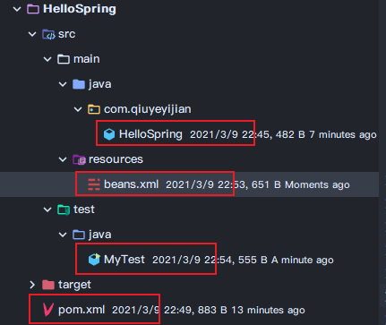

# Spring

* Spring是一个开源的免费的框架（容器）
* 轻量级的、非入侵式的框架
* 控制反转、面向切面编程
* 支持事务处理，对框架整合的支持

Spring就是一个轻量级的控制反转（IOC）和面向切面编程（AOP）的框架。


## 组成


## IOC本质

控制反转IOC(Inversion of Control)，是一种设计思想，DI(依赖注入)是实现IOC的一种方法，没有IOC的程序中，我们使用面向对象那编程，对象的创建于对象的依赖关系完全硬编码在程序中，对象的创建由自己控制，控制反转后将对象的创建转移给第三方。

所谓控制反转就是：获得依赖对象的方式反转了。

控制反转是一种通过描述（XML或注解）并通过第三方去生产或获取特定对象的方式。在Spring中实现控制反转的是IOC容器，其实现方法是依赖注入（Dependency Injection， DI）


## HelloSpring

新建一个Maven工程，下面先使用XML配置的方式感受一下Spring，后期将会使用更方便的注解功能。




**pom.xml**

加入依赖

```xml
<dependencies>
        <dependency>
            <groupId>org.springframework</groupId>
            <artifactId>spring-webmvc</artifactId>
            <version>5.2.9.RELEASE</version>
        </dependency>
</dependencies>
```

**HelloSpring.java**

```java
package com.qiuyeyijian;

public class HelloSpring {
    private String name;

    public HelloSpring() {
    }

    public HelloSpring(String name) {
        this.name = name;
    }

    public String getName() {
        return name;
    }
    
    // 必须实现set方法，因为控制反转就是利用set实现的
    public void setName(String name) {
        this.name = name;
    }

    @Override
    public String toString() {
        return "Hello{" +
                "name='" + name + '\'' +
                '}';
    }
}

```

**beans.xml**

```xml
<?xml version="1.0" encoding="UTF-8"?>
<beans xmlns="http://www.springframework.org/schema/beans"
       xmlns:xsi="http://www.w3.org/2001/XMLSchema-instance"
       xsi:schemaLocation="http://www.springframework.org/schema/beans http://www.springframework.org/schema/beans/spring-beans.xsd">

    <!--使用Spring来创建对象，在Spring这些都称之为Bean-->
    <!--
        bean = new 对象();
        id = 变量名
        class = new的对象那个
		name 也是取别名，可以同时取多个别名
        property = 属性值
            ref: 引用已经创建好的对象那个
            value: 具体的属性值
    -->
    <bean id="helloSpring" class="com.qiuyeyijian.HelloSpring">
        <property name="name" value="HelloSpring"/>
    </bean>
    
    <!-- 起个别名-->
    <alias name="user" alias="userAnotherName"/>
</beans>
```

**MyTest.java**

```java
public class MyTest {
    public static void main(String[] args) {
        // 获取Spring的上下文对象
        ApplicationContext context = new ClassPathXmlApplicationContext("beans.xml");
        // 我们的对象现在都在Spring中管理了，如果要使用，直接去取出来
        Object helloSpring = context.getBean("helloSpring");
        System.out.println(helloSpring.toString());
    }
}
```


## Spring xml配置

### 别名

```xml
<alias name="user" alias="userAnotherName"/>
```


### Bean配置

```xml
<!--使用Spring来创建对象，在Spring这些都称之为Bean-->
    <!--
        id bean的唯一标识符，相当于对象名
        class = new的对象那个
		name 也是取别名，可以同时取多个别名
        property = 属性值
            ref: 引用已经创建好的对象那个
            value: 具体的属性值
    -->
    <bean id="helloSpring" class="com.qiuyeyijian.HelloSpring">
        <property name="name" value="HelloSpring"/>
    </bean>
```


### Import

项目中有多个人开发，一般用于导入不同开发人员的配置文件到总的配置文件中

```xml
<import resource="beans2.xml"/>
```


## 依赖注入DI

* 构造器注入
* set注入（重点）
* 其他方式

### set注入

依赖：bean对象的创建依赖于容器

注入：bean对象中的所有属性有容器来注入


## Bean的自动装配

在Spring中有三种装配方式

* 在xml显示配置
* 在java显示配置
* 隐式地自动装配Bean【重要】

### byName

自动在容器上下文中查找和自己对象set方法后面的值对应的bean id

需要保证所有bean的id唯一，并且这个bean需要和自动注入的属性的set方法的值一致

```xml
 <bean id="people" class="com.qiuyeyijian.People" autowire="byName">
        <property name="name" value="秋叶依剑"/>
<!--        <property name="dog" ref="dog"/>-->
    </bean>
```


### byType

会自动在容器上下文中查找，和自己对象属性类型相同的bean

需要保证所有bean的Class唯一，并且需要和自动注入的属性类型一致

```xml
 <bean id="people" class="com.qiuyeyijian.People" autowire="byType">
        <property name="name" value="秋叶依剑"/>
<!--        <property name="dog" ref="dog"/>-->
    </bean>
```


### 使用注解自动装配

jdk1.5开始支持注解，Spring2.5就支持注解了


### @Autowired

直接在属性上使用即可！也可以在set方式上使用

使用Autowired我们可以不用编写set方法，前提是你这个自动装配的属性在IOC容器中存在，且符合名字byName

```xml
@Nullable	 // 说明这个字段可以为空
```

如果显示地定义了Autowired的require属性为false，说明这个对象可以为null，否则不允许为空

```java
@Autowired(require= false)
```


还可以使用`@Qualifier(value = xxx)`来配合`@Autowired`来使用


### @Resource 和 @Autowired

都是用来自动装配的，都可以放在属性字段上

@Autowired 通过byType的方式实现

@Resource默认通过byName，如果不行则通过byType，都不行则报错


## 使用注解开发


@Component 有几个衍生注解，我们在Web开发中，会按照MVC三层架构分层

* dao: @Repository
* service: @Service
* controller: @Controller

这四个注解功能都是一样的，都是代表将某个类注册到Spring中，装配Bean


## 动态代理

动态代理的好处

* 可以使真实角色更加纯粹，不用去关注一些公共业务
* 公共也就交给了代理角色，实现了业务分工
* 公共业务发生扩展时，方便集中管理
* 一个动态代理类代理的是一个接口，一般就是对应的一类业务
* 一个动态代理类可以代理多个类，只要这些类实现了同一个接口


### 案例


**公共接口 People**

```java
public interface People {
    public void learn();
    public void play();
}
```

**学生类 Student**

```java
public class Student implements People {

    public void learn() {
        System.out.println("学生在学习");
    }

    public void play() {
        System.out.println("学生在玩!");
    }
}
```


**老师类 Teacher**

```java
public class Teacher implements People{
    public void learn() {
        System.out.println("老师在学习");
    }

    public void play() {
        System.out.println("老师在玩！");
    }
}
```


**代理类 ProxyInvocationHandler**

```java
public class ProxyInvocationHandler implements InvocationHandler {

    // 被代理的接口
    private Object target;

    public void setTarget(Object target) {
        this.target = target;
    }

    // 通过反射生成代理类，代理目标对象的接口
    public Object getProxy() {
        return Proxy.newProxyInstance(this.getClass().getClassLoader(),
                target.getClass().getInterfaces(), this);
    }

    // 处理代理实例，并返回结果
    @Override
    public Object invoke(Object proxy, Method method, Object[] args) throws Throwable {
        System.out.println("通过代理执行"+method.getName()+"的方法！");
        return method.invoke(target, args);
    }
}
```


**测试类 Test**

```java
public class Test {
    // 一个动态代理类代理的是一个接口
    public static void main(String[] args) {
        // 真实角色
        Student student = new Student();
        Teacher teacher = new Teacher();
        // 创建代理代理角色
        ProxyInvocationHandler pih = new ProxyInvocationHandler();
        // 设置要代理的学生对象
        pih.setTarget(student);
        // 动态生成代理类，返回的是目标对象实现的接口类
        People proxy = (People) pih.getProxy();
        // 通过代理对象的接口执行方法
        proxy.learn();

        //代理老师对象
        pih.setTarget(teacher);
        proxy = (People) pih.getProxy();
        proxy.play();

    }
}
```


## 声明式事务

要么都成功，要么都失败！

事务的ACID原则：

* 原子性
* 一致性
* 隔离性
  * 多个业务可能操作同一个资源，防止数据损坏
* 持久性
  * 事务一旦提交，无论系统发生什么问题，结果都不会再被影响，被持久化地写到存储器中


