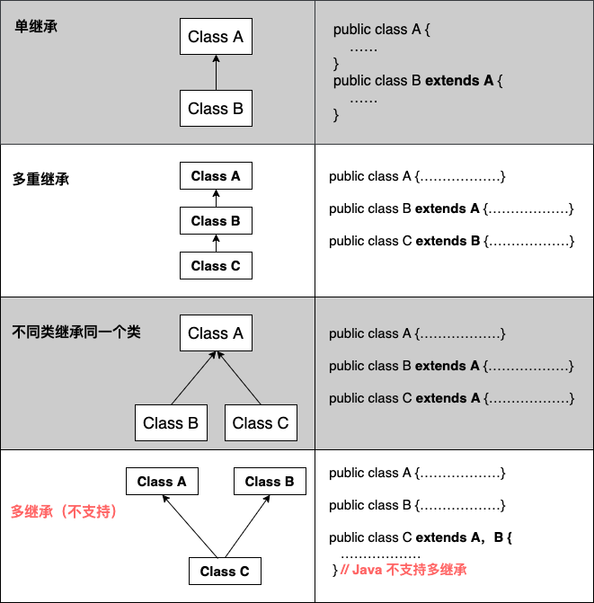

## printf 输出

``` java
double d = 345.678;
String s = "hello!"; 
int i = 1234;
//"%"表示进行格式化输出，"%"之后的内容为格式的定义。
System.out.printf("%f",d);//"f"表示格式化输出浮点数。
System.out.printf("%9.2f",d);//"9.2"中的9表示输出的长度，2表示小数点后的位数。
System.out.printf("%+9.2f",d);//"+"表示输出的数带正负号。
System.out.printf("%-9.4f",d);//"-"表示输出的数左对齐（默认为右对齐）。
System.out.printf("%+-9.3f",d);//"+-"表示输出的数带正负号且左对齐。
System.out.printf("%d",i);//"d"表示输出十进制整数。
System.out.printf("%o",i);//"o"表示输出八进制整数。
System.out.printf("%x",i);//"d"表示输出十六进制整数。
System.out.printf("%#x",i);//"d"表示输出带有十六进制标志的整数。
System.out.printf("%s",s);//"d"表示输出字符串。
System.out.printf("输出一个浮点数：%f，一个整数：%d，一个字符串：%s",d,i,s);//可以输出多个变量，注意顺序。
System.out.printf("字符串：%2$s，%1$d的十六进制数：%1$#x",i,s);//"X$"表示第几个变量。
```


## InputStream InputStreamReader BufferedReader 区别

### IputStream 和 OutputStream

**InputStream:** 表示输入字节流所有类的超类， 一般我们使用它的子类， 如FileInputStream等

**OutputStream:** 表示输出字节流所有类的超类。输出流接收输出字节并将他们发送到某个接收器。一般我们使用它的子类， 如FileOutputStream

### InputStreamReader 和 OutputStreamWriter

**InputStreamReader：** 从字节流到字符流的桥接器，它读取字节并使用指定字符将他们解码为字符charset。他使用的字符集可以通过名称指定， 也可以明确指定， 或者可以接收平台的默认字符集。

每次调用一个InputStreamReader的read() 方法都可能导致从底层字节输入流中读取一个或多个字节为了实现字节到字符的有效转换， 可以从基础流中提取比满足当前读取操作所需的更多字节。为了获得最高效率， 考虑在BufferedReader中包装InputStreamReader

```java
BufferedReader in = new BufferedReader(new InputStreamReader(System.in));
```

**OutputStreamWriter:** 从字符流到字节流的桥接，写入它的字符使用指定的字节编码为字节charset。它使用的字符集可以通过名称指定， 也可以明确指定， 或者可以接收平台默认的字符集。

每次调用write() 方法都会导致在给定字符上调用编码转化器，生成的字节在写入底层输出流之前在缓冲区中积累。可以指定此缓冲区的大小， 但默认情况下， 他足够大， 可用于大多属于用途。请注意， 传递给write() 方法的字符不会被缓冲。为了获得最高效率， 请考虑在BufferedWriter中包装OutputStreamWriter， 以避免频繁的转换器调用

```java
Writer out = new BufferedWriter（new OutputStreamWriter(System.out));
```

### BufferedReader 和 BufferedWriter

**BufferedReader** 从字符输入流中读取文本， 缓冲字符， 以便有效的读取字符， 数组和行。

可以指定缓冲区大小， 或者可以使用默认大小。对于大多数用途， 默认值足够大。

通常有Reader构成的每个读取请求都会导致响应的读取请求有基础字符或字节流构成， 因此， 建议将BufferReader包装在任何read() 操作可能代价较为高昂Reader上， 例如FileReaders InputStreamReaders

 ```java
BufferedReader in = new BufferedReader(new FileReader(""));
 ```

将缓冲指定文件的输入， 如果没有缓冲的read() 或readline(）的每次调用都可能导致从文件中读取字节， 转换为字符， 然后返回， 非常抵消

**BufferedWriter** 将文本写入字符的输入流， 缓冲字符， 以便的写入单个字符， 数字和字符串。

可以指定缓冲区大小， 或者可以接收默认大小， 对于大多数用途， 默认值足够用了

提供了一个newLine() 方法， 他使用平台的分隔符概念。并非所有的平台都是用换行符 “\n”来终止， 因此调用此方法终止输出行比直接写换行符更为可取， 通常，Writer会立即将其输出发送到基础字符或字节流， 除非需要提示输出， 否则将BufferedWriter包装在任何write()操作可能代价高昂

```java
PrintWriter out = new PrintWriter(new BufferedWriter(new FileWriter("")));
```

将PrintWriter的输出缓冲到文件， 如果没有缓冲， 每次调用print() 方法都会导致字符转换为字节， 然后立即写入文件， 但效率很低


### BufferedWriter 和 PrintWriter

**BufferedWriter** : 将文本写入字符输出流，缓冲各个字符从而提供单个字符，数组和字符串的高效写入。通过write()方法可以将获取到的字符输出，然后通过newLine()进行换行操作。**BufferedWriter中的字符流必须通过调用flush方法才能将其刷出去**。并且BufferedWriter只能对字符流进行操作。如果要对字节流操作，则使用BufferedInputStream。

**PrintWriter** : 向文本输出流打印对象的格式化表示形式(Prints formatted representations of objects to a text-output stream)。PrintWriter相对于BufferedWriter的好处在于，如果PrintWriter开启了自动刷新，那么当PrintWriter调用println，prinlf或format方法时，输出流中的数据就会自动刷新出去。PrintWriter不但能接收字符流，也能接收字节流。

**Socket编程中,尽量用PrintWriter取代BufferedWriter，下面是PrintWriter的优点：**

> 1. PrintWriter的print、println方法可以接受任意类型的参数，而BufferedWriter的write方法只能接受字符、字符数组和字符串；
>
> 2. PrintWriter的println方法自动添加换行，BufferedWriter需要显示调用newLine方法；
>
> 3. PrintWriter的方法不会抛异常，若关心异常，需要调用checkError方法看是否有异常发生；
>
> 4. PrintWriter构造方法可指定参数，实现自动刷新缓存（autoflush）；
>
> 5. PrintWriter的构造方法更广。

总结：

在使用BufferedReader中的readLine方法接收BufferedWriter中的字符流时，由于readLine是在读取到换行符的时候才将整行字符返回，所以BufferedWriter方法在录入一段字符后要使用newLine方法进行一次换行操作，然后再把字符流刷出去。而PrintWriter由于可以开启自动刷新，并且其中的println方法自带换行操作。所以代码实现起来要比BufferedWriter简单一些。

PrintWriter和BufferedWriter都是继承java.io.Writer，所以很多功能都一样。不过PrintWriter提供println()方法可以写不同平台的换行符，而BufferedWriter可以任意设定缓冲大小。OutputStream可以直接传给PrintWriter（BufferedWriter不能接收）,如： 

```java
PrintWriter out = new PrintWriter(new BufferedOutputStream(
    new FileOutputStream("foo.out")));
```

或者用OutputStreamWriter来将OutputStream转化为Wrtier．这时就可以用BufferedWriter了。JDK API documents中都写的很清楚了。


## 继承



Java中类不允许多继承，接口允许多继承。

## Reference

> https://blog.csdn.net/lyhkmm/article/details/78260207
>
> https://blog.csdn.net/qq867263657/article/details/90051854
>
> https://www.runoob.com/java/java-tutorial.html