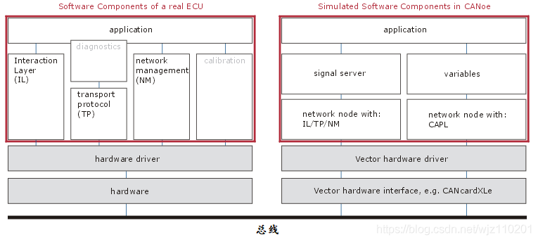

# SOME/IP

区别于传统CAN/LIN等总线面向信号（Signal-Oriented）的通信方式，SOME/IP用于面向服务（Service-Oriented）的通信，这也是以太网在汽车领域应用的最大优势所在。面向服务的通信传输是服务的相关信息，汽车以太网应用方面最重要的是面向服务的架构，简称为SOA（Service Oriented Architecture）。SOA的核心是服务，服务可以简单理解为是实现某种功能的函数或算法。

服务提供者作为服务端（Server），服务消费者作为客户端（Client），服务实现是借助于远程过程调用机制（RPC），客户端和服务端通过中间件进行信息的传输，而中间件是应用层软件和底层硬件之间的软件统称。

## 核心概念

AOTOSAR – AUTomotive Open System ARchitecture，汽车开发系统体系结构；

SOME/IP – Scalable service-Oriented MiddlewarE over IP，基于IP的可扩展面向服务中间件；

CM – Communication Management，通信管理/控制；

E2E – End-to-end communication protection，端到端通讯保护（发现这些错误介入引发的数据失效并作出警示）；

SoC – Service-Oriented Communication，服务通信标准化（即面向服务的通信）；

SecOC – Secure Onboard Communication，安全车载通信（一种车载通信加密与验证的安全方案）；

DTLS – Datagram Transport Layer Security，数据安全传输；

DDS – Data Distribution Service，数据传输服务；

RTPS – Real Time Publish Subscribe Proto,实时发布订阅协议；

TTL – Time To Live，生存时间（或者说是有效时间）；

TLV – Tag-Length-Value，每个子域由tag标签(T)，子域取值的长度(L)和子域取值(V)构成；

RPC – Remote Procedure Call，远程调用；

QoS – Quality of Service，服务质量；

BOM – Byte Order Mark，字节序；

SOA – Service-Oriented Architecture，面向服务的框架；


### SOME/IP

**Scalable service-Oriented MiddlewarE over IP，SOME/IP（应该是为了方便记忆，缩写取的不是每个单词的首字母）**即“基于IP的可扩展的面向服务的中间件”。

- **“Middleware中间件”**是一种独立的系统软件或服务程序，分布式应用软件可借助Middleware在不同的技术之间共享资源。（分布式应用软件，在这里指的就是**“服务”**；不同的技术之间，在这里指的就是“不同的平台或操作系统，比如Linux系统或AUTOSAR系统等。）
- **IP**是Internet Protocol，指的是TCP/IP的通信方式。
- **Scalable**可伸缩，指的是该中间件能够适配于不同的平台及操作系统，其支撑的平台可大可小。

综合来看，**SOME/IP就是指能够在不同平台上应用的，位于TCP/IP协议之上的，用于支持分布式应用软件，帮助分布式应用软件来传递信息的这么一套机制。**说白了，就是把服务接口里的内容通过这种**标准化的方式**打包，然后交给TCP/IP这个快递员。

SOME/IP协议是基于IP的面向服务的车载通信协议，属于应用层协议。通信节点之间根据服务接口，利用SOME/IP实现数据交换，并通过SOME/IP SD实现服务状态和订阅管理


### 服务

**“服务（Service）”**最初是一个社会学名词。1990年，市场营销学教授格鲁诺斯（Gronroos）给服务下的定义是：“服务是以无形的方式，在顾客与服务职员、有形资源等产品或服务系统之间发生的，可以解决顾客问题的一种或一系列行为。”

在IT相关的领域里，我们可以简单理解为**“实现某种功能的函数或方法”**。而这里的服务（函数或方法）能够被顾客（客户端）所使用，能够解决顾客这样或那样的问题（被调用所实现的功能）。

举个生活中的例子，比如你在餐厅点餐，服务员(Server)就提供了一种“点餐”的服务(Service)，你作为一个客户(Client)，就能够使用这些服务。服务的相关信息有哪些呢？就是各种属性信息、控制信息等内容。


### 服务接口

**“服务接口（Service Interface）”**直白的理解就是**服务**与外界进行联系的接口，也就是**服务模块**与外界沟通时的信息出入口。如果你写过程序，那么一个能够被其他模块调用的函数名称，或者一个封装的API，这些就是**接口**。

再看点餐的例子，服务员就可以理解为一个**服务接口**。服务员清晰的知道后厨能够提供哪些菜，也能够将你的点菜信息输入给后厨，还能够把做好的烤鸭提供给你，而这里的“后厨”就可以理解为是**服务**本身。

在通信方面，我们更多关注的是服务接口，而不是服务的内部代码分析过程。**SOME/IP中规定的服务接口包含：双向方法(Request & Response Method)、单向方法(Fire & Forget Method)、事件(Event)、属性(Field)等几项内容。**


服务接口（Service Interface）是描述服务与外界通信的接口。而SOME/IP作为中间件所打包的数据内容，也就是服务接口的内容。SOME/IP所对应的服务接口包含以下四种形式：

- Method（方法）：客户端发送请求，服务端回复响应；是一种有问有答的对话方式；

- F&F Method（单向方法）：客户端发送请求，服务端不需要响应；是一种只问不答的对话方式；

- Event（事件）：客户端向服务端订阅一个事件，服务端向客户端发布该事件；当该事件发生时，服务端就会自动给订阅了该事件的客户端发送相关的通知（Notification），是一种类似于生活中订阅报纸期刊的方式；即订阅之后不用询问会主动通知的对话方式；

- Properities / Fields（字段）：是服务里一系列的属性值（Attributes），这些属性值可以通过设置器（Setter）、获取器（Getter）和通知器（Notifier）进行操作，可以理解成一组参数通过Method（Setter/Getter为Method的方式）和Event（Notifier为Event的方式）的组合进行操作。


### 服务发现SD

**Service Discovery，SD**。用于协助客户端去寻找可用服务的一种机制。

服务(Service)部署在服务器端（Server），在具体实现时（实例化）会有些参数比如网络地址可能会发生变化。为了能够让客户端随时找到服务器上的服务，因此需要这种服务发现机制。

可以简单理解为服务发现(SD)是Service的秘书。SD清楚的知道Service的地址、状态等内容。就像你要找大领导签字，你先问一下秘书，领导在吗、什么时间有空。秘书会告诉你，领导今天在哪个会议室开会，什么时间段有空。

**在SOME/IP SD包含了发现服务、提供服务、停止提供服务、订阅事件组、停止订阅事件组等7种类型的服务发现相关报文。**

### 信息打包方式

用于将服务信息和服务发现的信息进行打包，并通过网络进行传输。针对不同的应用场合服务接口的内容会有所不同，因此也就会有不同的打包协议，不同协议对这些信息的打包方式均有所不同。

比如在SOME/IP中，打包的内容就包括：报文ID、请求ID、协议版本、接口版本以及处理之后（序列化）的服务接口信息等内容。**SOME/IP协议中对请求、无返回的请求、通知、响应、错误等五种类型的信息进行打包，即SOME/IP有上述五种报文类型。**而前边提到的**SOME/IP SD信息的打包，就是使用的通知(Notification)的报文类型。**


下图是Vector的AUTOSAR协议栈中截取的一部分，图中红色框出来三个模块就涉及到了上文提到的三个部分。

- **SW-C的全称为Software Component**，包含的服务代码实现了服务，其对外接口就是服务接口；
- SD模块实现了服务发现的内容，管理服务的地址信息、状态信息等内容；
- SOME/IP模块实现了数据的传输控制，用于服务接口数据的上下传递。


### 面向服务通信SoC

**Service-Oriented Communication，SoC**即**面向服务的通信**。顾名思义，这种通信是为了**对服务的相关信息进行传输**。

如果服务与服务使用者同在一台电脑上，那么可以直接通过程序接口实现过程调用，如图中A区域所示。

但是如果服务与服务使用者位于不同的电脑，则需要进行远程调用，如图中B区域所示。

在远程调用时，就需要借助中间件及网络传输实现信息传输，如图中C区域所示。

这种通信就是面向服务的通信，就是要通过一定的方式对服务的相关信息进行打包，打包后再把这些信息在网络上进行传递。


服务提供者作为服务端（Server），服务消费者作为客户端（Client），服务实现是借助于远程过程调用机制（RPC），客户端和服务端通过中间件进行信息的传输，而中间件是应用层软件和底层硬件之间的软件统称。

在汽车以太网中目前采用的较多的是AUTOSAR组织提出的SOME/IP通信方式。这种通用方式是一种远程过程调用RPC（Remote Procedure Call远程过程调用）。在这种面向服务通信的方式中有三个比较关键的内容：服务接口、服务发现、信息打包方式（SOME/IP的一些其他内容以后再慢慢展开）。


## 面向信号与面向服务

CAN为总线式通信，采用广播式的通信方式。针对这种通信方式，CAN总线在信息传输时通常采用的是面向信号的通信方式(Signal-Oriented Communication)。面向信号的通信，顾名思义，这种通信是**为了将信号进行传输**，比如节点B需要节点A的某一个信息（即一个信号值），节点A就直接把这个信号同其他信号一起，打包成报文丢到总线上，节点B收到之后就能够获得该信号了。用某些传统IT人士的说法，这是一种简单粗暴式的通信方法。

在这种传输情况下最核心的就是通信矩阵，在通信矩阵中以信号作为主要对象，体现出信号被封装到哪条报文中，信号被哪个节点发送，被哪个节点接收。

汽车以太网目前采用交换机式网络，采用点对点的通信方式。在这种通信方式下，最经典的就是面向服务的通信方式(Service-Oriented Communication)，当然也会有面向信号方式的存在。


## SOME/IP格式

SOME/IP协议在OSI七层网络结构中位于应用层，在AUTOSAR中位于BSW的服务层。从功能上讲，SOME/IP是一种将服务接口进行打包或解包的中间件：从应用层发送的数据（就是服务相关的信息以及前文提到的服务接口中的内容），按照SOME/IP的格式打包后，再传递到下层的TCP/IP层，再进行逐层打包和封装，最终通过物理层以比特流的形式进行传输；接收时则按照与打包相反的规则进行解包。


SOME/IP报文由消息头（Header）和数据段（Payload）组成，消息头是按照固定格式排列的有效信息，这些有效信息包括报文ID、请求ID、协议版本、接口版本以及处理之后（序列化）的服务接口信息等内容。

SOME/IP报文格式如下图所示。报文ID包括Service ID和Method ID，Service ID指的是Service本身的ID值；Method ID是指服务接口中的不同内容的ID，每个服务接口中定义的所有方法、单向方法、事件等都需要设置一个ID值；Session ID是从1开始增加的循环值，用于使得Request与Response相配对；Message Type主要分为请求、请求无响应、通知、响应、错误几种类型。


# SOME/IP SD


SD（Service Discovery）是服务的信息清单及管理机制，也是一种服务，主要实现服务寻址及事件订阅两种功能。SD用来对服务进行寻址时，服务提供者（Server端）通过服务发现（SD）通知其他ECU（Client端）某服务可用，并间接地通知该服务的地址（Server端地址）；服务消费者（Client端）了解到某服务状态后，能够调用该服务的相关内容。SD用来事件订阅时，专门针对Event类型的接口，可以通过SD实现对Event所在的Event group进行订阅、停止订阅等操作。


# SOA

> SOA（ Service-Oriented Architecture）就是面向服务的架构，是一种软件架构的设计理念。SOA的实现需要基于SOME/IP及TCP/IP的通信方式。在汽车领域，SOA及以太网的应用对于实现车内高带宽数据的互联互通、汽车与外部网络的互联互通都有其一定的优势，而实现某些特定功能，也需要采用SOA技术。

随着汽车以太网技术研究的深入，诊断、刷新、娱乐、智驾等功能对于带宽要求的日益增加，目前基本所有整车厂都在考虑在下一代平台上应用以太网技术。而随着汽车以太网技术的发展，经常会涉及到SOA这个概念，然而SOA到底是什么？与之相关的一系列的概念（如服务、服务接口、SOME/IP）又是什么？这些概念之间到底是什么关系？为什么要用SOA？不用可不可以？这些疑问肯定困扰着大家。今天我们就按照下图所示的步骤，一步步的来拆解它们。


### SOA

**Service-Oriented Architecture，SOA**即面向服务架构，是一种软件架构设计的模型和方法论。

IT行业的概念是：从业务角度来看，以最大化“服务”的价值为出发点，可以充分利用企业已有的各种软件体系，重新整合并构建起一套新的软件架构。

在汽车行业可以理解为，SOA是面向各种应用层程序（即“服务”，包含各种控制算法、显示功能等应用程序）进行设计，且不依赖于通信方式的一种架构设计理念。在架构设计工作中，重点关注汽车上的某些功能（“服务”）应该如何实现，该功能实现时与外界的各种信息交互（“服务接口”），该功能与外界交互时的基本流程（“服务序列”）。


### DoIP协议介绍

DoIP协议是基于IP的诊断通信协议。利用以太网等局域网相较于其它通信协议（如CAN、Flexray等）拥有更高通信速率等特点，助力实现当前市场上热门的远程诊断、OTA等技术。


### SOA与SOME/IP关系

SOA设计的是“服务”架构，是应用程序的功能以及应用程序的对外接口；SOME/IP打包的是“服务接口”，是应用程序的对外接口。

如此看来，SOA设计内容中的接口部分，需要通过SOME/IP进行打包传输。SOA是软件架构的一种设计理念；SOME/IP是一种将软件接口进行打包的打包方式，是一种中间件。


### SOA与以太网

“以太网”严格来讲，指的是IEEE组织的IEEE 802.3标准所制定的技术标准内容，包括物理层的连线、电子信令和介质访问层的内容。汽车行业通常所指的“以太网”是泛化之后的概念，涵盖了基于以太网技术所实现的各种相关技术手段，包括TCP/IP协议、DoIP协议、SOME/IP协议等。

“以太网”是一种通信手段。SOA与以太网之间的关系，是指采用SOA理念所设计的软件架构，在与外界交互时，其接口可以通过“以太网”的通信方式进行传输，而基于SOME/IP中间件的方式则是一个最典型的应用方式。（当然若通过其他非以太网的通信方式来实现SOA也是可行的，但通常大家不那么用）。


### Why SOA

SOA是IT行业近年来典型的架构方式，大量的IT系统都是基于SOA实现的。而汽车领域采用SOA架构的一个主要原因就是能够加快车辆与互联网的互联互通。包括：

» 能够将各种新功能灵活地与互联网集成，而无需通过信号到服务的转换；

» 基于互联互通，能够大幅提升自动驾驶功能：便于实现高清地图的创建、更新及路线预测等功能，便于实现车辆信息的上传以及云端指令的下达；

» 基于互联互通，快速提升系统与软件升级性能：有助于实现更高效的OBD及OTA软件升级，有助于实现各种远程诊断、预诊断等功能；

» 基于互联互通，能够大幅提升影音娱乐功能的用户体验，能够实现更为便捷的联网功能，实现不同平台间的各种App共享等功能；

» 更便于实现平台架构升级：通过SOA及SD的方式，能够有效降低架构升级带来的复杂度；


### Where SOA

SOA主要针对的是某些功能的实现，而不是指哪个节点，包括：

» 以车载以太网作为主要通信协议的功能，例如：

- 自动驾驶或驾驶辅助的视频流信息：各角度摄像头获取的视频及解析出来的信息；
- 车内影音娱乐信息：比如音视频播放、IVI/副驾及后座娱乐系统互动、导航等图像信息传输、收音机、CD等功能；
- 诊断及刷写功能：该内容在CAN及Eth都是以服务的方式实现的；

» 与车外互联网实现互联互通的功能，例如：

- 获取车载摄像头的信息，比如通过手机远程获取车辆周围环境；
- 获取车辆运行状态信息，比如云端获取车辆的驾驶习惯；
- 远程控制车辆舒适性设备，比如通过手机远程打开车辆空调；
- 远程控制车辆安全性设备，比如通过手机为代驾远程开锁与启动车辆运行；


### SOA的实现和升级

我们以“某车载智能摄像头通过获取限速标志信息（限速值、距离、置信度）并反馈给ADAS系统，来实现驾驶辅助功能”为例，分析一下在CAN总线的方式下以及在以太网SOA的方式下，会有如何区别（基本的内容）？

此外，在摄像头硬件不变动的情况下，如果该系统的功能不断升级——由摄像头提供行车记录仪功能、摄像头提供360环视的部分信息、限速提醒显示在HUD中、摄像头实现行人识别并显示在IVI中，那么，在以太网SOA的方式下以及在CAN总线的方式下，分别应该如何进行功能提升（增加的内容）？

如下表所示：（该功能仅为示意，实际的音视频信息不会采用CAN总线通通信的。）


```
SOA其实是互联网应用中，分布式服务对应的软件实现方式而已。
现在汽车由于引入以太网，简单粗暴地借用了分布式实现。但其实更多所谓服务都是车端软件自身提供的。
SOA会适用于车辆与服务器端的网络APP，类似于手机端应用，但不适合于对车辆控制实时性要求很高的自动驾驶系统。
```


## 其他

在CAN总线的车载网络中，通信过程是面向信号的



当ECU的信号的值发生了改变，或者发送周期到了，就会发送消息，而不考虑接收者是否需要，这样就会造成总线上出现不必要的信息，占用了带宽

而SOME/IP的出现就是为了解决这一问题，它和CAN网络发送机制不同，它是接收者有需要时才会发送，避免了无效信息对总线造成的影响

Scalable service-Oriented MiddlewarE over IP，通过网络提供面向服务的通信，不能写作Some/IP等

既然SOME/IP是一种提供服务的通信协议，我们就可以把请求服务的ECU看成是client，而提供服务的ECU就是server

SOME/IP作为一种通信协议，它也有自己的数据结构。SOME/IP由Header + Payload构成

## Q&A

### 汽车上为什么要用以太网
因而现有的车载网络中最高速的是CANFD(理论最高10Mbps，时间使用2Mbps)。已经不能满足现有ECU（Electronic Control Unit，电子控制单元）之间高带宽数据（视频或大尺寸数据）的传输。


### 为什么车载网络要使用SOMEIP协议

首先要介绍下，什么是SOMEIP协议。

SOMEIP协议的全称是Scalable service Oriented MiddlewarE over IP。既然是over IP，自然是网络层以上的协议。没错的，SOMEIP是OSI/RM模型中第5~7层协议。

SOMEIP主要实现的功能：SD(Service Discovery) , RPC(Remote Procedure Call)和访问进程数据。ECU 通过SD查找或提供服务


### SOMEIP协议的作用是什么？为什么车载网络会选择SOMEIP

SOMEIP设置了C/S和S/R机制

- Fulfills the hard requirements regarding resource consumption in an embedded world
  满足嵌入式领域中有关资源消耗的硬性要求
- Is compatible through as many use-cases and communication partners as possible  
  与尽可能多的用例和通信伙伴兼容
- compatible with AUTOSAR at least on the wire-format level; i.e. can communicate with PDUs AUTOSAR can receive and send without modification to the AUTOSAR standard. The mappings within AUTOSAR shall be chosen according to the SOME/IP specification.
  至少在wire-format上**与AUTOSAR兼容**; 如AUTOSAR标准无需修改即可接收和发送能与之通信的PDU。应根据SOME / IP规范选择AUTOSAR中的映射。
- Provides the features required by automotive use-cases
  提供汽车用例所需的功能
- Is scalable from tiny to large platforms
  可从小型平台扩展到大型平台
- Can be implemented on different operating system (i.e. AUTOSAR, GENIVI, and OSEK) and even embedded devices without operating system
  可以在不同的操作系统（即AUTOSAR，GENIVI和OSEK）上实现，甚至可以在没有操作系统的情况下实现

参考 http://www.sigent.cn/some-ip-1/


## Reference

* [怿星科技: 汽车上为什么非要用SOA？](https://zhuanlan.zhihu.com/p/76724348)

* 


