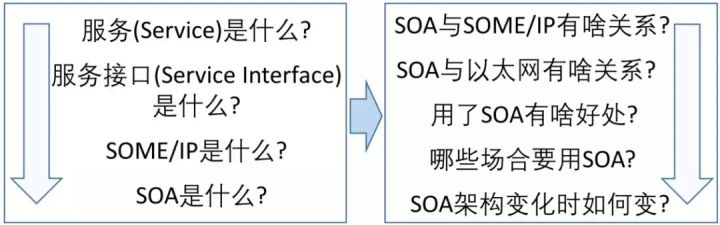
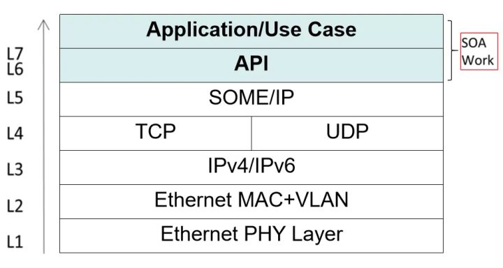
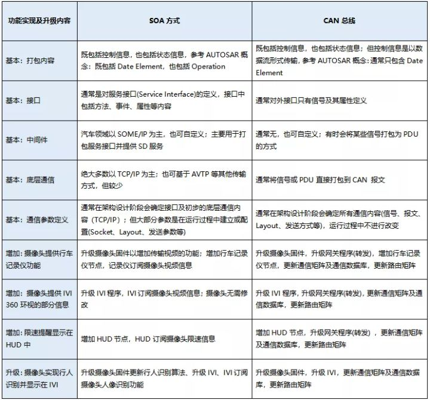

# SOA

> **SOA（ Service-Oriented Architecture）就是面向服务的架构，是一种软件架构的设计理念。**SOA的实现需要基于SOME/IP及TCP/IP的通信方式。在汽车领域，SOA及以太网的应用对于实现车内高带宽数据的互联互通、汽车与外部网络的互联互通都有其一定的优势。

随着汽车以太网技术研究的深入，诊断、刷新、娱乐、智驾等功能对于带宽要求的日益增加，目前基本所有整车厂都在考虑在下一代平台上应用以太网技术。而随着汽车以太网技术的发展，经常会涉及到SOA这个概念，然而SOA到底是什么？与之相关的一系列的概念（如服务、服务接口、SOME/IP）又是什么？这些概念之间到底是什么关系？为什么要用SOA？不用可不可以？这些疑问肯定困扰着大家。今天我们就按照下图所示的步骤，一步步的来拆解它们。




### 服务（Service）

“服务”最初是一个社会学名词。1990年，市场营销学教授格鲁诺斯（Gronroos）给服务下的定义是：“服务是以无形的方式，在顾客与服务职员、有形资源等产品或服务系统之间发生的，可以解决顾客问题的一种或一系列行为。”我们SOA里的服务是从这里引申出来的，在IT相关的领域里，我们可以简单理解为**“实现某种功能的函数或方法”**。而这里的服务（函数或方法）能够被顾客（客户端）所使用，能够解决顾客这样或那样的问题（被调用所实现的功能）。举个生活中的例子，去全聚德吃烤鸭，全聚德能够提供烤鸭给顾客，这就是一种服务。这里先对服务有个基本了解。


### 服务接口（Service Interface）

**“服务接口”**直白的理解就是**服务**与外界进行联系的接口，也就是**服务模块**与外界沟通时的信息出入口。如果你写过程序，那么一个能够被其他模块调用的函数名称，或者一个封装的API，这些就是**接口**。再看去全聚德吃烤鸭的例子，服务员就可以理解为一个**服务接口**。服务员清晰的知道后厨能够提供哪些菜，也能够将你的点菜信息输入给后厨，还能够把做好的烤鸭提供给你，而这里的“后厨”就可以理解为是**服务**本身。

### SOME/IP

**Scalable service-Oriented MiddlewarE over IP，SOME/IP（应该是为了方便记忆，缩写取的不是每个单词的首字母）**即“基于IP的可扩展的面向服务的中间件”。

**“Middleware中间件”**是一种独立的系统软件或服务程序，分布式应用软件可借助Middleware在不同的技术之间共享资源。（分布式应用软件，在这里指的就是**“服务”**；不同的技术之间，在这里指的就是“不同的平台或操作系统，比如Linux系统或AUTOSAR系统等。）

**IP**是Internet Protocol，指的是TCP/IP的通信方式。

**Scalable**可伸缩，指的是该中间件能够适配于不同的平台及操作系统，其支撑的平台可大可小。

综合来看，**SOME/IP就是指能够在不同平台上应用的，位于TCP/IP协议之上的，用于支持分布式应用软件，帮助分布式应用软件来传递信息的这么一套机制。**说白了，就是把服务接口里的内容通过这种**标准化的方式**打包，然后交给TCP/IP这个快递员。

SOME/IP协议是基于IP的面向服务的车载通信协议，属于应用层协议。通信节点之间根据服务接口，利用SOME/IP实现数据交换，并通过SOME/IP SD实现服务状态和订阅管理

### SOA

**Service-Oriented Architecture，SOA**即面向服务架构，是一种软件架构设计的模型和方法论。

IT行业的概念是：从业务角度来看，以最大化“服务”的价值为出发点，可以充分利用企业已有的各种软件体系，重新整合并构建起一套新的软件架构。

在汽车行业可以理解为，SOA是面向各种应用层程序（即“服务”，包含各种控制算法、显示功能等应用程序）进行设计，且不依赖于通信方式的一种架构设计理念。在架构设计工作中，重点关注汽车上的某些功能（“服务”）应该如何实现，该功能实现时与外界的各种信息交互（“服务接口”），该功能与外界交互时的基本流程（“服务序列”）。


### DoIP协议介绍

DoIP协议是基于IP的诊断通信协议。利用以太网等局域网相较于其它通信协议（如CAN、Flexray等）拥有更高通信速率等特点，助力实现当前市场上热门的远程诊断、OTA等技术。


### SOA与SOME/IP关系

SOA设计的是“服务”架构，是应用程序的功能以及应用程序的对外接口；SOME/IP打包的是“服务接口”，是应用程序的对外接口。

如此看来，SOA设计内容中的接口部分，需要通过SOME/IP进行打包传输。SOA是软件架构的一种设计理念；SOME/IP是一种将软件接口进行打包的打包方式，是一种中间件。


### SOA与以太网

“以太网”严格来讲，指的是IEEE组织的IEEE 802.3标准所制定的技术标准内容，包括物理层的连线、电子信令和介质访问层的内容。汽车行业通常所指的“以太网”是泛化之后的概念，涵盖了基于以太网技术所实现的各种相关技术手段，包括TCP/IP协议、DoIP协议、SOME/IP协议等。

“以太网”是一种通信手段。SOA与以太网之间的关系，是指采用SOA理念所设计的软件架构，在与外界交互时，其接口可以通过“以太网”的通信方式进行传输，而基于SOME/IP中间件的方式则是一个最典型的应用方式。（当然若通过其他非以太网的通信方式来实现SOA也是可行的，但通常大家不那么用）。




### Why SOA

SOA是IT行业近年来典型的架构方式，大量的IT系统都是基于SOA实现的。而汽车领域采用SOA架构的一个主要原因就是能够加快车辆与互联网的互联互通。包括：

» 能够将各种新功能灵活地与互联网集成，而无需通过信号到服务的转换；

» 基于互联互通，能够大幅提升自动驾驶功能：便于实现高清地图的创建、更新及路线预测等功能，便于实现车辆信息的上传以及云端指令的下达；

» 基于互联互通，快速提升系统与软件升级性能：有助于实现更高效的OBD及OTA软件升级，有助于实现各种远程诊断、预诊断等功能；

» 基于互联互通，能够大幅提升影音娱乐功能的用户体验，能够实现更为便捷的联网功能，实现不同平台间的各种App共享等功能；

» 更便于实现平台架构升级：通过SOA及SD的方式，能够有效降低架构升级带来的复杂度；


### Where SOA

SOA主要针对的是某些功能的实现，而不是指哪个节点，包括：

» 以车载以太网作为主要通信协议的功能，例如：

- 自动驾驶或驾驶辅助的视频流信息：各角度摄像头获取的视频及解析出来的信息；
- 车内影音娱乐信息：比如音视频播放、IVI/副驾及后座娱乐系统互动、导航等图像信息传输、收音机、CD等功能；
- 诊断及刷写功能：该内容在CAN及Eth都是以服务的方式实现的；

» 与车外互联网实现互联互通的功能，例如：

- 获取车载摄像头的信息，比如通过手机远程获取车辆周围环境；
- 获取车辆运行状态信息，比如云端获取车辆的驾驶习惯；
- 远程控制车辆舒适性设备，比如通过手机远程打开车辆空调；
- 远程控制车辆安全性设备，比如通过手机为代驾远程开锁与启动车辆运行；


### SOA的实现和升级

我们以“某车载智能摄像头通过获取限速标志信息（限速值、距离、置信度）并反馈给ADAS系统，来实现驾驶辅助功能”为例，分析一下在CAN总线的方式下以及在以太网SOA的方式下，会有如何区别（基本的内容）？

此外，在摄像头硬件不变动的情况下，如果该系统的功能不断升级——由摄像头提供行车记录仪功能、摄像头提供360环视的部分信息、限速提醒显示在HUD中、摄像头实现行人识别并显示在IVI中，那么，在以太网SOA的方式下以及在CAN总线的方式下，分别应该如何进行功能提升（增加的内容）？

如下表所示：（该功能仅为示意，实际的音视频信息不会采用CAN总线通通信的。）




```
SOA其实是互联网应用中，分布式服务对应的软件实现方式而已。
现在汽车由于引入以太网，简单粗暴地借用了分布式实现。但其实更多所谓服务都是车端软件自身提供的。
SOA会适用于车辆与服务器端的网络APP，类似于手机端应用，但不适合于对车辆控制实时性要求很高的自动驾驶系统。
```


## Reference

* [怿星科技: 汽车上为什么非要用SOA？](https://zhuanlan.zhihu.com/p/76724348)

* 