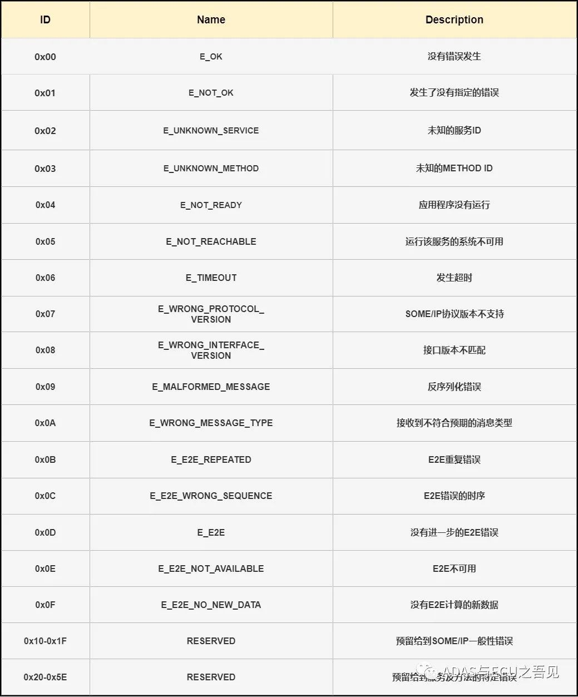

SOME/IP是一种都有所耳闻的以太网的上层协议，但是其诞生历史和协议内容都知道的不多吧！

SOME/IP的诞生是在以太网引入汽车之后更深入的发展，因此我们需要从车载以太网的历史开始讲起。

### 01 以太网引入汽车

2004年，宝马汽车的OBD诊断口采用的是高速CAN总线，速率为500kbit/s，除去CAN协议本身的开销，通过OBD口升级控制器的净升级速度降到200kbit/s。而它预计到2008年，软件更新的数据量会达到1GB，按照现在CAN的速度来算，更新一次软件要16个小时，这个肯定是不能接受的。经过内部讨论，将升级1GB数据的性能参数设置为15min，转换为速度约为9Mbit/s，因此开始考虑引入新的刷写总线。

从当时现有的选择来看，只有MOST、USB可选，虽然Flexray的速度可达10Mbit/s，但是2004年还没有推出，要到2006年才被推出。

MOST总线，2004年那会儿还是MOST25，速度约7Mbit/s，勉勉强强够格。是在2001年引入宝马汽车中的，主要用于同步音频通信。但是其存在一些缺点：

- 总线拓扑结构问题，由于MOST总线必须是环形拓扑，这意味在测试仪和网关之间必须添加另外一个拓扑环，或者在连接测试仪前接一个临时的扩展环，这增加了复杂性。
- 较高的资源需求，要实现7Mbit/s的最大带宽，需要使用1014B的数据包，而且需要64个包组成一个块(这个是MOST-high协议的一部分)，也就意味着光数据包的接收就需要64KB的RAM，在当时这个资源占太多了。
- 新接口，MOST25做升级，属于全新的接口，与现有的不兼容，需要另做一套诊断应用程序，这也意味着成本高昂的问题。

USB作为消费类设备接口，其在PC上非常常见，因此是适合外部测试仪的，而且通信速度高达480bit/s，远远高于需求，但是其缺点太明显：

- 鲁棒性和抗扰性不充分，想要保证信号的完整性，USB需要昂贵的电缆和连接器。
- USB最大支持的线缆长度为4m，难以覆盖使用场景。
- 必须为开发基于汽车的协议栈和驱动程序。

上面这些已有的无法满足需求后，宝马开始研究以太网，因为以太网是一种被充分验证的技术，并且有良好的基础设施以及足够的传输速度。

在评估以太网在汽车上的适用性时，最关键部分是物理层，刚开始预计会像USB一样，为了满足鲁棒性，需要高昂的线缆和接插件，宝马通过将以太网连接线换成非屏蔽双绞线，进行抗扰度进行测试，结果表明，非屏蔽线也满足要求，没必要做任何修改。

从而宝马开始了将以太网应用到车上，包括组织联盟建立车载以太网标准，例如OPEN联盟，着手基于以太网的上层协议，比如下面要讲的SOME/IP。

### 02 什么是SOME/IP？

SOME/IP 是 Scalable Service-Oriented Middleware over IP 的缩写，由宝马于 2011 年开发。这个名字清楚地表明它是一种中间件解决方案，可以在控制器之间实现面向服务的通信。更具体地说，SOME/IP 提供了广泛的中间件功能，如序列化、远程过程调用 (RPC)、服务发现和订阅，以使 ECU 软件能够相互通信。

### SOME/IP 的一些主要特点：

1. 序列化和反序列化：将数据结构转换成字节序列或者将字节序列转换为数据结构，这样有利于数据的高效传输。
2. 远程过程调用 (RPC)：它是客户端在需要来自服务器的一些数据时采用的一种数据交换方法。RPC 可能有也可能没有返回值，即客户端可以请求数据作为响应，或者简单地调用一个函数来在服务器端执行某些任务。
3. 服务发现：服务发现 (SD) 协议是 SOME/IP 概念的支柱。在面向服务的架构中，服务（功能实体-方法、事件或字段）必须是可发现的。SOME/IP SD 协议管理这个方面——是提供服务还是阻止它可用。
4. 发布/订阅：客户端可以订阅服务器的内容，从而可以动态地接收来自服务器的更新数据。SOME/IP 的发布/订阅功能推断客户需要哪些数据（事件/字段）并共享相同的数据。Pub/Sub 由 SOME/IP SD 管理。

在2014年，SOME/IP正式被集成进AUTOSAR 4.X，并且得到了持续的发展和完善：

- AUTOSAR 4.0 - 完成宝马SOME/IP消息的初步集成；
- AUTOSAR 4.1 - 支持SOME/IP-SD及其发布/订阅功能；
- AUTOSAR 4.2 - 添加transformer用于序列化以及其他相关优化；
- AUTOSAR 4.3 - 修复一些transformer bug同时添加针对大量UDP数据包的SOME/IP-TP协议以及其他SOME/IP-SD的优化工作。

**SOME/IP****协议**

SOME/IP协议首先定义了报文的格式，如下图所示。

SOME/IP报文格式(来源AUTOSAR)

**Message ID**

Message ID又通常叫报文ID，长度为32bit，包 含 Service ID 和 Method ID，各16bit， 每一个SOME/IP报文有唯一的报文ID，类似于CAN ID。当定义为Method时，Method ID的最高有效位值为0，当定义为Event时，Method ID的最高有效位为1，此时的Method ID又叫做Event ID。每一个服务应该由唯一的 Service ID作为标识；在同一服务， 不同的Method和Event也有唯一的Method ID或Event ID作为标识。

**长度(Length)**

长度字段的长度为32bit，指的是从Request ID到Payload的长度。 

**请求 ID(Request ID)**

Request ID的长度为32bit，由Client ID和Session ID组成。Client ID是客户端/服务器的唯一标识；Session ID是客户端和服务器之间通信过程中每次调用的标识，可以根据不同的应用场景，决定是否使用Session ID。

**协议版本(Protocol Version)**

该字段长度为8bit，用来表示当前使用的协议的类型，该字段当前固定为0x01。

##### **Message Type**

用来识别不同的消息类型，目前存在的类型如下图所示，其中TP表示分包的报文,按照AUTOSAR标准(R21-11)定义如下：

Message Type表(来源 ADAS与ECU之吾见)

##### **Return Code**

Return Code用来指示Message是否被成功处理了，或针对请求中的错误内容进行反馈，如下图为AUTOSAR(R21-11)中定义的Return Code类型：

Return Code定义表(来源 ADAS与ECU之吾见)

**Payload** ：数据段，用于放置需要传输的数据。

### 03 序列化

AUTOSAR对SOME/IP传输数据的序列化(数据结构转换成线性字节序列，或反之，如下图所示)也进行了标准化，除了支持AUTOSAR规定的基本数据类型(布尔类型、uint8、uint16、uint32,、sint8、sint16、sint32、float32和float64)之外，还支持包括结构体、联合体、字符串、数组等复杂的数据结构的传输 。

序列化示例(来源AUTOSAR)

### 04 SOME/IP通信机制

SOME/IP的通信机制包含远程过程调用、Event和Field。远程过程调用是指一个节点向另一个节点发送请求服务，这种方式又称为Method，多用于客户端向服务器发送控制命令，根据服务器是否有反馈分为Request/Response(R/R)和通信Fire&Forget(F&F)通信。

Event类似于CAN报文，用以发布状态，根据实际的应用场景，可以有不同的发送方式。

Field用以表示某一功能的状态量。可以通过Method发布控制命令，即Setter；也可以通过Method去请求获取状态，即Getter；在状态发生改变时也可以发送通知，即Notification。

**1.Request/Response(R/R)通信** 

R/R是一种有请求和响应的Method，意味着客户端发送请求之后，服务端需要返回响应报文。

Request/Response通信方式(来源知网)

**2. Fire&Forge(T&F)通信**

客户端向服务器发送请求报文，服务器不会有响应报文反馈。F&F通信中与R/R通信中的客户端行为一样，不同的是F&F通信时，请求报文的报文类型为REQUEST_NO_RETURN，而R/R的报文类型为RESPONS。

Fire&Forget通方式(来源知网)

**3. Event**

SOME/IP中定义了3种不同的Event方式，分别是周期发送、值改变触发
和值大于某一阈值触发。SOME/IP中的Event在网络中的发送是基于事件组传输的，要为定义的每一个Event分配事件组，同一个Event可以存在于不同的事件组，但不能定义空的事件组。Event的收发基于SOME/IP的发布和订阅行为，在SD通信时，客户端订阅服务器的事件组，在正常的SOME/IP通信时，依据定义的发送行为，周期或者值改变触发Event的发送。

Event通信方式(来源知网)

**4. Field**

Field表示一种功能的状态，可以用来表示某一状态量，如车门、车窗等，对于Setter来说，请求报文的有效载荷中存放设置Field表示状态量的控制命令 ，对于Getter来说，请求报文的有效载荷为空，服务器通过识别请求报文的报文ID，然后将Field表示的状态量放在响应报文的有效载荷中。Notification指的是Field表示的状态量值，当Field表示的状态量值发生改变或被外界触发时发送Notification。

Field通信方式(来源知网)

### 05 SOME/IP SD

SOME/IP SD报文是一种特殊的SOME/IP报文，其报文格式和SOME/IP报文是一样的。不同的是SOME/IP SD报文的SOME/IP报头字段的报文ID、接口版本、报文类型和返回码的值是固定不变的，SOME/IP SD报文的SOME/IP SD部分又包含了标志字段、预留字段、Entry和Option等字段，SOME/IP SD报文格式如下图所示：

SOME/IP SD报文(来源AUTOSAR)

**Flags**

Flags的第一个字节为标志字段，其高三位从高到低依次为重启标志位、单播标志位和初始数据控制标志位，低五位为预留位。

**Entry 阵列**

服务发现是通过SD报文中的Entry阵列字段携带的不同类型Entry来实现的，
Entry用来同步服务实例状态和处理事件组的发布和订阅。依据SD 报文中Entry的作用不同将SD的报文类型分为七种，其中Find报文、Offer报文和Stop Offer报文基于不同的机制周期发送，用于同步服务实例的状态；订阅事件组报文、停止订阅事件组报文、订阅ACK报文和订阅NACK报文用于处理事件组的发布和订阅。

**Option 阵列**

SD报文中的Entry通过引用Option阵列中的Option携带其他信息，如配置信息、传输协议、端口号和IP地址等相关信息。根据Option的作用不同，一般将Option分为配置Option、单播IP地址Option、多播IP地址Option和SD通信IP地址Option。配置Option用来传输服务名称、协议类型、实例名称等信息，IP地址Option分别表明节点通信单播、多播的地址信息和SD通信地址信息。

### 06 SOME/IP SD 通信机制

SD中，不管是客户端还是服务端，通信行为分为Down和Available，在Available下又分为Initial Wait阶段、Repetition阶段和Main阶段。

在Down阶段，服务不可用。服务可用后会立即进入Initial Wait阶段，该阶段的作用一是避免流量突发，防止拥堵；二是可以将多个Entry放到一个SD报文中，降低报文数量。在Repetition阶段，客户端和服务器通过快速的发送Find和Offer报文实现服务消费关系的快速同步， 在Main阶段，SD通信处于稳定状态，为了降低SD报文的数量，定义客户端不发送Find报文，而服务器以相对较慢的周期发送Offer报文。

对于服务端来说，在Initial Wait阶段的时间是在INITIAL_DELAY_MIN和INITIAL_DELAY_MAX之前的随机值，当计数器超时后，开始发送第一个offer报文，并且进入Repetition阶段，在这个时候，会定期发送REPETITIONS_MAX次offer报文。然后进入Main阶段，在Main阶段会 以 周 期 时 间 CYCLIC_OFFER_DELAY 周 期 性 发 送Offer报文。若收到客户端发送的Find报文，服务器单播响应Offer报文。

服务端的状态跳转图 (来源知网)

对于客户端来说，客户端在Down阶段不请求服务。若收到服务器发送的Offer报文，客户端存储该服务实例的状态，并启动该Offer报文的TTL计时器，此时若客户端请求服务，直接进入Main阶段。

在客户端需要请求服务后，进入Initial Wait阶段。若收到服务器发送的Offer报文，取消计时器，直接进入Main阶段；若没有收到服务器发送的Offer报文，等待INITIAL_DELAY(位于INITIAL_DELAY_MAX和INITIAL_DELAY_MIN之间的随机值)，计时器超时后，发送一个Find报文，进入Repetition阶段。

客 户 端 在Repetition阶 段 定期快速发送REPETITIONS_MAX次Find报文，若收服务器发送的Offer报文，停止当前阶段的计数和计时，进入Main阶段。

在Main阶段，SD通信已进入相对稳定的状态，这里定义客户端不发送Find报文，以降低SD报文数量。

客户端状态跳转图 (来源知网)

------

**参考文章**

1. 一网打尽车载以太网之SOME/IP(上)

2. 车载以太网 书籍

3. 基于SOME/IP协议的Demo小车Ethernet通信系统设计及建模仿真

4. AUTOSAR标准