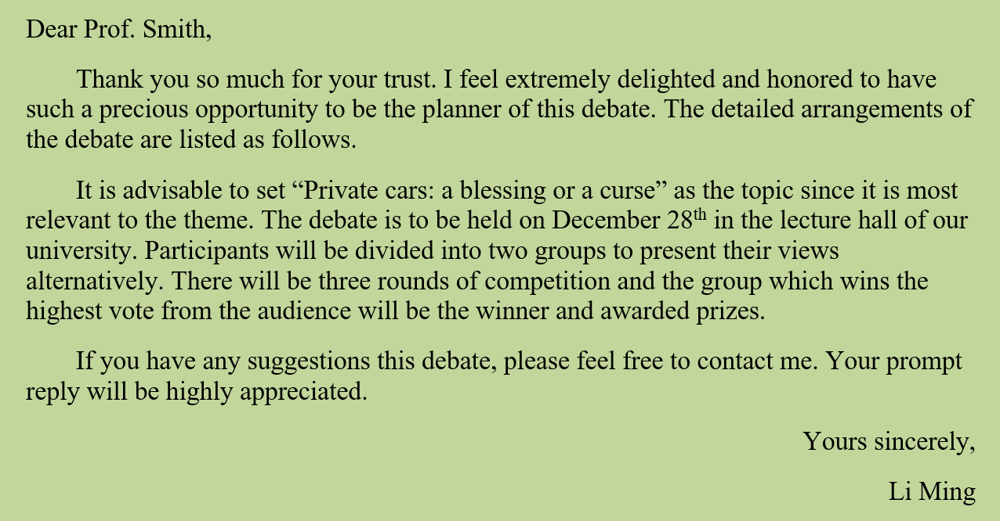
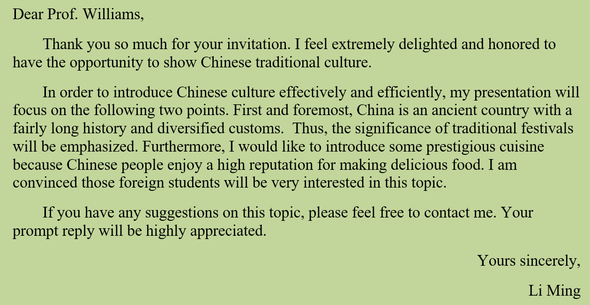
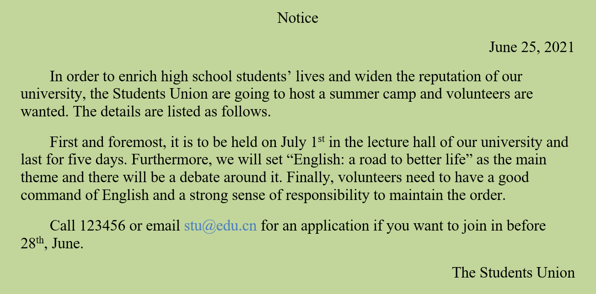
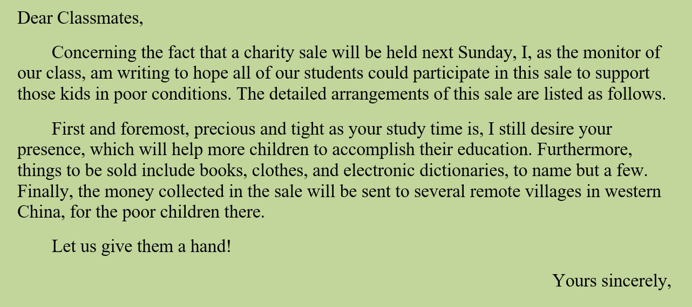
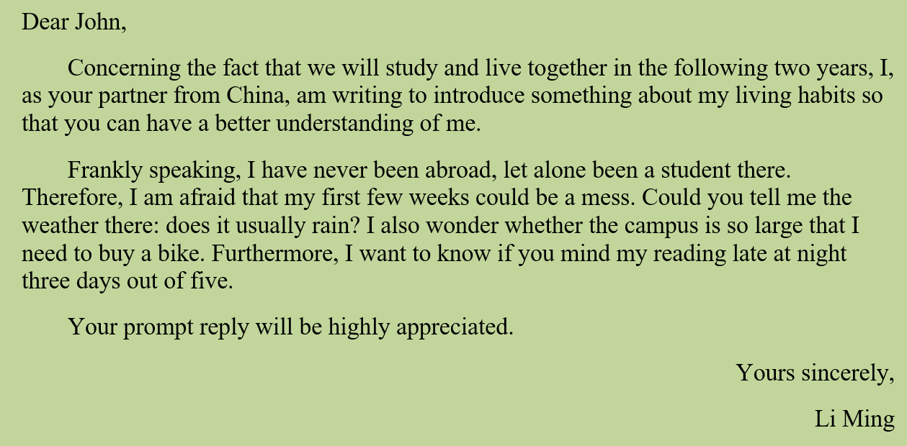

# Emphasize

## 柱状图

Sticking to the data rendered in the column chart above, a conclusion can be drawn that the dramatic changes have taken place in the graduates' future choice. From 2013 to 2018, there was a remarkable jump of 7.7% from 26.3% to 34.0% in choosing further education, while that of employment declined significantly by 7.4% from 68.1% to 60.7%. The percentage of running their own business, meanwhile, ascend from 1.3% to 2.6%.

## 饼状图

Sticking to the data rendered in the pie chart above, a conclusion can be drawn that consumers pay attention to many different factors in selecting a restaurant. The percentage of special dishes is highest amongst all the 5 categories, at approximately 36.30%. Services and environments are also important considerations, accounting for about 26.80% and 23.80%. Meanwhile, the statistics of price as well as others account for 8.40% and 4.70% respectively. 

## 折线图

Sticking to the data rendered in the line chart above, a conclusion can be drawn dramatic changes have taken place in the number of people visiting museums. From 2013 to 2015, the number of museums augmented remarkably from only about 4,100 to 4700. Meanwhile, the number of visitors to museums, exceeding individuals’ expectations, surging from 620 million to 780 million. 

## 万能原因

Fundamental factors contributing to the above – mentioned tendency may be expounded as below. First and foremost, encountering a pluralistic society, quite a few graduates are becoming increasingly education-oriented, which renders them the basis for the growth of choosing further education. Furthermore, it can be bound up with the turning of folks’ perspectives on success. Translated, finding a job is no longer as essential as it used to be, demonstrated what really counts is self - improvement or starting their own business. 

Furthermore, all kinds of publicity, be they the newspaper or the Internet, advocate vigorously what really matters is national self – confidence, inducing these visitors to have a full understanding of national culture by visiting museums. 

First and foremost, encountering a pluralistic society, quite a few students, if not most, are becoming increasingly freedom-oriented, which triggers the fact that they are prone to enjoy the wonderful landscape by traveling in different cities and alleviating pressure at the same time.

## 结尾

As discussed above, it is no surprise to see the current tendency. From the way I see things, this trend toward museums and visitors is irreversible and is certain to continue in the brilliant future. 

From the way I see things, it is beyond doubt that restaurants should improve their services and environments according to the preferences of consumers. 

From the way I see things, although each option is great, we still imbue ourselves with prudence and intelligence since it is related to our future. 

## 小作文

