### 一、设计目的

1． 模拟实现计算机的处理机调度。理解计算机的处理机调度的工作原理和实现过程。

2． 模拟实现计算机的主存储器空间的分配与回收。理解计算机主存储器空间的分配与回收的工作原理和实现过程。

### 二、处理机调度

#### 1、设计任务与要求

设计一个按优先数调度算法实现处理机调度的程序。要求：

1. 利用进程控制块PCB来管理进程的调度。

2. 进程控制块应包含进程名、要求运行时间、优先数、状态等基本信息，状态有就绪态用“R”表示，结束态用“E”表示。
3. 进程每次调度运行，优先数减1，运行时间减1。如果运行时间为0，就将其状态改为结束态并退出就绪队列，否则重新加入就绪队列运行。
4. 每次进程调度和调度之后应输出相关信息。

#### 2、设计思路与方案

系统假设有5个进程，进程控制块应该含有进程名、要求运行时间、优先数、状态等基本信息，所以设计PCB的结构体如下：

```c++
struct PCB {
	string name;		//进程名
	int runTime = 0;	//要求运行的时间
	int priority = 0;	//进程的优先数，优先数大的先执行
	string status;		//进程状态，就绪态“R”, 结束“E”
} pcb[5];
```

系统所要实现的功能较为简单，所以主函数程序主要分为三个模块：

* 初始化程序**init()**主要是从文件**PCB.txt**中读取进程相关信息，对定义的5个进程**pcb[5]**进行初始化。

* 打印队列程序**printSet()**主要是输出就绪队列上的进程相关信息。

* 进程调度程序**schedule()**主要是采用优先级数调度算法完成进程调度。

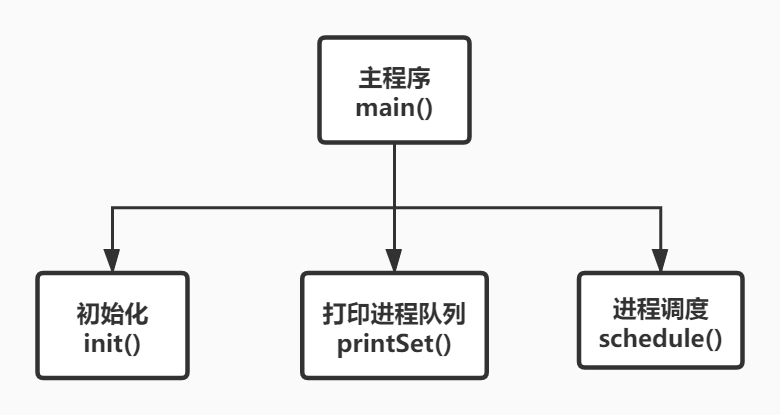

#### 3、设计原理与内容

#####  初始化函数init()

为了避免每次都需要用户手动输入相关信息，所以实现了系统从文件自动完成初始化功能。如果需要更改进程控制块相关信息，只需要修改程序所在目录下的**PCB.txt**文件即可。

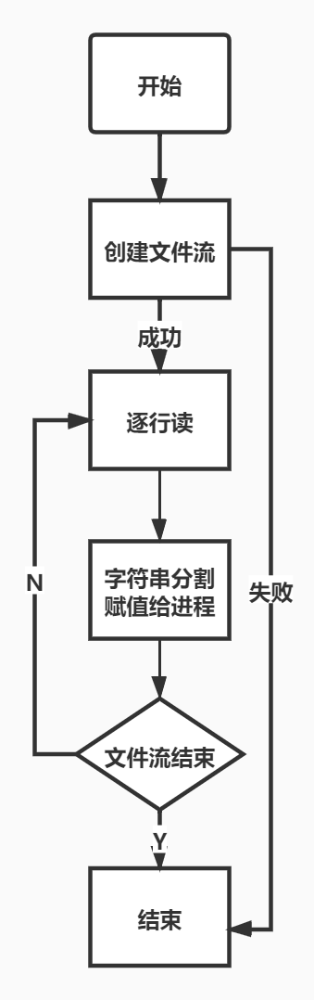


##### 打印队列函数printSet()

为了使就绪队列中的进程始终按照优先数降序排列，选择使用set容器来管理就绪进程，利用仿函数使就绪队列始终保持有序。所以，如果想要打印输出就绪队列中的进程信息，可以采用迭代器的方式：

```c++
string toString(multiset<PCB,Compare>::iterator pcb) {
	return "进程名：" + pcb->name + "\t"
		+ "运行时间：" + to_string(pcb->runTime) + "\t"
		+ "优先数：" + to_string(pcb->priority) + "\t"
		+ "状态：" + pcb->status + "\t";
}
void printSet(multiset<PCB, Compare> s) {
	for (multiset<PCB, Compare>::iterator it = s.begin(); it != s.end(); it++) {
		cout << toString(it) << endl;
	}
}
```


##### 进程调度函数schedule()

进程调度函数是本系统的核心函数，该函数功能逻辑也比较简单。先判断就绪队列是否为空，如果为空就结束。如果不为空，就调度队列第一个进程运行，调度之后进程的运行时间减1，优先数减1。接下来判断运行时间是否为0，为0表示进程运行完毕，不为0则将该进程重新加入就绪队列，再次进行进程调度。每进行一次进程调度，不管结果如何，都打印相关信息。

```c++
//优先级调度算法
void schedule(multiset<PCB, Compare> s) {
	while (!s.empty()) {
		cout << "============================" << endl;
		cout << "正在运行：" << s.begin()->name << endl;
		PCB temp = *s.begin();	//如果set容器不为空，则第一个元素优先级最高，调度运行
		s.erase(s.begin());


		temp.runTime--;			//进程每执行一次，运行时间减1
		temp.priority--;		//进程每执行一次，优先数减1

		if (temp.runTime > 0) {		//如果运行时间大于0，则将其在加入集合中
			s.insert(temp);
			cout << "运行之后结果为：" << endl;
			cout << "============================" << endl;
			printSet(s);
		}
		else {
			temp.status = "E";
			cout << "进程" << temp.name << "运行完成" << endl;
			cout << "============================" << endl;
		}
	}
	cout << "进程调度完毕！:）" << endl;
}
```


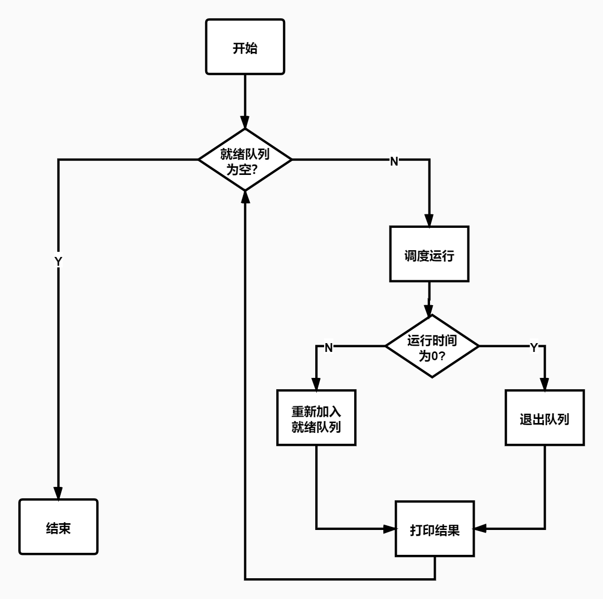

#### 4、设计调试与结果

因为模拟处理器调度实现起来较为简单，唯一需要交互的地方可能就是需要用户输入进程相关信息，但是在设计过程中，已经利用文本文件代替了这个有点繁琐的步骤，用户只需要修改程序所在目录下的**PCB.txt**文件即可，所以双击程序即可运行


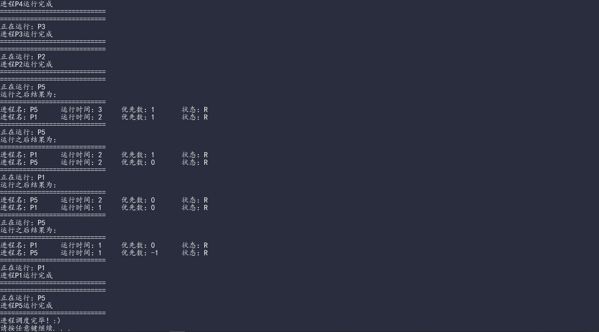


### 三、主存的分配与回收

#### 1、设计任务与要求

设计一个在可变分区管理方式下采用最先适应算法实现主存的分配与回收的程序。要求：

1. 有两张说明表来记录作业和空闲区相关信息，包括作业号、起址，长度，状态等

2. 采用最先适应算法来分配主存

3. 空闲区说明表里的空闲区应按照地址顺序进行登记，即每个后续的空闲区其开始地址总是比前者大

4. 为了减少碎片，“碎片”小于某一特定值时，应将空闲区全部分配给作业，不再分割空闲区。

5. 如果空闲区说明表中的两个空闲区相邻，应将其合并成一个较大的空闲区

6. 作业的每次分配或者撤销后，应显示空闲区说明表和作业登记表的内容信息

#### 2、设计思路与方案

因为每一个作业和空闲区都有相关属性，所以定义结构体如下：

```c++
//定义作业结构体
struct Job {
	int num = 0;		//作业号
	int start = 0;		//开始地址
	int len = 0;		//长度
};

//定义空闲区结构体
struct Free {
	int start;		//开始地址
	int len;		//长度
	char status;	//状态，F表示空闲
};
```

因为此系统所要实现功能比较多，可以利用模块化思想，将功能分为大致四个模块：

1. 初始化函数**init()**主要用来初始化作业登记表和空闲区说明表。为了提高效率，又增加了**autoInit()**函数，系统每次启动都会调用此函数实现自动初始化。

2. 主存分配函数**allocation()**主要用来为作业分配主存，采用最先适应算法。
3. 主存回收函数**recycle()**主要用来回收主存，当想要撤销作业时就会调用此函数，回收的主存会调用**insertFreeList()**函数在空闲区说明表进程登记，调用**mergeFreeList()**函数合并相邻的空闲区。
4. 展示信息函数**show()**主要展示空闲区说明表和作业登记表里的内容信息

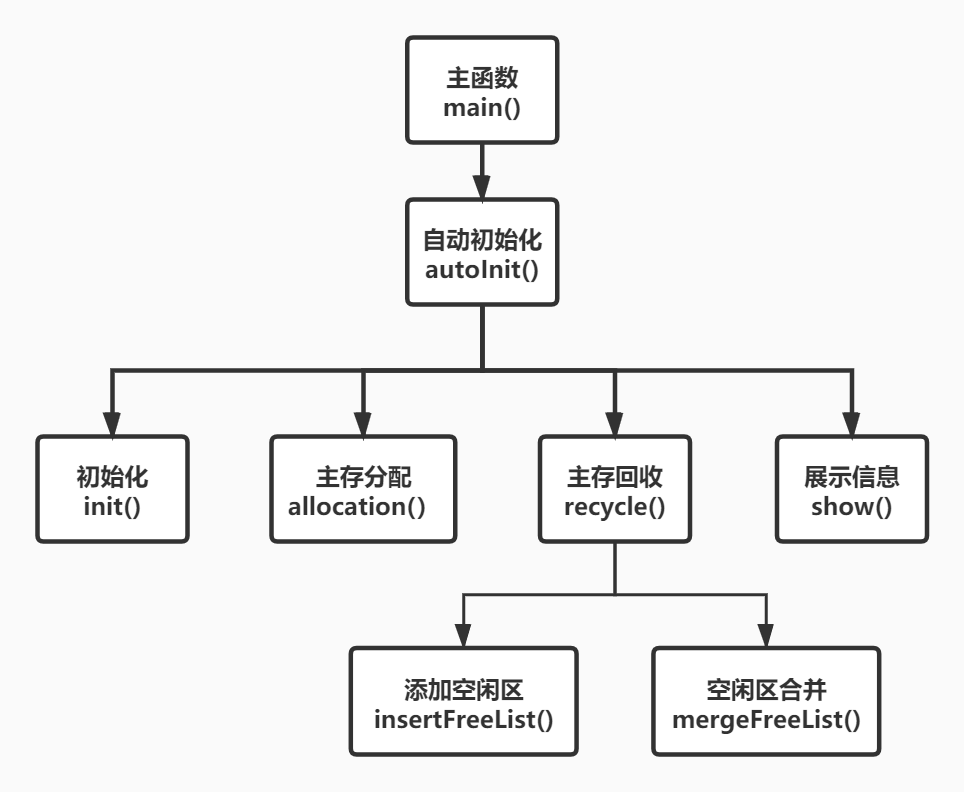

#### 3、设计原理与内容

##### 初始化函数autoInit()

在初始化作业登记表和空闲区说明表时，会需要用户输入一定的信息，这是一个比较重复和繁琐的过程，为了提高效率，实现了系统自动初始化功能，用户只需要修改程序目录下的**init.txt**函数即可。

当然，综合考虑还是保留了用户手动初始化的功能，具体原理比较简单，这里不再详细解释，可以参考下面附的系统源码。需要注意的是，为了系统安全，如果选择手动初始化，那么系统自动初始化的内容将会被清空。

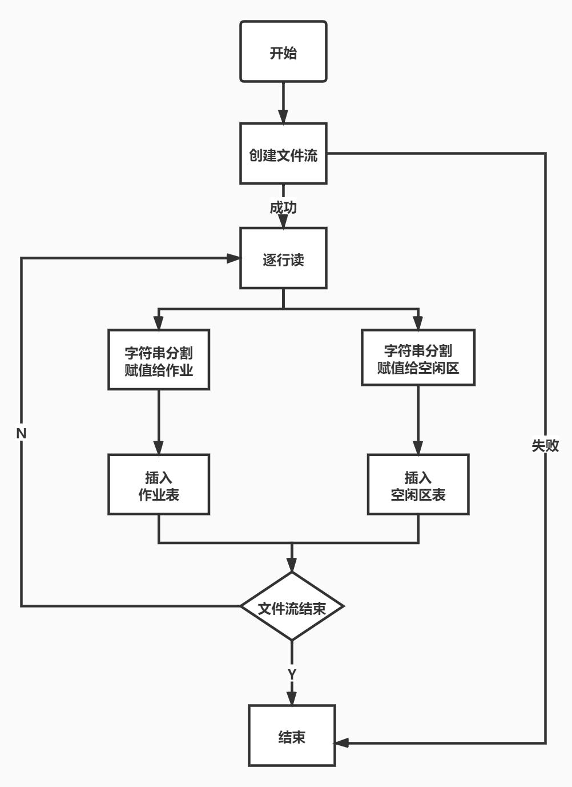


##### 主存分配函数allocation()

主存储器分配函数主要逻辑是，用户输入想要申请内存的作业号和需要量，然后系统就会根据最先适应算法查空闲区说明表。

如果找到第一个满足要求的空闲区，空闲区一部分用来装作业，另一部分修改起址和长度仍在空闲区说明表中进行登记。特别地，如果碎片大小小于0.25K，那么此空闲区将会全部分配给作业，在空闲分区表中移除此空闲区。

每次作业分配成功与否，都会在控制台输出相应信息，用户可以选择继续输入或者返回主菜单。

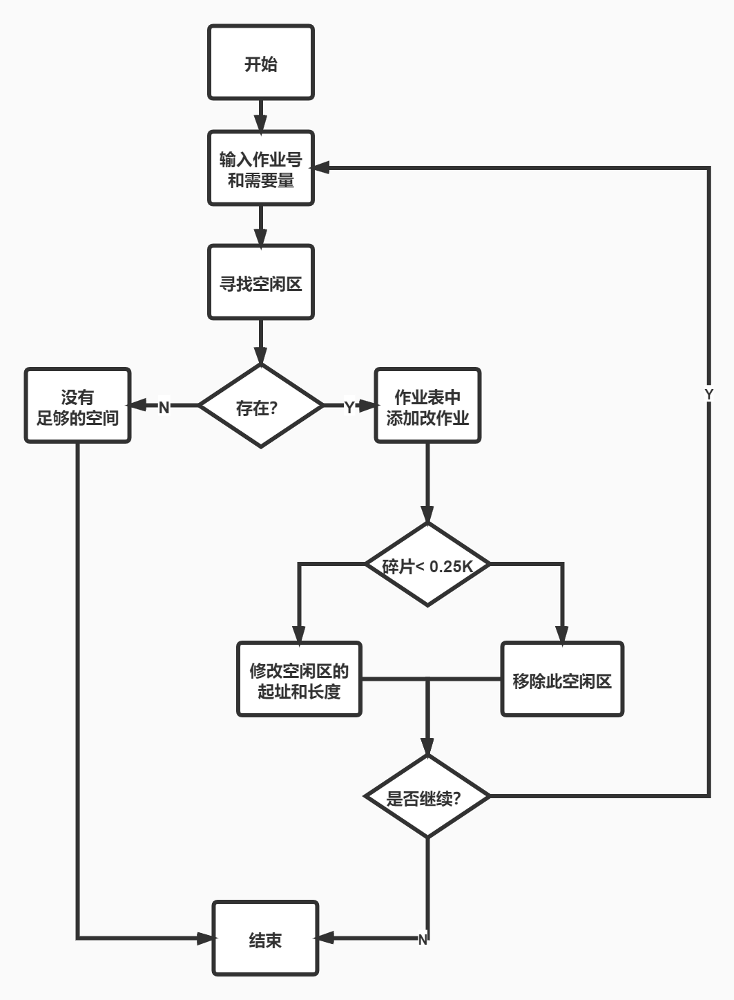


##### 主存回收recycle()

主存回收函数主要逻辑是，用户输入想要撤销的作业号，系统判断作业号是否是0或者作业表是否为空。

如果是，则显示无法进行内存回收，用户可以选择继续或者返回主菜单。

如果不是，则在作业表中寻找改作业，如果没找到则显示作业不再作业表中，用户可以再次输入或者返回主菜单。

如果找到作业，则在作业表中将此作业移除，调用**insertFreeList()**函数将此作业的区域加入空闲区。然后调用**mergeFreeList()**函数将空闲区表中的相邻空闲区合并。


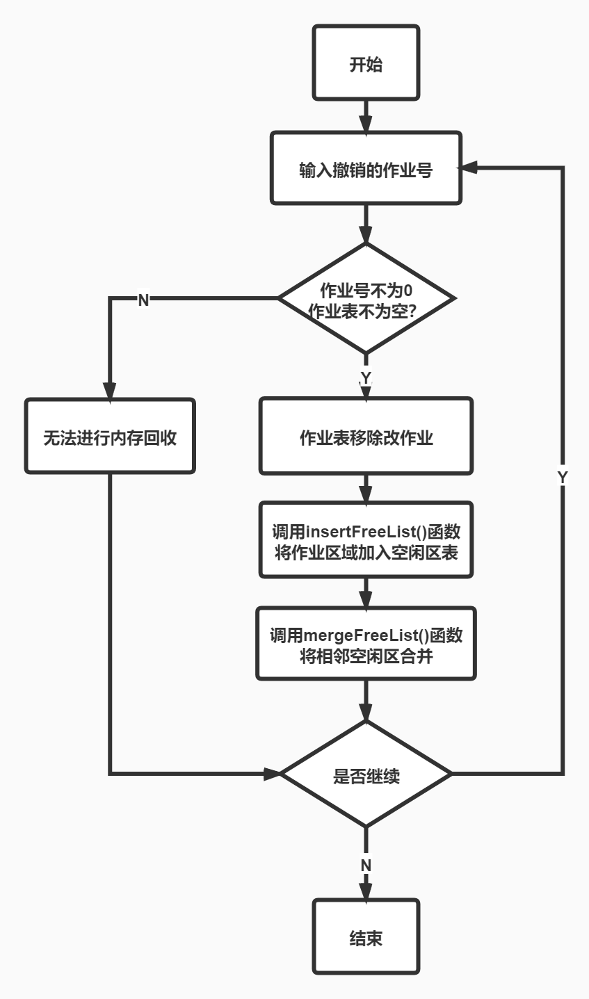


##### 信息展示函数show()

主要用来展示作业登记表和空闲区说明表中的内容信息，实现起来简单，就是用一个循环将链表里面的内容输出打印出来。

```c++
//输出作业登记表中的所有作业信息
void printList(list<Job> jobList) {
	for (list<Job>::iterator it = jobList.begin(); it != jobList.end(); it++) {
		cout << toString(it) << endl;
	}
}
//重载printList()
void printList(list<Free> freeList) {
	for (list<Free>::iterator it = freeList.begin(); it != freeList.end(); it++) {
		cout << toString(it) << endl;
	}
}
//展示作业登记表和空闲区说明表中的所有作业信息
void show(list<Job> jobList, list<Free> freeList) {
	cout << "当前作业登记表内容为" << endl;
	printList(jobList);
	cout << "当前空闲区说明表内容为" << endl;
	printList(freeList);
}
```


##### 空闲区函数insertFreeList()

此函数主要用来将空闲区插入空闲区说明表，为了使空闲区说明表里的空闲区应按照地址顺序进行登记，即每个后续的空闲区其开始地址总是比前者大，在插入的时候就会进行一次循环遍历。

```c++
//向空闲区说明表添加空闲区
void insertFreeList(Free f, list<Free> &freeList) {
	if (!freeList.empty()) {
		for (list<Free>::iterator it = freeList.begin(); it != freeList.end(); it++) {
			if (it->start > f.start) {				//使得空闲区说明表按地址大小升序排列
				freeList.insert(it, f);
				break;
			}
			if (it == --freeList.end() && it->start < f.start) {
				freeList.push_back(f);
			}
		}
	}
	else {
		freeList.push_back(f);
	}
}
```


##### 空闲区合并函数mergeFreeList()

对空闲区表利用迭代器进行一次遍历，只考虑前一个空闲区的尾部是否和后一个空闲区的头部相邻，如果相邻就合并。在调用的时候需要调用两次，才能确保将相邻空闲区全部合并。

```c++
//空闲区表合并函数
void mergeFreeList(list<Free>& freeList) {
	for (list<Free>::iterator it = freeList.begin(); it != freeList.end(); ) {
		list<Free>::iterator temp = it;
		list<Free>::iterator end = freeList.end();
		if (++temp == end) {
			break;
		}
		else if (it->start + it->len == temp->start) {		//如果第一个和第二个相邻
			it->len += temp->len;
			temp = freeList.erase(temp);
			if (temp == end) {
				break;
			}
			else {
				it = temp;
			}
		}
		else {
			it++;
		}		
	}
}
```


#### 4、设计调试与结果

##### 1. 开始

双击可执行文件，就可以进入到开始的主菜单界面，此时系统已经自动完成初始化，可以输入4来查看系统此时信息。

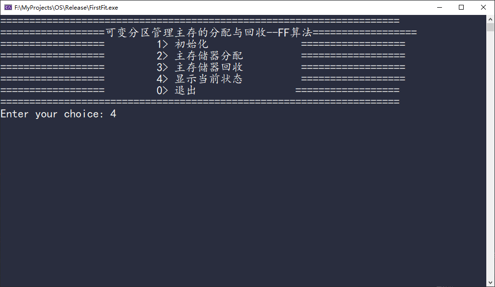

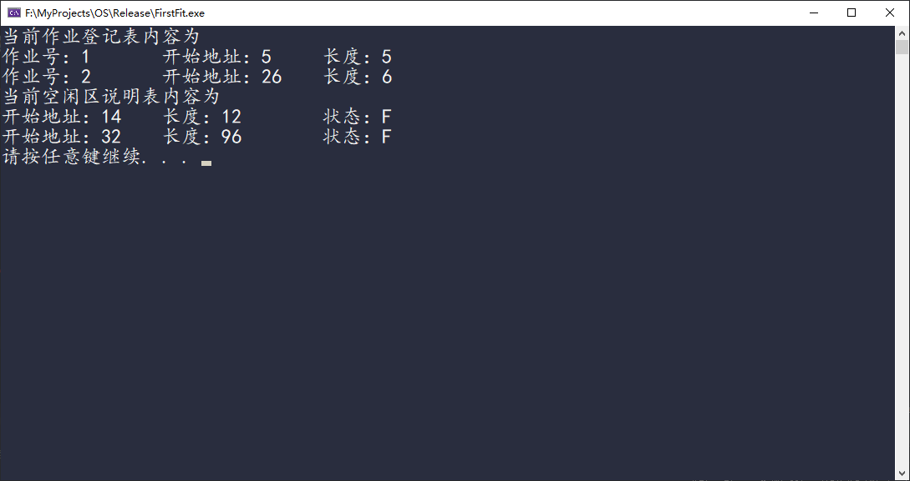


##### 2. 初始化

在主菜单界面下，输入1，可以进入系统初始化模块，选择对应的初始化选项，根据提示可以快速对作业登记表和空闲区说明表进行初始化操作。

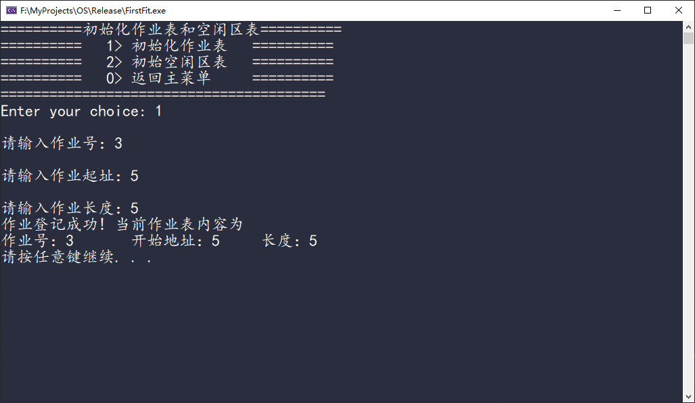

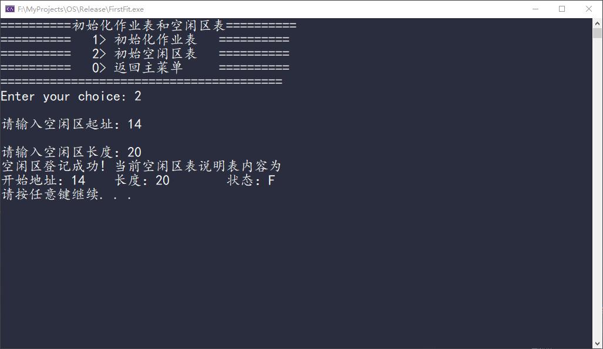


##### 3. 主存储器分配

在主菜单界面下，输入2，可以进入主存储器分配模块，根据提示可以为作业申请内存

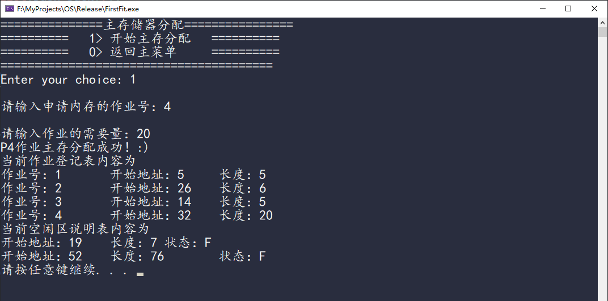


##### 4. 主存储器回收

在主菜单界面下，输入3，可以进入主存储器回收模块，根据提示可以撤销作业，回收主存

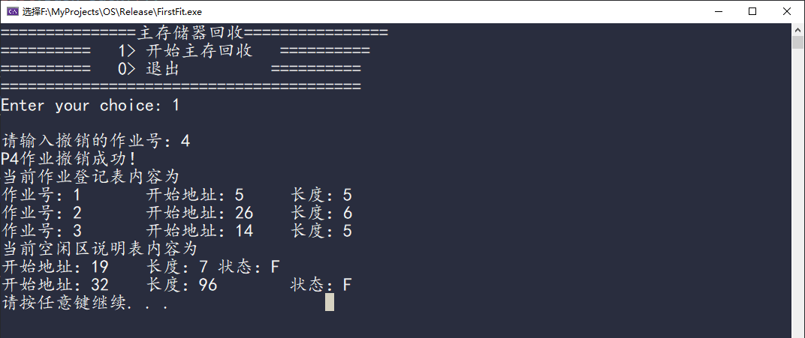


##### 5. 展示当前状态

在主菜单界面下，输入4，可以显示当前作业登记表和空闲区说明表的内容信息

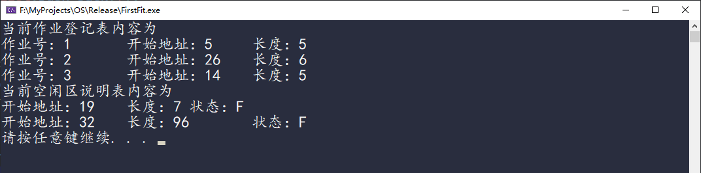


##### 6. 退出

在主菜单界面下，输入0，可以退出系统

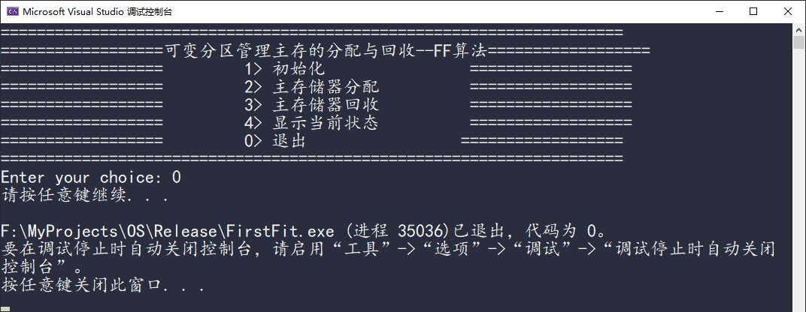

### 四、总结体会

#### 1、处理器调度

开始做处理器调度时，我没有直接就去写代码，而是用了大概半天的时间来阅读课程设计指导书。我明白只有搞清楚了程序的需求和内在功能逻辑才算完成了第一步。

完成了需求分析之后，我也明白了处理器调度程序的逻辑功能。接下来就采用模块化思想，将此程序拆分成三个主要的模块，逐一实现各个功能，最后在主函数调用。整个流程下来不到半天的时间。

在实现过程中也做了一点创新，比如指导书提示用指针将PCB链接成队列，我感觉这操作起来有点麻烦，而且容易出错。于是选择了采用set容器来管理PCB，利用仿函数使容器中PCB始终保持有序。

由于要实现的功能较为简单，而且处理器调度各个算法也都明白原理，做操作系统实验的时候也阅读过Linux进程调度的源码，所以在做处理器调度时没有太大问题。唯一的小问题是很久没写C++代码了，之前都是写Java，手有点生，不过很快就上手了。

####  2、主存的分配与回收

这个实验比第一个复杂一点，看下面所附的代码量也清除，当时复杂和困难不是一回事。只要清楚想要实现的需求，明白功能逻辑，就可以将该实验分解成一个个小模块， 逐一实现，最终也能成功。

感觉选对数据结构是一件非常重要的事，比如空闲区说明表和作业登记表我采用的是STL中的list容器，该容器相当于一个双向链表，很适合动态插入和删除，而且节省内存。

另外明白可变分区算法原理也是一件重要的是，其实写代码是其次，只要真正明白原理，实验就成功一半了。


### 参考文献

[1] 费翔林,骆斌.操作系统教程[M].高等教育出版社:北京,2014:94-112.

[4]管致锦,徐慧,陈德裕.数据结构[M].清华大学出版社:北京,2019:11-29.

[2] Randal E. Bryant,David R. O'Hallaron.深入理解计算机操作系统[M].机械工业出版社:北京,2019:243.

[3]Stanley B. Lippman,Barbara E. Moo. C++ Primer[M].电子工业出版社:北京,2018:373-397.


### 附件：系统源码

#### 1、处理器调度系统源码

```c++
#include<iostream>
#include<sstream>
#include<fstream>
#include<string>
#include<set>
#include<Windows.h>

using namespace std;

struct PCB {
	string name;		//进程名
	int runTime = 0;	//要求运行的时间
	int priority = 0;	//进程的优先数，优先数大的先执行
	string status;		//进程状态，就绪态“R”, 结束“E”
} pcb[5];

//仿函数，用于自定义数据类型排序
class Compare {
public:
	bool operator() (const PCB p1, const PCB p2) const {
		return (p1.priority > p2.priority)			//按照优先级降序排列，如果优先级相同，则名字大的先运行
			|| (p1.priority == p2.priority && p1.name > p2.name);
	}
};


//从文件中读取进程相关数据，初始化进程
void init() {
	ifstream ifs;		//创建流对象
	ifs.open("PCB.txt", ios::in);
	if (!ifs.is_open()) {
		cout << "文件打开失败" << endl;
		return;
	}

	string buff;
	int row = 0;		//行数，跳过第0行的中文字段说明
	while (getline(ifs, buff)) {
		if (row) {
			istringstream str(buff);
			string out;
			int column = 0;		//列数
			while (str >> out) {
				switch (column) {
				case 0:
					pcb[row - 1].name = out;
					break;
				case 1:
					pcb[row - 1].runTime = atoi(out.c_str());		//c语言转换形式，string 转 int
					break;
				case 2:
					pcb[row - 1].priority = atoi(out.c_str());
					break;
				case 3:
					pcb[row - 1].status = out;
					break;
				default:
					break;
				}
				column++;
			}
		}
		row++;
	}
}

string toString(PCB pcb) {
	return "进程名：" + pcb.name + "\t"
		+ "运行时间：" + to_string(pcb.runTime) + "\t"
		+ "优先数：" + to_string(pcb.priority) + "\t"
		+ "状态：" + pcb.status + "\t";
}

//重载toString(PCB pcb)函数
string toString(multiset<PCB,Compare>::iterator pcb) {
	return "进程名：" + pcb->name + "\t"
		+ "运行时间：" + to_string(pcb->runTime) + "\t"
		+ "优先数：" + to_string(pcb->priority) + "\t"
		+ "状态：" + pcb->status + "\t";
}

//打印集合中的所有元素
void printSet(multiset<PCB, Compare> s) {
	for (multiset<PCB, Compare>::iterator it = s.begin(); it != s.end(); it++) {
		cout << toString(it) << endl;
	}
}

//优先级调度算法
void schedule(multiset<PCB, Compare> s) {
	while (!s.empty()) {
		cout << "============================" << endl;
		cout << "正在运行：" << s.begin()->name << endl;
		PCB temp = *s.begin();	//如果set容器不为空，则第一个元素优先级最高，调度运行
		s.erase(s.begin());


		temp.runTime--;			//进程每执行一次，运行时间减1
		temp.priority--;		//进程每执行一次，优先数减1

		if (temp.runTime > 0) {		//如果运行时间大于0，则将其在加入集合中
			s.insert(temp);
			cout << "运行之后结果为：" << endl;
			cout << "============================" << endl;
			printSet(s);
		}
		else {
			temp.status = "E";
			cout << "进程" << temp.name << "运行完成" << endl;
			cout << "============================" << endl;
		}
	}
	cout << "进程调度完毕！:）" << endl;
}

int main() {

	init();

	multiset<PCB, Compare> s;			//定义一个set容器

	for (int i = 0; i < 5; i++) {		//将进程插入set容器，利用仿函数实现自动降序排列，模拟有序队列
		s.insert(pcb[i]);
	}

	cout << "============================" << endl;
	cout << "调度之前的队列为" << endl;
	cout << "============================" << endl;
	printSet(s);

	cout << "============================" << endl;
	cout << "开始进程调度！:)" << endl;
	cout << "============================" << endl;
	schedule(s);
	
	system("pause");				//冻结屏幕，防止窗口一闪而过
	return 0;
}
```


#### 2、主存的分配与回收系统源码

```c++
#include<iostream>
#include<string>
#include<list>
#include<fstream>
#include<sstream>
#include<Windows.h>

using namespace std;

//定义作业结构体
struct Job {
	int num = 0;		//作业号
	int start = 0;		//开始地址
	int len = 0;		//长度
};

//定义空闲区结构体
struct Free {
	int start;		//开始地址
	int len;		//长度
	char status;	//状态，F表示空闲
};


//输出一个作业的相关信息
string toString(Job job) {
	return "作业号：" + to_string(job.num) + "\t"
		+ "开始地址：" + to_string(job.start) + "\t"
		+ "长度：" + to_string(job.len) + "\t";
}

//重载toString()
string toString(list<Job>::iterator it) {
	return "作业号：" + to_string(it->num) + "\t"
		+ "开始地址：" + to_string(it->start) + "\t"
		+ "长度：" + to_string(it->len) + "\t";
}

//重载toString()
string toString(list<Free>::iterator it) {
	return "开始地址：" + to_string(it->start) + "\t"
		+ "长度：" + to_string(it->len) + "\t"
		+ "状态：" + it->status + "\t";
}

//输出作业登记表中的所有作业信息
void printList(list<Job> jobList) {
	for (list<Job>::iterator it = jobList.begin(); it != jobList.end(); it++) {
		cout << toString(it) << endl;
	}
}

//重载printList()
void printList(list<Free> freeList) {
	for (list<Free>::iterator it = freeList.begin(); it != freeList.end(); it++) {
		cout << toString(it) << endl;
	}
}

//展示作业登记表和空闲区说明表中的所有作业信息
void show(list<Job> jobList, list<Free> freeList) {
	cout << "当前作业登记表内容为" << endl;
	printList(jobList);
	cout << "当前空闲区说明表内容为" << endl;
	printList(freeList);
}

//向空闲区说明表添加空闲区
void insertFreeList(Free f, list<Free> &freeList) {
	if (!freeList.empty()) {
		for (list<Free>::iterator it = freeList.begin(); it != freeList.end(); it++) {
			if (it->start > f.start) {				//使得空闲区说明表按地址大小升序排列
				freeList.insert(it, f);
				break;
			}
			if (it == --freeList.end() && it->start < f.start) {
				freeList.push_back(f);
			}
		}
	}
	else {
		freeList.push_back(f);
	}
}

//空闲区表合并函数
void mergeFreeList(list<Free>& freeList) {
	for (list<Free>::iterator it = freeList.begin(); it != freeList.end(); ) {
		list<Free>::iterator temp = it;
		list<Free>::iterator end = freeList.end();
		if (++temp == end) {
			break;
		}
		else if (it->start + it->len == temp->start) {
			it->len += temp->len;
			temp = freeList.erase(temp);
			if (temp == end) {
				break;
			}
			else {
				it = temp;
			}
		}
		else {
			it++;
		}		
	}
}


//用户手动初始化作业和空闲区说明表
void init(list<Job> &jobList, list<Free> &freeList) {
	system("cls");
	jobList.clear();		//清空原来的信息
	freeList.clear();

	int choice = 0;
	Job j;		//作业
	Free f;		//空闲区
	do {
		cout << "==========初始化作业表和空闲区表==========" << endl;
		cout << "==========   1> 初始化作业表   ==========" << endl;
		cout << "==========   2> 初始空闲区表   ==========" << endl;
		cout << "==========   0> 返回主菜单     ==========" << endl;
		cout << "========================================" << endl;
		cout << "Enter your choice: ";
		cin >> choice;

		switch (choice) {
		case 1:
			cout << "\n请输入作业号：";
			cin >> j.num;
			cout << "\n请输入作业起址：";
			cin >> j.start;
			cout << "\n请输入作业长度：";
			cin >> j.len;
			if (j.num != 0) {
				jobList.push_back(j);
				cout << "作业登记成功! 当前作业表内容为" << endl;
				printList(jobList);
			}
			else {
				cout << "作业号输入错误！无法登记作业表" << endl;
			}

			system("pause");
			system("cls");
			break;
		case 2:
			cout << "\n请输入空闲区起址：";
			cin >> f.start;
			cout << "\n请输入空闲区长度：";
			cin >> f.len;
			f.status = 'F';

			if (f.len != 0) {

				insertFreeList(f, freeList);		//调用空闲表插入函数

				cout << "空闲区登记成功! 当前空闲区表说明表内容为" << endl;
				printList(freeList);
			}
			else {
				cout << "空闲区长度输入错误！无法登记空闲区表" << endl;
			}

			system("pause");
			system("cls");
			break;
		default:
			choice = 0;
			break;
		}
	} while (choice != 0);

	system("cls");
}

//系统从文件自动初始化作业表和空闲区说明表
void autoInit(list<Job>& jobList, list<Free>& freeList) {

	jobList.clear();		//清空原来的信息
	freeList.clear();
	Job j;
	Free f;

	ifstream ifs;		//创建流对象
	ifs.open("init.txt", ios::in);
	if (!ifs.is_open()) {
		cout << "文件打开失败" << endl;
		return;
	}

	string buff;
	int row = 0;		//行数，跳过第0行的中文字段说明
	while (getline(ifs, buff)) {
		if (row) {
			istringstream str(buff);
			string out;
			int column = 0;		//列数
			while (str >> out) {
				switch (column) {
				case 0:
					j.num = atoi(out.c_str());
					break;
				case 1:
					j.start = atoi(out.c_str());		//c语言转换形式，string 转 int
					break;
				case 2:
					j.len = atoi(out.c_str());
					jobList.push_back(j);
					break;
				case 3:
					f.start = atoi(out.c_str());
					break;
				case 4:
					f.len = atoi(out.c_str());
					break;
				case 5:
					f.status = out[0];
					insertFreeList(f, freeList);
					break;
				default:
					break;
				}
				column++;
			}
		}
		row++;
	}
}

//主存储器分配
void allocation(list<Job>& jobList, list<Free>& freeList) {
	system("cls");	//清屏

	int choice = 0;
	Job j;		//作业

	do {
		cout << "===============主存储器分配================" << endl;
		cout << "==========   1> 开始主存分配   ==========" << endl;
		cout << "==========   0> 返回主菜单     ==========" << endl;
		cout << "========================================" << endl;
		cout << "Enter your choice: ";
		cin >> choice;
		switch (choice) {
		case 1:
			cout << "\n请输入申请内存的作业号：";
			cin >> j.num;
			cout << "\n请输入作业的需要量：";
			cin >> j.len;

			if (j.num != 0) {
				for (list<Free>::iterator it = freeList.begin(); it != freeList.end(); it++) {
					if (it->len >= j.len) {
						j.start = it->start;
						jobList.push_back(j);		//将该作业加入作业登记表中

						if (( (double)it->len - j.len ) > 0.25) {
							it->start += j.len;			//修改空闲区的起址和长度
							it->len -= j.len;
						}
						else {				//如果碎片大小小于0.25K，就全部分给作业
							freeList.erase(it);
						}

						cout << "P" << j.num << "作业主存分配成功！:)" << endl;
						break;
					}

					if (it == --freeList.end() && it->len < j.len) {
						cout << "没有足够的空间，无法分配！" << endl;
						break;
					}
				}

			}
			else {
				cout << "输入的作业号有误！无法进行内存分配" << endl;
			}

			show(jobList, freeList);		//展示分配之后的信息
			system("pause");
			system("cls");
			break;
		default:
			choice = 0;
			break;
		}

	} while (choice != 0);

	system("cls");
}

//主存储器的回收
void recycle(list<Job>& jobList, list<Free>& freeList) {
	system("cls");	//清屏
	int choice = 0;
	Job j;		//作业
	Free f;		//空闲区

	do {
		cout << "===============主存储器回收================" << endl;
		cout << "==========   1> 开始主存回收   ==========" << endl;
		cout << "==========   0> 退出          ==========" << endl;
		cout << "========================================" << endl;
		cout << "Enter your choice: ";
		cin >> choice;
		switch (choice) {
		case 1:
			cout << "\n请输入撤销的作业号：";
			cin >> j.num;
			if (j.num != 0 && !jobList.empty()) {
				for (list<Job>::iterator it = jobList.begin(); it != jobList.end(); it++) {
					if (it->num == j.num) {				//如果找到要撤销的作业,就将此区域变成空闲区
						f.start = it->start;
						f.len = it->len;
						f.status = 'F';
						jobList.erase(it);
						insertFreeList(f, freeList);		//将此空闲区插入空闲登记表中
						mergeFreeList(freeList);//合并相邻分区, 需要执行两次，因为合并一
						mergeFreeList(freeList);//次之后，原本不相邻的分区可能变成相邻

						cout << "P" << j.num << "作业撤销成功！" << endl;
						break;
					}

					if (it == --jobList.end() && it->num != j.num) {
						cout << "没有找到要撤销的作业，作业撤销失败！" << endl;
						break;
					}
				}
			}
			else {
				cout << "输入的作业号有误或没有该作业！无法进行内存回收" << endl;
			}

			show(jobList, freeList);		//展示撤销作业之后的信息
			system("pause");
			system("cls");
			break;
		default:
			choice = 0;
			break;
		}

	} while (choice != 0);

	system("cls");
}

int main() {

	list<Job> jobList;		//建立作业登记表
	list<Free> freeList;	//建立空闲区说明表

	autoInit(jobList, freeList);		//系统自动从文件初始化，用户可以在之后手动初始化

	int choice = 0;			//菜单选择
	
	do {
		cout << "=====================================================================" << endl;
		cout << "==================可变分区管理主存的分配与回收--FF算法==================" << endl;
		cout << "==================         1> 初始化                ==================" << endl;
		cout << "==================         2> 主存储器分配          ==================" << endl;
		cout << "==================         3> 主存储器回收          ==================" << endl;
		cout << "==================         4> 显示当前状态          ==================" << endl;
		cout << "==================         0> 退出                 ==================" << endl;
		cout << "=====================================================================" << endl;
		cout << "Enter your choice: ";
		cin >> choice;

		switch (choice) {
		case 1:
			init(jobList, freeList);
			break;
		case 2:
			allocation(jobList, freeList);
			break;
		case 3:
			recycle(jobList, freeList);
			break;
		case 4:
			system("cls");
			show(jobList, freeList);

			system("pause");
			system("cls");
			break;
		default:
			choice = 0;
			break;
		}

	} while (choice != 0);
	

	system("pause");
	return 0;
}
```