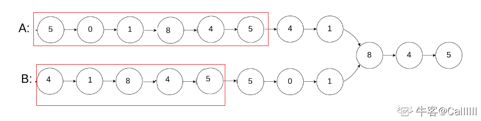

## [矩阵元素之和](https://www.nowcoder.com/practice/3afe6fabdb2c46ed98f06cfd9a20f2ce)

```cpp
class Solution {
 public:
  vector<int> findElement(vector<vector<int> > mat, int n, int m, int x) {
    // write code here

    int i = n - 1, j = 0;  // 左下角

    while (i >= 0 && j <= m - 1) {
      // 始终保持mat[i][j] 是在左下角
      if (mat[i][j] > x) {
        // 说明该行都比x大，往上走，消去该行
        --i;
      } else if (mat[i][j] < x) {
        // 说明该列都比x小，往右走，消去该列
        ++j;
      } else {
        return {i, j};
      }
    }

    return {};
  }
};
```


## [编程题: 棋子翻转](https://www.nowcoder.com/questionTerminal/b0d2c7f3a5b1429ba41997dc935f2594?orderByHotValue=0&mutiTagIds=179&page=1&onlyReference=false)

```cpp
class Flip {
 public:
  void flipChess(vector<vector<int>>& A, vector<vector<int>>& f) {
    // write code here
    // 小技巧，设置两个增量数组，可以用来表示上下左右
    int X[4] = {1, -1, 0, 0};
    int Y[4] = {0, 0, 1, -1};

    for (const auto& a : f) {
      for (int i = 0; i < 4; ++i) {
        int xt = a[0] + X[i];
        int yt = a[1] + Y[i];

        if (xt >= 1 && xt <= 4 && yt >= 1 && yt <= 4) {
          A[xt - 1][yt - 1] ^= 1;
        }
      }
    }
  }
};
```


## **NC78** **反转链表**

```cpp
/*
struct ListNode {
	int val;
	struct ListNode *next;
	ListNode(int x) :
			val(x), next(NULL) {
	}
};*/
class Solution {
public:
    ListNode* ReverseList(ListNode* pHead) {
       ListNode* pre = nullptr;
        ListNode* cur = pHead;
        ListNode* nex = nullptr;
        while(cur) {
            nex = cur->next;
            cur->next = pre;
            pre = cur;
            cur = nex;
        }
        return pre;
    }
};
```


## **NC19** **连续子数组的最大和**

```cpp
class Solution {
public:
    int FindGreatestSumOfSubArray(vector<int> array) {
        int n = array.size();
        vector<int> dp(n+1, 0);
        
        // 边界
        dp[0] = array[0];
        
        for(int i = 1; i < n; ++i) {
            dp[i] = max(array[i], dp[i-1] + array[i]);
        }
        
        int k = 0;
        for(int i = 1; i < n; ++i) {
            if(dp[i] > dp[k]) {
                k = i;
            }
        }
        
        return dp[k];
            
    }
};
```


## **NC33** **合并两个排序的链表**

```cpp
/*
struct ListNode {
	int val;
	struct ListNode *next;
	ListNode(int x) :
			val(x), next(NULL) {
	}
};*/
class Solution {
public:
    ListNode* Merge(ListNode* pHead1, ListNode* pHead2) {
        ListNode* head = new ListNode(-1);
        ListNode* p = head;
        while(pHead1 != nullptr && pHead2 != nullptr) {
            if(pHead1->val < pHead2->val) {
                p->next = pHead1;
                pHead1 = pHead1->next;
            } else {
                p->next = pHead2;
                pHead2 = pHead2->next;
            }
            p = p->next;
        }
        
        p->next = pHead1 == nullptr ? pHead2 : pHead1;
        
        return head->next;
    }
};
```


## **NC66** **两个链表的第一个公共结点**

```cpp
class Solution {
public:
    ListNode* FindFirstCommonNode( ListNode* pHead1, ListNode* pHead2) {
        ListNode *ta = pHead1, *tb = pHead2;
        while (ta != tb) {
            ta = ta ? ta->next : pHead2;
            tb = tb ? tb->next : pHead1;
        }
        return ta;
    }
};
```

假设链表`A`长度为`a`， 链表`B`的长度为`b`，此时`a != b`。但是，`a+b == b+a`

因此，可以让a+b作为链表A的新长度，b+a作为链表B的新长度。




## **NC41** **最长无重复子数组**

### 条件：

1. 设置两个指针/索引，`left = 0` `right = 1`；
2. `map<int,int>`，记录数组元素的 值-索引： `value：index`

### 设定：

1. `left`到`right`之间的元素为连续不重复；
2. `map`中存放`left`到`right`间元素的 值-索引 对；
3. 初始`left right`都在数组首部，从`right++`进数，从`left--`出数；
4. **进数：** `right++`，检查`map`(含连续不重复子序列中所有元素) 中是否存在`arr[right]`，不存在即不重复，向连续不重复子序列进数，加入`map`，`right`继续向前。
5. **出数：** `left--`,以上检查`map`是否含`arr[right]`时，若存在，则需要从`left`段出数，即从`map`中吐出`arr[left]`，并`left++`，直至`arr[left]==arr[right]`，即一直吐到存在的和当前`right`所指同值元素。
6. 在每次进数出数的过程中，维护不重复子数组的最大长度`maxLength = max{maxLength, map.size()}`

> 整个过程，像蚯蚓一样伸缩爬动至数组末尾，`right`为头 一直向前吞，`left`为尾 一直前缩吐数。

```cpp
int maxLength(vector<int>& arr) {
  // write code here'
  int n = arr.size();
  int ans = 0;
  std::unordered_map<int, int> mp;

  for (int left = 0, right = 0; right < n; ++right) {
    mp[arr[right]]++;

    while (mp[arr[right]] > 1) {
      mp[arr[left++]]--;
    }

    ans = max(ans, right - left + 1);
  }

  return ans;
}
```


## **NC1** **大数加法**

```cpp
string solve(string s, string t) {
  // 若其中一个为空，则直接返回
  if (s.empty() || t.empty()) return s + t;

  if (s.length() < t.length()) swap(s, t);

  int carry = 0;

  for (int i = s.length() - 1, j = t.length() - 1; i >= 0; --i, --j) {
    int tmp = s[i] - '0' + carry;

    if (j >= 0) {
      tmp += t[j] - '0';
    }
    s[i] = tmp % 10 + '0';
    carry = tmp / 10;
  }

  if (carry == 1) {
    s = '1' + s;
  }

  return s;
}
```


## **NC73** **数组中出现次数超过一半的数字**


