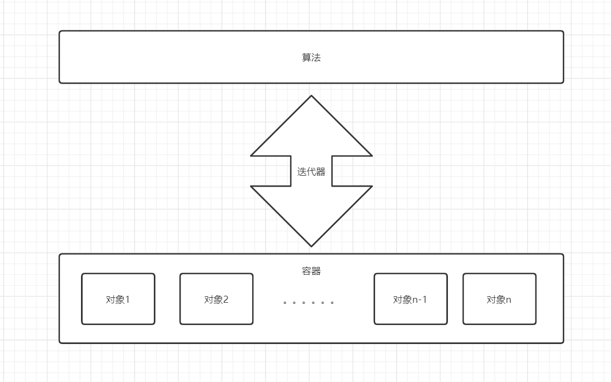

# STL

STL主要由`container(容器)、algorithm(算法)、iterator(迭代器)`三大部分组成。





### 什么是STL算法


> 使用STL算法`sort()`实现整型数组a的递增排序

```c++
#include<algorithm>
using namespace std;

int main() {
	int a[] = { 2, 3, 5, 4, 1 };
	sort(a, a + 5);
	for (int i = 0; i < 5; i++) {
		printf("%d ", a[i]);
	}
	printf("\n");

	return 0;
}
```


### 什么是STL迭代器

| 迭代器                 | 描述                                                         |
| ---------------------- | ------------------------------------------------------------ |
| input_iterator         | 提供读功能的向前移动迭代器，它们可被进行增加(++)，比较与解引用（*）。 |
| output_iterator        | 提供写功能的向前移动迭代器，它们可被进行增加(++)，比较与解引用（*）。 |
| forward_iterator       | 可向前移动的，同时具有读写功能的迭代器。同时具有input和output迭代器的功能，并可对迭代器的值进行储存。 |
| bidirectional_iterator | 双向迭代器，同时提供读写功能，同forward迭代器，但可用来进行增加(++)或减少(--)操作。 |
| random_iterator        | 随机迭代器，提供随机读写功能.是功能最强大的迭代器， 具有双向迭代器的全部功能，同时实现指针般的算术与比较运算。 |
| reverse_iterator       | 如同随机迭代器或双向迭代器，但其移动是反向的。（Either a random iterator or a bidirectional iterator  that moves in reverse direction.）（我不太理解它的行为） |


```cpp
#include<algorithm>
#include<vector>
using namespace std;

int main() {
	vector<int> myVec;

	myVec.push_back(1);
	myVec.push_back(2);
	myVec.push_back(3);
	myVec.push_back(4);

	//使用正向迭代器 it
	for (vector<int>::iterator it = myVec.begin(); it != myVec.end(); it++) {
		printf("%d ", *it);
	}
	printf("\n");

	//使用反向迭代器 rit
	for (vector<int>::reverse_iterator rit = myVec.rbegin(); rit != myVec.rend(); rit++) {
		printf("%d ", *rit);
	}

	printf("\n");

	return 0;
}
```


