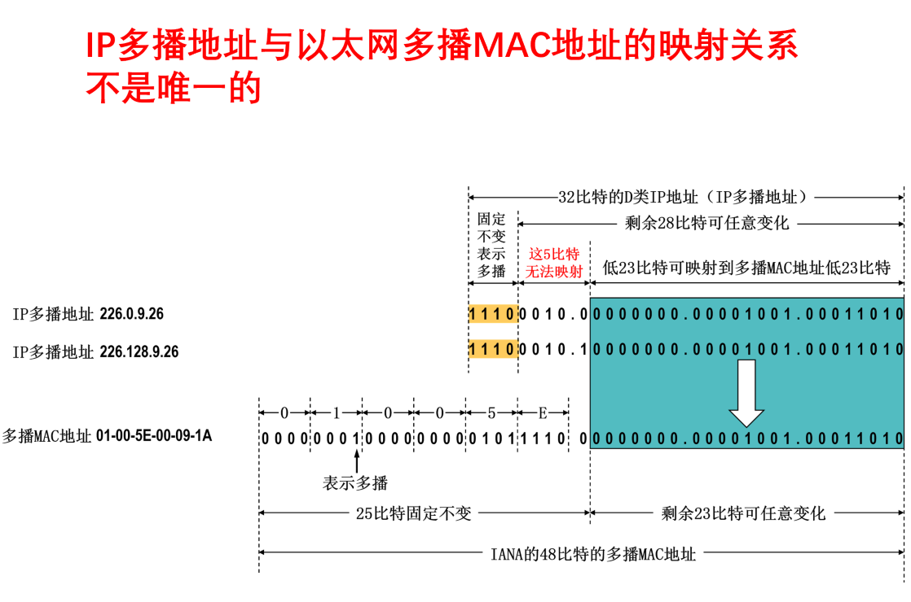

# 网络层

## IP多播

IANA拥有以太网地址块的高24位为`00-00-5E`，因此TCP/IP协议使用的以太网多播地址块范围为00-00-5E-00-00-00到00-00-5E-FF-FF-FF。

以太网硬件地址字段中的第一个字节的最低位为1即为多播地址，且这种多播地址占IANA（互联网号码指派管理局）**分配到的地址数的一半**（第24位为0的地址均分配给多播）。则以太网硬件多播地址范围为01-00-5E-00-00-00到01-00-5E-7F-FF-FF。

**由IP地址映射到硬件地址时，前0-23位为`01-00-5E`，第24位为`0`，剩下23位来自IP地址的低23位**

由于**IP多播地址与以太网硬件地址的映射关系不是唯一的**，因此收到多播数据报的主机还要在IP层利用软件过滤。

# 传输层

## TCP连接

TCP三次握手最后一次确认的ACK报文段可以携带数据。如果不携带数据则不消耗序列号，开始数据传输时序列号仍然是seq = x + 1。

