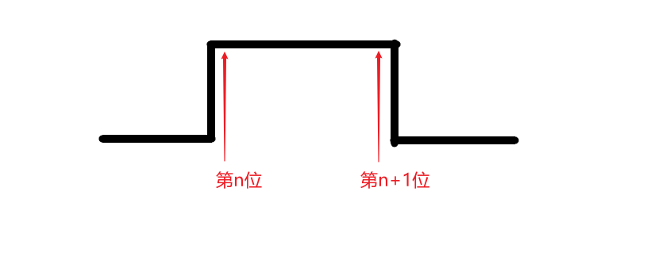

# 第五次学习札记

## GPIO模拟UART通信


### 前言

KL36一共有三个串口通信模块，在需要多个串口进行通信的时候，此时可能会出现串口不够用的情况。 此时就需要通过GPIO进行串口模拟。


### 知识准备

#### 1. UART串口发送数据基本波形

想要模拟串口，我们首先应该知道UART发送数据的基本波形。通过书本和波形观察得知：

* UART采用双极性非归零编码，低电平对应逻辑0，高电平对应逻辑1
* 以字节为单位，每个字节均有起始位和终止位。
* UART采用异步传输，线路平常保持高电平。MCU检测到低电平说明有数据过来，进入UART中断，起始位为低电平占用一个周期，中间是8个周期的数据部分，最后一个周期的终止位。读取完毕后，清中断。如果还有数据，将会再次触发中断，重复以上步骤。
* UART发送数据的时候，从数据的低位开始发送

比如我们发送字符“u”的ASCII码是01110101，那么串口就会先发一个周期的低电平也就是起始位，然后发送8个周期的数据位10101110（从低位开始发），最后是终止位。


#### 2. 中断

当没有数据发送和接收的时候，CPU可以去忙其他事情。只有当有数据过来的时候，CPU才会处理到来的数据。使用中断是一种很好的实现方式。

KL36有一个中断向量控制器，想要模拟串口就必须在中断控制器中使能GPIO中断。KL36只有A、C、D端口可以使能中断。


### 3. 时钟周期

串口发送可以设置波特率，也就是每秒钟可以发送多少位。对应的可以求出每一位所占用的时间，接下来模拟串口发送的时候，就是设置引脚的高低点平持续这个时间，达到模拟串口的效果。

比如115200波特率，每一位占用8.68微秒，9600波特率占用104.1微秒。


### 构件实现

懂的原理后，再实现GPIO模拟UART的构件就比较简单了。通过分析，我们决定将该构件命名为`suart.h`和`suart.c`，意思是`simulate uart`。该构件应该具有以下功能：

* 串口初始化`suart_init()`，将两个引脚初始化成UART的发送和接收引脚。
* 设置引脚状态`suart_set()`，将引脚设置成高电平或者低电平。
* 获取端口状态`suart_get()`，获取引脚状态。
* 发送数据`suart_send()`，模拟串口发送数据。
* 接收数据`suart_send()`，模拟串口接收数据。
* 使能接收中断`suart_enable_receive_interupt()`，使能接收引脚的GPIO中断，下降沿触发。

### **构件使用**

首先在**main.c**中初始化并且开启串口接收中断

```c
// 初始化发送串口和接收串口
suart_init(SUART_TX, SUART_SEND);
suart_init(SUART_RX, SUART_RECEVIE);  
// 使能串口接收中断
suart_enable_receive_interupt(SUART_RX);
```

其次在 user.h 中包含`suart.h`头文件，然后声明中断服务函数

```c
#include "suart.h"
#define SUART_PortA_Handler PORTA_IRQHandler    //用户串口中断函数
#define SUART_PortC_PortD_Handler PORTC_PORTD_IRQHandler
```

最后在` isr.c` 文件中实现中断函数

```c
void SUART_PortC_PortD_Handler(void) {

    uint32_t len = suart_receive(SUART_RX, gReceiveBuff);
    printf("gLenth: %d\n", len);
    suart_send(SUART_TX, gReceiveBuff, len);
    
}
```


### Q&A

在进行调试的时候，遇到一个比较有意思的问题：当接收连续数据且数据量比较大的时候，就会出现重复采集一位的值的情况：



原因就是当连续接收的时候，误差值会累加，导致会出现采集点不再是中间，而是靠近开始的点平跳变。这时如果MCU又优化了空循环导致后一位也采集了上一位的值。


### 源码

**suart.h**

```c
#include "mcu.h"
#include "printf.h"
#include "gec.h"

// 端口起始地址
#define PORT_START_BASE ((uint32_t*)(0x40049000u))
#define SUART_START_BASE ((uint32_t*)(0x400FF000u))
// 每个端口基地址相差 100H
#define PORT_BASE(port) (PORT_START_BASE + (port*1024))
// 相应引脚的控制寄存器
#define PORT_PCR(port, pin) (*(PORT_BASE(port) + pin))
// 每个SUART口的基地址相差 40H
#define SUART_BASE(port) (SUART_START_BASE + (port*16))
// 每个SUART口相应的寄存器
#define SUART_PDOR(port) (*(SUART_BASE(port)+0))
#define SUART_PSOR(port) (*(SUART_BASE(port)+1))
#define SUART_PCOR(port) (*(SUART_BASE(port)+2))
#define SUART_PTOR(port) (*(SUART_BASE(port)+3))
#define SUART_PDIR(port) (*(SUART_BASE(port)+4))
#define SUART_PDDR(port) (*(SUART_BASE(port)+5))

// 端口号地址偏移量宏定义
#define PTA_NUM    (0<<8)
#define PTB_NUM    (1<<8)
#define PTC_NUM    (2<<8)
#define PTD_NUM    (3<<8)
#define PTE_NUM    (4<<8)

// 发送和接收方向定义
#define SUART_SEND (1)
#define SUART_RECEVIE (0)

//【变动】SUART可用模块定义
// MCU发送端口和引脚号
#define  SUART_TX   (PTC_NUM | 0)  // GEC_40
// MCU接收端口和引脚号
#define  SUART_RX   (PTC_NUM | 1)  // GEC_39

// 根据示波器调试出来，MCU做空操作22次，可模拟波特率115200，也就是位长大概8.69us
#define delayCount (22)     // 波特率 115200
// #define delayCount (300)        // 波特率 9600

// 模拟串口初始化
void suart_init(uint16_t port_pin, uint8_t dir);

// 设置串口状态
void suart_set(uint8_t port, uint8_t pin, uint8_t status);

// 获取串口状态 
uint8_t suart_get(uint8_t port, uint8_t pin);

// 发送字符
void suart_send(uint16_t port_pin, uint8_t* arr, uint32_t len);

// 接收字符
uint32_t suart_receive(uint16_t port_pin, uint8_t* arr);

// 接收一个字符

// 打开串口接收中断, 下降沿触发
void suart_enable_receive_interupt(uint16_t port_pin);
```


**suart.c**

```c
#include "suart.h"

// 内部函数声明
void suart_get_port_pin(uint16_t port_pin, uint8_t* port, uint8_t* pin);

// 模拟串口初始化
void suart_init(uint16_t port_pin, uint8_t dir) {
    uint8_t port, pin;
    suart_get_port_pin(port_pin, &port, &pin);

    //设定相应端口的相应引脚功port能为GPIO（即令引脚控制寄存器的MUX=0b001）
    PORT_PCR(port, pin) &= ~PORT_PCR_MUX_MASK;//置D10-D8=000
    PORT_PCR(port, pin) |= PORT_PCR_MUX(1);//置D10-D8=001

    // 根据带入参数dir, 决定引脚为输出还是输入
    if (dir == 1) {
        // 数据方向寄存器对应位设为1，表示输出
        BSET(pin, SUART_PDDR(port));

        // 数据输出寄存器对应位设为1(没有数据时保持高电平)，表示高电平
        BSET(pin, SUART_PDOR(port));
    }
    else {
        // 数据方向寄存器对应位设为0，表示输入
        BCLR(pin, SUART_PDDR(port));
    }
}

void suart_set(uint8_t port, uint8_t pin, uint8_t status) {
    if (status == 1) {
        BSET(pin, SUART_PDOR(port));
    }
    else {
        BCLR(pin, SUART_PDOR(port));
    }
}


uint8_t suart_get(uint8_t port, uint8_t pin) {
    // 一般都是获取相应引脚的输入寄存器的值
    return BGET(pin, SUART_PDIR(port));
}

// 这个函数的实现本可以用循环来操作，可减少代码量
// 但是经过测试发现，循环每次判断操作也占用一定时间
// 可能会引起一定的误差（用while循环，大概1us），所以就直接对每一位操作
// 下面的suart_receive()函数同理
void suart_send(uint16_t port_pin, uint8_t* arr, uint32_t len) {
    uint8_t port, pin;
    suart_get_port_pin(port_pin, &port, &pin);

    uint8_t bit[8];

    for (uint32_t count = 0; count < len; count++) {
        // 将字符转成二进制数组
        for (uint8_t i = 0; i < 8; i++) {
            bit[i] = arr[count] >> i & 1;
        }

        // 起始位，将电平拉低一个周期表示开始发送数据
        suart_set(port, pin, 0);
        for (uint16_t i = 0; i < delayCount; i++) {}

        // 第0位
        suart_set(port, pin, bit[0]);
        for (uint16_t i = 0; i < delayCount; i++) {}

        // 第1位
        suart_set(port, pin, bit[1]);
        for (uint16_t i = 0; i < delayCount; i++) {}

        // 第2位
        suart_set(port, pin, bit[2]);
        for (uint16_t i = 0; i < delayCount; i++) {}

        // 第3位
        suart_set(port, pin, bit[3]);
        for (uint16_t i = 0; i < delayCount; i++) {}

        // 第4位
        suart_set(port, pin, bit[4]);
        for (uint16_t i = 0; i < delayCount; i++) {}

        // 第5位
        suart_set(port, pin, bit[5]);
        for (uint16_t i = 0; i < delayCount; i++) {}

        // 第6位
        suart_set(port, pin, bit[6]);
        for (uint16_t i = 0; i < delayCount; i++) {}

        // 第7位
        suart_set(port, pin, bit[7]);
        for (uint16_t i = 0; i < delayCount; i++) {}

        // 终止位, 将电平拉高
        suart_set(port, pin, 1);
        for (uint16_t i = 0; i < delayCount; i++) {}
    }
}


uint32_t suart_receive(uint16_t port_pin, uint8_t* arr) {

    uint8_t port, pin;
    uint16_t count = 4096;
    uint32_t len = 0;
    arr[len] = 0;
    uint8_t bit[8];

    suart_get_port_pin(port_pin, &port, &pin);

    while (count--) {
        // 起始位
        for (uint16_t i = 0; i < delayCount / 2; i++) {}
        suart_get(port, pin);

        // 第0位
        for (uint16_t i = 0; i < delayCount; i++) {}
        bit[0] = suart_get(port, pin);

        // 第1位
        for (uint16_t i = 0; i < delayCount; i++) {}
        bit[1] = suart_get(port, pin);

        // 第2位
        for (uint16_t i = 0; i < delayCount; i++) {}
        bit[2] = suart_get(port, pin);

        // 第3位
        for (uint16_t i = 0; i < delayCount; i++) {}
        bit[3] = suart_get(port, pin);

        // 第4位
        for (uint16_t i = 0; i < delayCount; i++) {}
        bit[4] = suart_get(port, pin);

        // 第5位
        for (uint16_t i = 0; i < delayCount; i++) {}
        bit[5] = suart_get(port, pin);

        // 第6位
        for (uint16_t i = 0; i < delayCount; i++) {}
        bit[6] = suart_get(port, pin);

        // 第7位
        for (uint16_t i = 0; i < delayCount; i++) {}
        bit[7] = suart_get(port, pin);

        // 终止位, 这里减少10次，是因为下面的语句执行也要占用一定时间
        // 所以利用终止位的时间来进行这些运算
        for (uint16_t i = 0; i < delayCount - 10; i++) {}

        for (uint8_t i = 0; i < 8; i++) {
            arr[len] += (bit[i] << i);
        }
        if (!(arr[len] ^ 255)) {
            arr[len] = '\0';
            PORT_PCR(port, pin) |= PORT_PCR_ISF(1); // 清除中断状态
            return len;
        }
        count = 4096;
        arr[++len] = 0;

        // 消耗掉终止位剩余的时间，方便进行下一个字符的接收
        while (count--) {
            if (!suart_get(port, pin)) {
                break;
            }
        }
    }
}

// 打开串口接收中断, 下降沿触发
void suart_enable_receive_interupt(uint16_t port_pin) {
    uint8_t port, pin;
    suart_get_port_pin(port_pin, &port, &pin);

    // 清引脚控制寄存器中断配置字段，将D19-D16置零
    PORT_PCR(port, pin) &= ~PORT_PCR_IRQC_MASK;
    // 将D19-D16置成1010， 表示下降沿触发
    PORT_PCR(port, pin) |= PORT_PCR_IRQC(10);

    if (port == 0) {
        NVIC_EnableIRQ(PORTA_IRQn);    //使能A端口中断
    }
    else if (port == 2 || port == 3) {
        NVIC_EnableIRQ(PORTC_PORTD_IRQn);    //使能C、D端口中断
    }
    else {
        printf("Fail to init port interupt！！！\n");
        printf("Please select around Port A or C or D\n");
    }

}


// 内部函数存放处
void suart_get_port_pin(uint16_t port_pin, uint8_t* port, uint8_t* pin)
{
    *port = (port_pin >> 8);
    *pin = port_pin;
}

```

