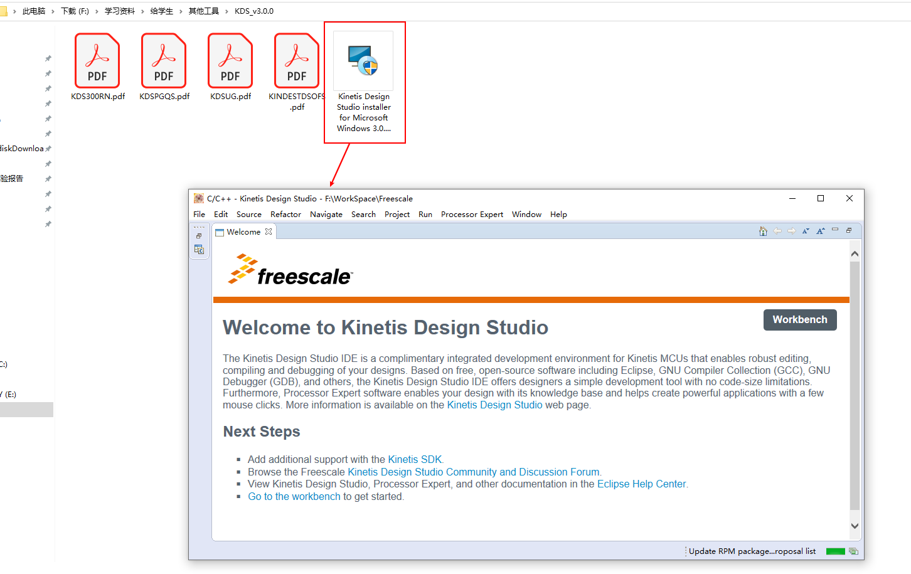
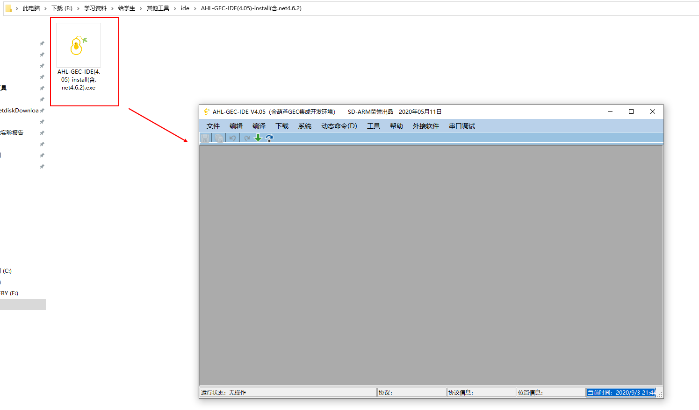
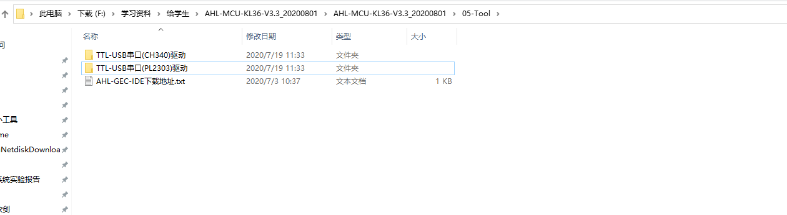

# 第一次学习札记

## 开发环境准备

### 安装Kinetis Design Studio

双击`Kinetis Design Studio`安装包，保持默认配置，一直点下一步即可。安装好之后，双击桌面图标，打开软件如下图所示，



### 安装金葫芦

双击`AHL-GEC-IDE(4.05)-install(含.net4.6.2)`安装包，保持默认，一直点击下一步即可。安装好之后，选择稍后重启。



接下来安装两个驱动程序，同样保持默认配置即可。

> “..\05-Tool \TTL-USB串口(CH340)驱动\SETUP.EXE”文件，安装CH340型TTL-USB串口驱动。
>
> “..\05-Tool\TTL-USB串口(PL2303)驱动\PL2303_Prolific_DriverInstaller_v1.5.0.exe”文件，安装PL2303型TTL-USB串口驱动。



重启计算机，使配置生效。


## 实验总结

### 引脚初始化一般步骤

```c
	//1. 找到端口相应的基地址，可以参考KL36参考手册
    volatile uint32_t *portA_base = (uint32_t *)0x40049000u;

    //2. 找到端口相应引脚控制器的地址
    volatile uint32_t *portA_pcr_5 = portA_base + 5;

    //3. 将端口的相应引脚设置成 GPIO
    *portA_pcr_5 &= ~0x700u; //清MUX位段
    *portA_pcr_5 |= 0x100u;

    //4. 找到端口相应GPIO寄存器的基地址
    volatile uint32_t *gpioA_base = (uint32_t *)0x400FF000u;

    //6. 找到端口的 GPIO数据输出寄存器 pdor
    volatile uint32_t *portA_pdor = gpioA_base + 0;

    //7. 找到端口的 GPIO数据输入寄存器 pdir
    volatile uint32_t *portA_pdir = gpioA_base + 4;

    //8. 找到端口的GPIO数据方向寄存器地址
    volatile uint32_t *portA_pddr = gpioA_base + 5;

    //9. 定义相应引脚的输入输出状态
    *portA_pddr |= (1 << 5);

```


## 课后作业

### 作业一

> 求**MKL36Z64VLH4**
>
> * Flash大小？
> * RAM的大小？
> * Flash地址范围？
> * SRAM_L和SRAM_U地址范围？

| Flash大小 | RAM大小 | Flash地址范围           | SRAM_L地址范围          | SRAM_U地址范围          |
| --------- | ------- | ----------------------- | ----------------------- | ----------------------- |
| 64KB      | 8KB     | 0x0000_0000-0x0000_FFFF | 0x1FFF_F800-0x1FFF_FFFF | 0x2000_0000-0x2000_0405 |


## 知识总结

### 嵌入式常见英文缩写

| 缩写 | 含义                                                         |
| ---- | ------------------------------------------------------------ |
| GEC  | General Embedded Computer， 通用嵌入式计算机                 |
| GND  | ground，接地                                                 |
| UART | Universal Asynchronous Receiver/Transmitter，通用异步收发传输器，它将要传输的资料在串行通信与并行通信之间加以转换，把并行输入信号转成串行输出信号的 |
| SWD  | Serial Wire Debug，串行调试接口                              |
| GPIO | General Purpose I/O，通用输入输出                            |
| ADC  | 模数转换，将电压信号（模拟量）转换成对应的数字量。DAC数模转换 |
| IC   | Integrated Circuit，集成电路                                 |


### VCC、VDD、VSS

经常碰见电源符号：VCC、VDD、VSS 他们具有什么样的关系。

> * **VCC**：C=circuit 表示电路的意思, 即接入电路的电压
> * **VDD**：D=device 表示器件的意思, 即器件内部的工作电压;
> * **VSS**：S=series 表示公共连接的意思，通常指电路公共接地端电压

**对于数字电路来说，VCC是电路的供电电压,VDD是芯片的工作电压(通常Vcc>Vdd)，VSS是接地点。**

```
例如，对于ARM单片机来说，其供电电压VCC一般为5V，一般经过稳压模块将其转换为单片机工作电压VDD = 3.3V。有些IC既有VDD引脚又有VCC引脚，说明这种器件自身带有电压转换功能。
```


一般VDD和VSS管脚均匀分布在芯片的四周的，是基于电源完整性的考虑，可以为芯片提供最好的电源质量，降低电源阻抗，保证高速数字电路可靠工作的手段

> DSP内部有很多功能单元，这些单元都需要供电，采用多引脚供电可以就近获取电源，无需在内部穿越。
>
> 不同单元之间，有时不希望电源互相影响，采用独立的电源引脚，可以避免这种影响。
>
> 实际使用时，每个引脚不但要连接电源，还应在电源引脚附近加上退藕电容。其目的是当器件工作时，电流的变化会引起电源的电压微小波动，加上退藕电容后，这种波动就不容易传递到另外的电源引脚。

 

### SWD接口

**串行调试（Serial Wire Debug）**，应该可以算是一种和JTAG不同的调试模式，使用的调试协议也应该不一样，所以最直接的体现在调试接口上，与JTAG的20个引脚相比，**SWD只需要4个（或者5个）引脚，结构简单，但是使用范围没有JTAG广泛**，主流调试器上也是后来才加的SWD调试模式。

**SWD和传统的调试方式区别：**

- SWD模式比JTAG在高速模式下面更加可靠。在大数据量的情况下面JTAG下载程序会失败，但是SWD发生的几率会小很多。基本使用JTAG仿真模式的情况下是可以直接使用SWD模式的，只要你的仿真器支持，所以推荐大家使用这个模式。
- 在大家GPIO刚好缺一个的时候，可以使用SWD仿真，这种模式支持更少的引脚。
- 在大家板子的体积有限的时候推荐使用SWD模式，它需要的引脚少，当然需要的PCB空间就小啦！比如你可以选择一个很小的2.54间距的5芯端子做仿真接口。


