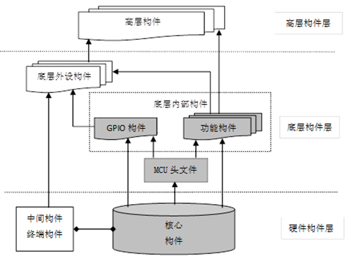

### 嵌入式硬件构件与底层驱动构件基本规范

## 硬件构件

### 概念与分类

嵌入式硬件构件是指将一个或多个硬件功能模块、支撑电路及其功能描述封装成一个可重用的硬件实体，并提供一系列规范的输入/输出接口。

根据接口之间的生产消费关系分为：核心构件、中间构件和终端构件三种类型。

### 核心构件的设计原则

核心构件能为其他构件提供哪些信号？

### 中间构件的设计原则

中间构件需要接受哪些信号，以及提供哪些信号？

### 终端构件的设计原则

终端构件需要什么信号才能工作？

## 底层驱动构件的概念与层次模型

### 嵌入式底层驱动构件的概念

嵌入式软件构件（Embedded Software Component）是实现一定嵌入式系统功能的一组封装的、规范的、可重用的、具有嵌入特性的软件构件单元，是组织嵌入式系统功能的基本单位。

嵌入式底层驱动构件，简称底层驱动构件或硬件驱动构件，是直接面向硬件操作的程序代码及使用说明。规范的底层驱动构件由头文件（.h）及源程序文件（.c）文件构成

头文件（.h）应该是底层驱动构件简明且完备的使用说明，也就是说，不需查看源程序文件情况下，就能够完全使用该构件进行上一层程序的开发。

### 嵌入式硬件构件和软件构件的层次模型

## 底层驱动构件的封装规范

### 构件设计的基本思想与基本原则

基本思想：尽量做到：当一个底层构件应用到不同系统中时，仅需修改构件的头文件，对于构件的源程序文件则不必修改或改动很小。

基本原则：为了使构件设计满足封装性、描述性、可移植性、可复用性的基本要求，嵌入式底层驱动构件的开发，应遵循层次化、易用性、鲁棒性及对内存的可靠使用原则。

### 编码风格基本规范

应该有一些基本规范，如文件、函数、变量、宏及结构体类型的命名需要有基本规则；对于排版，要通过插入空格与空行，使用缩进、断行等手段，调整代码的书面版式，使代码整体美观、清晰，从而提高代码的可读性。而注释文件头注释、函数头注释、整行注释与边注释。

### 头文件的设计规范

### 源程序的文件的设计规范

## 硬件构件及底层软件构件的重用与移植方法

### 硬件构件的重用与移植

### 底层构件的重用与移植

