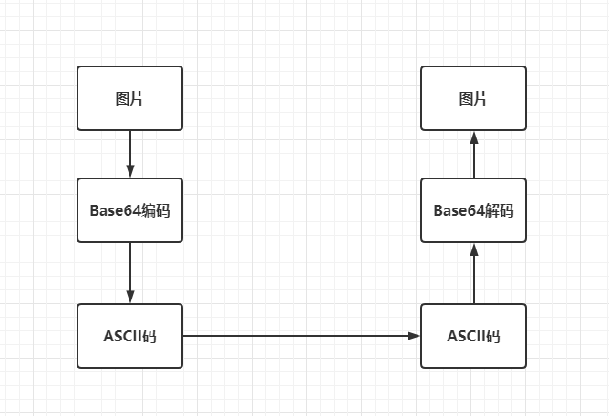
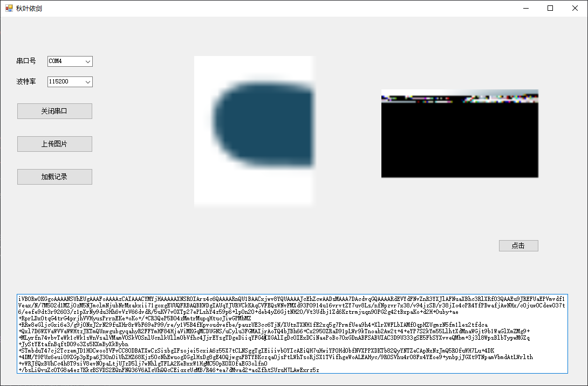
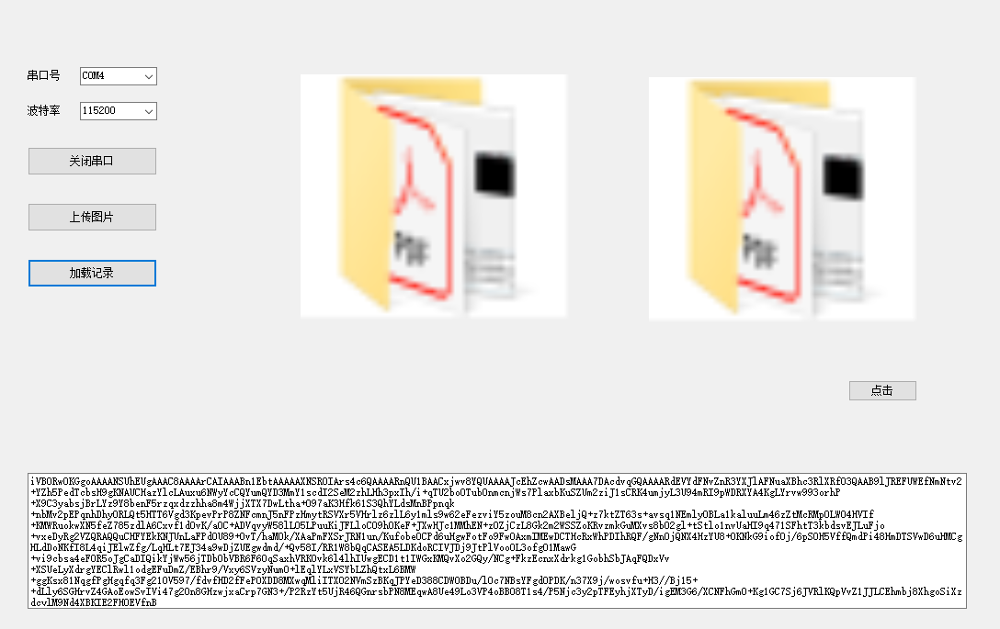

# 第六次学习札记

## Flash任意大小图片存储


### 前言

Flash存储照片的思路就是，上位机将图片编码后的数据发送给MCU，然后再从MCU取出来。如果这中间没有错误，那么就可以读取到和原来图片一样数据。



为了简单起见，我们尽可能将操作在上位机上完成。**所以规定，MCU要用扇区的整数倍来存取照片。**用一个空闲扇区来保存图片所占用的扇区数。

这样就不必考虑偏移量和读取的字节数了，因为图片转成Base64编码后是一个字符串，所以即使读取整个扇区的数据，在转成字符串后，也会自动将遇到的第一个字符0`\0`后面的数据去掉。利用这个特性可以大大简化我们的操作和计算量。

另外，之前我们封装的串口模拟构件`suart`可以用在此次项目当中。因为`suart`可以自动组帧，并返回真实数据。不用我们加帧头和帧尾。


### 知识准备

#### 1. Flash存储数据原理

KL系列MCU芯片的FLASH模块以扇区为基本单位，每个扇区的大小为1KB。擦除操作的含义是将存储单元的内容由二进制0变成1，而，写入操作的含义是将存储单元的某些位由二进制1变成0。


#### 2. Base64编码

对于图片、声音等不能用ASCII码表示的数据，我们一般都是先对其进行编码，使其能够用ASCII码表示，然后再传送给对方。Base64就是其中的一种编码。


### 软件编写

对于MCU程序来说，实现非常简单，只需要有flash的读和写程序就可以了，而且读和写都是以扇区为单位的

```C
 switch (cmd)
    {
    case '1':   // 写文件数据
        flash_erase(sect);
        flash_write(sect, 0, 1024, gReceiveBuff + 2);
        break;
    case '2':   // 读数据
        flash_read_logic(gReceiveBuff, sect, 0, 1024);
        printf("读取长度：%d\n", strlen(gReceiveBuff));
        suart_send(SUART_TX, gReceiveBuff, strlen(gReceiveBuff));
        break;

    default:
        break;
    }
```


### Q&A

在存取图片大于1k的时候，我发现图片会有不完整现象



原因是我发送和接收的时候没有考虑字符串的结尾是字符`\0`，也需要占用1位。在对大于1k的base64编码进行分片存储的时候其实每个扇区只能保存1023个有效字符，最后一个保存字符`\0`。这样读取出来的数据才能准确而不会读取到缓冲区其他字符。如果没有字符`\0`，上位机会误以为缓冲区或者扇区的其他字符也是有效数据，从而造成错误。因为我们一次是读取一个扇区。


### 结果展示

