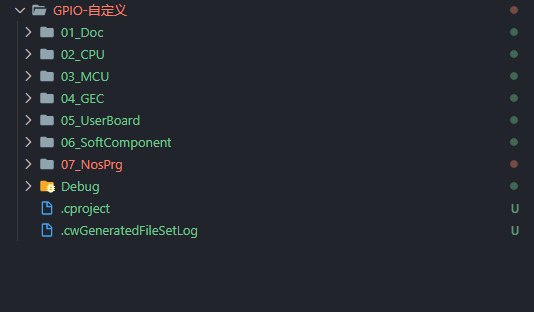
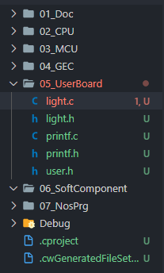
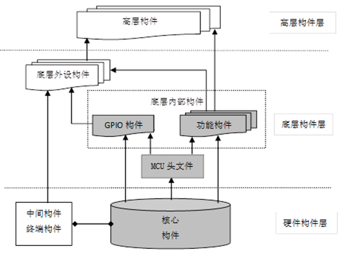
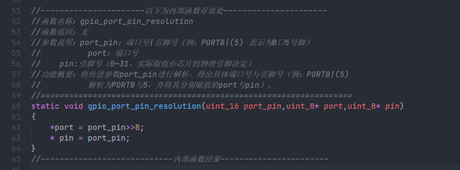

# 第二次学习札记

## 自定义构件并引用

### 工程框架



| 文件夹           | 简明功能及特点                                               |
| ---------------- | ------------------------------------------------------------ |
| 01_Doc           | 说明文档，介绍工程的功能以及记录版本改动相关细节             |
| 02_CPU           | CMSIS M0+ 内核文件                                           |
| 03_MCU           | 存放芯片头文件及芯片初始化文件，MCU不同时，芯片头文件需要更换 |
| 04_GEC           | GEC芯片的相关文件                                            |
| 05_UserBoard     | 主要放置底层构件，和板子有一定的耦合性，移植时需要做一点修改 |
| 06_SoftComponent | 主要放置应用层构件，和硬件没有关系，比如CRC冗余校验，类型值判断等，和板子无耦合，可移植和重用。 |
| 07_NosPrg        | 无操作系统编程                                               |


### 构件思路

经过前面直接地址程序洗礼，现在发现使用构件是真香。接下来记录一下如何在金葫芦工程中使用自定义构件。

以最简单的彩色灯控制为例，编写一个彩色灯控制构件。一般一个构件由两部分组成：

> 一个是`.h`文件，这个是构件的头文件，一般用来声明构件函数和宏定义，看一个构件的头文件就能了解这个构件的基本功能。
>
> 另一个是`.c`文件，这个是对头文件声明函数的实现。根据想要的效果来实现具体的代码逻辑。

这样，我们就轻松创建了两个文件：`light.h`和`light.c` ，一般来说我们可以将自定义的构件放在`05_UserBoard`，如图所示



在头文件`light.h`中添加如下代码：

```cpp
#ifndef _LIGHT_H
#define _LIGHT_H

//头文件包含
//（1）【固定】文件包含
#include "printf.h"
#include "gec.h"
#include "gpio.h"

//（2）【变动】指示灯端口及引脚定义—根据实际使用的引脚改动
//指示灯端口及引脚定义
#define LIGHT_RED (PTA_NUM | 5)    //红灯，所在引脚：GEC_56
#define LIGHT_GREEN (PTA_NUM | 12) //绿灯，所在引脚：GEC_55
#define LIGHT_BLUE (PTA_NUM | 13)  //蓝灯，所在引脚：GEC_54

// 开关定义
#define SWITCH_0 (PTC_NUM | 0)
#define SWITCH_1 (PTC_NUM | 1)

// 下拉上拉
#define PULL_DOWN 0
#define PULL_UP 1

//灯状态宏定义（灯亮、灯暗对应的物理电平由硬件接法决定）
#define LIGHT_ON 0  //灯亮
#define LIGHT_OFF 1 //灯暗

// 初始化
void light_init(uint16_t port_pin, uint8_t state);

// 控制灯的亮暗
void light_control(uint16_t port_pin, uint8_t state);

//切换等的亮暗
void light_change(uint16_t port_pin);

#endif
```


在源文件`light.c`中添加如下代码，用来实现头文件

```CPP
#include "light.h"

void light_init(uint16_t port_pin, uint8_t state)
{
    gpio_init(port_pin, GPIO_OUTPUT, state);
}

void light_control(uint16_t port_pin, uint8_t state)
{
    gpio_set(port_pin, state);
}

void light_change(uint16_t port_pin)
{
    gpio_reverse(port_pin);
}
```


## 硬件构件

### 概念与分类

嵌入式硬件构件是指将一个或多个硬件功能模块、支撑电路及其功能描述封装成一个可重用的硬件实体，并提供一系列规范的输入/输出接口。

根据接口之间的生产消费关系分为：核心构件、中间构件和终端构件三种类型。

### 核心构件的设计原则

核心构件能为其他构件提供哪些信号？

### 中间构件的设计原则

中间构件需要接受哪些信号，以及提供哪些信号？

### 终端构件的设计原则

终端构件需要什么信号才能工作？


## 底层驱动构件的概念与层次模型


### 嵌入式底层驱动构件的概念

嵌入式软件构件（Embedded Software Component）是实现一定嵌入式系统功能的一组封装的、规范的、可重用的、具有嵌入特性的软件构件单元，是组织嵌入式系统功能的基本单位。

嵌入式底层驱动构件，简称底层驱动构件或硬件驱动构件，是直接面向硬件操作的程序代码及使用说明。规范的底层驱动构件由头文件（.h）及源程序文件（.c）文件构成

头文件（.h）应该是底层驱动构件简明且完备的使用说明，也就是说，不需查看源程序文件情况下，就能够完全使用该构件进行上一层程序的开发。


### 嵌入式硬件构件和软件构件的层次模型




## 底层驱动构件的封装规范

### 构件设计的基本思想与基本原则

基本思想：尽量做到：当一个底层构件应用到不同系统中时，仅需修改构件的头文件，对于构件的源程序文件则不必修改或改动很小。

基本原则：为了使构件设计满足封装性、描述性、可移植性、可复用性的基本要求，嵌入式底层驱动构件的开发，应遵循层次化、易用性、鲁棒性及对内存的可靠使用原则。


### 编码风格基本规范

应该有一些基本规范，如文件、函数、变量、宏及结构体类型的命名需要有基本规则；对于排版，要通过插入空格与空行，使用缩进、断行等手段，调整代码的书面版式，使代码整体美观、清晰，从而提高代码的可读性。而注释文件头注释、函数头注释、整行注释与边注释。


### 源程序的文件的设计规范

封装比较复杂功能的函数时，应当将其中功能相对独立的部分封装成子函数作。这些子函数仅在构件内部使用，不提供对外服务，因此被称为“内部函数”。为将内部函数的访问范围限制在构件的源文件内部，在创建内部函数时，应使用static关键字为修饰符。




