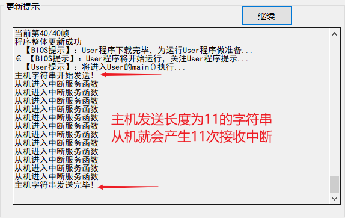
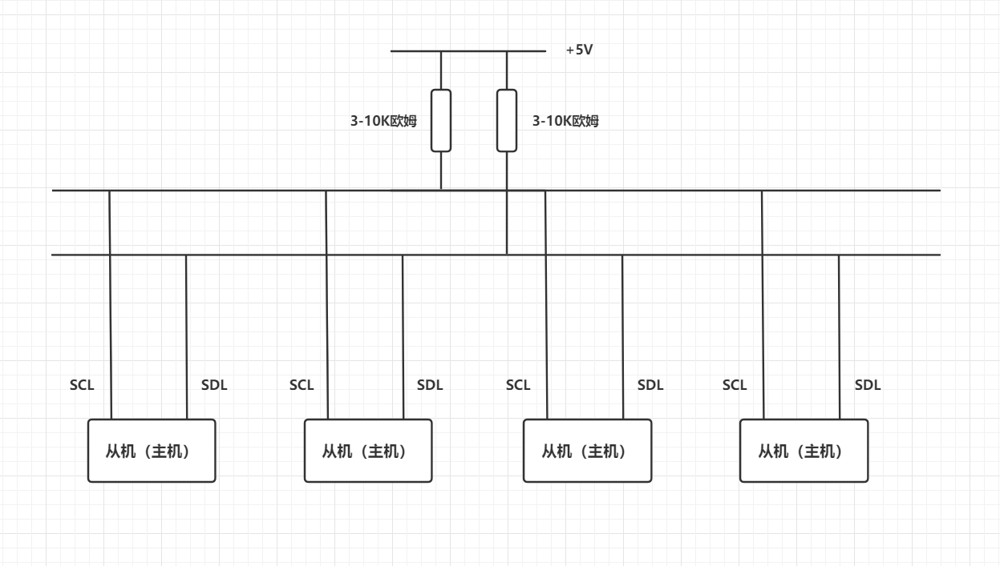
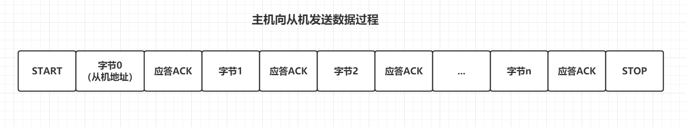
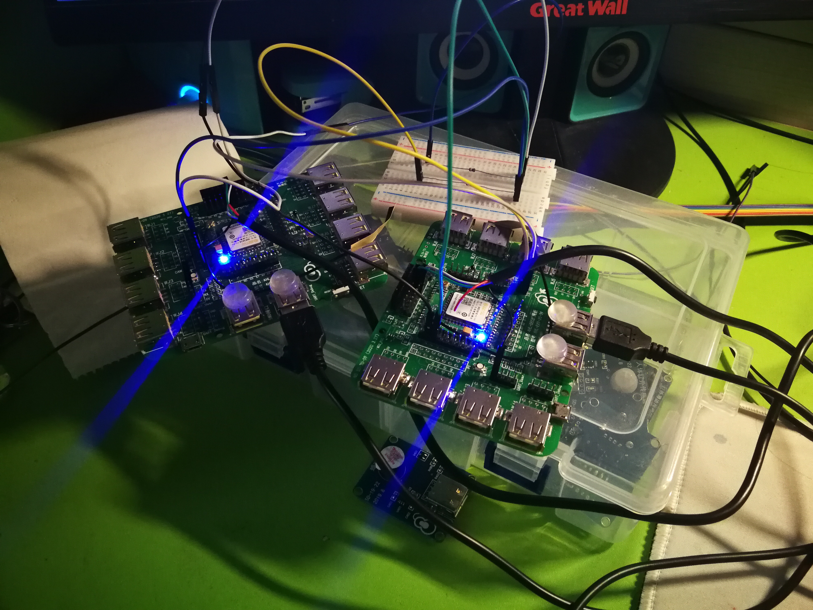
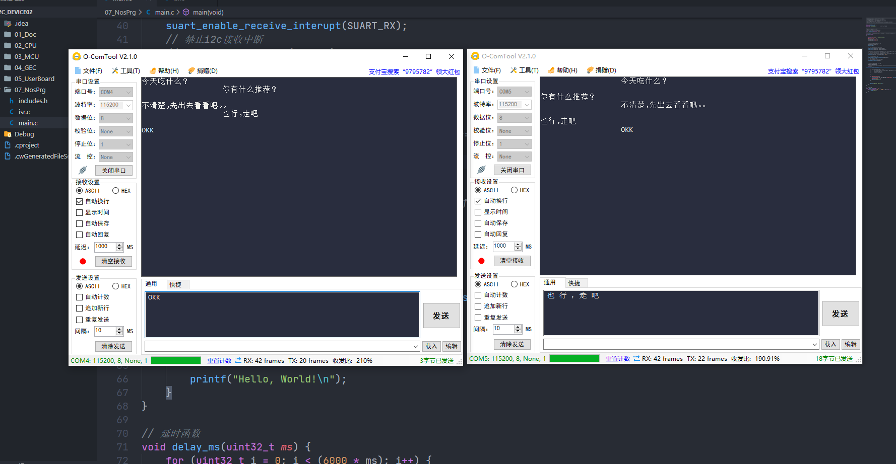

# 第七次学习札记

## SPI

### 改正一处错误

**spi_sendN()**函数中清除发送缓冲区为空标志（SPTEF）应该写错了，**应该是或等于，而不是非等于。C语言当中!=是关系运算符**。感觉此处也不需要清除SPTEF位，当向数据寄存器写数据之后，数据被送到发送缓冲区，发送完毕之后，**SPTEF会自动被置1，为发送下一个字符做准备**。

```c
void spi_sendN(uint8_t No, uint8_t n, uint8_t* buff)
{
    SPI_MemMapPtr baseadd = SPI_baseadd(No);
    uint32_t k;
    for (k = 0;k < n;k++) {
        //等待上一个字符发送完毕，发送缓冲区空闲
        while (!(SPI_S_REG(baseadd) & SPI_S_SPTEF_MASK));
        SPI_DL_REG(baseadd) = buff[k];

        // 此处感觉不需要清SPTEF位，也就是将SPTEF置1
        // 个人认为向数据寄存器写数据之后，会自动将SPTEF置1
        // 经过打桩调试也证明了我的想法。
        SPI_S_REG(baseadd) |= SPI_S_SPTEF_MASK; 
    }
}
```

另外通过调用**spi_send1()**实现更简单，所以我将spi底层构件源码修改如下实现方式。之所以最后多发送一个字符'\0'，是因为接下来想要实现收发字符串

```c
void spi_sendN(uint8_t No, uint8_t n, uint8_t* buff) {
	// 通过调用spi_send1()也可以实现上述功能
	for (uint32_t i = 0; i < n; i++) {
         spi_send1(No, buff[i]);
	}
    
    // 发送转义字符0, 告诉接收方一串字符串发送完毕
    spi_send1(No, '\0');
}
```


### 实现收发字符串

#### 需求分析

**我想要实现基于SPI的聊天工具，但是所给SPI的驱动在收发字符串方面似乎有问题。**

首先，对于单个字符的收发是没有问题的。但是，对于字符串的收发，如果想要调用**spi_receiveN()**来实现，每次都会将板子卡死。于是我觉的是SPI底层驱动写的有问题，花了一点时间将SPI的驱动改了一下。**主要修改spi_sendN()函数和spi_receiveN()函数**

#### 原理实现

SPI发送数据的时候，每一个字节的数据都会触发从机的一次中断。对于字符串的收发来说，就需要根据条件来进行组帧。只有完全接收完主机发送来的数据之后，才进行接下来的操作。



我的想法是，修改spi底层源码，在**spi_sendN()**发送字符串之后，在发送一个字符'\0'，表名当前字符串发送完毕，接收方就可以根据此条件进行组帧。发送字符串源码上面已经给出，下面给出接收字符串**spi_receiveN()**源码

```c
uint32_t spi_receiveN(uint8_t No, uint8_t* buff) {
    // 设置一个静态变量，记录当前接收字符个数
    static uint32_t index = 0;
    buff[index++] = spi_receive1(No);

    // 当接收到转义字符'\0'时， 说明发送方已经发送完毕
    // 此时返回接收的字符串的长度，同时index归0, 方便接收下一个字符串
    if (buff[index - 1] == '\0') {
        index = 0;
        return strlen(buff);
    }

    // 如果不是字符'\0', 说明还有数据，返回0
    return 0;
}
```

下面是从机中断服务函数源码

```c
void SPI_Receive_Handler(void) {
    DISABLE_INTERRUPTS;     //关总中断
    uint32_t len = spi_receiveN(SPI_RECEIVE, gRecvBuff);
    // 如果len的长度不为0,说明字符接收成功，长度为len
    if (len) {
        // 在这里可以愉快地写业务逻辑
        printf("%s", gRecvBuff);
    }
    
    //------------------------------------------------------------------
    ENABLE_INTERRUPTS;     //开总中断
}
```


## I2C

### I2C与SPI比较

I2C可以和SPI结合在一起学习。

* 他们有许多共同特点：

都有主机和从机的概念。都是串行同步通信，时钟信号由主机提供。

* 他们也有不同之处：

一个SPI设备需要四根线来连接，硬件方面比较复杂一点，但是软件方面就比较简单一点。用软件模拟SPI也比较简单。通信模式是全双工，可以有多个从机，但是只能有一个主机。不采用应答机制。

一个I2C设备需要两根线连接，硬件方面比较简单，但是软件方面就比较复杂，因为需要进行许多判断。用软件模拟也比较复杂而且容易出错。通信模式是半双工，任何一个设备都可以成为主机，但是为了防止冲突，同一时刻只能有一个主机。采用应答机制

### 主从切换

**I2C设备既可以是主机也可以是从机，只要保证同一时刻至多只有一个主机就行。**

假如我们有许多I2C设备互联构成了一个通信网络，为了使得每个设备都能正确即时收发数据，就需要进行主从切换。我们这样规定：

* **设备不发数据，则一直处于从机状态，监听其他设备与自己通信。**
* **设备要发数据时，由从机转成主机状态，数据发送完毕后，再次转成从机状态。**




### 通信格式

I2C采用了应答机制来保证数据的正确性。

主机每发送一个字节的数据之后都会等待从机的应答信号，在一定时间内收到了应答信号，才会发送下一个字节数据。

从机每接收一个字节的数据，都会回发一个应答信号，一般是低电平（非应答或者应答非是高电平）。通知主机发送下一个字节数据。

**注意：从机每接收一个字节都会产生一次接收中断，并且自动发送应答信号，所以我们在编程的时候，不需要在接收中断处理函数中手动发送应答信号，只需要处理接收的数据就行。但是主机在发送数据时，需要检测应答信号，如果一定时间内还没有检测到，就停止发送，返回错误**




由上图可以看出，**I2C的通信其实也挺简单的，无非就是先发送开始信号，紧接着发送一个字节数据，就检测应答，循环往复，直到数据发送完毕，最后发送一个停止信号。**

但是书上为什么说的有点麻烦呢？下面稍微补充一点个人的理解。

首先，在应用场景中，我们不可能是一对一通信，而是由许多I2C设备构成一个大的通信网络。所以为了找到特定的设备，我们给这个通信网络中的所有设备都进行了编号，也称为地址。为了方便从机检测判断，我们将这个地址放在了第0个字节。从机根据这个地址来判断接下来的n个字节是否是发送给自己的。如果地址匹配，则接下来接收n个字节数据；如果不是，就过滤掉。

还有一个问题，从机怎么知道主机想要向自己写数据还是要读取数据呢？这就需要一个比特位来表示数据方向，然后又考虑到用一个字节8位来编址有点浪费，就拿出第0位来表示数据方向。1表示读，0表示写。其他七位来表示真正的地址。

最后，其实我们还可以对I2C进行扩充，我们既然可以让第0个字节表示地址和数据方向，那么我们也可以让第一个字节、第二个字节等等有其他功能。比如书上就将第一个字节表示成数据存放位置，虽然个人觉得在主机向从机写数据时，不是非常必要的，而且令人费解。我们只需要理解I2C是可以进行改造扩充的，我们完全可以基于I2C设备构造出自己的通信协议。


### I2C聊天器

现在的I2C功能是能发送单个字符和N个字符，但是并没有对应的接收字符串函数。唯一可以接收单个字符函数还是直接读取I2C的数据寄存器。所以问了方便，我对I2C构件进行了扩充。基本原理和SPI一样。

首先对 i2c_writeN()函数进行修改，使其发送完N个字节数据后，再发送一个字符'\0'。这样方便从机的接收函数进行判断。


其次，增加了两个函数**i2c_recv()和i2c_send()**。

接收函数和SPI接收函数原理一样，根据'\0'判断字符串结束标志。

```c
uint32_t i2c_recv(uint8_t No, uint8_t* buff) {
	static uint32_t index = 0;
	buff[index++] = i2c_read(No);
	// 当接收到字符'\0'时，说明字符串接收成功
	if (buff[index - 1] == '\0') {
		index = 0;
		return strlen(buff);
	}
	return 0;
}
```


为了方便主从切换，初始化的时候，所有的机器都初始化为从机。为了发送数据，我们必须先将该设备切换到主机，然后调用**i2c_writeN()**函数发送数据，完毕后，再切换到从机。

有一点需要注意，主机模式下，需要禁用该设备的接收中断。

```c
uint8_t i2c_send(uint8_t No, uint8_t slaveAddress, uint8_t* buff, uint8_t len) {

	I2C_MemMapPtr i2c_ptr = I2C_BASE_TABLE[No];		// 获取该模块相关配置寄存器：地址，分频，控制，状态，数据寄存器
	BSET(I2C_C1_TX_SHIFT, i2c_ptr->C1);//TX = 1,MCU设置为发送模式
	BSET(I2C_C1_MST_SHIFT, i2c_ptr->C1);//MST位由0变成1，设置为主机模式
	i2c_disable_re_int(No);		// 设置成主机之后要禁用接收中断

	i2c_writeN(No, slaveAddress, buff, len);	// 发送数据

	BCLR(I2C_C1_TX_SHIFT, i2c_ptr->C1);//TX = 0,MCU设置为接收模式
	BCLR(I2C_C1_MST_SHIFT, i2c_ptr->C1);//MST位由1变成0，设置为从机模式
	i2c_enable_re_int(No);	// 设置成从机之后开启接收中断
}
```


上面说过，从机每接收一个字节，都会进入接收中断，所以我们设置一个静态变量标志**isMe**来判断是否接收接下来的数据。

```c
void I2C_M0_Handler(void) {
    printf("send\n");
    static uint8_t isMe = 0;
    DISABLE_INTERRUPTS;     //关总中断

    // 如果isMe = 0; 则进行判断是否是和自己通信,
    // 如果地址匹配，说明是和自己通信，令isMe = 1
    if (!isMe) {
        // 因为地址和数据方向位合并在一起了，所以判断的时候也要现将地址和方向合并再判断
        if ((i2c_m0_addr << 1 & 0xFE) == i2c_read(I2C_M0)) {
            isMe = 1;
        }
    }
    else {		// 如果isMe == 1,说明该设备被选中，调用i2c_recv()接收接下来的n个数据
        uint32_t len = i2c_recv(I2C_M0, gRecvBuff);
        if (len) {
            // 在这里可以愉快地写业务逻辑
            suart_send(SUART_TX, gRecvBuff, strlen(gRecvBuff));
            // 最后别忘了将isMe清零，方便下一次接收
            isMe = 0;
        }
    }

    // 别忘了清中断
    i2c_clear_re_int(I2C_M0);
    ENABLE_INTERRUPTS;      //开总中断
}
```


最后，我们可以设置一个全局数组和一个I2C发送数据标志。MCU将用户通过串口发送来的数据保存到全局数组中，令I2C发送数据标志有效。主函数就可以根据该标志调用**i2c_send()**函数，将全局数组中的数据发送给另一个设备。


**下面是聊天器效果演示**






## UART

经过修改SPI的接收字符串函数，让我想起其实uart中接收N个字符也有点小问题。原来的uart接收N个字符需要指定接收的字符个数，对于需要发送长度不同的字符串可能无能为力，就必须用到组帧。

uart和SPI一样，串口调试助手发送的每一个字节数据都会触发一次uart中断。想要实现收发字符串的功能，组帧肯定是需要的。但是我的想法是不用再去写组帧函数，**直接修改uart_reN()函数的几行代码，就可以实现相同的功能，而且可以简化操作。**

和SPI的想法一样，利用每个字符串都是以'\0'结尾的特点。我们只要保证所发数据最后是以'\0'结尾的，MCU就可以根据这个特点来判断用户所发数据什么时候结束。

**由于串口调试助手不会将'\0'发送给MCU，所以我们需要手动在数据最后多加两个字符**：'\\'和'0'。比如，如果我们想要发送open，只需要串口调试助手发送**open\0**；发送close，只需要在串口调试助手发送**close\0**


```c
// 这个函数还可以进行扩充，使其能处理更复杂的字符串，不过现在基本功能够用。
uint32_t uart_reN(uint8_t uartNo, uint8_t* buff){
    static uint32_t index = 0;
    uint8_t flag;

    buff[index++] = uart_re1(uartNo, &flag);
    
    // 检测到连续的字符'\'和字符'0', 说明用户数据发送完毕
    // 将接收到最后两个字符转换成真正的字符'\0',返回数据长度
    // 此时buff数组中保存的就是真正的字符串数据
    if (buff[index - 2] == '\\' && buff[index - 1] == '0') {
        buff[index - 2] = '\0';
        index = 0;
        return strlen(buff);
    }

    return 0;

}
```

下面是在uart中断服务函数中使用此函数。如果我们想要发送close和open这两个字符串，只需要在串口调试助手中发送**open\0** 和**close\0**就行。uart_reN()会自动将后面的两个字符去掉，返回真正的字符串长度。

如果我们担心之前可能会误发了字符而导致错误，也可以加上帧头。比如发送open，就在串口调试助手中发送**\0open\0**，close就发**\0close\0**。前两个相当于清除之前的错误字符，最后两个表示结束。**uart_reN()**都会自动去掉帧头帧尾，返回真正数据的长度。如果只是日常调试，可以没有必要这么严谨，因为字符串只有后面才有字符'\0'更符合我们的思维。

```c
void UART_User_Handler(void) {
	DISABLE_INTERRUPTS; //关总中断
	//------------------------------------------------------------------

	// 要接收的数据最后两个字符一定要以'\', '0'结尾
	//	uart_reN()在接收完毕后会自动去掉这两个字符
	uint32_t len = uart_reN(UART_User, gRecvBuff);
    
    // len 大于0 说明字符串接收成功
	if (len) {
        // 回发接收到的数据
		uart_send_string(UART_User, gRecvBuff);
	}

	//------------------------------------------------------------------
	ENABLE_INTERRUPTS; //开总中断
}
```


​	