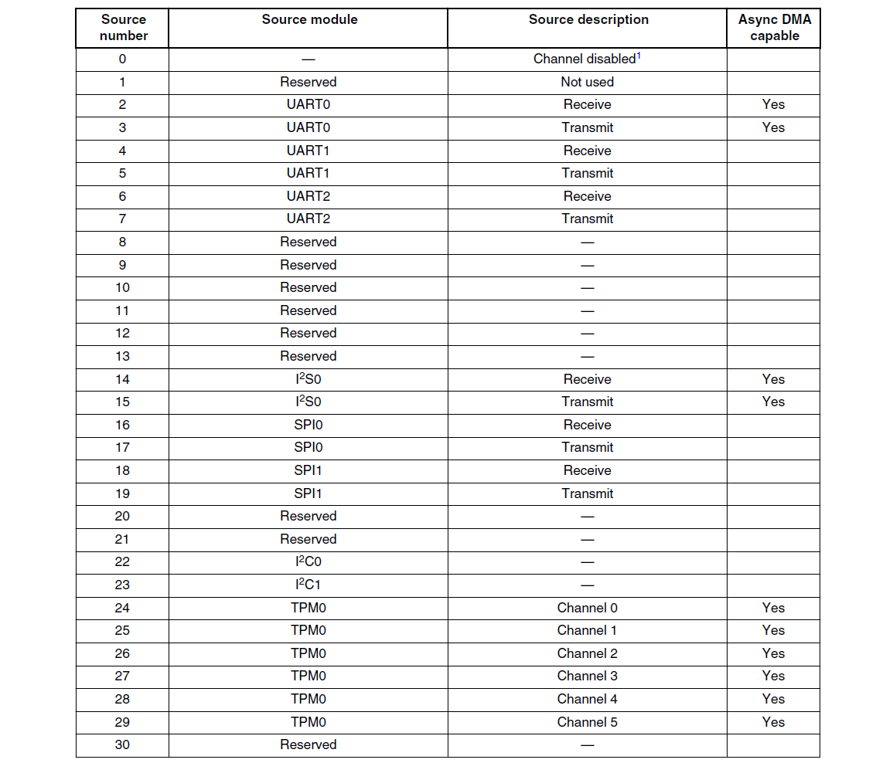
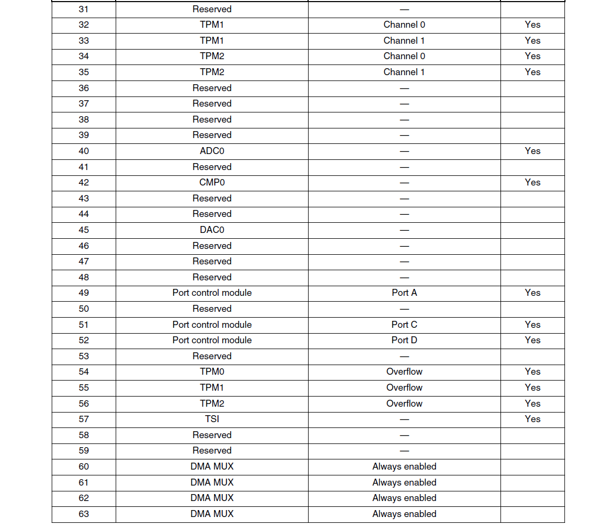
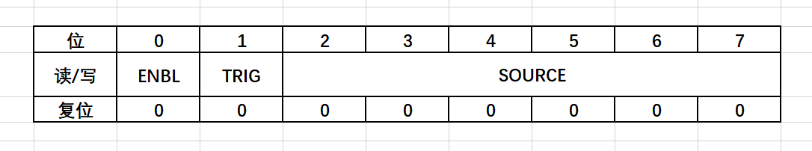

## 一、设计目的

* 了解DMA传送原理
* 掌握DMA编程方法
* 熟悉UART的DMA基本原理

## DMA 基础

### DMA 请求

KL36包含一个DMA多路请求复用器（DMAMUX0），拥有4个可独立编程的DMA通道，每个通道支持多达63个请求信号。有些模块的请求支持异步DMA请求操作，下面表格中都有注明。





注意，每次请求都只会进行一次DMA传输，即DMA将一个字节数据，放到目的地址内。


### DMA通道

KL36拥有4个可独立编程的DMA通道，关于DMA通道有很多官方解释，下面谈一下个人理解。

其实，DMA通道是一个抽象的概念，我们可以认为DMA通道就是一组寄存器的集合。比如，KL36的DMA0号通道主要由源地址寄存器（DMA_SAR0），目的地址寄存器（DMA_DAR0），状态/字节数寄存器（DMA_DSR_BCR0），控制寄存器（DMA_DCR0）， 加上DMAD多路复用的通道配置寄存器（DMAMUXx_CFCFGn）组成。这些寄存器控制DMA的发送与接收，记录DMA发送或者接收状态，每一组寄存器都是独立编程的。

下图是KL36 各个模块总览


下图是KL36某个通道的结构，可以看出，DMA通道可以说就是由一组寄存器组成。

DMA请求都是DMA控制器（DMA）来处理，但是能发起DMA请求的模块有很多。为了统一管理，KL36都是由一个DMA多路请求复用器与外设模块进行交互，然后统一交给DMA控制器。


## DMA 寄存器

### DMA寄存器总览

从下表可以看到，DMA主要用到的寄存器有：源地址寄存器（DMA_SARn），目的地址寄存器（DMA_DARn），状态/字节数寄存器（DMA_DSR_BCRn），控制寄存器（DMA_DCRn）。

**其中，DMA的状态和字节数放在一个32位的寄存器里面进行控制，所以叫做状态/字节数寄存器。字节数占低16位，状态占高16位**，下面会对各个寄存器进行详细介绍。

| 绝对地址（HEX） | 寄存器名                                   | 宽度 | 读/写 | 重置值（HEX） |
| --------------- | ------------------------------------------ | ---- | ----- | ------------- |
| 4000_8100       | 源地址寄存器（DMA_SAR0）                   | 32   | R/W   | 0000_0000     |
| 4000_8104       | 目的地址寄存器（DMA_DAR0）                 | 32   | R/W   | 0000_0000     |
| 4000_8108       | DMA状态寄存器/字节数寄存器（DMA_DSR_BCR0） | 32   | R/W   | 0000_0000     |
| 4000_810C       | DMA控制寄存器（DMA_DCR0）                  | 32   | R/W   | 0000_0000     |
| 4000_8110       | 源地址寄存器（DMA_SAR1）                   | 32   | R/W   | 0000_0000     |
| 4000_8114       | 目的地址寄存器（DMA_DAR1）                 | 32   | R/W   | 0000_0000     |
| 4000_8118       | DMA状态寄存器/字节数寄存器（DMA_DSR_BCR1） | 32   | R/W   | 0000_0000     |
| 4000_811C       | DMA控制寄存器（DMA_DCR1）                  | 32   | R/W   | 0000_0000     |
| 4000_8120       | 源地址寄存器（DMA_SAR2）                   | 32   | R/W   | 0000_0000     |
| 4000_8124       | 目的地址寄存器（DMA_DAR2）                 | 32   | R/W   | 0000_0000     |
| 4000_8128       | DMA状态寄存器/字节数寄存器（DMA_DSR_BCR2） | 32   | R/W   | 0000_0000     |
| 4000_812C       | DMA控制寄存器（DMA_DCR2）                  | 32   | R/W   | 0000_0000     |
| 4000_8130       | 源地址寄存器（DMA_SAR3）                   | 32   | R/W   | 0000_0000     |
| 4000_8134       | 目的地址寄存器（DMA_DAR3）                 | 32   | R/W   | 0000_0000     |
| 4000_8138       | DMA状态寄存器/字节数寄存器（DMA_DSR_BCR3） | 32   | R/W   | 0000_0000     |
| 4000_813C       | DMA控制寄存器（DMA_DCR3）                  | 32   | R/W   | 0000_0000     |


### 通道配置寄存器DMAMUXx_CHCFGn




 ENBL：DMA 通道使能。0，DMA通道禁止；1，DMA通道使能。

TRIG：DMA通道触发使能。

* 0，触发禁止，普通触发模式；在普通触发模式下，DMA只会触发一次，之后需要再次对DMA使能。比如，普通模式下，通过DMA向外设发送数据，使能之后，只会发送一次数据，如果需要再次发送，需要再次使能。

* 1，触发使能，周期触发模式。在周期触发模式下，当字节数寄存器减到0的时候，会自动加载之前设置的初值，从而可以实现不断地想外设发送数据。

SOURCE：DMA 通道源，用来选择通道号。共6位，可以编码64个请求信号。一般全0不用，剩下63个请求信息号可以参考上面介绍的DMA请求号


### 源地址寄存器 DMA_SARn


该寄存器共32位，复位后值为0，用来记录DMA传输的源地址。


### 目的地址寄存器 DMA_DARn


该寄存器共32位，复位后值为0，用来记录DMA传输的目的地地址。


### 状态/字节数寄存器 DMA_DSR_BCRn


CE： Bit30,配置错误，0，无配置错误；1， 有配置错误。

BES：Bit29，源总线错误，0，无总线错误；1，有总线错误

BED：Bit28,目的总线错误，0，无总线错误；1，有总线错误

REQ：Bit26，请 求，0，无请求；1，DMA通道有传输且通道未被选中

BSY：Bit25， 忙碌，0，DMA通道不活跃，当DMA完成最后的传输会清除；1，传输初始化后，通道使能的第一时间BSY置位。

DONE：Bit24，传输完成标志。0，DMA传输未完成；1，传输已经完成，写1清除。

BCR：Bit23-0，还未传输的字节数。


### 控制寄存器 DMA_DCRn


EINT：Bit31,传输完成中断使能。0，无中断产生；1，中断信号运行

ERQ：Bit30，运行外设请求。0，请求忽略；1，运行外设请求发起传输。

CS：Bit29，周期调用。0，DMA连续读写传输，直到BCR到0；1，一次请求一次传输

AA：Bit28，自动对齐。0，自动对齐禁止；1，如果SSIZE 不小于DSIZE，源进入自动对齐，否则，目的地址进入自动对齐。如果自动对齐使能，相应的寄存器增加，而不考虑DINC 与SINC。

EADREQ：Bit23，使能异步DMA 请求。0，禁止；1，使能。

SINC：Bit22，源地址增加。0，不改变源地址；1，根据传输字节增加相应的源地址

SSIZE：Bit21-20,源字节。00 32 位；01 8 位；10 16 位；11 保留

DINC：Bit19 目的地址增加。0，不改变目的地址；1，根据传输的字节增加相应的目的地址。

DSIZE：Bit18-17。目的地字节。00 32 位；01 8 位；10 16 位；11 保留

START：Bit16。开始传输。0，DMA 不活跃；1，根据TCDn 中的值开始传输

SMOD： Bit15-12。源地址模值。

DMOD：Bit11-8。目的地址模值。

D_REQ：Bit7。禁止请求。0，ERQ 位无影响；1，当BCR 值为0 时ERQ 清零

LINKCC：Bit5-4。通道连接控制。

LCH1：连接通道1。00 通道0；01 通道1；10 通道2；11 通道3.

LCH2：连接通道2。00 通道0；01 通道1；10 通道2；11 通道3.


### UART DMA通信

DMA有两种模式，一个是普通触发模式，另一个是周期触发模式。DMA根据字节数寄存器是否为0来判断是否结束本次DMA传输。

KL36有四个DMA通道，假如我们将DMA通道0设置成接收通道。使能通道0的时候，需要设置通道0的字节数寄存器为一个大于0的值，这个值得范围是0到65535。当DMA接收一个字节的时候， 字节数寄存器的值减1，直到变成0的时候，就会将DMA控制寄存器的ERQ标志位清0，忽略外设的请求，从而结束本次DMA传输。

假如我们将通道1设置成发送通道。和接收通道类似，每发送一个字节，字节数寄存器的值就减1，直到变成0的时候，结束本次发送传输。


上图为UART的DMA接收流程图。UART0的数据寄存器UART0_D每接收一个字节，都会产生一个UART0_RX请求，触发DMA将UART0_D中的数据写入到给定的，内存中的某个地址，并自动清除UART0_RX请求标志。然后目的地址加1，便于下一次数据的存放。

这个内存地址保存在DMA的目的地址寄存器DMA_DARn，可以在初始化DMA时设置。


上图为UART的DMA传输流程图。将发送通道使能之后，DMA就会运行外设请求UART0_TX，将一个字节写入到UART0_D数据寄存器，发送个串口调试助手。同时源地址也就是保存在DMA源地址寄存器的值加1，便于下一个字节的发送，然后字节数寄存器减1。循环往复，直到字节数寄存器的值为0。


## DMA 构件

此次构件实现的是UART的DMA功能，关于I2C和SPI的DMA原理和UART非常相似，如果有机会可以继续完善。

下表是DMA构件的主要函数

| 函数名               | 功能                                                         |
| -------------------- | ------------------------------------------------------------ |
| dma_uart_init()      | 初始化DMA的发送和接收通道，并告诉DMA内存缓冲区的首地址。普通触发模式 |
| dma_uart_recv()      | 使能DMA接收传输                                              |
| dma_uart_send()      | 使能DMA发送传输                                              |
| dma_get_recv_count() | 获取DMA通道接收数据个数。使能DMA接收传输时，字节数寄存器的值是65535。当数据接收完毕后，会进入空闲线中断，拿65535减去此时字节数寄存器的值，就是接收的数据字节数。 |
| dma_enable_int()     | 使能DMA通道中断                                              |
| dma_clear()          | 清除中断与错误标志                                           |

UART构件需要增加两个函数

| 函数名                 | 功能           |
| ---------------------- | -------------- |
| uart_enable_idle_int() | 使能空闲线中断 |
| uart_clear_idle_int()  | 清除空闲线中断 |


### DMA.H

```c
//=====================================================================
//文件名称：dma.h
//功能概要：dma底层驱动构件头文件
//制作单位：南通大学 计181张龙威
//版    本：  2020-12-31 V2.0
//适用芯片：KL36
//=====================================================================

#ifndef _DMA_H_
#define _DMA_H_
#include "mcu.h"  //包含公共要素头文件

// DMA模式
#define DMA_MODE_NORMAl 0    //普通模式
#define DMA_MODE_PERIODIC 1  //周期模式
// DMA传输宽度
#define DMA_TRANS_WIDTH_BIT32 (0x00)  // DMA传输宽度为32位
#define DMA_TRANS_WIDTH_BIT8 (0x01)   // DMA传输宽度为8位
#define DMA_TRANS_WIDTH_BIT16 (0x02)  // DMA传输宽度为16位
// DMA源地址模数大小
#define DMA_MODULE_DISABLE (0)  //禁用模块
#define DMA_MODULO_BYTE_16 (1)
#define DMA_MODULO_BYTE_32 (2)
#define DMA_MODULO_BYTE_64 (3)
#define DMA_MODULO_BYTE_128 (4)
#define DMA_MODULO_BYTE_256 (5)
#define DMA_MODULO_BYTE_512 (6)
#define DMA_MODULO_BYTE_1K (7)
#define DMA_MODULO_BYTE_2K (8)
#define DMA_MODULO_BYTE_4K (9)
#define DMA_MODULO_BYTE_8K (10)
#define DMA_MODULO_BYTE_16K (11)
#define DMA_MODULO_BYTE_32K (12)
#define DMA_MODULO_BYTE_64K (13)
#define DMA_MODULO_BYTE_128K (14)
#define DMA_MODULO_BYTE_256K (15)
//源地址偏移量开关
#define DMA_SRC_ADDR_OFFSET_ON (1)
#define DMA_SRC_ADDR_OFFSET_OFF (0)
//目标地址偏移量开关
#define DMA_DST_ADDR_OFFSET_ON (1)
#define DMA_DST_ADDR_OFFSET_OFF (0)
// 定义字节数计数寄存器最大值
#define DMA_DSR_BCR_MAXLEN (65535)
// DMA请求源
typedef enum DMA_sources {
  Channel_Disabled = 0,
  DMA_UART0_Rx = 2,
  DMA_UART0_Tx = 3,
  DMA_UART1_Rx = 4,
  DMA_UART1_Tx = 5,
  DMA_UART2_Rx = 6,
  DMA_UART2_Tx = 7,
  /*        I2S            */
  DMA_I2S0_Rx = 14,
  DMA_I2S0_Tx = 15,
  /*        SPI            */
  DMA_SPI0_Rx = 16,
  DMA_SPI0_Tx = 17,
  DMA_SPI1_Rx = 18,
  DMA_SPI1_Tx = 19,
  /*        I2C            */
  DMA_I2C0 = 22,
  DMA_I2C1 = 23,
  /*        TPM            */
  DMA_TPM0_CH0 = 24,
  DMA_TPM0_CH1 = 25,
  DMA_TPM0_CH2 = 26,
  DMA_TPM0_CH3 = 27,
  DMA_TPM0_CH4 = 28,
  DMA_TPM0_CH5 = 29,
  DMA_TPM1_CH0 = 32,
  DMA_TPM1_CH1 = 33,
  DMA_TPM2_CH0 = 34,
  DMA_TPM2_CH1 = 35,
  /*     ADC/DAC/CMP    */
  DMA_ADC0 = 40,
  DMA_CMP0 = 42,
  DMA_DAC0 = 45,
  DMA_Port_A = 49,
  DMA_Port_C = 51,
  DMA_Port_D = 52,
  DMA_TPM0_OVERFLOW = 54,
  DMA_TPM1_OVERFLOW = 55,
  DMA_TPM2_OVERFLOW = 56,
  DMA_TSI = 57,
  DMA_Always_EN1 = 60,
  DMA_Always_EN2 = 61,
  DMA_Always_EN3 = 62,
  DMA_Always_EN4 = 63,
} DMA_sources;

//定义DMA通道状态
typedef enum {
  DMAChannelIdle,       //通道空闲
  DMAChannelStarting,   //通道正在启动
  DMAChannelExecuting,  //通道正在执行
  DMAChannelDone        //通道完成主循环
} DMAChannelState;

//==========================================================================
//函数名称: dma_uart_init
//函数返回: 无
//参数说明:  chSend: DMA发送通道
//         chRecv: DMA接收通道
//         buff: DMA在内存中的缓冲区
//功能概要: 初始化UART的DMA功能
//==========================================================================
void dma_uart_init(uint8_t chSend, uint8_t chRecv, uint32_t buff);

//==========================================================================
//函数名称: dma_uart_recv
//函数返回: 无
//参数说明:  chRecv: DMA接收通道
//         dstAddress: 目的地址。源地址固定为UART0的数据寄存器地址
//         len: 接收的数据长度
//功能概要:  使能一次DMA接收传输
//==========================================================================
void dma_uart_recv(uint8_t chRecv, uint32_t dstAddress, uint32_t len);

//==========================================================================
//函数名称: dma_uart_send
//函数返回: 无
//参数说明:  chSend: DMA发送通道
//         srcAddress: 源地址。目的地址固定为UART0的数据寄存器地址
//         len: 接收的数据长度
//功能概要:  使能一次DMA发送传输
//==========================================================================
void dma_uart_send(uint8_t chSend, uint32_t srcAddress, uint32_t len);

//==========================================================================
//函数名称: dma_get_recv_count
//函数返回: 无
//参数说明:  chRecv: DMA接收通道
//功能概要:  获取DMA接收通道接收数据个数
//==========================================================================
uint32_t dma_get_recv_count(uint8_t chRecv);

//==========================================================================
//函数名称: dma_enable_int
//函数返回: 无
//参数说明:  ch: DMA通道
//功能概要:  使能DMA通道中断
//==========================================================================
void dma_enable_int(uint8_t ch);

//==========================================================================
//函数名称: dma_clear
//函数返回: 无
//参数说明:  ch: DMA通道
//功能概要:  清通道中断与错误标志
//==========================================================================
void dma_clear(uint8_t ch);

#endif

```

### DMA.C

```c
//=====================================================================
//文件名称：dma.h
//功能概要：dma底层驱动构件头文件
//制作单位：南通大学 计181张龙威
//版    本：  2020-12-31 V2.0
//适用芯片：KL36
//=====================================================================
#include "dma.h"

// DMA各通道中断请求号
static const IRQn_Type dma_irq_table[] = {
    DMA0_IRQn,
    DMA1_IRQn,
    DMA2_IRQn,
    DMA3_IRQn,
};

//==========================================================================
//函数名称: dma_uart_init
//函数返回: 无
//参数说明:  chSend: DMA发送通道
//         chRecv: DMA接收通道
//         buff: DMA在内存中的缓冲区
//功能概要: 初始化UART的DMA功能
//==========================================================================
void dma_uart_init(uint8_t chSend, uint8_t chRecv, uint32_t buff) {
  //使能UART0的DMA发送
  SIM_SCGC4 |= SIM_SCGC4_UART0_MASK;  //启动串口0时钟
  UART0_C5 |= UART_C4_TDMAS_MASK;     //使能UART0的TDMA
  UART0_C5 |= UART_C4_RDMAS_MASK;     //使能UART0的RDMA
  // UART0_C2 |= UART_C2_TIE_MASK;       //使能UART0发送中断
  // UART0_C2 |= UART_C2_RIE_MASK;       //使能UART0接收中断
  // UART0_C2 &= ~UART_C2_TCIE_MASK;  //禁用UART0发送完成中断

  //开启DMA和DMAMUX模块时钟门
  SIM_SCGC6 |= SIM_SCGC6_DMAMUX_MASK;  // 开DMA MUX模块时钟
  SIM_SCGC7 |= SIM_SCGC7_DMA_MASK;     // 开 DMA模块时钟
  // 初始化DMA通道配置寄存器，默认DMA通道禁止，普通触发
  DMAMUX0_CHCFG(chSend) = 0x00;
  DMAMUX0_CHCFG(chRecv) = 0x00;
  // 设置DMA通道触发请求源
  DMAMUX0_CHCFG(chSend) |= DMAMUX_CHCFG_SOURCE(DMA_UART0_Tx);
  DMAMUX0_CHCFG(chRecv) |= DMAMUX_CHCFG_SOURCE(DMA_UART0_Rx);

  // 清除DMA状态寄存器/字节数寄存器中的错误、中断和完成标志
  dma_clear(chSend);
  dma_clear(chRecv);

  // 初始化DMA控制寄存器
  // 默认不运行外设DMA请求，即忽略外设发起的DMA请求
  DMA_DCR(chSend) = 0x00;
  DMA_DCR(chRecv) = 0x00;

  //设置源地址和目标地址的模数大小和数据宽度以及其他相关标志
  DMA_DCR(chSend) |=
      (DMA_DCR_SSIZE(1)    //配置源地址数据长度为8位
       | DMA_DCR_DSIZE(1)  //目的地址数据长度为8位
       | DMA_DCR_SMOD(0)  // 禁止源地址取模，循环模式下需要开启
       | DMA_DCR_DMOD(0)  // 禁止目的地址取模，循环模式需要开启
       | DMA_DCR_D_REQ_MASK  // BCR到0时外设请求清除
       | DMA_DCR_SINC_MASK  // 源地址允许增加，每次传输后的目的地址增加一个字节
       | DMA_DCR_CS_MASK   //每次请求都会产生一次读写传输
       | DMA_DCR_ERQ_MASK  //允许外设请求
       //| DMA_DCR_EINT_MASK  // 传输完成中断使能
       | DMA_DCR_EADREQ_MASK  //允许异步请求

      );

  DMA_DCR(chRecv) |=
      (DMA_DCR_SSIZE(1)    //配置源地址数据长度为8位
       | DMA_DCR_DSIZE(1)  //目的地址数据长度为8位
       | DMA_DCR_SMOD(0)  // 禁止源地址取模，循环模式下需要开启
       | DMA_DCR_DMOD(0)  // 禁止目的地址取模，循环模式需要开启
       | DMA_DCR_D_REQ_MASK  // BCR到0时外设请求清除
       | DMA_DCR_DINC_MASK  // 源地址允许增加，每次传输后的目的地址增加一个字节
       | DMA_DCR_CS_MASK   //每次请求都会产生一次读写传输
       | DMA_DCR_ERQ_MASK  //允许外设请求
       //| DMA_DCR_EINT_MASK  // 传输完成中断使能
       | DMA_DCR_EADREQ_MASK  //允许异步请求

      );

  // 设置发送通道目的地址, 应该是UART0的数据寄存器地址
  // 发送通道的源地址和目的地址，从内存到外设UART0的数据寄存器
  DMA_SAR(chSend) = (uint32_t)buff;
  DMA_DAR(chSend) = (uint32_t)&UART0_D;
  // 接收通道源地址和目的地址，从外设UART0的数据寄存器到内存buff
  DMA_SAR(chRecv) = (uint32_t)&UART0_D;
  DMA_DAR(chRecv) = (uint32_t)buff;

  //发送通道字节数计数寄存器设置
  DMA_DSR_BCR(chSend) &= ~DMA_DSR_BCR_BCR_MASK;  // 一定要先清零
  DMA_DSR_BCR(chSend) = DMA_DSR_BCR_BCR(0);      // 初始化先不要发数据
  //接收通道字节数计数寄存器设置
  // 每接收一个字节，其数值减一，为0的时候自动清除外设的请求
  DMA_DSR_BCR(chRecv) &= ~DMA_DSR_BCR_BCR_MASK;  // 一定要先清零
  DMA_DSR_BCR(chRecv) = DMA_DSR_BCR_BCR(DMA_DSR_BCR_MAXLEN);

  // 使能DMA通道
  DMAMUX0_CHCFG(chSend) |= (DMAMUX_CHCFG_ENBL_MASK);
  DMAMUX0_CHCFG(chRecv) |= (DMAMUX_CHCFG_ENBL_MASK);
}

//==========================================================================
//函数名称: dma_uart_recv
//函数返回: 无
//参数说明:  chRecv: DMA接收通道
//         dstAddress: 目的地址。源地址固定为UART0的数据寄存器地址
//         len: 接收的数据长度
//功能概要:  使能一次DMA接收传输
//==========================================================================
void dma_uart_recv(uint8_t chRecv, uint32_t dstAddress, uint32_t len) {
  //设置目标地址
  DMA_DAR(chRecv) = dstAddress;

  //清中断与错误标志
  dma_clear(chRecv);

  //暂时关闭该DMA通道，默认触发模式为正常模式
  DMA_DCR(chRecv) &= ~DMA_DCR_ERQ_MASK;
  DMAMUX0_CHCFG(chRecv) &= ~(DMAMUX_CHCFG_ENBL_MASK);

  //字节数计数寄存器设置
  DMA_DSR_BCR(chRecv) &= ~DMA_DSR_BCR_BCR_MASK;  // 一定要先清零
  DMA_DSR_BCR(chRecv) = DMA_DSR_BCR_BCR(len);

  // 使能该DMA通道
  DMAMUX0_CHCFG(chRecv) |= (DMAMUX_CHCFG_ENBL_MASK);
  DMA_DCR(chRecv) |= DMA_DCR_ERQ_MASK;
}

//==========================================================================
//函数名称: dma_uart_send
//函数返回: 无
//参数说明:  chSend: DMA发送通道
//         srcAddress: 源地址。目的地址固定为UART0的数据寄存器地址
//         len: 接收的数据长度
//功能概要:  使能一次DMA发送传输
//==========================================================================
void dma_uart_send(uint8_t chSend, uint32_t srcAddress, uint32_t len) {
  //判断传输数目参数是否合法
  if ((len & 0xFFF00000) > 0) {
    len = 0xFFFFF;
  }

  //清中断与错误标志
  dma_clear(chSend);

  //暂时关闭该DMA通道，并设置该通道的请求源，默认触发模式为正常模式
  DMA_DCR(chSend) &= ~DMA_DCR_ERQ_MASK;
  DMAMUX0_CHCFG(chSend) &= ~(DMAMUX_CHCFG_ENBL_MASK);

  //设置目的地址, 应该是UART0的数据寄存器地址
  DMA_DAR(chSend) = (uint32_t)&UART0_D;

  //设置源地址
  DMA_SAR(chSend) = srcAddress;

  //字节数计数寄存器设置
  DMA_DSR_BCR(chSend) &= ~DMA_DSR_BCR_BCR_MASK;  // 一定要先清零
  DMA_DSR_BCR(chSend) = DMA_DSR_BCR_BCR(len);

  //使能该DMA通道
  DMAMUX0_CHCFG(chSend) |= (DMAMUX_CHCFG_ENBL_MASK);
  DMA_DCR(chSend) |= DMA_DCR_ERQ_MASK;
}

//==========================================================================
//函数名称: dma_get_recv_count
//函数返回: 无
//参数说明:  chRecv: DMA接收通道
//功能概要:  获取DMA接收通道接收数据个数
//==========================================================================
uint32_t dma_get_recv_count(uint8_t chRecv) {
  // 最大值减去剩余的值就是接收的数据个数
  return (DMA_DSR_BCR_MAXLEN -
          (uint32_t)(DMA_DSR_BCR(chRecv) & DMA_DSR_BCR_BCR_MASK));
}

//==========================================================================
//函数名称: dma_enable_int
//函数返回: 无
//参数说明:  ch: DMA通道
//功能概要:  使能DMA通道中断
//==========================================================================
void dma_enable_int(uint8_t ch) {
  DMA_DCR(ch) |= DMA_DCR_EINT_MASK;   // 开启通道中断使能
  NVIC_EnableIRQ(dma_irq_table[ch]);  //开中断控制器IRQ中断
}

//======================================================================
//函数名称：dma_clear
//参数说明：ch:
//函数返回：清通道中断与错误标志
//======================================================================
void dma_clear(uint8_t ch) {
  if ((DMA_DSR_BCR(ch) & DMA_DSR_BCR_DONE_MASK) == DMA_DSR_BCR_DONE_MASK ||
      (DMA_DSR_BCR(ch) & DMA_DSR_BCR_BES_MASK) == DMA_DSR_BCR_BES_MASK ||
      (DMA_DSR_BCR(ch) & DMA_DSR_BCR_BED_MASK) == DMA_DSR_BCR_BED_MASK ||
      (DMA_DSR_BCR(ch) & DMA_DSR_BCR_CE_MASK) == DMA_DSR_BCR_CE_MASK) {
    DMA_DSR_BCR(ch) |= DMA_DSR_BCR_DONE_MASK;  //清DMA传输完成标志, 写1清除
  }
}

```


### UART增加的函数

#### UART.H

```c
//======================================================================
//参数说明：uartNo: 串口号 :UART_0、UART_1、UART_2
//函数返回：无
//功能概要：使能空闲线中断
//======================================================================
void uart_enable_idle_int(uint8_t uartNo);

//======================================================================
//参数说明：uartNo: 串口号 :UART_0、UART_1、UART_2
//函数返回：无
//功能概要：清除空闲线中断
//======================================================================
void uart_clear_idle_int(uint8_t uartNo);

```


#### UART.C

```c
//======================================================================
//参数说明：uartNo: 串口号:UART_0、UART_1、UART_2
//函数返回：无
//功能概要：使能空闲线中断
//======================================================================
void uart_enable_idle_int(uint8_t uartNo) {
  UART0_MemMapPtr UART_2h_0 = UART0_BASE_PTR;  //获取UART0基地址

  //判断传入串口号参数是否有误，有误直接退出
  if (!uart_is_uartNo(uartNo)) {
    return;
  }

  if (0 == uartNo) {
    UART0_C2_REG(UART_2h_0) |= UART0_C2_ILIE_MASK;  //开放UART空闲线中断
    UART0_S1_REG(UART_2h_0) |= UART0_S1_IDLE_MASK;
  }

  NVIC_EnableIRQ(table_irq_uart[uartNo]);  //开中断控制器IRQ中断
}

//======================================================================
//参数说明：uartNo: 串口号 :UART_0、UART_1、UART_2
//函数返回：无
//功能概要 清除空闲线中断
//======================================================================
void uart_clear_idle_int(uint8_t uartNo) {
  UART0_MemMapPtr UART_2h_0 = UART0_BASE_PTR;  //获取UART0基地址
  //判断传入串口号参数是否有误，有误直接退出
  if (!uart_is_uartNo(uartNo)) {
    return;
  }
  if (0 == uartNo) {
    UART0_S1_REG(UART0_BASE_PTR) |= UART0_S1_IDLE_MASK;
  }
}

```


### 使用说明

#### main.c

```c
int main(void) {
  //（1）======启动部分（开头）==========================================
  //（1.1）声明main函数使用的局部变量

  //（1.2）【不变】关总中断
  DISABLE_INTERRUPTS;
  wdog_stop();

  //（1.3）给主函数使用的局部变量赋初值

  //（1.4）给全局变量赋初值
  gLen = 0;

  //（1.5）用户外设模块初始化
  // DMA通道0发送，DMA通道1接收
  dma_uart_init(DMA_SEND, DMA_RECV, (uint32_t)gRecvBuff);
  uart_init(UART_User, 115200);

  //（1.6）使能模块中断
  uart_enable_idle_int(UART_User);  // 使能空闲线中断, 不要使能接收中断
  //（1.7）【不变】开总中断
  ENABLE_INTERRUPTS;

  //（1）======启动部分（结尾）==========================================

  //（2）======主循环部分（开头）=========================================
  for (;;) {
    if (gLen) {
      dma_uart_send(DMA_SEND, (uint32_t)gRecvBuff, gLen);
      gLen = 0;
      printf("\nDMA Read Success!\n");
    }

  }  // for(;;)结尾
  //（2）======主循环部分（结尾）========================================
}
```


#### isr.c

```c
void UART_User_Handler(void) {
  uint32_t ch;
  uint8_t flag;
  uint8_t arr[2];
  DISABLE_INTERRUPTS;  //关总中断
  //------------------------------------------------------------------
  // 最大值减去剩余的值就是接收的数值
  gLen = dma_get_recv_count(DMA_RECV);
  printf("进入空闲线中断: %d\n", gLen);

  // 使能DMA接收传输，接收下一个到来的字符串
  dma_uart_recv(DMA_RECV, (uint32_t)gRecvBuff, DMA_DSR_BCR_MAXLEN);
  uart_clear_idle_int(UART_User);  // 清除空闲线中断
  //------------------------------------------------------------------
  ENABLE_INTERRUPTS;  //开总中断
}
```

#### includes.h

```c
//（在此增加全局变量）
G_VAR_PREFIX uint8_t gRecvBuff[1024];
G_VAR_PREFIX uint8_t gFlag;
G_VAR_PREFIX uint32_t gLen;
```


## FAQ

### 问题一


不能连续使用`dma_uart_send()`函数发送数据，因为CPU执行完第一条发送指令时，就不管DMA了，继续执行第二条DMA发送指令。但是第二条发送指令发送之前会清除DMA标志，就会将第一条DMA清除掉。这从某方面表明，DMA是不需要CPU干预的，CPU可以继续执行其他指令。

所以，如果连续使用`dma_uart_send()`，中间要给一定的时间延迟，比如使用prinf函数


### 问题二

UART的空闲线中断和接收中断的中断向量号是一样的，所以如果使能了空闲线中断，就不能使能接收中断，否则会不断进入中断处理函数，就不会进入主函数了。

UART使用DMA传输相对于普通传输，之所以这么快，是因为DMA对于每个字节接收都不用进入中断，只有全部数据接收完毕后，进入空闲线中断，通知CPU过来处理数据。

KL36能使用DMA功能的只有UART0串口。UART1串口用作窄带物联网的终端，UART2串口是UART_Debug串口，用作往板子里面写数据。


### 问题三

关于字节数寄存器有几点需要注意：

* 数据传输数量范围为0至65535。
* 这个寄存器只能在通道不工作(DMAMUXx_CHCFGn的ENBL=0)时写入。通道开启后该寄存器变为只读，指示剩余的待传输字节数目。

* 寄存器内容在每次DMA传输后递减。数据传输结束后，寄存器的内容或者变为0;
* 当该通道配置为自动重加载模式（周期模式）时，寄存器的内容将被自动重新加载为之前配置时的数值。
* 当寄存器的内容为0时，无论通道是否开启，都不会发生任何数据传输。
* 字节数计数器使用之前一定要先清零。往字节数寄存器写入值的时候，一定要先清0字节数寄存器，然后再写入。


## 待验证问题

### DMA中断

DMA在传输完成后，会产生传输完成中断，利用DMA中断，也可以实现不定长字符串的收发。比较常用的是UART的空闲线中断。目前已经在构件内写好了DMA中断程序，也验证了可以进入DMA中断。之后需要做的就是利用这个中断实现不定长字符串收发。

### DMA 周期模式

KL36的DMA周期触发模式资料较少，可能理解有问题。个人觉得周期触发模式下，每发送或者接收一个字节，字节数寄存器减1。当减到0的时候，自动加载之前的初值，这种模式是周期触发模式。周期模式只需要使能一次，不用像普通模式那样，当字节数寄存器的值为0的时候，需要重新使能。此想法待验证，主要是DMA周期模式我现在还没有用到过，以后有机会在讨论这个问题。


## 参考资料

* 嵌入式系统原理 基于Arm Cortex-M微控制器体系		亚历山大·狄恩编著
* https://bbs.elecfans.com/jishu_464287_1_1.html


## 设计总结与体会

通过本次课程设计，熟悉了KL36基本底层驱动的编写流程，掌握了DMA的基本原理与工作流程，深刻体会到了MCU的底层各个寄存器之间的相互协同。

在编写UART的DMA驱动时候，由于资料较少，详细阅读了KL36的参考手册，切身体会到了参考手册对嵌入式开发人员的重要性。同时，在编程过程中，遇到了许多问题，经过查阅资料，和同学交流都逐一化解了。虽然遇到问题会让人抓狂，但是问题解决之后也是让人心情愉悦。


