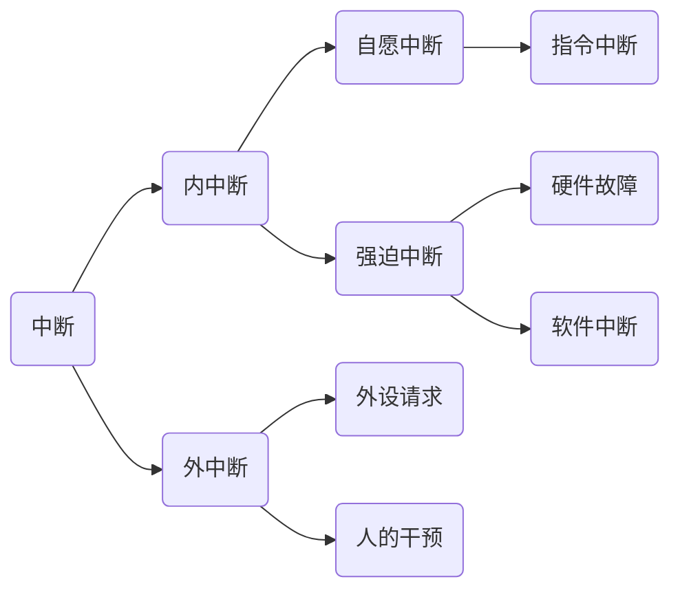

## 操作系统期末复习笔记（核心知识点总结）

### :rocket:  操作系统的基本概念

> **操作系统（Operating System）：**是指控制和管理整个计算机系统的硬件与软件资源，合理地组织、调度计算机的工作与资源分配，进而为用户和其他软件提供方便接口与环境的程序集合。**操作系统是计算机系统中最基本的系统软件。**

操作系统的基本特征包括：**并发、共享、虚拟和异步**。

##### 并行性与并发性

> **并行性**是指两个或多个事件在同一时刻发生。
>
> **并发性**是指两个或多个事件在同一时间间隔内发生。

在多道程序环境下，**并发性**是指在一段时间内，宏观上有多个程序同时执行，但在单处理器系统中每个时刻却仅能有一道程序执行，故在微观上这些程序只能分时地交替执行。

若在计算机系统中有多个处理器，则这些可以并发执行的程序便被分配到多个处理器上，实现并行执行，即利用每个处理器来处理一个可并发的程序。

##### 特权指令与非特权指令

**特权指令**：只能由操作系统内核使用，不允许用户直接使用的指令，如I/O指令、设置中断屏蔽指令、清内存指令、存储保护指令和设置时钟指令

所谓特权指令，是指有特殊权限的指令。比如清内存、置时钟、分配系统资源、修改虚存的段表或页表、修改用户访问权限等。

为了防止用户程序中使用特权指令，**用户态下只能使用非特权指令，和心态下可以使用全部指令**。从用户态转换为核心态的唯一途径是中断或异常。

若程序的运行由用户态转到核心态，则会用到访管指令（陷入指令或trap指令），访管指令是在用户态使用的，所以它不可能是特权指令。

#### :star:  系统调用

系统调用是操作系统提供的用户接口之一，是由操作系统实现的所有系统调用所构成的集合，即程序接口或应用编程接口（Application Programming Interface，API），是应用程序同操作系统之间的接口。

#### :star:  中断与异常

**中断（Interruption）**也称外中断，指来自CPU执行指令以外的事情发生。如设备发出的I/O结束中断，表示设备输入输出处理已经完成，希望处理机能够向设备发下一条输入输出请求，同时让完成输入输出后的程序继续运行。时钟中断，表示一个固定的时间片已到，让处理机处理计时、启动定时运行任务等。这一类中断通常是与当前程序运行无关的事件，即他们与当前处理机运行的程序无关。

**异常（Exception）**也称内中断、例外或陷入（trap），指源自CPU执行指令内部的事件。如程序的非法操作码、地址越界、算术溢出、虚存系统的缺页即专门的陷入指令等引起的事件。对异常的处理一般要依赖当前程序的运行现场，而且异常不能被屏蔽，一旦出现应立即处理。

通常异常会引起中断，而中断未必是由异常引起的

#### 操作系统的发展与分类

### :rocket:  处理器管理

**进程是计算机进行资源调度和分配的基本单位**

在多道程序环境下，处理器的分配和运行都是以**进程（或线程）**为基本单位，因而对处理器的管理可以归结为对进程的管理。并发是指在计算机内同时运行多个进程，因此进程何时创建、何时撤销、如何管理、如何避免冲突、合理共享就是进程管理的主要任务。

进程管理的主要功能包括：**进程控制、进程同步、进程通信、死锁处理、处理器调度等**

#### 处理器调度

**处理器的三级调度：高级调度（作业调度）、中级调度、低级调度（进程调度）。**

##### 三级调度的联系和区别

作业调度从外存的后备队列中选择一批作业进入内存，为它们建立进程，这些进程就送入就绪队列。进程调度从就绪队列中选出一个进程，并将其状态改为运行态，将CPU分配给它。中级调度是为了提高内存的利用率，系统将那些暂时不能运行的进程挂起来。当内存空间宽松时，通过中级调度选择具备运行条件的进程，将其唤醒。

> 作业调度为进程活动做准备，进程调度使进程正常活动起来，中级调度将暂时不能运行的进程挂起，中级调度处于作业调度和进程调度之间。
>
> 作业调度次数较少，中级调度次数略多，进程调度频率最高。
>
> 进程调度是最基本的，不可或缺。

#### :star:  调度的基本准则

**周转时间**：
$$
周转时间 = 作业完成时间 - 作业提交时间
$$
**带权周转时间**：
$$
带权周转时间 = 作业周全时间 /作业实际运行时间
$$
平均周转时间是指n个作业周转时间的平均值。

平均带权周转时间是指n个作业带权周转时间的平均值。

#### 进程调度方式

非剥夺调度方式，又称非抢占式方式。

剥夺调度方式，又称抢占方式。

#### 进程调度算法

进程调度的方式通常有**抢占式（剥夺式）**和**非抢占式（非剥夺式）**两种方式

##### 先来先服务调度算法（FCFS）

先来先服务调度算法（FCFS）是一种简单的调度算法，可以用于作业调度与进程调度。

**其基本思想是按照进程进入就绪队列的先后次序来分配处理器，采用非抢占的调度方式**

##### 短作业优先调度算法（SJF）

短作业优先调度算法（SJF）用于进程调度时被称为**短进程优先调度算法（SPF）**。改算法既可以用于作业调度，也可以用于进程调度。

**其基本思想就是把处理器分配给最快完成的作业（或进程）**

##### 最短剩余时间优先调度算法（SRTN）

抢占式的短作业优先调度算法又称为**最短剩余时间优先调度算法（SRTN）**。每当有进程加入，就绪队列改变时，就需要调度。如果新到达的进程剩余时间比当前运行的进程剩余时间更短，则由新进程抢占处理机，当前运行进程重新回到就绪队列。另外，当一个进程完成时也需要调度。

##### 优先级调度算法

优先级调度算法是一种常用的进程调度算法，既可以用于作业调度，也可以用于进程调度。

**其基本思想是把处理器分配给优先级最高的进程。**

##### 高响应比优先调度算法

高响应比优先调度算法综合了先来先服务和短作业优先两种调度算法的特点，即考虑了作业的等待时间和作业的运行时间两个因素，弥补了之前两种调度算法只考虑其中一个因素的不足。

高响应比优先调度算法主要用于作业调度。其基本思想是每次进行作业调度时，先计算就绪队列中的每个作业的响应比，挑选响应比最高的作业投入运行。

响应比的计算公式为
$$
响应比 = (作业等待时间 + 估计运行时间) / 估计运行时间
$$

##### 时间片轮转调度算法（RR）

时间片轮转调度算法主要适用于分时操作系统，在这种算法中，系统将所有就绪进程按到达时间的先后次序排成一个队列，进程调度程序总是选择就绪队列中的第一个进程执行，即先来先服务原则，但仅能运行一个时间片，如100ms。在使用完一个时间片后，即进程并未完成其运行，他也必须释放出（被剥夺）处理机给下一个就绪进程，而被剥夺的进程返回到**就绪队列**的末尾重新排队，登陆后下一次再运行。

##### 多级反馈队列调度算法

#### 进程同步

##### :heart:  临界资源和临界区

>**临界资源**：一次仅允许一个进程使用的资源称为临界资源。
>
>许多物理设备都属于临界资源，如打印机等；许多变量、数据等都可以被若干进程共享，也属于临界资源。
>
>**临界区**：进程中访问临界资源的那段代码，又称临界段。

##### 两种形式的制约关系

同步，也称为直接制约关系，是指为完成某种任务而建立的两个或多个进程，这些进程因为需要在某些位置上协调他们的工作次序而等待、传递消息所产生的制约关系。进程间的直接制约关系源于他们之间的相互合作。

互斥，也称为间接制约关系。当一个进程进入临界区使用临界资源时，另一个进程必须等待，当占用临界资源的进程退出临界区后，另一个进程才允许去访问临界资源。

> **区分同步和互斥只需要记住：只要是同类进程即为互斥关系，不同类进程即为同步关系。**例如消费者与消费者就是互斥关系，消费者和生产者就是同步关系。

为禁止两个进程同时进入临界区，同步机制应遵循以下准则：

**空闲让进**。临界区空闲时，可以允许一个请求进入临界区的进程立即进入临界区。

**忙则等待**。当已有进程进入临界区时，其他试图进入临界区的进程必须等待。

**有限等待**。对请求访问的进程，应保证能在有限时间内进入临界区。

**让权等待**。当进程不能进入临界区时，应立即释放处理器，防止进程忙等待。

#### :lock:  死锁

> **死锁**：若系统中存在一组进程，其中每个进程都占用了某种资源，但他们又都在等待其中另一个进程所占有的资源。如果这种等待永远不能结束，则说明系统出现了死锁。
>
> **死锁产生的必要条件：互斥条件、不剥夺条件、占有和等待条件、循环等待条件。**

**死锁的处理策略有：死锁的预防、死锁的避免、死锁的检测和解除。**

死锁定理：系统处于死锁状态的充分条件是：当且仅当此状态的进程-资源分配图是不可完全简化的，这一充分条件成为死锁定理。

##### 死锁的检测和解除

死锁的解除方法主要有：

资源剥夺法。挂起某些死锁进程，并抢占它的资源，将这些资源分配给其他的死锁进程。但应防止被挂起的进程长时间得不到资源而处于资源匮乏状态。

撤销进程法。强制撤销部分甚至全部死锁进程并剥夺这些进程的资源。撤销的原则可以按进程优先级和撤销进程的代价的高低来进行。

进程回退法。让一个或多个进程回退到足以回避死锁的地步，进程回退时资源释放资源而非被剥夺。要求系统保持进程的历史信息，设置还原点。

### :rocket:  存储器管理

操作系统中的存储器管理是指对内存（又称主存）的管理，是操作系统重要功能之一。

#### 内存管理的基本概念

##### 内存管理的功能

**内存空间的分配与回收。**由操作系统完成主存储器空间的分配和管理，是程序员拜托存储分配的麻烦

**地址转换。**在多道程序环境下，程序中的逻辑地址与内存的物理地址不可能一致，一次存储器管理必须提供地址变换功能，把逻辑地址转换成相应的物理地址。

**内存空间的扩充。** 利用虚拟存储技术或自动覆盖技术，从逻辑上扩充内存。

**存储保护。** 保证各道作业在各自的存储空间内运行，互不干扰。

#### 连续分区分配管理方式

##### 单一连续分配

单一连续分配会产生内部碎片

**什么是内部碎片和外部碎片**

根据碎片出现的情况，可以将碎片分为**内部碎片和外部碎片**。

**内部碎片**是指已经分配给作业但不能被利用的内存空间。

**外部碎片**是指系统中还没有分配给作业，但是由于碎片太小而无法分配给申请内存空间的新进程的存储块。

固定分区分配中存在内部碎片，而动态分区分配中存在外部碎片。通俗点理解是，某个作业所占用的内存区域如果没有装满，就是内部碎片，而作业与作业之间，如果有内存区域没有分配给某个作业，但又不能分配给任何作业，就是外部碎片。

##### 固定分区分配

##### 动态分区分配

#### 动态分区分配算法

##### 首次适应算法（First Fit，FF）

##### 下次适应算法（Next Fit，NF）

##### 最佳适应算法（Best Fit，BF）

要求将空闲分区按照**容量大小递增**的次序排列

##### 最差适应算法（Worst Fit，WF）

要求将空闲分区按照**容量大小递减**的次序排列

#### 非连续分配管理方式

非连续分配管理方式根据**分区大小**是否固定分为**分页存储管理方式和分段存储管理方式**，其中分页存储管理方式**根据运行作业时是否需要把作业的所有页都装入内存才运行**而分为**基本分页存储管理方式和请求分页存储管理方式**

##### 基本分页存储管理方式

假设逻辑地址为A，页面大小为L，则页号P = (int)(A/L)。页内偏移量W = A % L。

知道页号，题目中会给出相应的页表来记录每个页号存放的物理块号。块号乘以块的大小就是页面起始地址。

物理地址 = 页面起始地址 + 页内偏移量

**分页存储管理的逻辑地址结构**

如果每个页面大小为 2^k^B，用二进制数表示逻辑地址，则末尾k位即为页内偏移量，其余部分就是页号。因此，如果让每个页面的大小为2的整数幂，计算机就可以很方便得出一个逻辑地址对应的页号和页内偏移量。

| 31                                                                                   12 | 11                                                                                                      0 |
| ------------------------------------------------------------ | ------------------------------------------------------------ |
| 页号P                                                        | 页内偏移量W                                                  |

地址结构中包含两部分：前一部分为页号P，后一部分为页内偏移量W。

==**如果有K位表示“页内偏移量”，则说明该系统中一个页面的大小是 2^k^ 个内存单元**==

==**如果有M位表示“页号”，则说明该系统中，一个进程最多允许有2^M^ 个页面**==

**什么是快表（TLB）**

快表，又称联想寄存器（TLB），是一种访问速度比内存快很多的告诉缓冲器，用来存放当前访问的若干页表项，以加速地址变换的过程。与此对应，内存中的页表常称为慢表。

  

##### 基本分段存储管理方式

**分页和分段的区别**

|                     分页                     |                             分段                             |
| :------------------------------------------: | :----------------------------------------------------------: |
|              页是信息的物理单位              |                       段信息的逻辑单位                       |
| 分页的目的是系统管理所需，为了提高内存利用率 |             分段的目的是为了更好地满足用户的需要             |
|           页的大小固定且由系统决定           | 段的长度不固定，不同的段有不同的段长，是由用户编写的程序决定的 |
|             作业地址空间是一维的             |                     作业地址空间是二维的                     |
|            有内部碎片，无外部碎片            |                    无内部碎片，有外部碎片                    |

**为什么分页存储管理系统的地址空间是一维，而分段存储管理系统是二维的**

**段号是程序员自己定义的，每个段都是有特定含义**。因此不同的段大小不同，代表的意义也不相同。想要找到某个数据或者指令，需要指定段号和位移两个变量。

**而页号是系统自动生成的，本身地址是线性连续的**。当访问特定地址时，只需要提供地址即可。系统会自动将地址划分为页号和页内位移（地址整除页的大小，商为页号，余数为页内位移），而页号对程序员来说是没有实际意义的，一次是一维的。

##### 基本段页式存储管理方式

#### 虚拟内存管理

##### 请求分页存储管理方式

请求分页 = 基本分页 + 请求调页功能 +页面置换功能

#### 页面置换算法

##### 最佳置换算法（OPT）

在预知一个进程的页面号引用串的情况下，每次都淘汰以后不再使用的或以后最迟不再使用的页面，这种算法就是最佳置换算法。

显然，最佳置换算法是最优的，具有最低的缺页率。但由于实际操作中往往**无法事先知道以后会引用到的所有页面信息**，因此**最佳置换算法无法实现**，只能作为一个标准来衡量其他置换算法的优劣。

##### 先进先出算法（FIFO）

FIFO算法是最简单的页面置换算法，每次总是淘汰最先进入内存的页面，也就是淘汰在内存驻留时间最长的页面。

该算法实现简单，用数据结构中的队列就可以实现。首先将页面按照次序排成一个队列，并设置指针指向最先进入的页面，每次需要淘汰页面时，将指针所指的页面淘汰即可。

不过FIFO算法可能会导致Belady异常（缺页次数随着分配的物理块号的增加而增加）。这是因为FIFO算法忽略了一种现象——最早调入的页面往往是使用最频繁的页面。因此FIFO算法与进程的实际运行规律不符，实际效果不好。

##### 最近最少使用算法（LRU）

选择最近最长时间没有被使用的页面予以淘汰，其思想是用以前的页面引用情况来预测将来会出现的页面引用情况。也就是假设一个页面刚被访问，那么不久该页面还会被访问。最佳置换算法（OPT）是"向后看"，最近最少使用算法（LRU）则是"向前看"。

该算法可用寄存器组合栈来实现，性能较好。**常用的页面置换算法中，LRU算法最接近最佳置换算法**

##### 时钟置换算法（CLOCK）

##### 改进型时钟算法

##### 其他页面置换算法

**最不常用置换算法（LFU）**

**页面缓冲算法（PBA）**

### :rocket:  设备管理

#### 磁盘的驱动调度

**磁盘的驱动调度分为两种：移臂调度和旋转调度**

==移臂调度是根据访问者指定的柱面位置来决定执行次序的调度。移臂调度的目的是尽可能减少输入输出操作中的寻找时间。==

==旋转调度是根据延迟时间来决定执行次序的调度。旋转调度选择延迟时间最短的访问者先执行。==

一般来说，寻道时间因为要移动磁头臂，所以占用时间最长。

#### 移臂调度的主要算法

##### 先来先服务算法（FCFS）

谁先到就先处理谁

##### 最短寻道时间优先算法（SSTF）

谁离当前移动臂近，就先处理谁

##### 扫描算法（SCAN）

移动臂每次沿一个方向移动，扫过所有柱面，遇到最近的I/O请求就处理，==直至到达最后一个柱面后再向相反的方向移动过来==。

##### 电梯调度算法（LOOK）

每次总选择沿移动臂的移动方向最近的那个柱面，如果当前移动方向上没有但相反方向上有访问请求时，就改变移动方向，==不需要移动到柱面尽头==。

##### 循环扫描（C-SCAN）

规定移动臂单项移动，从0开始扫描至最大处，再返回0处重新开始扫描

### :rocket:  文件管理

> **文件**：文件是以计算机硬盘为载体的存储在计算机上的信息集合。
>
> **文件控制块（FCB）**：用来存放控制文件需要的各种信息的数据结构，以实现“按名存取”。
>
> **文件目录**：FCB的有序集合称为文件目录，一个FCB就是一个文件目录项。

在系统运行时，计算机以**进程**为基本单位进行资源的调度和分配。在用户进行的输入、输出时，则以**文件**为基本单位。

#### 文件的逻辑结构

##### 无结构文件（流式文件）

##### 有结构文件（记录式文件）

顺序文件

索引文件

索引顺序文件

#### 文件共享

##### 基于索引节点的共享方式（硬链接）

##### 利用符号链接实现文件共享（软链接）

#### 文件实现

##### 文件分配方式

连续分配

链接分配

索引分配

文件的物理结构包括连续、链式、索引三种。链式结构不能实现随机访问，连续结构的文件不易扩展。索引结构可以随机访问且易扩展。

直接存取即随机存取，采用连续分配和索引分配的文件都适合直接存取方式，只有采用链接分配的文件不具有随机存取特性。

##### 文件存储空间管理

空闲表法

空闲链表法

位示图法

### 其他

常见的高级通信机制包括 共享存储 、消息通信系统和管道通信系统三大类。

### 一些例题

#### 第一题

若页面大小L为1K字节，页号2对应的内存块号b=8，逻辑地址A=2500转换为物理地址E。

等价描述：某系统按字节寻址，逻辑地址结构中，页内偏移量站10位，页号2对应的内存块号b=8，将逻辑地址A=2500转换为物理地址E。

1. 计算页号、页内偏移量

页号：
$$
P = A/L = 2500/1024 =2 
$$
页内偏移量：
$$
W=A \% L = 2500 \% 1024 = 425
$$

2. 根据题中条件可知，页号2没有越界，其存放的内存块号b=8

3. 物理地址：

$$
E = b*L + W = 8*1024 + 425 = 8644
$$

#### 第二题

某虚拟存储器的用户空间共有32个页面，每页1KB，主存16KB。试问：

（1）逻辑地址的有效位是多少？

（2）物理地址的有效位是多少？

（3）假定某时刻系统用户的第0,1,2,3页分别分配的物理块号为5,10,4,7，试将虚拟地址0A5C和093C变换为物理地址。

| 页号 | 物理块号 |
| ---- | -------- |
| 0    | 5        |
| 1    | 10       |
| 2    | 4        |
| 3    | 7        |

1. 程序空间大小为32KB，因此逻辑地址有效位为15位

2. 内存大小是16KB，因此物理地址至少需要14位

3. 虚地址0A5C用二进制表示为0000101001011100，页面大小为1KB时，表示页内偏移需要10位来表示，即1001011100，剩下的6位为页号，即000010，转成10进制就是第2页。所以该页在内存的第4块，即0100，和页内偏移量拼接后就是物理地址即：0100 1001011100，转成10进制之后就是125CH

   同理可求093CH变换为物理地址为113CH。

#### 第三题

设有三道作业，他们的提交时间和执行时间由下表给出：

| 作业号 | 提交时间 | 执行时间 |
| ------ | -------- | -------- |
| 1      | 8.5      | 2.0      |
| 2      | 9.2      | 1.6      |
| 3      | 9.4      | 0.5      |

试计算在单道程序环境下，采用先来先服务调度算法和最短作业优先调度算法的平均周转时间（时间单位：小时，以十进制进行计算：要求写出计算过程）
$$
周转时间 = 完成时间 - 提交时间 = 执行时间 + 等待时间
$$

FCFS调度算法：

| 执行次序 | 提交时间 | 执行时间 | 开始时间 | 完成时间 | 周转时间 |
| -------- | -------- | -------- | -------- | -------- | -------- |
| 1        | 8.5      | 2.0      | 8.5      | 10.5     | 2.0      |
| 2        | 9.2      | 1.6      | 10.5     | 12.1     | 2.9      |
| 3        | 9.4      | 0.5      | 12.1     | 12.6     | 3.2      |

$$
平均周转时间 = (2.0 + 2.9 + 3.2) / 3 = 2.7(小时)
$$

SJF调度算法

| 作业号 | 提交时间 | 执行时间 | 开始时间 | 完成时间 | 周转时间 |
| ------ | -------- | -------- | -------- | -------- | -------- |
| 1      | 8.5      | 2.0      | 8.5      | 10.5     | 2.0      |
| 3      | 9.4      | 0.5      | 10.5     | 11.0     | 1.6      |
| 2      | 9.2      | 1.6      | 11.0     | 12.6     | 3.4      |

$$
平均周转时间 = (2.0+3.4+1.6)/3=2.3(小时)
$$

