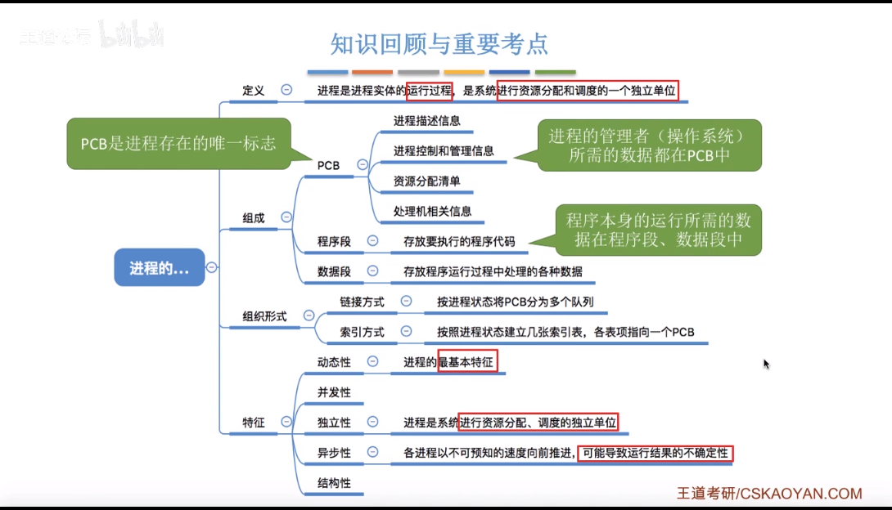

## 操作系统

### 1. 操作系统定义

操作系统（Operating System，OS）是指控制和管理整个计算机系统的硬件和软件资源，并合理地组织调度计算机的工作和资源分配，以提供给用户和其他软件方便的接口和环境，它是计算机系统中最基本的**系统软件**

简单来说，有三个方面

> 1. 负责管理协调硬件，软件等计算机资源的工作
> 2. 为上层应用程序、用户提供简单易用的服务
> 3. 操作系统是系统软件，而不是硬件

### 2. 操作系统的特征

**并发，共享，虚拟，异步**是操作系统的四个基本特征。其中并发和共享是两个最基本的特征，二者互为存在条件。

**并发**：指两个或多个事件在同一时间间隔内发生。这些事件宏观上是同时发生的，但微观上是交替发生的。**并行**：指两个或多个时间在同一时刻同时发生。

**共享：** 即资源共享，是指系统中的资源可供内存中多个并发执行的进程共同使用。**互斥共享和同时共享**是两种资源共享方式。

所谓“同时”往往是宏观上的，而微观上，这些进程可能是交替地对该资源进行访问的（即分时共享） 

**虚拟：** 是指把一个物理上的实体变为若干个逻辑上的对应物。物理实体（前者）是实际上存在的，而逻辑上对应物（后者）是用户感受到的。

虚拟技术包括“空分复用技术”和“时分复用技术”

### 3. 操作系统的发展与分类

### 4. 操作系统的运行机制与体系结构

处理器的两种状态：用户态（目态，cpu只能执行非特权指令）、核心态（管态，cpu可以执行特权指令和非特权指令）。

用程序状态字寄存器（psw)中的某标志位来标识当前处理器处于什么状态，如0为用户态，1为核心态。

### 5. 中断和异常

用户态到核心态是通过中断来实现的,并且中断是唯一的途径。

核心态到用户态的切换时通过执行一个特权指令，将程序状态字（psw）的标志位设置为“用户态”

### 6. 系统调用

trap 指令 = 陷入指令 = 访管指令

### 7. 进程的定义、组成和组织方式

为了方便操作系统管理、完成各程序并发执行，引入了进程、进程实体的概念。

系统为每个运行的程序配置一个数据结构，成为进程控制块（PCB），用来描述进程的各种信息（如程序代码存放位置）

PCB、程序段、数据段三部分构成了进程实体（进程映像）

程序段、数据段、PCB三部分组成了进程实体（进程映像）。一般情况下，我们把进程实体就简称为进程，例如，所谓创建进程，实质上是创建进程实体中的PCB; 而撤销进程，实质上是撤销进程实体中的PCB。

**PCB是进程存在的唯一标志！**

操作系统通过PCB来管理进程，因此PCB中应该包含操作系统对其进行管理所需的各种信息。

动态性是进程的基本特征，进程是资源分配，接受调度的基本单位

### 8. 进程的状态

### 9. 进程控制

用原语实现进程控制。原语的特点是执行期间不允许中断，只能一气呵成。这种不可被中断的操作即原子操作。

原语采用“关中断指令”和“开中断指令”实现。关/开中断指令的权限非常强大，必然只允许在核心态下执行特权指令，所以原语运行在核心态。

### 10.  进程通信

### 11. 线程、多线程模型

线程是一个基本的cup执行单元，也是程序执行流的最小单位。引入线程之后，不仅进程之间可以并发，进程内的各个线程之间也可以并发，从而进一步提高了系统的并发度。

引入线程之后，进程只作为除cpu之外的系统资源的分配单元。也就是说，进程是资源分配的基本单位，线程是调度的基本单位。

 

### 12. 处理机的调度

 

### 13. 进程调度的时机

进程执行过程中若发生中断，则需要执行低级调度。

 抢占式和非抢占式是低级调度（进程调度）的类型，作业调度是高级调度

进程切换是指一个进程让出处理机，由另一个进程占用处理机的过程

### 14. 调度算法的评价指标

系统吞吐量：单位时间内完成作业的数量

系统吞吐量 = 总共完成了多少道作业 / 总共花了多少时间

周转时间，是指作业被提价给系统开始，到作业完成为止的这段时间间隔

### 15. 调度算法

#### 先来先服务（FCFS)

 

#### 短进程优先调度（SPF)

#### 最短剩余时间优先（SRTN)

#### 高响应比优先（HRRN)

#### 时间片轮转（RR)

一般来说，设计时间片时要让切换进程的开销占比不超过1%

#### 优先级调度

### 多级反馈队列

### 作业，进程，线程，管程

 作业：用户在一次解决或是一个事务处理过程中要求计算机系统所做的工作的集合，它包括用户程序、所需要的数据集控制命令等。作业是由一系列有序的步骤组成的。在执行一个作业可能会运行多个不同的进程。

​     进程：程序在一个数据集上的一次运行过程。是操作系统资源分配的基本单位。

​     线程：是进程中的一个实体，是被操作系统独立调度和执行的基本单位。一个进程包含一个或多个线程。

​      线程特征：

1、线程的执行状态包括运行、就绪和等待。

2、进程中的所有线程共享所属进程内的主存和其他资源。

3、拥有自己的线程控制块和执行栈，寄存器。

​      进程和线程的区别：

1、进程间是独立的，在内存空间、上下文环境上。而线程是运行在进程空间内的，同一进程所产生的线程共享同一内存空间。

2、进程间是可以并发执行的，线程之间也可以并发执行。但同一进程中的两端代码只有在引入线程的情况下才能并发执行。

3、线程是属于进程的，当进程退出时，该进程所产生的线程都会被强制退出并清除。

4、线程占用的资源要少于进程占用的资源，线程间的切换速度比进程间的切换快的多。

​    管程：是定义了一个数据结构和在该数据结构上能为并发进程所执行的一组操作。这些操作能同步进程和改变管程中的数据。它是一种进程同步机制。在结构上类似于面向对象中的类。在功能上和信号量和p，v操作类似。可以更方便的管理系统的临界资源。

​     管程特征：

1、模块化：一个管程就是一个可单独编译的实体，结构上和类相仿。

2、抽象数据类型。

3、信息隐蔽。

​    管程要素：

1、安全性：管程中的数据变量在管程之外是不可见的，只能有该管程的操作过程存取。

2、互斥性：任一时刻只能有一个调用者进入管程。

3、等待机制：设置等待队列及相应的操作，对资源进行管理。

​    管程和上面三个名词，区别大，但是容易混淆。

​    管道：是一种进程通信机制。是共享文件模式，它基于文件系统，在两个进程之间，以先进先出的方式实现消息的单向传送。管道是一种特殊文件。

### 进程同步

### 进程互斥

临界区是进程中访问临界资源的代码段

进入区和退出区是负责实现互斥的代码段

### 进程互斥的软件实现

单标志法可以实现 同一时刻最多只允许一个进程访问临界区。

### 进程互斥的硬件实现方法

