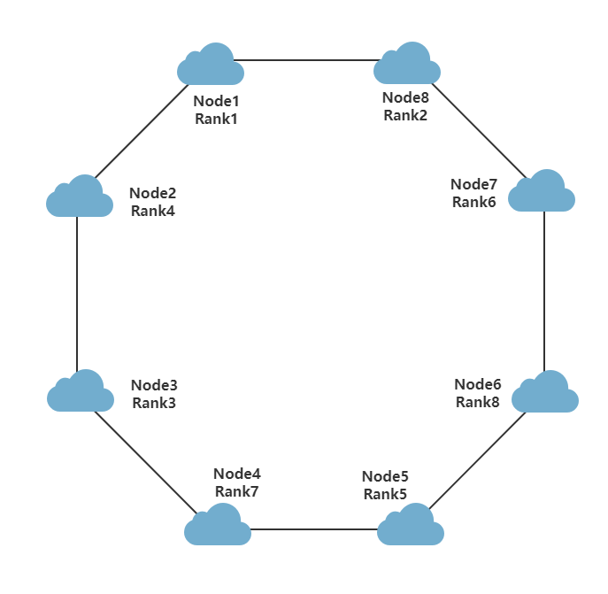

# 高性能计算集群上节点通信时延与跳数的关系

### 摘要

本文主要讨论了高性能计算集群上节点通信时延与跳数的关系。单个计算机计算能力有限，但是造价便宜。大型计算机虽然计算速度快，但是造价昂贵。如果将许多小型计算机连接成计算集群，每个结点之间利用网络通信，不仅降低了成本，而且极大地提高计算速度。因此，研究节点之间的网络通信时延对提高计算速度有着重要的意义。

### 关键词

计算集群	通信时延	数据清洗	数据拟合

## 1. 问题的重述

超级计算机一般是由多台计算机通过具有一定结构网络连接起来，并具备超高速运算能力的大型计算系统，通常也被称之为高性能计算集群。

附件“数据1.xlsx”是上图所示的8节点集群环形网络的各节点间时延测试的原始数据记录（循环1000次），进行数据的清洗，然后请建立数学模型分析时延与跳数的关系。

## 2. 问题分析

对于将要解决的问题，首先所给数据进行预处理，使之变成结构化数据。考虑到节点和自己通信并没有实际意义，应予以去除。接着应对数据进行清洗，包括清理缺失数据、离群数据，对数据做平滑处理。最后利用均值代表节点之间的通信时延。

由于集群包含数以百计的计算机，节点之间的差异应忽略不计。认为所有节点的通信能力，计算能力等都是相等的。所以，针对上述8节点集群环形网络，Node1分别于Node1和Node7的通信时延应是相等的。

基于以上分析，可以初步判断，通信时延与节点跳数之间应该是线性关系。于是想到利用Node1与其他节点的通信时延与跳数的关系建立初步模型，然后利用其它节点的数据进行数据拟合，并绘制折线图观察模型正确性。

## 3. 模型假设

（1）假设所有节点的通信能力，计算能力都是相同的

（2）假设节点之间跳数相同，则其通信时延也是相同的，即不考虑路径差异带来的影响。

（3）只考虑Node1到其他节点的通信时延与跳数的关系

（4）通信时延虽然每次都不一样，但应该在某一范围内波动，这里假设波动范围为$±10\%$

## 4. 符号说明和名词解释

### 4. 1 符号说明

| 符号 | 含义                | 单位 |
| ---- | ------------------- | ---- |
| L    | 通信时延            | us   |
| h    | 跳数                |      |
| R    | 节点分配的MPI进程号 |      |

### 4. 2 名词解释

通信时延：指一个报文或分组从一个网络的一端传送到另一个端所需要的时间。

数据清洗：数据清洗是指发现并纠正数据文件中可识别的错误的最后一道程序，包括检查数据一致性，处理无效值和缺失值等。

数据拟合：根据实验，测试等获得的若干离散数据，从中得到连续函数或者离散方程。

## 5. 模型的建立与求解

### 5. 1 数据分析

题目所给数据是每个节点到其他节点的通信测试数据，每两个节点之间循环1000次。基于模型假设，只考虑Node1到其他节点的数据。

初步观察发现，Node1与每个节点通信的1000次测试数据中，大约前100次通信时延不是很稳定，所以在接下来的数据清洗中应予以去除。

测试数据中会有少部分离群数据以及明显不符合逻辑的数据，比如通信时延相对于平均值来说超过了一定的范围，这些数据也不应该考虑在内。

### 5.2 数据清洗

基于上面的数据分析，对所给原始数据按照如下步骤进行数据清洗，得到基本数据。

根据以上数据清洗步骤，得到Node1到其他节点的通信时延与跳数的关系。

| Rank | Latency (us) | Hoops |
| ---- | ------------ | ----- |
| 4    | 0.64866717   | 1     |
| 2    | 0.64970712   | 1     |
| 6    | 1.09808305   | 2     |
| 3    | 1.09849822   | 2     |
| 7    | 1.54979999   | 3     |
| 8    | 1.55114903   | 3     |
| 5    | 1.99555586   | 4     |

可以发现，跳数相同的话，通信时延也大致相同。为了简化模型，将跳数相同的节点通过求平均值合并成一个，从而得到通信时延与跳数的关系简表。

| Hoops | Latency (us) |
| ----- | ------------ |
| 1     | 0.64918715   |
| 2     | 1.09829064   |
| 3     | 1.55047451   |
| 4     | 1.99555586   |

### 5.3 数据拟合

基于通信时延与跳数的简表，利用Excel进行数据拟合，如下图所示。

可以得到通信时延与跳数拟合公式为
$$
L = 0.4491h + 0.2006，R^2 = 1
$$
上述公式中，$R^2$为拟合优度，反应拟合程度。

### 5. 4 结果分析

经过数据拟合可以看出，通信时延和跳数成完全线性关系。即随着跳数的增大，通信时延也成比例增大。所以，在分配MPI时，应将通信次数较小的Rank映射到距离较远的的节点上，而将通信较频繁的Rank映射到距离较近的节点上。

通过本模型得到的线性关系，在实际组建计算机群中可以采用更为复杂的树形网络拓扑，类似于最优二叉树等拓扑结构可以较大地减少主计算机与从计算机通信的跳数，从而减少通信时延。当然，利用任务映射，网络拓扑的结构对于程序来说依然是透明的。

## 6. 模型的评价与改进

### 6. 1 模型的评价

本模型建立在大量真实的通信测试数据上，基本符合实际情况。可以为组建超级计算集群提供参考依据。在分析通信时延与网络的关系，改进计算速度，打破计算瓶颈方便有着重要的参考意义。

### 6. 2 模型的改进

本模型建立在较为理想的情况下，简化了诸多复杂的现现实因素，具有一定的局限性。实际情况下，节点平均无故障运行时间，节点的计算能力，通信能力等都是影响整个计算集群的因素。因此模型具有可以优化和研究的前景，并且相信经过优化后的模型对突破计算集群的算力有着重要的参考意义。

## 参考文献

[1]吴孟达.全国大学生数学建模竞赛湖南赛区优秀论文集[M].清华大学出版社:北京,2014:1.

[2]谢希仁.计算机网络[M].电子工业出版社:北京,2017:1-.

