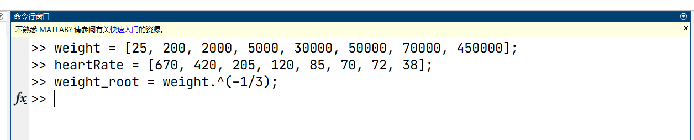
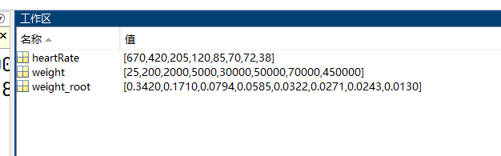
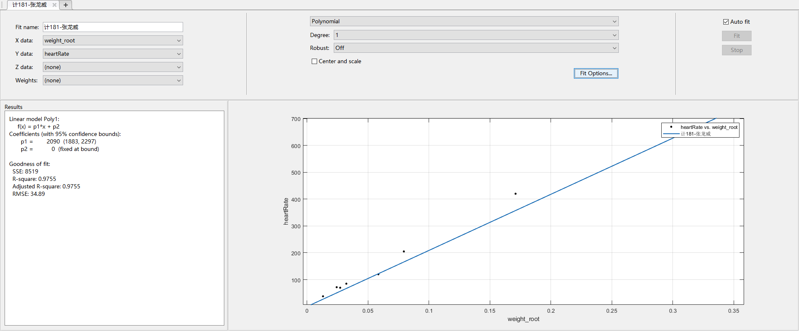
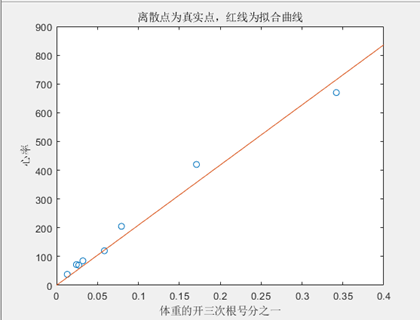

# **休息状态的热血动物的体重与心率的关系模型**

## 一、问题简述

生物学家认为，对于休息状态的热血动物，消耗的能量主要用于维持体温，能量与从心脏到全身的血流量成正比，而体温主要通过身体表面散失，建立一个动物体重（单位：g）与心率（单位：次/min）之间关系的模型，并用下面的数据加以检验。

| 动物 | 体重（单位：g） | 心率（单位：次/min） |
| ---- | --------------- | -------------------- |
| 田鼠 | 25              | 670                  |
| 家鼠 | 200             | 420                  |
| 兔   | 2000            | 205                  |
| 小狗 | 5000            | 120                  |
| 大狗 | 30000           | 85                   |
| 羊   | 50000           | 70                   |
| 人   | 70000           | 72                   |
| 马   | 450000          | 38                   |

 

## 二、问题分析

1、首先明确我们需要建立一个体重和心率之间的模型。根据上述提供的数据可以粗略地看出：体重越大的动物心率反而越小。

2、动物心脏的跳动就主要用于维持体温和血液流动，于是就大致有体表散热和心脏跳动产热有正比关系。

2、根据生活经验可知，有很多因素都可以影响到心率的大小，比如年龄，运动状态，天气等。为了简化问题，我们假设动物都处于静止并且健康状态。

3、为了简化问题，我们不考虑不同动物个性特征的差异。意思是除了血液，体征，散热量，能量，其他无关变量我们都不考虑，处于一个相对理想的模型。尽可能方便地建立动物体重和心率之间的关系。

## 三、模型假设

1、假设只考虑动物的体征，不考虑动物的个性特征，比如冬眠状态等。

2、假设动物都处于静止状态，周围环境相同。

3、假设动物的表面积与动物的长度成二次方关系

4、假设动物的体积与动物的长度成三次方关系，并且动物的体重和体积成正比

5、假设动物心脏的跳动就主要用于维持体温和血液流动，于是就大致有体表散热和心脏跳动产热有正比关系。

经过分析，我们对接下来将要用到的符号进行统一说明：

| 符号 | 说明                                       |
| ---- | ------------------------------------------ |
| L    | 生物的长度                                 |
| S    | 生物的表面积                               |
| V    | 生物的体积                                 |
| W    | 生物的体重                                 |
| Q    | 每分钟生物通过表皮耗散的热量               |
| E    | 每分钟生物通过血液流动产生的能量           |
| F    | 每分钟生物的血流量                         |
| f    | 心脏跳动一次生物的血流量                   |
| n    | 心率                                       |
| k1   | 表面积S与长度L的平方的比例系数             |
| k2   | 体积V与长度L的三次方的比例系数             |
| k3   | 体重W与体积V的比例系数                     |
| k4   | 耗散热量Q与产生能量E的比例系数             |
| k5   | 耗散热量Q与表面积S的比例系数               |
| k6   | 每次心跳出血量f与体重W的比例系数           |
| k7   | 每分钟产生的能量E与每分钟血流量F的比例系数 |

## 四、模型建立

先展示一下各个符号间的关系

表面积与长度的关系 S=k1*L^2  ①

体积与长度的关系  V=K2*L^3  ②

体重与体积的关系  W=k3*V  ③

每分钟耗散热量与每分钟产生能量的关系  Q=k4*E   ④

每分钟耗散热量与表面积的关系  Q=k5*S  ⑤

每分钟的血流量与心率和单次心跳出血量的关系  F=n*f   ⑥

单次心跳出血量与体重的关系  f=k6*W  ⑦

每分钟产生的能量与每分钟血流量的关系  E=k7*F   ⑧

 经过整理，得到心率与体重的关系对应的模型：
$$
n = \displaystyle \frac{k1*k5}{(k4*k6*k7)*(k2*k3)^{2/3}} *W^{-1/3}
$$

## 五、结果分析或解释

为了简单起见，不妨假设
$$
n = K * W^{-1/3}
$$
接下来使用MATLAB来处理原始数据

将得到的比例系数k=2090代入上述模型，进行检验，得到如下结果：

| 动物 | 体重（单位：g） | 心率（单位：次/min） |
| ---- | --------------- | -------------------- |
| 田鼠 | 25              | 715                  |
| 家鼠 | 200             | 357                  |
| 兔   | 2000            | 166                  |
| 小狗 | 5000            | 122                  |
| 大狗 | 30000           | 67                   |
| 羊   | 50000           | 57                   |
| 人   | 70000           | 51                   |
| 马   | 450000          | 27                   |

对数据进行拟合，如下图所示：

### 结果分析

发现模型得到的心率与实际心率存在一些误差，进一步分析，模型后可能有如下缺点：

* 我们设想的环境过于理想，假设条件过多，导致和实际结果会有些偏差。

* 我们没有考虑动物之间的其他差异，比如动物密度，动物习性等。
* 在处理数据的时候，使用了近似值，导致结果出现了偏差。

## 六、参考文献

[1] 林道荣，秦志林，周伟光.《数学实验与数学建模》[M].科学出版社

