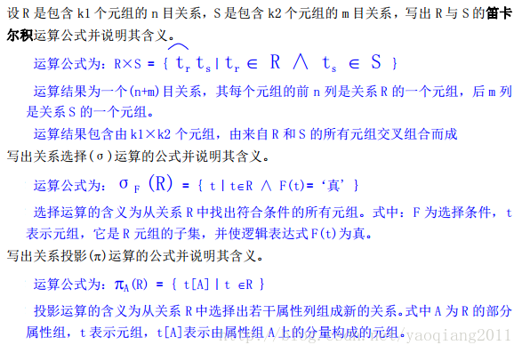

# 数据库

## 基本概念

数据库是**长期存储**在计算机内、**有组织的**、**可共享**和大量数据的集合。

数据库三个阶段：人工管理，文件系统，数据库系统

数据库有两个重要的模型：概念模型和数据模型。概念模型面向人，数据模型面向机器。

Data：数据，是数据库中存储的基本对象，是描述事物的符号记录。

Database：数据库，是长期储存在计算机内、有组织的、可共享的大量数据的集合。

DBMS：数据库管理系统，是位于用户与操作系统之间的一层数据管理软件，用于科学地组织、存储和管理数据、高效地获取和维护数据。

DBS：数据库系统，指在计算机系统中引入数据库后的系统，一般由数据库、数据库管理系统、应用系统、数据库管理员（DBA）构成。

实体和属性：客观存在并可相互区别的事物称为实体。实体所具有的某一特性称为属性。

码：代表数目的符号（分有主码和候选码等）

主码：我们在建立数据库的时候，需要为每张表指定一个主码，主bai码也叫主键。所谓主码就是在实体集中区分不同实体的候选码。一个实体集中只能有一个主码，但可以有多个候选码。

**主属性：包含在任一候选关键字中的属性称主属性。**主码和候选码所包含的属性称为主属性。

非主属性：不包含在主码中的属性称为非主属性。 非主属性是相对与主属性来定义的。

**E-R图：**即实体-关系图，用于描述现实世界的事物及其相互关系，**是数据库概念模型设计的主要工具。**

型/值：型是对某一类数据的结构和属性的说明；值是型的一个具体赋值，是型的实例。

数据库模式：是对数据库中全体数据的逻辑结构（数据项的名字、类型、取值范围等）和特征（数据之间的联系以及数据有关的安全性、完整性要求）的描述。

**数据库的三级系统结构：外模式、模式和内模式。**

数据库内模式：又称为存储模式，是对数据库物理结构和存储方式的描述，是数据在数据库内部的表示方式。一个数据库只有一个内模式。

数据库外模式：又称为子模式或用户模式，它是数据库用户能够看见和使用的局部数据的逻辑结构和特征的描述，是数据库用户的数据视图。通常是模式的子集。一个数据库可有多个外模式。

**数据库的二级映像：外模式/模式映像、模式/内模式映像。**

**数据库系统由数据库、数据库管理系统、应用系统和数据库管理员构成。**

实体型之间的联系分为一对一、一对多和多对多三种类型。

关系模型的完整性约束包括：实体完整性、参照完整性和用户定义完整性。

阐述数据库三级模式、二级映象的含义及作用。

数据库三级模式反映的是数据的三个抽象层次： 模式是对数据库中全体数据的逻辑结构和特征的描述。内模式又称为存储模式，是对数据库物理结构和存储方式的描述。外模式又称为子模式或用户模式，是对特定数据库用户相关的局部数据的逻辑结构和特征的描述。

数据库三级模式通过二级映象在 DBMS 内部实现这三个抽象层次的联系和转换。外模式面向应用程序， 通过外模式/模式映象与逻辑模式建立联系， 实现数据的逻辑独立性。 模式/内模式映象建立模式与内模式之间的一对一映射， 实现数据的物理独立性。

## 简答题

### 简述数据库系统的组成

数据库系统是由数据库、数据库管理系统、应用程序和数据库管理员组成的存储、管理、处理、和维护数据的系统。

### 简述数据库系统常见故障

数据库系统中可能发生的故障大致分以下几类：事务内部故障、系统故障、介质故障、计算机病毒。

### 简述使用ODBC技术有点

使用ODBC编写的应用程序可移植性好，能同时访问不同的数据库，共享多个数据库。


### 简述并发操作带来的数据不一致性

丢失修改、不可重复读、读脏数据


## 数据模型

数据模型是用来抽象、表示和处理现实世界中的数据和信息的工具，是对现实世界的模拟，**是数据库系统的核心和基础； ** **其组成元素有数据结构、数据操作和完整性约束。**

根据模型的应用的不同目的，可以将这些模型划分为两大类，他们分别属于不同的层次。第一类是概念模型，第二类是逻辑模型和物理模型。

### 概念模型

概念模型，也称信息模型，是按用户的观点来对数据和信息建模，主要用于数据库设计。

### 逻辑模型和物理模型

逻辑模型：是按计算机系统的观点对数据建模，用于DBMS实现。

物理模型：是对数据最底层的抽象，描述数据在系统内部的表示方式和存取方法，在磁盘或磁带上的存储方式和存取方法，是面向计算机系统的。

常见的主要的数据模型有：

* **层次模型**
* **网状模型**
* **关系模型**
  * 面向对象数据模型
* 对象关系数据模型
* 半结构化数据模型

其中层次模型和网状模型统称为格式化模型。 


#### 层次模型

在数据库中定义满足下面两个条件的基本层次联系的集合称为层次模型：

* 有且只有一个节点没有双亲节点，这个节点称为根节点
* 根以外的其他节点有且只有一个双亲节点

层次模型类似数据结构中的二叉树


#### 网状模型

在数据结构中，把满足以下两个条件的基本层次联系集合称为网状模型：

* 允许一个以上的节点无双亲
* 一个节点可以有多于一个的双亲

网状模型中一个节点可以有多个双亲，节点之间可以有多种联系。


#### 关系模型

从用户观点看，关系模型是由一组关系组成，每个关系的数据结构是一张规范化的二维表。

关系模型中有很多术语：关系、元组、属性、码、域、分量、关系模式。

**关系模型要求关系必须是规范化的**，即要求关系必须满足一定的规范条件，这些规范条件中最基本的一条就是， **关系的每一个分量都必须是一个不可分割的数据项。**关系模型具有以下优点：

* 关系模型与格式化模型不同，它是**建立在严格的数学概念的基础上的。**
* **关系模型的概念单一**
* **关系模型的存取路径对用户来说是透明的**，从而有更高的数据独立性，安全性。但是降低了查询效率。


注意关系模型与关系模式的区别，关系模型包含关系模式。关系模式是对关系的描述，一般为：

> 关系名（属性1，属性2， 属性3，......，属性n）

下面是关系和生活中表格的术语对比

| 关系术语   | 一般表格术语             |
| ---------- | ------------------------ |
| 关系名     | 表名                     |
| 关系模式   | 表头（表格的描述）       |
| 关系       | （一张）二维表           |
| 元组       | 记录或行                 |
| 属性       | 列                       |
| 属性名     | 列名                     |
| 属性值     | 列值                     |
| 分量       | 一条记录中的一个列值     |
| 非规范关系 | 表中有表（大表嵌套小表） |


### 关系代数

一、相关概念

主键： 能够唯一地标识一个元组的属性或属性组称为关系的键或候选键。 若一个关系有多个候选键则可选其一作为主键(Primary key)。

外键：如果一个关系的一个或一组属性引用(参照)了另一个关系的主键，则称这个或这组属性为外码或外键(Foreign key)。

关系数据库： 依照关系模型建立的数据库称为关系数据库。 它是在某个应用领域的所有关系的集合。

关系模式： 简单地说，关系模式就是对关系的型的定义， 包括关系的属性构成、各属性的数据类型、 属性间的依赖、 元组语义及完整性约束等。 关系是关系模式在某一时刻的状态或内容， 关系模型是型， 关系是值， 关系模型是静态的、 稳定的， 而关系是动态的、随时间不断变化的，因为关系操作在不断地更新着数据库中的数据。

实体完整性：用于标识实体的唯一性。它要求基本关系必须要有一个能够标识元组唯一性的主键，主键不能为空，也不可取重复值。

参照完整性： 用于维护实体之间的引用关系。 它要求一个关系的外键要么为空， 要么取与被参照关系对应的主键值，即外键值必须是主键中已存在的值。

用户定义的完整性：就是针对某一具体应用的数据必须满足的语义约束。包括非空、 唯一和布尔条件约束三种情况。

  二、重要知识点

关系数据库语言分为关系代数、关系演算和结构化查询语言三大类。

**关系的 5 种基本操作是选择、投影、并、差、笛卡尔积。**

关系模式是对关系的描述，五元组形式化表示为：R（U，D，DOM，F），其中

    R —— 关系名
    U —— 组成该关系的属性名集合
    D —— 属性组 U 中属性所来自的域
    DOM —— 属性向域的映象集合
    F —— 属性间的数据依赖关系集合

笛卡尔乘积，选择和投影运算如下



### SQL语句

一、相关概念

SQL：结构化查询语言的简称， 是关系数据库的标准语言。SQL 是一种通用的、 功能极强的关系数据库语言， 是对关系数据存取的标准接口， 也是不同数据库系统之间互操作的基础。集数据查询、数据操作、数据定义、和数据控制功能于一体。

数据定义：数据定义功能包括模式定义、表定义、视图和索引的定义。

嵌套查询：指将一个查询块嵌套在另一个查询块的 WHERE 子句或 HAVING 短语的条件中的查询。

  二、重要知识点

SQL 数据定义语句的操作对象有：模式、表、视图和索引。

SQL 数据定义语句的命令动词是：CREATE、DROP 和 ALTER。

RDBMS 中索引一般采用 B+树或 HASH 来实现。

索引可以分为唯一索引、非唯一索引和聚簇索引三种类型。


**SQL 创建表语句的一般格式**


```sql
create table <表名> (
	<列名> <数据类型> [<列级完整性约束],
    <列名> <数据类型> [<列级完整性约束],
    [表级完整性约束]
);
```

<数据类型>：数据库系统支持的各种数据类型，包括长度和精度。 

列级完整性约束：针对单个列(本列)的完整性约束， 包括 PRIMARY KEY、 REFERENCES表名(列名)、UNIQUE、NOT NULL 等。 

表级完整性约束：基于表中多列的约束，包括 PRIMARY KEY ( 列名列表) 、FOREIGN KEY REFERENCES 表名(列名) 等。

**SQL  创建索引语句的一般格式**

```sql
create [unique] [cluster] index <索引名> on <表名> (
	<列名列表>
);
```

UNIQUE：表示创建唯一索引，缺省为非唯一索引；

CLUSTER：表示创建聚簇索引，缺省为非聚簇索引；

 <列名列表>：一个或逗号分隔的多个列名，每个列名后可跟 ASC 或 DESC，表示升/降序，缺省为升序。多列时则按为多级排序。


**SQL 查询语句的一般格式**


```sql
select [all | distinct] <算术表达式列表> from <表名或视图名列表>
[ WHERE <条件表达式 1> ]
[ GROUP BY <属性列表 1> [ HAVING <条件表达式 2 > ] ]
[ ORDER BY <属性列表 2> [ ASC｜DESC ] ] ；
```

ALL／DISTINCT： 缺省为 ALL， 即列出所有查询结果记录， 包括重复记录。 DISTINCT则对重复记录只列出一条。

算术表达式列表：一个或多个逗号分隔的算术表达式，表达式由常量(包括数字和字符串)、列名、函数和算术运算符构成。每个表达式后还可跟别名。也可用 *代表查询表中的所有列。

 <表名或视图名列表>： 一个或多个逗号分隔的表或视图名。 表或视图名后可跟别名。

条件表达式 1：包含关系或逻辑运算符的表达式，代表查询条件。

条件表达式 2：包含关系或逻辑运算符的表达式，代表分组条件。

<属性列表 1>：一个或逗号分隔的多个列名。

<属性列表 2>： 一个或逗号分隔的多个列名， 每个列名后可跟 ASC 或 DESC， 表示升/降序，缺省为升序。


### 权限管理

一、相关概念和知识

触发器是用户定义在基本表上的一类由事件驱动的特殊过程。由服务器自动激活， 能执行更为复杂的检查和操作，具有更精细和更强大的数据控制能力。使用 CREATE TRIGGER 命令建立触发器。

计算机系统存在技术安全、管理安全和政策法律三类安全性问题。

TCSEC/TDI 标准由安全策略、责任、保证和文档四个方面内容构成。

常用存取控制方法包括自主存取控制(DAC)和强制存取控制(MAC)两种。

自主存取控制(DAC)的 SQL 语句包括 GRANT 和 REVOKE 两个。 用户权限由数据对象和操作类型两部分构成。


```sql

把对 Student 和 Course 表的全部权限授予所有用户。
GRANT ALL PRIVILIGES ON TABLE Student，Course TO PUBLIC ；

把对 Student 表的查询权和姓名修改权授予用户 U4。
GRANT SELECT，UPDATE(Sname) ON TABLE Student TO U4;

把对 SC 表的插入权限授予 U5 用户，并允许他传播该权限。
GRANT INSERT ON TABLE SC TO U5 WITH GRANT OPTION;

把用户 U5 对 SC 表的 INSERT 权限收回，同时收回被他传播出去的授权。
REVOKE INSERT ON TABLE SC FROM U5 CASCADE;

创建一个角色 R1，并使其对 Student 表具有数据查询和更新权限。
CREATE ROLE R1;
GRANT SELECT，UPDATE ON TABLE Student TO R1;

对修改 Student 表结构的操作进行审计
AUDIT ALTER ON Student ；
```

### 范式

 一、相关概念和知识点

数据依赖：反映一个关系内部属性与属性之间的约束关系，是现实世界属性间相互联系的抽象，属于数据内在的性质和语义的体现。

规范化理论：是用来设计良好的关系模式的基本理论。它通过分解关系模式来消除其中不合适的数据依赖，以解决插入异常、删除异常、更新异常和数据冗余问题。

函数依赖：简单地说，对于关系模式的两个属性子集X和Y，若X的任一取值能唯一确定Y的值，则称Y函数依赖于X，记作X→Y。

非平凡函数依赖：对于关系模式的两个属性子集X和Y，如果X→Y，但Y!⊆X，则称X→Y为非平凡函数依赖；如果X→Y，但Y⊆X，则称X→Y为平凡函数依赖。

完全函数依赖：对于关系模式的两个属性子集X和Y，如果X→Y，并且对于X的任何一个真子集X'，都没有X'→Y，则称Y对X完全函数依赖。

范式：指符合某一种级别的关系模式的集合。在设计关系数据库时，根据满足依赖关系要求的不同定义为不同的范式。

规范化：指将一个低一级范式的关系模式，通过模式分解转换为若干个高一级范式的关系模式的集合的过程。

1NF：若关系模式的所有属性都是不可分的基本数据项，则该关系模式属于1NF。

2NF：1NF关系模式如果同时满足每一个非主属性完全函数依赖于码，则该关系模式属于2NF。

3NF：若关系模式的每一个非主属性既不部分依赖于码也不传递依赖于码，则该关系模式属于3NF。全码一定是3NF

BCNF：若一个关系模式的每一个决定因素都包含码，则该关系模式属于BCNF。消除了主属性对码的部分和传递函数依赖


####  第一范式（1NF）

**消除重复列**

第一范式（1NF）中数据库表的每一列都是不可分割的基本数据项。同一列中不能有多个值，即实体中的某个属性不能有多个值或者不能有重复的属性。 简而言之，第一范式就是无重复的列。

在任何一个关系数据库中，第一范式（1NF）是对关系模式的基本要求，不满足第一范式（1NF）的数据库就不是关系数据库。

#### 第二范式（2NF）

**属性完全依赖于主键[消除部分子函数依赖]**

满足第二范式（2NF）必须先满足第一范式（1NF）。

第二范式（2NF）要求数据库表中的每个实例或行必须可以被惟一地区分。为实现区分通常需要为表加上一个列，以存储各个实例的惟一标识。 

  **第二范式（2NF）要求实体的属性完全依赖于主关键字。所谓完全依赖是指不能存在仅依赖主关键字一部分的属性**，如果存在，那么这个属性和主关键字的这一部分应该分离出来形成一个新的实体，新实体与原实体之间是一对多的关系。为实现区分通常需要为表加上一个列，以存储各个实例的惟一标识。简而言之，第二范式就是属性完全依赖于主键。

#### 第三范式（3NF）

**属性不依赖于其它非主属性[消除传递依赖]**

满足第三范式（3NF）必须先满足第二范式（2NF）。简而言之，第三范式（3NF）要求一个数据库表中不包含已在其它表中已包含的非主关键字信息。

例如，存在一个部门信息表，其中每个部门有部门编号（dept_id）、部门名称、部门简介等信息。那么在的员工信息表中列出部门编号后就不能再将部门名称、部门简介等与部门有关的信息再加入员工信息表中。如果不存在部门信息表，则根据第三范式（3NF）也应该构建它，否则就会有大量的数据冗余。简而言之，第三范式就是属性不依赖于其它非主属性。


#### 具体实例剖析

      下面列举一个学校的学生系统的实例，以示几个范式的应用。
    
       在设计数据库表结构之前，我们先确定一下要设计的内容包括那些。学号、学生姓名、年龄、性别、课程、课程学分、系别、学科成绩，系办地址、系办电话等信息。为了简单我们暂时只考虑这些字段信息。我们对于这些信息，说关心的问题有如下几个方面。
    
       1）学生有那些基本信息 
       2）学生选了那些课，成绩是什么 
       3）每个课的学分是多少 
       4）学生属于那个系，系的基本信息是什么。
    
       首先第一范式（1NF）：数据库表中的字段都是单一属性的，不可再分。这个单一属性由基本类型构成，包括整型、实数、字符型、逻辑型、日期型等。在当前的任何关系数据库管理系统（DBMS）中，不允许你把数据库表的一列再分成二列或多列，因此做出的都是符合第一范式的数据库。 
    
       我们再考虑第二范式，把所有这些信息放到一个表中(学号，学生姓名、年龄、性别、课程、课程学分、系别、学科成绩，系办地址、系办电话)下面存在如下的依赖关系。 
       1）（学号）→ (姓名, 年龄，性别，系别，系办地址、系办电话) 
       2） (课程名称) → (学分) 
       3）（学号，课程）→ (学科成绩)

根据依赖关系我们可以把选课关系表SelectCourse改为如下三个表： 

       学生：Student(学号，姓名, 年龄，性别，系别，系办地址、系办电话)； 
       课程：Course(课程名称, 学分)； 
       选课关系：SelectCourse(学号, 课程名称, 成绩)。


事实上，对照第二范式的要求，这就是满足第二范式的数据库表，若不满足第二范式，会产生如下问题 

**数据冗余**

 同一门课程由n个学生选修，"学分"就重复n-1次；同一个学生选修了m门课程，姓名和年龄就重复了m-1次。

比如姓名重复出现，浪费空间。

**更新异常** 

更新后造成数据不一致。比如班主任换名字，每个学生的每行都要换。

若调整了某门课程的学分，数据表中所有行的"学分"值都要更新，否则会出现同一门课程学分不同的情况。 假设要开设一门新的课程，暂时还没有人选修。这样，由于还没有"学号"关键字，课程名称和学分也无法记录入数据库。

**插入异常**

应该插入的无法被插入。比如系刚成立，无法插入数据。

**删除异常 **

不改删除的被删除。比如学生毕业，老师也没了。

 假设一批学生已经完成课程的选修，这些选修记录就应该从数据库表中删除。但是，与此同时，课程名称和学分信息也被删除了。很显然，这也会导致插入异常。

       我们再考虑如何将其改成满足第三范式的数据库表，接着看上面的学生表Student(学号，姓名, 年龄，性别，系别，系办地址、系办电话)，关键字为单一关键字"学号"，因为存在如下决定关系：
      （学号）→ (姓名, 年龄，性别，系别，系办地址、系办电话) 
但是还存在下面的决定关系 
       (学号) → (所在学院)→(学院地点, 学院电话) 

即存在非关键字段"学院地点"、"学院电话"对关键字段"学号"的传递函数依赖。 

它也会存在**数据冗余、更新异常、插入异常和删除异常**的情况（这里就不具体分析了，参照第二范式中的分析）。根据第三范式把学生关系表分为如下两个表就可以满足第三范式了：

    学生：(学号, 姓名, 年龄, 性别，系别)； 
    系别：(系别, 系办地址、系办电话)。


### 数据库设计

数据库设计：是指对于一个给定的应用环境，构造优化的数据库逻辑模式和物理结构，并据此建立数据库及其应用系统，使之能够有效地存储和管理数据，满足各种用户的应用需求，包括信息管理要求和数据操作要求。

数据库设计的6个基本步骤：需求分析，概念结构设计，逻辑结构设计，物理结构设计，数据库实施，数据库运行和维护。

| 设计阶段         | 设计描述                                                     |
| ---------------- | ------------------------------------------------------------ |
| 需求分析         | **数据字典：**数据项，数据结构，数据流，数据存储和处理       |
| 概念结构设计     | 按照用户观点，形成独立于机器特点、独立于各个关系数据库管理系统产品的概念模式，**常见的就是E-R图** |
| 逻辑结构设计     | 按照计算机观点，将E-R图转换成具体的数据库产品支持的数据模型，如关系模型，也就是一张二维表。在表的基础上再**建立必要的视图，形成数据的外模式。** |
| 物理结构设计     | 根据关系数据库管理系统的特点和处理的需要，**进行物理存储安排，建立索引，形成数据库的内模式** |
| 数据库实施       | 创建数据库模式，写SQL语句                                    |
| 数据库运行和维护 | 性能监测、转储/恢复、数据库的重组和重构                      |


**概念结构设计**

指将需求分析得到的用户需求抽象为信息结构即概念模型的过程。也就是通过对用户需求进行综合、归纳与抽象，形成一个独立于具体DBMS的概念模型。

**逻辑结构设计**

将概念结构模型（基本E-R图）转换为某个DBMS产品所支持的数据模型相符合的逻辑结构，并对其进行优化。

**物理结构设计**

指为一个给定的逻辑数据模型选取一个最适合应用环境的物理结构的过程。包括设计数据库的存储结构与存取方法。

抽象：指对实际的人、物、事和概念进行人为处理，抽取所关心的共同特性，忽略非本质的细节，并把这些特性用各种概念精确地加以描述，这些概念组成了某种模型。

**数据库设计必须遵循结构设计和行为设计相结合的原则。**

数据字典主要包括数据项、数据结构、数据流、数据存储和处理过程五个部分。

三种常用抽象方法是分类、聚集和概括。

**局部 E-R 图之间的冲突主要表现在属性冲突、命名冲突和结构冲突三个方面。**

数据库常用的存取方法包括索引方法、聚簇方法和 HASH方法三种。

**确定数据存放位置和存储结构需要考虑的因素主要有： 存取时间、 存储空间利用率和维护代价等。**


### 并发控制


#### 一级封锁协议

一级封锁协议是指，事务T在修改数据R之前必须先对其加X锁，知道事务结束才释放。

一级封锁协议可以防止丢失修改，并保证事务T是可恢复的。

#### 二级封锁协议

二级封锁协议是指，在一级封锁协议的基础上增加事务T在读取数据R之前必须先对其加S锁，读取完成后即可释放S锁

二级封锁协议除防止丢失修改，还可以进一步防止读“脏”数据。

#### 三级封锁协议

三级封锁协议是指，在一级封锁协议的基础上增加事务T在读取数据R之前必须先对其加S锁，知道事务结束才释放。

三级封锁协议除了防止丢失修改数据和读“脏”数据外，还可以进一步防止不可重复读。


如果不使用锁机制，对数据的并发操作会带来下面一些问题：

脏读：当一个事务读取的记录式另一个事务的一部分时，如果第一个事务正常完成，就没什么问题。如果此时第一个事务未完成，就产生了脏读。

幻读：

非重复性读取：如果一个事务不止一次读取相同 的记录，但在两次读取中间有另一个事务刚好修改了数据，则两次读取的数据将出现差异。

丢失更新：一个事务更新了数据库之后，另一个事务再次对数据库更新，此时系统只能保留最后一个数据的修改。

## 视图

>视图是从一个或多个表（或视图）导出的表，它是一个虚拟表。数据库中只存放视图的定义，而不存放视图对应数据，这些数据仍然存放在原来的基本表中。在对视图的数据进行操作时，系统根据视图的定义去操作与视图相关联的基本表。

视图一旦一定义，就可以和基本表一样被查询、被删除。也可以在一个视图之上再定义新的视图，但对视图的更新（增、删、改）操作则有一定的限制。

视图的作用：

**简单化：**用户常用的操作不必每次都指定全部条件

**安全性：**用户只能查询和修改他们所能见到的数据

**独立性：**视图可以帮助用户屏蔽真实表结构变化带来的影响

视图能够简化用户的操作、使用户能以多种角度看待同一数据、对重构数据库提供了一定程度的逻辑独立性、能够对机密数据提供安全保护。


## 数据库完整性

关系数据库管理系统使得完整性控制成为其核心支持的功能，从而能够为所有用户和应用提供一致的数据库完整性。

**实体完整性检查和违约处理**

每当用户程序对基本表插入一条记录或对主码列进行更新时，关系型数据库管理系统进行自动检查

* 检查主码值是否唯一，如果不唯一则拒绝插入或修改
* 检查主码的各个属性是否为空，只要有一个为空就拒绝插入或者修改

**参照完整性的违约处理**

当对被参照表参照表进行更新操作时，如果破坏了参照完整性，可能采取的违约处理方式有：

* **拒绝执行（NO ACTION）**
* **级联操作（CASCADE）**
* **设置空值**


### 授权与收回

SQL中使用`GRANT`和`REVOKE`语句向用户授予或取回对数据的操作权限。

```sql
grant <权限> [,<权限>......]
on <对象类型> <对象名> [, <对象类型> <对象名称>]
to <用户> [,<用户>]
[with grant option]
```

如果指定了`with grant option`子句，则获得了某种权限的用户还可以把这种权限再授予其他用户。否则，该用户只能使用，不能传播该权限。

```sql
grant <权限> [,<权限>......]
on <对象类型> <对象名> [, <对象类型> <对象名称>]
from <用户> [,<用户>]
[cascade | restrict]
```

使用`cascade`子句，将该用户传播出去的权限都收回来。

## 数据库安全

数据库安全最重要的一点就是确保只授权给有资格的用户访问数据库的权限，同时令所有未被授权的人员无法接近数据，这主要通过数据库系统的存取控制机制实现。

**存取控制机制主要包括定义用户权限和合法权限检查两部分。**

数据库管理系统支持**自主存取控制和强制存取控制**两种方式


## 触发器

触发器（trigger）是用户定义在关系表上的一类由事件驱动的特殊过程。一旦定义，触发器将被保存在数据库服务器中。任何用户对表的增、删、改操作均由服务器自动激活相应的触发器，在关系数据库管理系统核心层进行集中的**完整性**控制。

**触发器是实现数据库完整性的一个重要方法。**

```sql
CREATE TRIGGER <触发器名>		
{BEFORE | AFTER} <触发事件> ON <表名>
REFERENCING NEW|OLD ROW AS <变量>
FOR EACH{ROW|STATEMENT}
[WHEN <触发事件>] <触发动作体>
```


## 数据库恢复

数据库系统中可能发生的故障大致分以下几类：

* 事务内部故障
* 系统故障
* 介质故障
* 计算机病毒


建立冗余数据最常用的技术是数据转储和登记日志文件。


### 实战演练

下面为一个例子，通过它我们应该能很好地掌握以上关键词的使用方法。

```sql
create table student(
	Sid int,
	Sname varchar(10),
	Sage int,
	Ssex varchar(5) not null,
	primary key(Sid)
);

create table course(
	Cid int,
	Cname varchar(10),
	Tid int,
	primary key(Cid),
	constraint fk_tid foreign key(Tid) references teacher(Tid)
);

create table score(
	Sid int,
	Cid int,
	sc int,
	primary key(Sid, Cid),
	constraint fk_sid foreign key(Sid) references student(Sid),
	constraint fk_cid foreign key(Cid) references course(Cid)
);

create table teacher(
	Tid int,
	Tname varchar(10),
	primary key(Tid)
);

insert into student(Sid, Sname, Sage, Ssex) values(1, '张无忌', 18, '男');
insert into student(Sid, Sname, Sage, Ssex) values(2, '赵敏', 17, '女');
insert into student(Sid, Sname, Sage, Ssex) values(3, '郭靖', 19, '男');
insert into student(Sid, Sname, Sage, Ssex) values(4, '黄蓉', 16, '女');
insert into student(Sid, Sname, Sage, Ssex) values(5, '段誉', 20, '男');
insert into student(Sid, Sname, Sage, Ssex) values(6, '周芷若', 17, '女');
insert into student(Sid, Sname, Sage, Ssex) values(7, '虚竹', 21, '男');
insert into student(Sid, Sname, Sage, Ssex) values(8, '李秋水', 18, '女');
insert into student(Sid, Sname, Sage, Ssex) values(9, '韦小宝', 20, '男');

insert into teacher(Tid, Tname) values(100, '丘处机');
insert into teacher(Tid, Tname) values(101, '风清扬');
insert into teacher(Tid, Tname) values(102, '任我行');
insert into teacher(Tid, Tname) values(103, '黄药师');


insert into course(Cid, Cname, Tid) values(200, '语文', 100);
insert into course(Cid, Cname, Tid) values(201, '政治', 100);
insert into course(Cid, Cname, Tid) values(202, '数学', 101);
insert into course(Cid, Cname, Tid) values(203, '物理', 101);
insert into course(Cid, Cname, Tid) values(204, '化学', 103);
insert into course(Cid, Cname, Tid) values(205, '生物', 103);
insert into course(Cid, Cname, Tid) values(206, '地理', 102);


insert into score(Sid, Cid, sc) values(1, 200, 75);
insert into score(Sid, Cid, sc) values(1, 201, 66);
insert into score(Sid, Cid, sc) values(1, 202, 85);
insert into score(Sid, Cid, sc) values(1, 203, 80);
insert into score(Sid, Cid, sc) values(1, 204, 93);
insert into score(Sid, Cid, sc) values(1, 205, 98);
insert into score(Sid, Cid, sc) values(1, 206, 89);
insert into score(Sid, Cid, sc) values(2, 200, 95);
insert into score(Sid, Cid, sc) values(2, 201, 60);
insert into score(Sid, Cid, sc) values(2, 202, 93);
insert into score(Sid, Cid, sc) values(2, 203, 77);
insert into score(Sid, Cid, sc) values(2, 204, 62);
insert into score(Sid, Cid, sc) values(2, 205, 88);
insert into score(Sid, Cid, sc) values(2, 206, 90);
insert into score(Sid, Cid, sc) values(3, 200, 62);
insert into score(Sid, Cid, sc) values(3, 202, 59);
insert into score(Sid, Cid, sc) values(3, 203, 60);
insert into score(Sid, Cid, sc) values(3, 204, 48);
insert into score(Sid, Cid, sc) values(4, 200, 91);
insert into score(Sid, Cid, sc) values(4, 201, 80);
insert into score(Sid, Cid, sc) values(4, 202, 99);
insert into score(Sid, Cid, sc) values(4, 203, 89);
insert into score(Sid, Cid, sc) values(4, 204, 88);
insert into score(Sid, Cid, sc) values(4, 205, 96);
insert into score(Sid, Cid, sc) values(4, 206, 90);
insert into score(Sid, Cid, sc) values(5, 203, 75);
insert into score(Sid, Cid, sc) values(5, 204, 68);
insert into score(Sid, Cid, sc) values(5, 205, 80);
insert into score(Sid, Cid, sc) values(5, 206, 78);
insert into score(Sid, Cid, sc) values(6, 200, 93);
insert into score(Sid, Cid, sc) values(6, 201, 80);
insert into score(Sid, Cid, sc) values(6, 202, 91);
insert into score(Sid, Cid, sc) values(6, 203, 77);
insert into score(Sid, Cid, sc) values(7, 202, 60);
insert into score(Sid, Cid, sc) values(7, 203, 71);
insert into score(Sid, Cid, sc) values(7, 204, 83);
insert into score(Sid, Cid, sc) values(7, 205, 89);
insert into score(Sid, Cid, sc) values(8, 200, 75);
insert into score(Sid, Cid, sc) values(8, 201, 66);
insert into score(Sid, Cid, sc) values(8, 202, 78);
insert into score(Sid, Cid, sc) values(8, 203, 80);
insert into score(Sid, Cid, sc) values(8, 204, 73);
insert into score(Sid, Cid, sc) values(8, 205, 82);
insert into score(Sid, Cid, sc) values(8, 206, 65);
insert into score(Sid, Cid, sc) values(9, 202, 56);
insert into score(Sid, Cid, sc) values(9, 203, 48);
insert into score(Sid, Cid, sc) values(9, 204, 55);
insert into score(Sid, Cid, sc) values(9, 205, 66);
```


**1、查询课程ID200比课程ID202成绩高的所有学生学号；**

```sql
select a.sid from 
(select Sid, sc from score where Cid = 200) a,
(select Sid, sc from score where Cid = 202) b 
where a.sc > b.sc and a.Sid = b.Sid;
```


**2、查询平均成绩大于60分的同学的学号和平均成绩；**

```sql
select Sid, avg(sc) from score group by Sid having avg(sc) > 60;
```


**3、查询所有同学的学号、姓名、选课数、总成绩；**

```sql
select student.Sid, student.Sname, count(score.Cid), sum(sc)
from student left outer join score on student.Sid = score.Sid
group by student.Sid, Sname;
```


**4、查询姓黄的老师的个数；**

```sql
select count(distinct(Tname))
from teacher
where Tname like '黄%';
```


**5、查询没学过黄药师老师课的同学的学号、姓名；**

```sql
select student.Sid, student.Sname
from student
where Sid not in (
	select distinct(score.Sid) 
	from score, course, teacher 
	where score.Cid = course.Cid and teacher.Tid = course.Tid and teacher.Tname = '黄药师'
	);
```


**6、查询学过课程ID203并且也学过课程ID204的同学的学号、姓名；**

```sql
select student.Sid, student.Sname
from student, score
where student.Sid = score.Sid and score.Cid = 200 and exists(
	select * from score
	where score.Cid = 201
	);
```


**7、查询学过风清扬老师所教的所有课的同学的学号、姓名；**

```sql
select Sid, Sname
from student
where Sid in (
	select Sid from score, course, teacher
	where score.Cid = course.Cid and teacher.Tid = course.Tid and teacher.Tname = '风清扬'
	group by Sid 
	having count(score.Cid) = (
		select count(Cid) 
		from course, teacher 
		where teacher.Tid = course.Tid and Tname = '风清扬'
		)
	);
```


**8、查询所有课程成绩小于60分的同学的学号、姓名；**

```sql
select Sid, Sname
from student
where Sid not in (
	select student.Sid 
	from student, score 
	where student.Sid = score.Sid and sc > 60
);
```


**9、查询没有学全所有课的同学的学号、姓名；**

```sql
select Student.S#,Student.Sname
from Student,SC
where Student.S#=SC.S#
group by Student.S#,Student.Sname having count(C#) <(select count(C#) from Course);
```


### 关系代数与SQL语句转换关系


| 关系代数运算符                                | 对应sql语句                                                  |
| --------------------------------------------- | ------------------------------------------------------------ |
| 聚合操作                                      |                                                              |
| ∪ (UNION)并                                   |                                                              |
| ∩ (INTERSECTION)交                            |                                                              |
| - (DIFFERENCE)差                              |                                                              |
| × (Cartesian PRODUCT)笛卡尔积                 | from                                                         |
| 纯关系操作                                    |                                                              |
| π (PROJECT)投影                               | select                                                       |
| σ (SELECT)选择                                | where                                                        |
| ⋈ (JOIN)链接                                  | JOIN(mysql> SELECT a.age, b.author FROM books a INNER JOIN books2 b ON a.age>25;) |
| ÷ (DIVISION)除                                | exists 和not exists(select * from books A where not exists(select age from books8 B WHERE A.age=B.age);) |
|                                               |                                                              |
| > 大于                                        |                                                              |
| >=大于等于                                    |                                                              |
| < 小于                                        |                                                              |
| <=小于等于                                    |                                                              |
| = 等于                                        |                                                              |
| !=不等于                                      |                                                              |
| ∧ 与                                          |                                                              |
| ∨ 或                                          |                                                              |
| ¬ 非                                          |                                                              |
| between　　　　　　　　　　在两个值范围内查找 |                                                              |
| like  　　　　　　　　　　　　按通配符查找    |                                                              |
| regexp　　　　　　　　　　 按正则表达式查找   |                                                              |
| 组合条件 and, or                              | select * from table_name where coll = xxx and col2 = xx or col3 > x; |


## 参考

