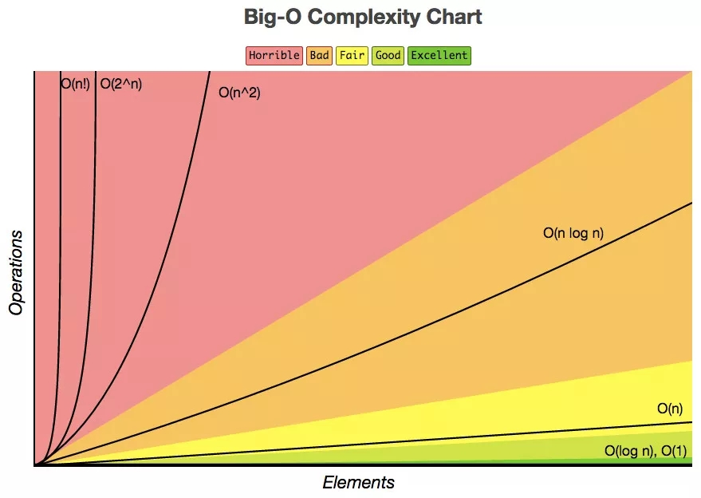

# 数据结构

## 前言


## 线性表

### 线性与非线性结构

线性结构是一个有序数据元素的集合。常用的线性结构有：线性表，栈，队列，双队列，一维数组，串。

非线性结构，数学用语，其逻辑特征是一个结点元素可能有多个直接前趋和多个直接后继。常见的非线性结构有：二维数组，多维数组，广义表，树(二叉树等)。

传统文本（例如书籍中的文章和计算机的文本文件）都是线性结构，阅读是需要注意顺序阅读，而超文本则是一个非线性结构。在制作文本时，可将写作素材按内部联系划分成不同关系的单元，然后用制作工具将其组成一个网型结构。阅读时，不必按线性方式顺序往下读，而是有选择的阅读自己感兴趣的部分。

在超文本文件中，可以用一些单词，短语或图像作为连接点。这些连接点通常同其他颜色显示或加下划线来区分，这些形式的文件就成为超文本文件。通过非线性结构，可能实现页面任意跳转。

有一个以上根结点的数据结构一定是非线性结构。

### 头指针与头结点

| 头指针                                                       | 头结点                                                       |
| ------------------------------------------------------------ | ------------------------------------------------------------ |
| 头指针是指链表指向第一个结点的指针，若链表有头结点，则是指向头结点的指针 | 头结点是为了操作统一和方便设立的，放在第一元素的节点之前，其数据域一般无意义（也可存放链表长度） |
| 头指针具有标识作用，所以长用头指针冠以链表的名字             | 有了头结点，对在第一元素的节点前插入节点和删除第一节点，其操作与其他节点的操作就统一了 |
| 无论链表表是否为空，头指针均不为空。头指针是链表的必要元素   | 头结点不一定是链表的必要元素                                 |

### 链表为空判断

循环链表与单链表的判断主要差异就在于循环判断条件上：

* head->next = null , 单链表为空
* head->next = head, 循环链表为空

### 单链表结构与顺序存储结构的优缺点

| 存储分配方式 | 时间性能 | 空间性能 |
| ------------ | -------- | -------- |
|              |          |          |


## 栈和队列

> 栈：限定在表尾进行插入和删除的线性表
>
> 队列：只允许在一端进行插入操作，而在另一端进行删除操作的线性表


链栈与顺序栈相比，一个明显的优点是通常不会出现栈满的情况

> 循环队列满的条件是：（rear +1) % QueueSize == front
>
> 循环队列长度计算公式：（rear - front + QueueSize) % QueueSize

 栈满的时候要考虑上溢的情况，栈空的时候要考虑下溢的情况。 


## 串

### 子串的个数

> 串（string）：是由零个或多个字符组成的有限序列，又名叫字符串。
>
> 子串：串中任意个连续的字符组成的子序列称为该串的子串，空串也属于子串。


* n个字符构成的字符串，假设每个字符都不一样，则共有**n(n+1)/2+1**个字符串

  实例应用：若串S=′software′,其子串的数目是()

  解析：n(n+1)/2+1=8（8+1）/2+1=37

* 串中字符出现重复：字符串'wwwpqqpcom'所有非空子串（两个子串如果内容相同则只算一个）个数是（）

  答案：50
  解析：包含重复子串共：n(n+1)/2+1=10（10+1）/2+1=55，减去重复：2个w，1个ww，1个q，1个.，所以共55-5=50个

> 串的定位操作通常称为串的模式匹配


## 树

### 二叉树遍历

如果一个二叉树的先序遍历序列与后序遍历序列正好相反，则该二叉树一定满足所有的节点全部没有左子树或者所有的节点全部没有右子树，即二叉树的高度等于节点数。

### 树和二叉树遍历对应关系

| 树       | 二叉树   | 森林     |
| -------- | -------- | -------- |
| 先序遍历 | 先序遍历 | 先序遍历 |
| 后序遍历 | 中序遍历 | 中序遍历 |

树的先序对应二叉树的先序

树的后序对应二叉树的中序

### 树转成二叉树

> 加线：在所有的兄弟节点之间加一条线
> 
> 去线：对树中每个结点，只保留它与第一个孩子节点的连线，删除它与其他孩子节点之间的连线。
> 
> 层次调整：以树的根节点为轴心，将整颗树顺时针旋转一定的角度，使之结构层次分明。


**任何一棵和树对应的二叉树，其右子树必定为空**


### 二叉树性质

如果对一棵有n个节点的完全二叉树（其深度为$[log_2n]+1$ ）的节点按层序编号（从第 1 层到第$[log_2n]+1 $）层，每层从左到右），对任一节点 $i \left( 1\leq i \leq n\right)$ 有：

> 1. 如果 i = 1, 则节点 i 是二叉树的根， 无双亲；如果 i > 1，则其双亲是节点 [i/2]
> 2. 如果 2i > n，则节点 i 无左孩子（节点 i 为 叶子节点）；否则其左孩子是节点2i
> 3. 如果2i + 1 > n, 则节点 i 无右孩子；否则其右孩子是节点 2i + 1

 完全二叉树的最后一个结点的编号一定是1001，则它的父结点的编号为1001/2=500，则叶子结点个数为1001-500=501. 

   **总结一下**：完全二叉树的最后一个结点的编号是n，则它的父结点的编号为[n/2]，则叶子结点个数为n-[n/2]。

## 图

### 无向图

一个有n个顶点的无向图最多有$n(n-1)/2$ 条边

### 关键路径

> 在一个表示工程队的带权有向图中，用顶点表示事件，用有向边表示活动，用边上的权值表示活动的持续时间，这种有向图的边表示活动的网，我们成之为AOE网（Activity On Edge Network）
>
> 用一个有向图表示一个工程的各子工程及其相互关系，其中以顶点表示活动，狐表示活动之间的优先制约关系，称这种有向图为顶点表示活动的网，简称AOV网（Activity On Vertex network）。
>
> 我们把路径上各个活动所持续的时间之和称为路径长度，从原点到汇点具有最大长度的路径叫关键路径，在关键路径上的活动称为关键活动

### 拓扑排序

设有向图有 n 个顶点 e 条边，进行拓扑排序时总的时间复杂度为 $O(n + e)$ 

## 查找

### 二分查找

二分查找也称折半查找（Binary Search），它是一种效率较高的查找方法。但是，折半查找要求线性表必须采用顺序存储结构，而且表中元素按关键字有序排列。

根据顺序表二分法查找比较次数的计算公式：
$$
a<log_2n<b (a,b,n \in Z^+)
$$
当顺序表有n个关键字时：

查找失败时，至少比较a次关键字；查找成功时，最多比较关键字次数是b。

如果顺序表记录数 n=97 ，log₂64<log₂97<log₂128，即6<log₂97<7，最大比较次数为7次。

### 分块查找

分块查找的平均查找长度不仅取决于数据集的总记录个数 n，还和每一块的记录个数 t 相关。


### 二叉排序树

> 二叉排序树（Binary Sort Tree），又称二叉查找树。它或者是一颗空树，或者是具有以下性质的二叉树。
>
> * 若它的左子树不空，则左子树上所有的节点的值均小于它的根结点的值；
> * 若它的右子树不空，则右子树上所有的节点的值均大于它的根结点的值；
> *  ⑶ 左、右子树本身又各是一棵二叉排序树。 按中序遍历二叉排序树，所得到的中序遍历序列是一个递增有序序列   

### 平衡二叉树（AVL树）

> 平衡二叉树（Height-Balanced Binary Search Tree），是一种二叉排序树，其中的每一个节点的左子树和右子树的高度差至多等于1。
>
> 我们将二叉树上节点的左子树深度减去右子树深度的值称为平衡因子BF(Balance Factor)

### 散列表查找


对于散列表长为m的散列函数，构造方法有：

1. 除留余数法

> Hash(key) = key mod p (p<=m)

p一般取小于m的最大质数（素数）

2. 直接定址法

$$
Hash(key) = a\times key + b \quad \left( a, b 为常数 \right)
$$

3. 数字分析法
4. 平方取中法
5. 折叠法
6. 随机数法


Hash表的平均查找长度与处理冲突的方法和散列表的装填因子有关

* 装填因子 = 填入表中的记录个数 / 散列表长度。


 查找成功=查找次数/数据个数。

查找失败=查找次数/散列后的地址个数。

 

## 排序

### 七种排序算法的各种指标比较

| 排序方法     | 平均情况         | 最好情况     | 最坏情况     | 辅助空间     | 稳定性 |
| ------------ | ---------------- | ------------ | ------------ | ------------ | ------ |
| 冒泡排序     | $$ O(n^{2})$$    | $$ O(n)$$    | $$O(n^{2})$$ | O(1)         | 稳定   |
| 简单选择排序 | $$ O(n^{2})$$    | $$O(n^{2})$$ | $$O(n^{2})$$ | O(1)         | 稳定   |
| 直接插入排序 | $$O(n^{2})$$     | $$ O(n)$$    | $$O(n^{2})$$ | O(1)         | 稳定   |
| 希尔排序     | O(n logn)~O(n^2) | O(n^1.3)     | $$O(n^{2})$$ | O(1)         | 不稳定 |
| 堆排序       | O(n logn)        | O(n logn)    | O(n logn)    | O(1)         | 不稳定 |
| 归并排序     | O(n logn)        | O(n logn)    | O(n logn)    | O(n)         | 稳定   |
| 快速排序     | O(n logn)        | O(n logn)    | $$O(n^{2})$$ | O(logn)~O(n) | 不稳定 |




```

```