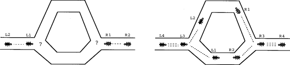
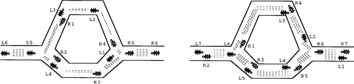
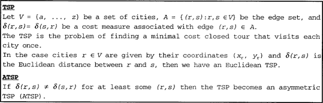
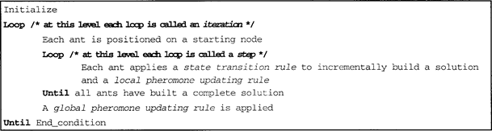
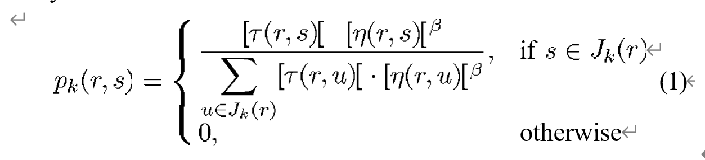

# Ant Colony System: A Cooperative Learning Approach to the Traveling Salesman Problem

Marco Dorigo, *Senior Member, IEEE*, and Luca Maria Gambardella, *Member, IEEE*

### Abstract

This paper introduces the ant colony system (ACS), a distributed algorithm that is applied to the traveling salesman problem (TSP). In the ACS, a set of cooperating agents called ants cooperate to find good solutions to TSP’s. Ants cooperate using an indirect form of communication mediated by a pheromone they deposit on the edges of the TSP graph while building solutions. We study the ACS by running experiments to understand its operation. The results show that the ACS outperforms other nature-inspired algorithms such as simulated annealing and evolutionary computation, and we conclude comparing ACS-3-opt, a version of the ACS augmented with a local search procedure, to some of the best performing algorithms for symmetric and asymmetric TSP’s.

Index Terms: Adaptive behavior, ant colony, emergent behavior, traveling salesman problem.

### 1. Introduction

The natural metaphor on which ant algorithms are based is that of ant colonies. Real ants are capable of finding the shortest path from a food source to their nest [3], [22] without using visual cues [24] by exploiting pheromone information. While walking, ants deposit pheromone on the ground and follow, in probability, pheromone previously deposited by other ants. In Fig. 1, we show a way ants exploit pheromone to find a shortest path between two points.

Consider Fig. 1(a): ants arrive at a decision point in which they have to decide whether to turn left or right. Since they have no clue about which is the best choice, they choose randomly. It can be expected that, on average, half of the ants decide to turn left and the other half to turn right. This happens both to ants moving from left to right (those whose name begins with an L) and to those moving from right to left (name begins with an R). Fig. 1(b) and (c) shows what happens in the immediately following instants, supposing that all ants walk at approximately the same speed. The number of dashed lines is roughly proportional to the amount of pheromone that the ants have deposited on the ground. Since the lower path is shorter than the upper one, more ants will visit it on average, and therefore pheromone accumulates faster. After a short transitory period the difference in the amount of pheromone on the two paths is sufficiently large so as to influence the decision of new ants coming into the system [this is shown by Fig. 1(d)]. From now on, new ants will prefer in probability to choose the lower path, since at the decision point they perceive a greater amount of pheromone on the lower path. This in turn increases, with a positive feedback effect, the number of ants choosing the lower, and shorter, path. Very soon all ants will be using the shorter path.

The above behavior of real ants has inspired *ant system*,  an algorithm in which a set of artificial ants cooperate to the solution of a problem by exchanging information via pheromone deposited on graph edges. The ant system has been applied to combinatorial optimization problems such as the traveling salesman problem (TSP) [7], [8], [10], [12] and the quadratic assignment problem [32], [42].

The ant colony system (ACS), the algorithm presented in this article, builds on the previous ant system in the direction of improving efficiency when applied to symmetric and asymmetric TSP’s. The main idea is that of having a set of agents, called *ants*, search in parallel for good solutions to the TSP and cooperate through pheromone-mediated indirect and global communication. Informally, each ant constructs a TSP solution in an iterative way: it adds new cities to a partial solution by exploiting both information gained from past experience and a greedy heuristic. Memory takes the form of pheromone deposited by ants on TSP edges, while heuristic information is simply given by the edge’s length.

The main novel idea introduced by ant algorithms, which will be discussed in the remainder of the paper, is the synergistic use of cooperation among many relatively simple agents which communicate by distributed memory implemented as pheromone deposited on edges of a graph.

This paper is organized as follows. Section II puts the ACS in context by describing ant system, the progenitor of the ACS. Section III introduces the ACS. Section IV is dedicated to the study of some characteristics of the ACS:  We study how pheromone changes at run time, estimate the optimal number of ants to be used, observe the effects of pheromone-mediated cooperation, and evaluate the role that pheromone and the greedy heuristic have in ACS performance. Section V provides an overview of results on a set of standard test problems and comparisons of the ACS with well-known general purpose algorithms like evolutionary computation and simulated annealing. In Section VI we add local optimization to the ACS, obtaining a new algorithm called ACS-3-opt. This algorithm is compared favorably with the winner of the First International Contest on Evolutionary Optimization [5] on asymmetric TSP (ATSP) problems (see Fig. 2), while it yields a slightly worse performance on TSP problems. Section VII is dedicated to the discussion of the main characteristics of the ACS and indicates directions for further research.

Fig. 1. How real ants find a shortest path. 

(a) Ants arrive at a decision point. 

(b) Some ants choose the upper path and some the lower path. The choice is random. 

(c) Since ants move at approximately a constant speed, the ants which choose the lower, shorter, path reach the opposite decision point faster than those which choose the upper, longer, path.

 (d) Pheromone accumulates at a higher rate on the shorter path. The number of dashed lines is approximately proportional to the amount of pheromone deposited by ants.

Fig. 2. The traveling salesman problem.

### 2. Background

*Ant system* [10] is the progenitor of all our research efforts with ant algorithms and was first applied to the TSP, which  is defined in Fig. 2.

Ant system utilizes a graph representation which is the same as that defined in Fig. 2, augmented as follows: in addition to the cost measure $\delta(\gamma, s)$, each edge $(\gamma, s)$ has also a desirability measure $\tau(\gamma, s)$, called *pheromone* which is updated at run time by artificial ants (*ants* for short). When ant system is applied to symmetric instances of the TSP, $\tau(\gamma, s)$  = $\tau(s, \gamma)$, but when it is applied to asymmetric instances it is possible that $\tau(\gamma, s) \neq \tau(s, \gamma)$ .

Informally, ant system works as follows. Each ant gener- ates a complete tour by choosing the cities according to a probabilistic *state transition rule*; ants prefer to move to cities which are connected by short edges with a high amount of pheromone. Once all ants have completed their tours a *global pheromone updating rule* (global updating rule, for short) is applied; a fraction of the pheromone evaporates on all edges (edges that are not refreshed become less desirable), and then each ant deposits an amount of pheromone on edges which belong to its tour in proportion to how short its tour was (in other words, edges which belong to many short tours are the edges which receive the greater amount of pheromone). The process is then iterated.

The  state transition rule used by ant system, called a*random-proportional rule*, is given by (1), which gives the probability with which ant in city chooses to move to the city:

Fig. 3. The ACS algorithm.

