学号：1813021012 

姓名：张龙威 

班级：计181 

内容：深度树、迁移图、随机网


## 作业一

```
算法设计与分析->算法=>设计=>分析

-算法->分解算法=>组合算法=>优化算法=>随机算法=>智能算法

-设计->结构=>人脑

--结构->前端=>后台

---前端->控制台=>可视窗口=>web

---后台->自然语言问答型=>数学语言求解型=>程序语言智能型

-分析->行为=>机器

--机器->时间复杂度=>空间复杂度}
```


### 1. 深度树

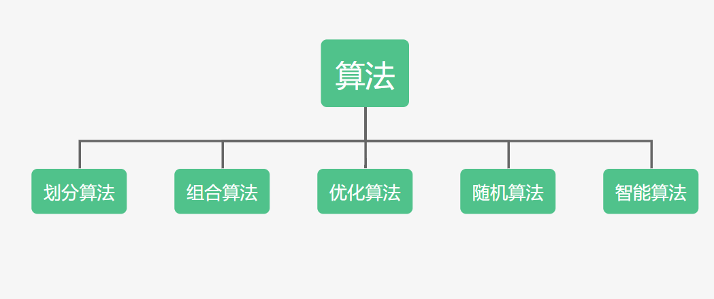

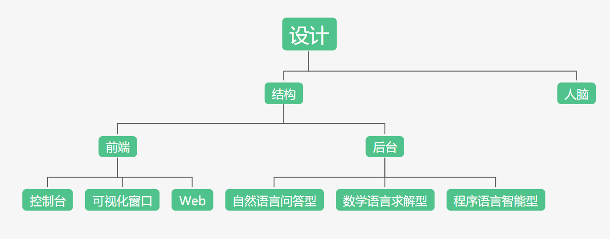

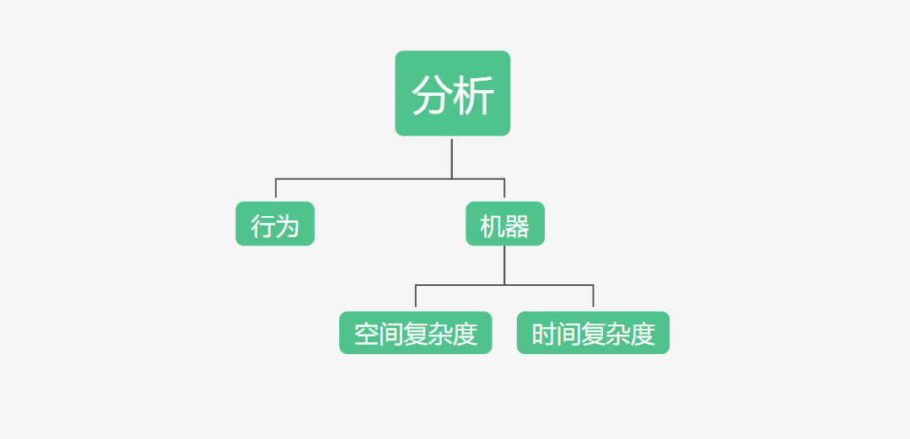

### 2. 迁移图


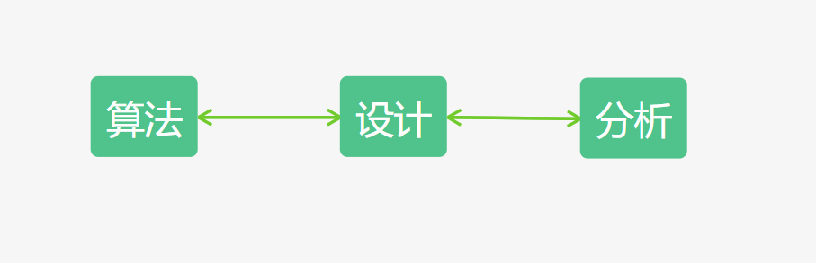


### 3. 随机网

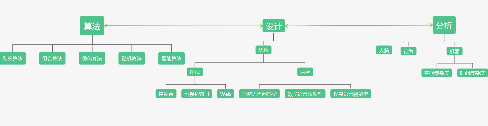


## 作业二

> --算法@作业2->文档#分治算法相关=>系统#数理化计算相关
>
> ---分治算法->划分=>组合=>编码
>
> ----编码->编程=>表达式=>文字
>
> -----编程->命令式=>面向过程=>面向对象=>面向逻辑
>
> -----表达式->数学表达式=>物理表达式=>化学表达式


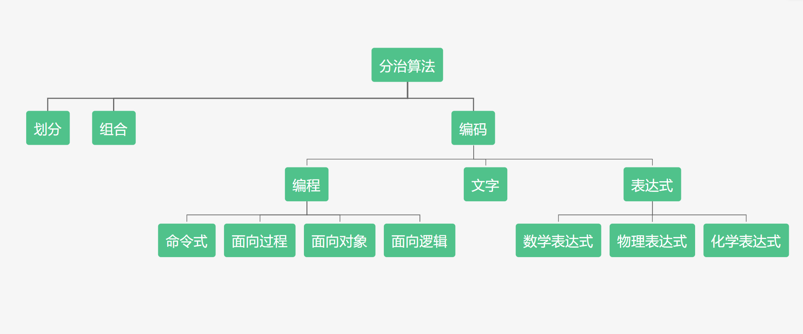


### C++

```c++
#include<iostream>
#include<math.h>
using namespace std;

// 由牛顿第二定律F=ma, 求加速度 a
void getA() {
	double F = 0;
	double m = 0;

	cout << "\n请输入物体所受合力F: ";
	cin >> F;
	cout << "\n请输入物体的质量m: ";
	cin >> m;
	cout << endl;

	//计算物体的加速度, 物体的质量需大于0
	if (m>0) {
		cout << "物体加速度 a=" << F / m << endl;
	}
	else {
		cout << "物体质量输入有误！" << endl;;
	}
}

//求解一元二次多项式的根 x
//这里规定系数a是大于0的
void getX() {
	double a = 0;
	double b = 0;
	double c = 0;
	double delta = 0;

	cout << "\n请输入第一个系数a: ";
	cin >> a;
	cout << "\n请输入第二个系数b: ";
	cin >> b;
	cout << "\n请输入第三个系数c: ";
	cin >> c;
	cout << endl;

	delta = b * b - 4 * a * c;

	// delta > 0, 有两个实根；
	// delta = 0, 有两个相同的实根；
	// delta < 0, 无实根；
	if (delta < 0) {
		cout << "方程无实根" << endl;
	}
	else if (delta == 0) {
		cout << "方程有两个相同的实根：" << -b / (2 * a) << endl;
	}
	else {
		double x1 = (-b + sqrt(delta)) / (2 * a);
		double x2 = (-b - sqrt(delta)) / (2 * a);

		cout << "方程第一个实根x1: " << x1 << endl;
		cout << "方程第二个实根x2: " << x2 << endl;
	}	
}

// 求化学公式

void getC() {
	cout << "A+B = C+D" << endl;
}

int main() {
	int choice = 0;

	do {
		cout << "===============功能菜单=============" << endl;
		cout << "============1. 求加速度 ============" << endl;
		cout << "============2. 解一元二次方程 =======" << endl;
		cout << "============3. 求化学公式 ==========" << endl;
		cout << "============0. 退出 ===============" << endl;
		cout << "===================================" << endl;
		cout << "Enter your choice: ";
		cin >> choice;

		switch (choice)
		{
		case 1:
			getA();
			break;
		case 2:
			getX();
			break;
		case 3:
			getC();
			break;
		default:
			break;
		}

		system("pause");
		system("cls");

	} while (choice > 0);
}
```


### Java

```java
package com.qiuyeyijian;

import java.util.Scanner;

public class Qiuyeyijian {
    // 由牛顿第二定律F=ma, 求加速度 a
   public static void  getA() {
        double F = 0;
        double m = 0;
        Scanner sc = new Scanner(System.in);

        System.out.print("\n请输入物体所受合力 F：");
        F = sc.nextDouble();
        System.out.print("\n请输入物体的质量 m：");
        m = sc.nextDouble();
        System.out.println();

        if(m > 0) {
            System.out.println("物体的加速度a = " + F / m);
        } else {
            System.out.println("物体质量输入有误！");
        }
    }

    //求解一元二次多项式的根 x
    //这里规定系数a是大于0的
    public static void getX() {
       double a = 0;
       double b = 0;
       double c = 0;
       double delta = 0;

       Scanner sc = new Scanner(System.in);
        System.out.print("\n请输入第一个系数a: ");
        a = sc.nextDouble();
        System.out.print("\n请输入第二个系数b: ");
        b = sc.nextDouble();
        System.out.print("\n请输入第三个系数c: ");
        c = sc.nextDouble();

        delta = b * b - 4 * a * c;

        // delta > 0, 有两个实根；
        // delta = 0, 有两个相同的实根；
        // delta < 0, 无实根；
        if(delta < 0) {
            System.out.println("方程无实根！");
        }
        else if(delta == 0) {
            System.out.println("方程有两个相同的实根：" + (-b / (2 * a) ) );
        }
        else {
            double x1 = (-b + Math.sqrt(delta)) / (2*a);
            double x2 = (-b - Math.sqrt(delta)) / (2*a);

            System.out.println("方程第一个实根x1: " + x1);
            System.out.println("方程第二个实根x2: " + x2);
        }
    }

    public static void getC() {
        System.out.println("A+B = C+D");
    }

    public static void main(String[] args) {
       Scanner sc = new Scanner(System.in);
        int choice = 0;

        do {
            System.out.println("===============功能菜单=============");
            System.out.println("============1. 求加速度 ============");
            System.out.println( "============2. 解一元二次方程 =======");
            System.out.println("============3. 求化学公式 ==========");
            System.out.println("============0. 退出 ===============");
            System.out.println("===================================");
            System.out.print("Enter your choice: ");
            choice = sc.nextInt();

            switch (choice) {
                case 1:
                    getA();
                    break;
                case 2:
                    getX();
                    break;
                case 3:
                    getC();
                    break;
                default:
                    break;
            }
        }while (choice > 0);
    }
}
```


### Python

```python
import math


def getA():
    F = float(input("\n请输入物体所受合力："))
    m = float(input("\n请输入物体的质量："))

    if m > 0:
        print("\n物体的加速度 a = ", F / m, "\n")
    else:
        print("物体质量输入有误！\n")


def getX():
    a = float(input("\n请输入第一个系数a: "))
    b = float(input("\n请输入第二个系数b: "))
    c = float(input("\n请输入第三个系数c: "))
    print("\n")
    delta = b * b - 4 * a * c

    if delta < 0:
        print("方程无实根！\n")
    elif delta == 0:
        print("方程有两个相等实根：", -b / (2 * a), "\n")
    else:
        x1 = (-b + math.sqrt(delta)) / (2 * a)
        x2 = (-b - math.sqrt(delta)) / (2 * a)

        print("方程第一个实根x1: ", x1, "\n")
        print("方程第二个实根x2: ", x2, "\n")


def getC():
    print("A+B = C+D")


choice = 1
while choice > 0:
    print("===============功能菜单=============")
    print("============1. 求加速度 ============")
    print("============2. 解一元二次方程 =======")
    print("============3. 求化学公式 ==========")
    print("============0. 退出 ===============")
    print("===================================")
    choice = int(input("Enter your choice: "))

    if choice == 1:
        getA()
    elif choice == 2:
        getX()
    elif choice == 3:
        getC()
    else:
        print("输入有误！")
```


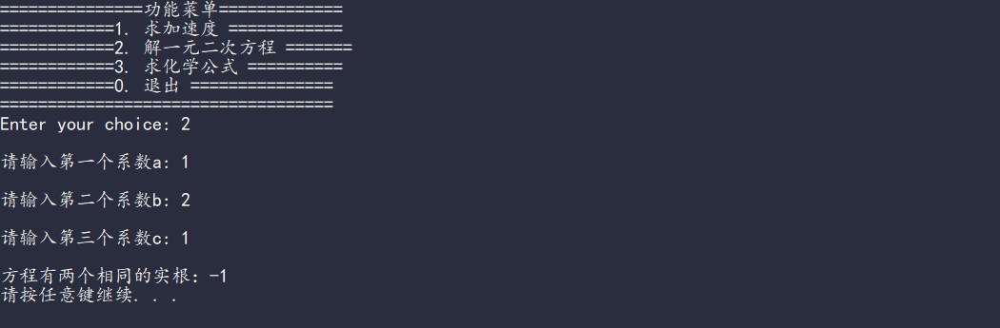

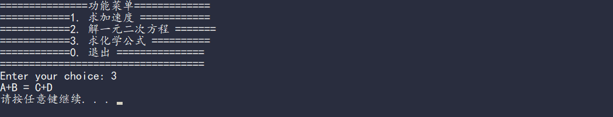


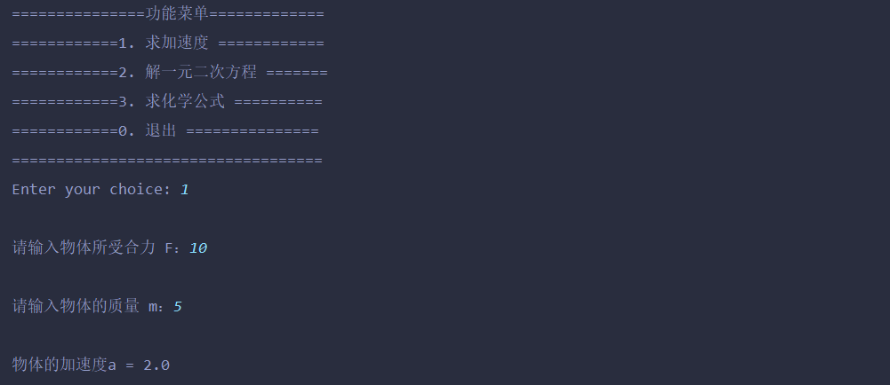

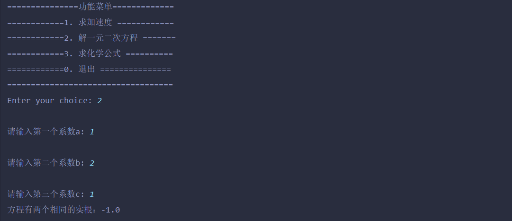

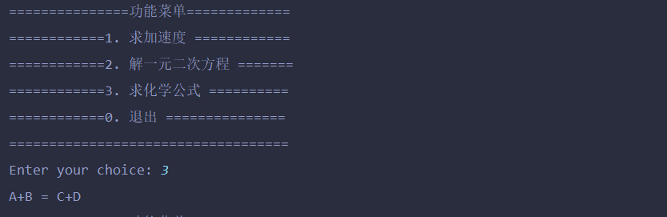


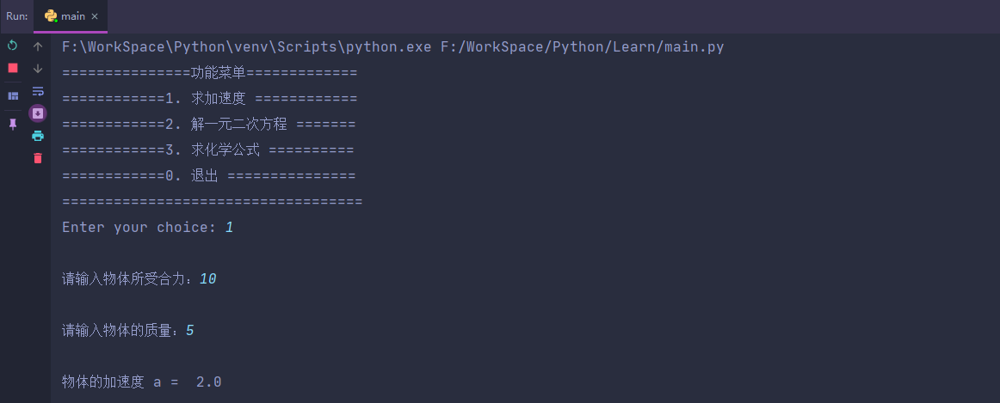


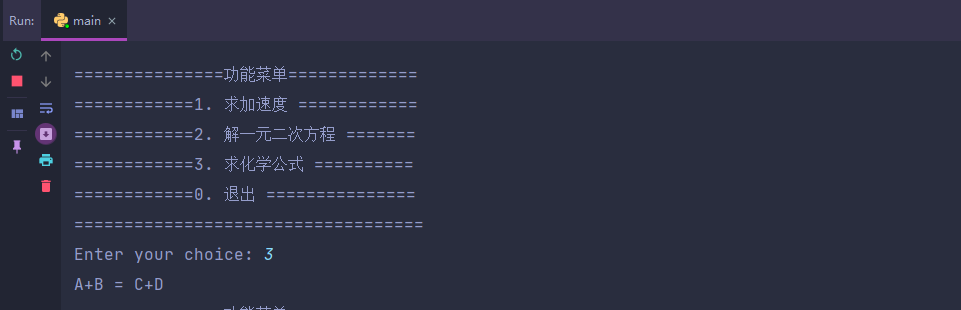