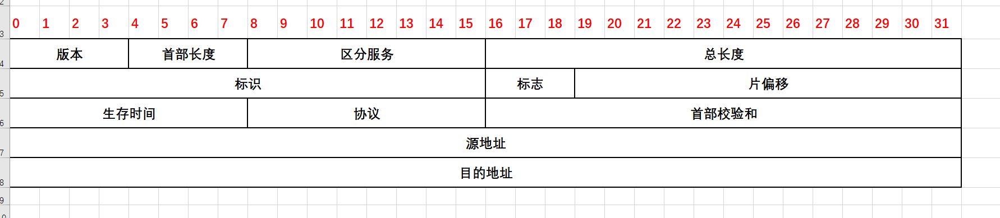
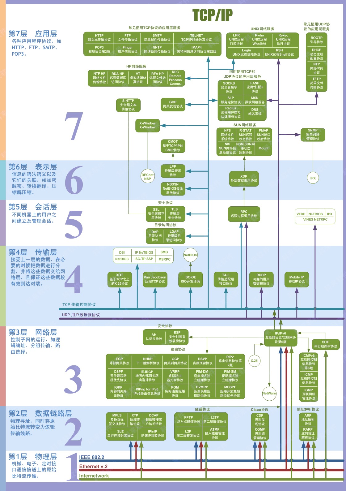

# 计算机网络

### 基本概念

通过子网掩码，可以从一个IP地址中提取出网络号、子网号和主机号。

接收方一般都采用**累积确认**的方式。这就是说，接收方不必对收到的每个分组逐一确认，而是在收到几个分组后，对按序到达的最后一个分组发送确认。

TCP将来自上层的字节流组织成报文段，然后交给IP协议。

计算机网络系统由负责信息传递的通信子网和负责信息处理的资源子网组成。

**网络协议主要有三个要素组成：语法、语义和同步。**

**IP数据报的检验和只检验IP数据报的首部，但UDP的检验和是把首部和数据部分一起都检验。**

TCP报文段首部的**"窗口"**字段值，指明了发送本报文段一方的**接收窗口大小。**

> 例如，我发送了一个报文段，其确认号是701，窗口字段值是1000.这就告诉对方：从701号算起，我的接收缓存空间还可接收1000个字节数据。

数据链路层协议有许多种，但有三个基本问题则是共同的。这三个基本问题是：**封装成帧、透明传输和差错检测。**

### 简答题

#### 零比特填充法

PPP协议使用零比特填充法来实现透明传输。

在发送方，先扫描整个信息段，每发现5个连续的1，就立即填入1个0。

在接收方，每发现5个连续的1，就删除其后的1个0，还原原来的比特流。

#### 争用期

以太网端到端的往返时间成为争用期。一个站点开始发送数据帧，如果经过一个争用期时间段内还没有检测到碰撞，就可以肯定这次发送不会在发生碰撞，该帧数据可以顺利发送完毕。

#### NAT地址转换

在专用网内部站点和外网通信时，安装了NAT软件的NAT路由器将专用网内部站点所发送的数据报的源IP地址（专用地址）转换为全球IP地址，从而实现专用网和外网通信。使用NAT地址转换可以在一定程度上缓解IPV4地址资源短缺的问题。

#### 拥塞控制

在某段时间内，若对网络中某一资源的需求超过了该资源所能提供的可用部分，网络性能就会变坏，这成为网络拥塞。

采用拥塞控制，可以防止过多的数据注入到网络中，是网络不至于过载。拥塞控制是一个全局性过程，涉及到网络中所有的主机和路由器，以及与降低网络传输性能有关的所有因素。

#### 最长前缀匹配

在使用CIDR（无分类编址，超网），如果路由器收到一个需要转发的报文，该路由器路由表中有多个与该报文目的地址相匹配的路由项，应当从匹配结果中选择具有最长网络前缀的路由项进行转发。

#### 数据链路中的链路控制包括哪些功能

封装成帧、透明传输、差错检测。

#### 简述CSMA/CD协议工作原理

1、每个站在发送数据之前先要检测一下总线上是否有节点在发送数据。如果有，则暂时不要发送数据，等待信道变为空闲时再发送

2、在数据发送过程中，发送站还要检测是否发生了冲突，当发送站一旦检测到产生冲突，他就立即放弃本次发送。

3、所有发生冲突的结点都将按截断二进制指数退避算法等待一段时间，然后重新竞争发送。

#### IP地址分为几类？各如何表示

IP地址分为A, B, C, D, E五类。

A类，B类和C类地址的网络号字段分别为1个，2个和3个字节长，而在网络号字段的最前面有1-3位的类别位，其数值分别规定为0， 10和110。A类，B类和C类地址的主机号字段分别为3个、2个和1个字节长。

D类地址用于多播（前4位是1110）

E类地址（前4位是1111）保留为以后使用。

IP地址的主要特点是全球唯一，每类地址均由网络号和主机号组成。

IP地址是一种分等级的地址结构。这样有两个好处：

1. IP地址管理机构在分配IP地址时只分配网络号，而剩下的主机号则由得到该网络号的单位自行分配，这样就方便了IP地址的管理。
2. 路由器仅根据目的主机所连接的网络号来转发分组（而不考虑目的主机号），这样就可以大幅度减少路由表项目数，从而减少路由表所占空间。

#### 停等协议如果没有超时重传定时器和报文编号会有什么问题

如果没有超时重传定时器会出现死等问题，例如某个报文或者接收方对它的确认报文丢失了都会造成发送方死等

没有报文编号，如果发送方由于超时重传报文，但是原报文的延时确认报文和重传报文的确认最后都被发送方收到了，如果没有报文编号，就会导致混乱。

#### 简要说明硬件MAC地址和IP地址的区别

硬件地址是数据链路层和物理层使用的地址，而IP地址是网络层和以上使用的地址，IP地址放在IP数据报的首部，而硬件地址放在MAC帧首付。链路层只能看见MAC地址，IP地址只在网络层可见。

在数据传输过程中，源IP地址和目的IP地址不会发生改变，而源MAC地址和目的MAC地址随着数据报文的不同在链路上传输，会不断发生改变。

#### 私网IP地址

- A类地址：10.0.0.0～10.255.255.255
- B类地址：172.16.0.0 ～172.31.255.255
- C类地址：192.168.0.0～192.168.255.255

* 保留地址：127.0.0.0 ~ 127.255.255.255

| 面向字节 | 面向报文 |      |
| -------- | -------- | ---- |
| PPP，TCP | UDP      |      |
|          |          |      |
|          |          |      |

